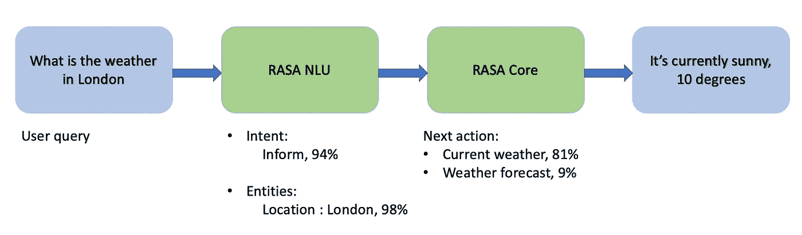
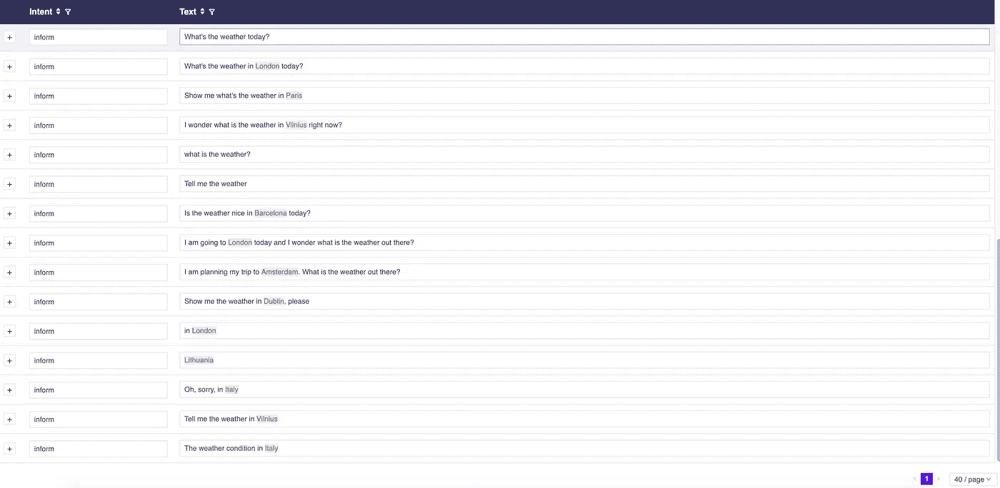

# 在几分钟内建立你自己的对话聊天机器人-第一部分:拉莎-NLU

> 原文：<https://medium.com/analytics-vidhya/build-your-own-conversational-chatbot-in-minutes-part-one-rasa-nlu-13df39601032?source=collection_archive---------6----------------------->


聊天机器人每天都在获得牵引力，它将触及生活几乎所有方面的日子不远了。如果你看到像 IBM、脸书、谷歌、微软和亚马逊这样的公司都在广泛地研究它，并建立自己的框架。一些可用于构建聊天机器人的框架有 Rasa stack、微软机器人框架、Google Dialogflow 等。让我们看看 Rasa 相对于市场上其他框架的优势。

# 为什么是拉莎？

RASA stack 是一个开源的人工智能工具,作为一个开源框架，它很容易定制。RASA NLU 的主要优势在于，您可以访问整个 python 处理管道，并且可以使用复杂的定制逻辑来扩展它。事实上，客户不想分享他们的数据，大多数工具都在云平台**上。您可以在服务器或环境内部构建、部署或托管 Rasa，并对其进行完全控制。**

# **Rasa——聊天机器人解决方案**

Rasa 为您提供了一套在本地桌面上构建完整聊天机器人的工具。

他们的旗舰工具是:

*   rasa NLU——一种自然语言理解工具，接受用户输入，推断用户意图，提取可用实体。
*   Rasa 核心——一个对话管理解决方案，它试图建立一个概率模型，该模型根据之前的一组用户输入来决定要执行的一组操作。

构建聊天机器人时常用的一些关键字是:

*   意图—将其视为用户输入的目的或目标。如果一个用户说，“伦敦的天气如何”，那么他的意图将是找到“伦敦的天气”。
*   实体—这是可以从用户输入中提取的有用信息。从前面的例子中，我们知道我们的目的是查找天气，但是是在哪个位置呢？如果我们提取“伦敦”作为一个实体，我们可以在“伦敦”上执行操作。
*   动作——动作是由机器人执行的操作，或者询问更多细节以获得所有实体，或者与一些 API 集成，或者查询数据库以获得/保存一些信息。
*   故事——这些是用户和机器人之间的示例交互，根据捕获的意图和执行的动作来定义。如果你得到一个带有/不带有实体的用户输入，开发者可以告诉你该怎么做。从上面的例子来看，用户的意图是找到“伦敦的天气”，但没有提到是哪一天，因此缺少了一个实体。这将使机器人的下一个行动。

现在我们知道了一些基础知识，让我们开始一些实际的行动:)

在这篇文章中，我们将关注 Rasa 自然语言理解，包括意图分类和实体提取。

# **Rasa 自然语言理解(NLU)** :

让我们看看下面的例子来建立一个机器人



用户输入查询“伦敦的天气如何”，Rasa NLU 预测给定输入查询的意图“通知”(置信度 94%)和实体“伦敦”(置信度 98%)。Rasa 核心用于使机器人能够响应用户输入。在这个例子中，机器人的下一个动作是提供“伦敦”的天气信息。因此，机器人回答“现在是晴天，10 度”。

由于我们关注的是拉莎·NLU，我们将在本帖中讨论以下主题:

*   Rasa 安装和设置
*   Rasa-NLU 教练机安装
*   生成训练数据
*   Rasa 配置文件
*   培训 rasa 模型

## Rasa 安装和设置:

让我们首先进行环境设置，为此我们需要安装 python。我正在使用 conda 来设置 Python 的虚拟环境，并强烈推荐创建一个，因为在一个地方安装所有的 Rasa 会很好。

```
conda create -n rasa-chatbot python=3.6conda activate rasa-chatbot
```

让我们安装 rasa 包:

```
pip install rasa
```

这将安装所有 rasa 依赖项，包括 rasa-nlu 和 rasa-core。

```
python -m spacy download en
```

*由于我的聊天机器人的语言是英语，我将使用 spacy* 下载英语词汇

## Rasa-NLU 教练机安装:

Rasa-NLU-教练是一个用户界面，有助于产生训练数据的 Rasa NLU 模型。这是一个 Javascript 应用程序，我们需要节点和 NPM。

安装 https://nodejs.org/en/T7[的最新版本 NodeJs 和 NPM](https://nodejs.org/en/)

```
npm i -g rasa-nlu-trainer
```

*上面的命令应该运行在终端你的项目目录下。这将安装 rasa-nlu-trainer。*

## 生成训练数据:

包安装完成后，让我们创建一个项目目录。我把我的项目命名为 rasa-chatbot。我们在其中创建数据目录和 data.json 文件。我们还应该创建配置文件' config_spacy.json '和 python 文件' nlu_model.py '

```
mkdir rasa-chatbot
cd rasa-chatbot
mkdir data
echo 'config'>config_spacy.json
echo 'nlu_model'>nlu_model.py
cd data
echo 'training_data'>data.json
```

有两种方法可以为模型创建训练数据:

*   在 data.json 文件中创建 json 数据

*   使用 Rasa-NLU-Trainer UI 创建 json 数据

您还可以使用拉莎-NLU-训练器用户界面来生成模型的训练数据。这个 UI 可以向您项目的客户公开，以添加新的培训示例，他们可以看到机器人没有工作。

```
cd data
rasa-nlu-trainer
```

拉莎-NLU-教练用户界面可用于添加新的例子，可以指定的意图和实体可以在用户界面上突出。此用户界面在“data.json”文件中生成了训练数据。



## Rasa 配置文件

配置文件对于训练 rasa 模型非常重要。你可以在[文档](https://rasa.com/docs/)中了解更多信息

我们将在配置文件中指定三件事:

1.  管道——它指定使用什么特征提取器来处理文本消息并提取必要的信息。Rasa 在这里提供了更多关于管道[的信息](https://rasa.com/docs/rasa/nlu/choosing-a-pipeline/)
2.  路径——我们指定要存储训练好的拉沙-NLU 模型的路径
3.  数据——我们指定存储训练数据的目录

## 培训 Rasa 模型

现在我们有了足够的数据，让我们继续训练模型

这里，train_nlu()函数训练 Rasa-NLU 模型并将其存储在/models/nlu 目录中，run_nlu()函数使用训练好的 Rasa-NLU 模型来预测意图并提取新用户查询的实体。输出如下所示:

即使我们没有提供“此刻柏林的天气如何？”的例子机器人能够猜测意图并提取值为“berlin”的实体“location”。用大量数据训练模型总是好的，这样它就可以从中学习。

我们已经成功地完成了对机器人的训练，它能够理解自然语言，但我们仍然需要建立对话，以便机器人能够响应消息。

我将很快发布如何使用 Rasa-core 来构建对话，以便 bot 可以响应用户输入。

Rasa 社区引入了 **RasaX** ，帮助你利用实时对话来改善你的助手。你可以在这里了解更多

我强烈建议通读每一节，并阅读 Rasa 文档以更好地理解它。以防你需要这里的代码是 [Github 库](https://github.com/Vaishnavikodai/rasa-chatbot)

*请分享您的想法、反馈、评论和澄清。*

*感谢阅读！* ❤