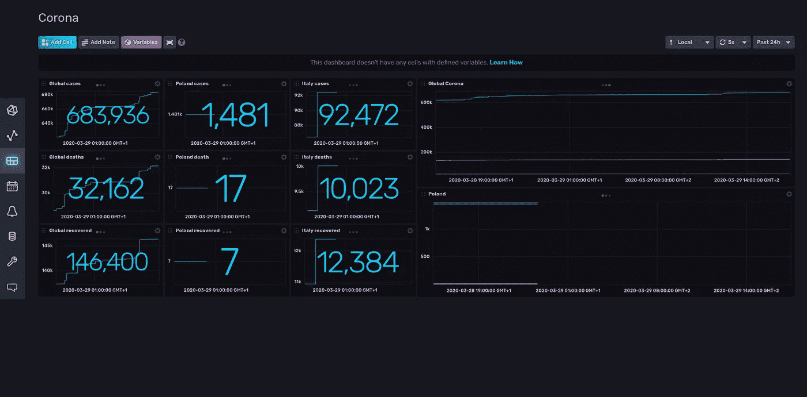
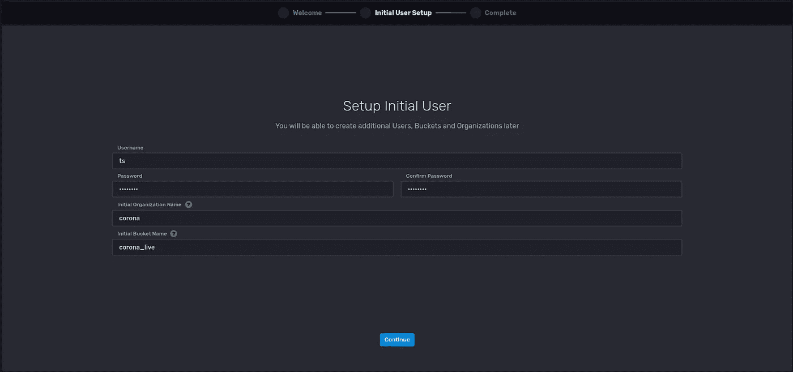
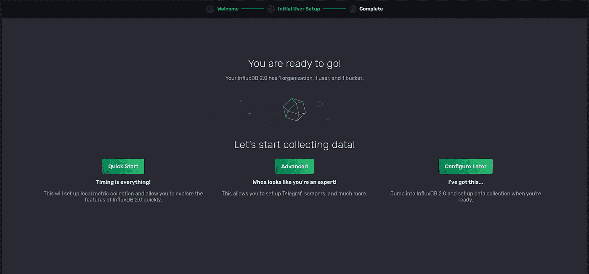
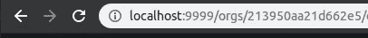
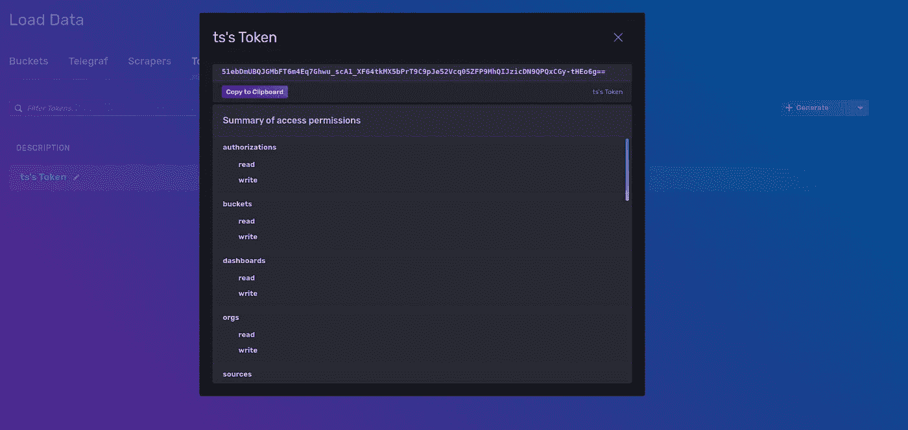
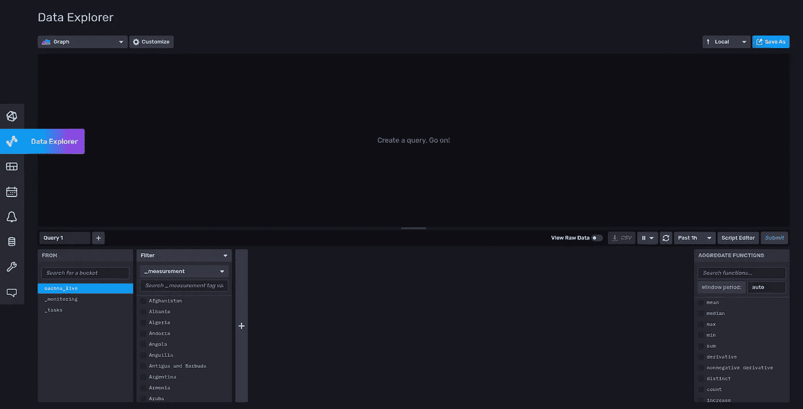
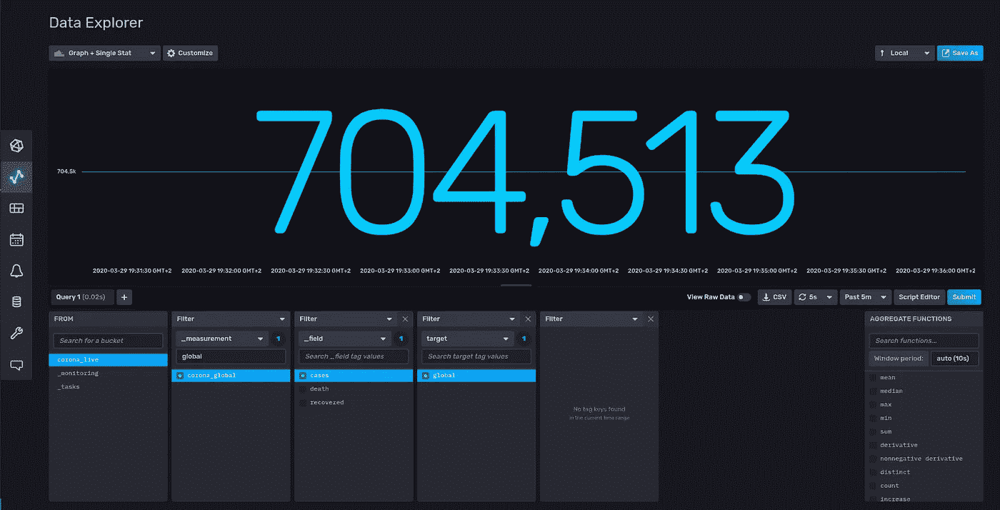
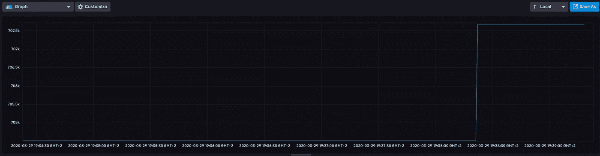
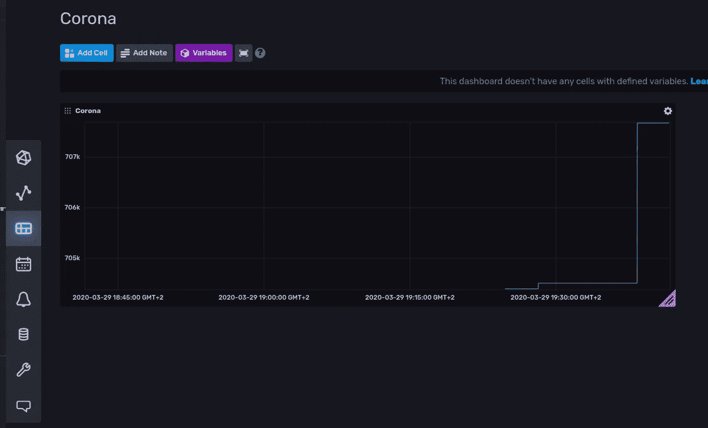

# 用 influxdb 2.0 和 nodejs 构建您自己的新冠肺炎统计数据实时仪表板，只需几行代码

> 原文：<https://medium.com/analytics-vidhya/build-your-own-covid-19-live-stats-dashboard-with-influxdb-2-0-and-nodejs-with-minimal-code-d3cf9db76b13?source=collection_archive---------16----------------------->

最近我注意到，许多人发布了他们自己的 covid 19 stats 仪表板，这些仪表板是用 react 和一些图形库等 web 技术创建的。今天我想向你展示如何用众所周知的数据可视化工具和时间序列数据库来创建令人惊叹的实时仪表盘。

最终效果，应该是这样的。



先决条件:node js 的基本知识和 javascript 的基础知识

我们在本教程中所做的

1.  安装和运行流入数据库和仪表板
2.  在 nodejs 中创建小型数据刮刀
3.  创建带有一些图表的仪表板

等等，什么是 influxdb？正如我提到的，我们将使用时序数据库。在本教程中，我们将使用 influxdata 生态系统，它具有时间序列数据库和可视化工具(如图表)。点击了解更多关于 influxdata 生态系统的信息[。](https://www.influxdata.com/)

对于那些不熟悉时间序列数据库概念的人来说，简而言之，这是一个高度优化的(即使是微秒精度的时间序列)数据库，用于存储具有自己测量时间的值(为了方便起见，存储为 UNIX 时间戳)。例如 cpu 使用测量

```
cpu_usage: 28,98%, measurement_time: 1585495074
cpu_usage: 57,58%, measurement_time: 1535493454
cpu_usage: 89,48%, measurement_time: 1535493450
```

## 有了这些基础知识，我们就可以从涌入开始了

先下载*潮人@2.0:*

```
wget https://dl.influxdata.com/influxdb/releases/influxdb_2.0.0-beta.7_linux_amd64.tar.gz
```

*对于 linux 以外的其他操作系统，点击* [*这里*](https://portal.influxdata.com/downloads/) *手动下载*

拆开包装:

```
tar xvfz influxdb_2.0.0-beta.7_linux_amd64.tar.gz
```

导航到文件夹:

```
cd Downloads/influxdb_2.0.0-beta.6_linux_amd64/
```

将 *influxd* 可执行文件作为后台进程运行:

```
./influxd &
```

并导航到 [http://localhost:9999/](http://localhost:9999/) ，您应该会看到


点击“开始”



只需填写表格，流入的桶就像 MySQL 的数据库名称



接下来，单击 configure later，您应该会看到一个最小的仪表板

## 基本的流入配置已经完成，最后我们可以写一些代码

我们使用 node.js，我们利用长轮询过程的便利。我们的目标是定期从[端点](https://corona.lmao.ninja/countries)删除冠状病毒统计数据，并将其保存在流入数据中。

让我们创建基本的节点应用程序，我更喜欢使用 typescript，但你也可以使用 javascript。

```
mkdir corona-stats && cd corona-statsnpm init
npm install [@influxdata/influxdb-clien](http://twitter.com/influxdata/influxdb-client)t axios --save
npm install [@types/node](http://twitter.com/types/node) typescript @types/axios --save-devtouch scraper.tsnode_modules/.bin/tsc --init
```

我们使用 [**轴**](https://github.com/axios/axios) 从端点获取数据

将这个脚本部分添加到 **package.json，**

```
"scripts": {
    "build": "node_modules/.bin/tsc",
    "start": "node scraper.js"
  },
```

tsconfig.json 保持创建时的样子，我们不需要修改它。

## 我们要做的下一件事

您将需要 **org-id** ，您可以在登录后从 URL 获取。



接下来，要获取令牌，请前往***加载数据* - > *令牌***



## 我们想通过我们的潮人客户实现什么

我们的 **scraper.ts** 目标是在 **1 秒间隔**内从[https://corona.lmao.ninja/all](https://corona.lmao.ninja/all)获取全球统计数据，从[https://corona.lmao.ninja/countries](https://corona.lmao.ninja/countries)获取每个国家的统计数据，并将其保存在 influxdb 中。

除了时间戳之外的时间序列数据库应该已经标记了每个度量，让我们回到 CPU 使用示例。

```
cpu_usage: 28,98%, memory_usage: 64,34%, measurement_time: 1585495074
cpu_usage: 57,58%, memory_usage: 34,32%, measurement_time: 1535493454
cpu_usage: 89,48%, memory_usage: 14,79%, measurement_time: 1535493450
```

**cpu_usage** 是标签， **28，98%** 是数值。我们可以添加另一个度量标准，如 **memory_usage** ，而 influx 将很容易聚集这些度量。

## 让我们回到代码上来

```
**import** { InfluxDB, WritePrecision, Point } **from** '@influxdata/influxdb-client';**import** {**default** **as** axios, AxiosResponse} **from** 'axios';**const** config **=** {
url: 'http://localhost:9999',
token: 'your_token_here',
org: 'your_orgid_here',
bucket: 'corona_live', //Your bucket name
}
// Create client and writeApi instance
**const** client **=** **new** InfluxDB({url: config.url, token: config.token});**const** writeApi **=** client.getWriteApi(config.org, config.bucket, WritePrecision.s);//Interfaces for api reponse**interface** CoronaCountry {
country**:** string;
cases**:** number;
todayCases**:** number;
deaths**:** number;
todayDeaths**:** number;
recovered**:** number;
active**:** number;
critical**:** number;
casesPerOneMillion**:** number;
}**interface** CoronaGlobal {
cases**:** number;
deaths**:** number;
recovered**:** number;
}//  Factory for global stats
**const** globalPointFactory **=** **async** ()**:** Promise<Point> **=>** {// Get data from endpoint
**const** result**:** AxiosResponse<CoronaGlobal> **=** **await** axios.get('https://corona.lmao.ninja/all');//Write in influxdb
**return** **new** Point('corona_global')
.tag('target', 'global')
.intField('cases', result.data.cases)
.intField('death', result.data.deaths)
.intField('recovered', result.data.recovered);
}// Factory for stats per country
**const** countryPointCollectionFactory **=** **async** ()**:** Promise<Point[]> **=>** {
// Get data from endpoint
**const** result**:** AxiosResponse<CoronaCountry[]> **=** **await** axios.get('https://corona.lmao.ninja/countries');
**return** result.data.map(countryData **=>** {
**return** **new** Point(countryData.country).tag('target', countryData.country)
.intField('cases', countryData.cases)
.intField('death', countryData.deaths)
.intField('recovered', countryData.recovered)
.intField('todayCases', countryData.todayCases)
.intField('todayDeaths', countryData.todayDeaths)
.intField('active', countryData.active)
.intField('critical', countryData.critical);
});
}// Periodically (1 second) send global stats to influx
setInterval(**async** () **=>** {
**const** point **=** **await** globalPointFactory();
writeApi.writePoint(point);
}, 1000);// Periodically (1 second) send stats for each country to influx
setInterval(**async** () **=>** {
**const** pointCollection **=** **await** countryPointCollectionFactory();
pointCollection.map(point **=>** {
writeApi.writePoint(point);
})
}, 1000);
```

gist 上也有代码[https://gist . github . com/mrtyccan/25d 665472 B4 cefa 42780877 e58a 307 D1](https://gist.github.com/mrtycjan/25d665472b4cefa42780877e58a307d1)

流入节点客户端的 API 可能看起来不熟悉，所以让我帮助您更好地理解它。

```
**Point //** is object referred to position of measurement point in graph**tag //** mark points with some text to easily filter data**intField //** is interpretation of integer type field in measurement**writePoint //** basically sends data to influx
```

## 现在，我们可以构建和运行客户端，最后，我们可以创建我们的仪表板

```
npm run build
npm run start
```

现在，实时统计数据应该定期发送到流入实例中的 **corona_live** 桶中。现在转到数据浏览器，如果您的客户端运行良好，您应该会看到 measurements 标签。



让我们创建一些全局统计图表，选择这些选项，然后单击**提交，**



在下面，您可以选择过滤器来汇总流入量的测量值

不要忘记在下拉列表中选择超过 5m 的,因为你在不久前才开始发送统计数据。您也可以将刷新设置为 **5s** 以获得更好的现场体验。当然，你可以选择其他的可视化类型，比如干净的图表或者简单的统计。



清晰图表

不要忘记保存仪表板，刷新仪表板后，数据资源管理器将丢失您创建的所有内容。保存后，您可以用另一个 stat 添加另一个单元格。



## 结论

正如你所注意到的，即使没有任何前端开发的知识，在 influence 中创建一个活的、专业外观的仪表板也是非常快的。