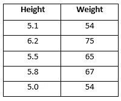
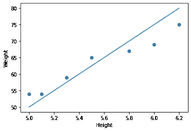
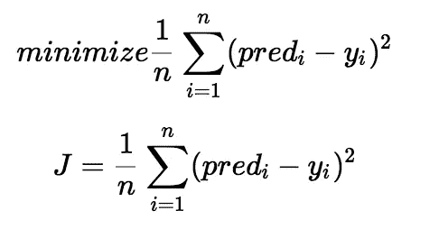
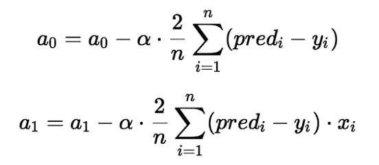

# 从头开始构建您自己的线性回归模型

> 原文：<https://medium.com/analytics-vidhya/build-your-own-linear-regression-model-from-scratch-2b330a431626?source=collection_archive---------16----------------------->


机器猫

让我们从一些真实的例子开始，考虑一个月大的婴儿，如果一条蛇来到婴儿面前，婴儿不会害怕，事实上他或她可能会试图触摸那条蛇。但是让我们假设现在婴儿已经长大，他已经 20 岁了，现在假设如果一条蛇出现在那个男孩面前，那么那个男孩肯定会逃离那条蛇。所以在这 20 年的时间里，这个男孩已经知道蛇是危险的，可能是从他的父母那里，可能是从电视频道，可能是从他的朋友那里，可能是蛇在过去咬过他，但不知何故他知道蛇等于危险的关系。

我会给你一个更实际的例子，所以让我们考虑下表。



日期设置

如果一个人的身高是 5.1，那么他的体重是 54，如果身高是 6.2，那么体重是 75，所以我们定义了一个表。如果我问你一个人的身高是 6.0，他的体重是多少？

你的猜测是在 70-72 之间，对吗？

现在让我们分析一下你是如何猜测重量的。首先，通过查看数据，我们可以很容易地找出身高和体重之间的关系，也就是说，如果身高增加，那么体重也增加。

所以这里你的大脑是如此强大，通过查看这些数据，他能够很容易地了解身高和体重之间的关系。

这就是我们作为一个人类试图学习的模式。

## 但现在的问题是，机器学习到底是如何工作的？或者机器如何尝试学习这种关系？

所以对于身高等于 6.0，你的预测是对的？那么现在是机器预测体重的时候了？让我们来看看机器是如何预测体重的。
**所以这里我们的目的是预测身高为 6.0 时的体重**

现在我用图形表示了身高和体重。



身高与体重

所以在上图中，你可以清楚地看到，是的，身高和体重是成正比的。

现在你可能想知道图中的那条线是什么？？？

所以我们都知道基本的线方程，即 Y = m*X + c

这里，
m =直线的斜率
c =截距，即 X = 0 时 Y 的值

我将再次重写这条线方程，它将定义我们的问题陈述。

> **体重= m *身高+ c**

这表明，如果我知道 m 的值，高度的值和 c 的值，那么我就可以很容易地求出重量。

让我们试一下，假设 m = 10，c = 1，身高= 5.5，那么在这种情况下，我的体重将是 56，即(体重= 10 * 5.5 + 1)。但是如果你去看上面的表格，你会发现当身高等于 5.5 的时候，我的体重是 65。

所以这里我的预测体重是 56，实际体重是 65，所以我得到了 9 个单位的误差。

**误差=预测值-实际值**

n =示例数量。

为了便于理解，我只展示了一个例子的误差值，但是成本函数只不过是所有例子的均方误差的总和。



价值函数

所以现在的问题是，我们如何最小化这个成本函数？或者，我们如何找到最合适的线方程，给我最小的成本函数？或者我如何能减少均方差值？对不对…？

如果你仔细观察，你就会知道，我在上面的线方程中随机选择了 m 和 c 的值，即体重= m *身高+ c，但是如果不是 m=10 和 c=1，如果我用 m 和 c 中的一些其他值替代，那么成本函数值可能会最小。

因此，寻找更好的 m 和 c 值的过程被称为**梯度下降算法**，该过程给出了**代价函数**的最小值。

因此，梯度下降是一种更新 m 和 c 的值以降低成本函数(均方误差)的方法。想法是，我们从 m 和 c 的一些值开始，然后我们迭代地改变这些值，以减少误差值或成本函数。梯度下降帮助我们了解如何改变这些值。


凸函数与非凸函数

所以我们必须不断改变 m 和 c 的值，以达到这个凸函数的最小值。

所以我们改变 m 和 c 值的每一次速率叫做**学习速率(α)**。所以我们的学习速度应该是这样的，我们不应该错过凸函数的最小值。



梯度下降(在我们的例子中，a0 = c，a1 = m)

就这样…让我们试着用编程的方式执行上面的步骤，看看我们能得到的最合适的 m 和 c 值是多少。

```
*import pandas as pd**# Initialization of m and c* m = 0
c = 0

X = [5.1, 6.2, 5.8, 5.5, 5.0, 5.3, 6.0]
Y = [54, 75, 67, 65, 54, 59, 69]

data = pd.DataFrame(list(zip(X, Y)), columns =[**'X'**, **'Y'**]) 

print(data.head())

X = data.iloc[:, 0]
Y = data.iloc[:, 1]*# The learning Rate*
L = 0.0001*# The number of iterations to perform gradient descent* epochs = 1000*# Number of elements in X* n = float(len(X))  *# Performing Gradient Descent* **for** i **in** range(epochs):
    Y_pred = m * X + c  *# The current predicted value of Y* D_m = (-2 / n) * sum(X * (Y - Y_pred))  *# Derivative wrt m* D_c = (-2 / n) * sum(Y - Y_pred)  *# Derivative wrt c* m = m - L * D_m  *# Update m* c = c - L * D_c  *# Update c* print(m, c)# m = 11.05 , c = 1.94

**def** predict(x):
    **return** m * x + cpredict(6.0)# 68.26
```

因此，我们可以看到，使用我们自己的线性回归算法，我们能够预测重量。

感谢阅读…

***第一条原则是，千万不要愚弄自己，自己是最容易被愚弄的人。——理查德·费曼。***