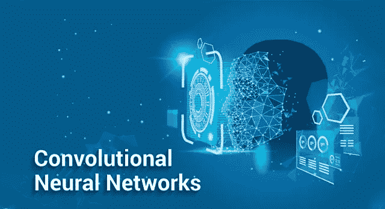

# 用卷积神经网络建立你自己的模型

> 原文：<https://medium.com/analytics-vidhya/build-your-own-model-with-convolutional-neural-networks-5ca0dd222c8f?source=collection_archive---------20----------------------->

## 什么是神经网络

神经网络是一系列算法，通过模拟人脑运行方式的过程，努力识别一组数据中的潜在关系。

## 什么是卷积神经网络