# 使用 Google 的 Tesseract 和 OpenCV 构建您自己的光学字符识别(OCR)系统

> 原文：<https://medium.com/analytics-vidhya/build-your-own-optical-character-recognition-ocr-system-using-googles-tesseract-and-opencv-6bf40d2a6ae?source=collection_archive---------19----------------------->

# 概观

*   光学字符识别(OCR)是计算机视觉领域中广泛使用的系统
*   了解如何为各种任务构建自己的 OCR
*   我们将利用 OpenCV 库和 Tesseract 来构建 OCR 系统

# 介绍

你还记得在一次考试中你不得不填写正确答案的那些日子吗？或者你在第一份工作前做的能力倾向测试怎么样？我能清晰地回忆起奥林匹克竞赛和多项选择测试，大学和组织使用光学字符识别(OCR)系统成群结队地给答卷评分。

老实说，OCR 在很多行业和功能中都有应用。因此，从扫描文件——银行对账单、收据、手写文件、优惠券等。，到在自动驾驶汽车中阅读街道标志——这些都属于 OCR 的范畴。

几十年前，OCR 系统的构建非常昂贵和繁琐。但是计算机视觉和深度学习领域的进步意味着我们现在就可以建立自己的 OCR 系统！


但是建立一个 OCR 系统并不是一件简单的事情。首先，它充满了各种问题，比如图像中不同的字体、对比度差、图像中有多个对象等等。

因此，在本文中，我们将探索一些非常著名和有效的 OCR 任务方法，以及如何自己实现一个。

*如果你是物体检测和计算机视觉的新手，我建议浏览以下资源:*

*   [*基本物体检测算法分步介绍*](https://www.analyticsvidhya.com/blog/2018/10/a-step-by-step-introduction-to-the-basic-object-detection-algorithms-part-1/?utm_source=blog&utm_medium=build-your-own-ocr-google-tesseract-opencv)
*   [*计算机视觉教程*](https://courses.analyticsvidhya.com/courses/computer-vision-using-deep-learning-version2?utm_source=blog&utm_medium=build-your-own-ocr-google-tesseract-opencv)

# 目录

1.  什么是光学字符识别(OCR)？
2.  现实世界中流行的 OCR 应用程序
3.  使用 Tesseract OCR 进行文本识别
4.  文本检测的不同方法

# 什么是光学字符识别(OCR)？

我们先来了解一下 OCR 是什么，以防你之前没有碰到过这个概念。

> *OCR，即光学字符识别，是识别图像中的文本并将其转换为电子形式的过程。这些图像可以是手写文本、打印文本，如文档、收据、名片等。，甚至是自然风光照片。*

OCR 有两个部分。第一部分是**文本检测**，其中确定图像内的文本部分。图像中文本的定位对于 OCR 的第二部分很重要，即**文本识别**，从图像中提取文本。综合使用这些技术，你就可以从任何图像中提取文本。

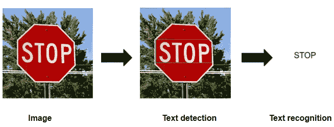

但是没有什么是完美的，OCR 也不例外。然而，随着深度学习的出现，这一问题有可能获得更好和更通用的解决方案。

在我们深入研究如何构建自己的 OCR 之前，让我们先来看看一些流行的 OCR 应用程序。

# 现实世界中流行的 OCR 应用程序

OCR 在各行各业都有广泛的应用(主要目的是减少人工操作)。它已经融入到我们的日常生活中，以至于我们几乎没有注意到它！但他们肯定会努力带来更好的用户体验。


OCR 用于**手写识别任务**提取信息。这个领域正在进行大量的工作，我们已经取得了一些真正重大的进展。微软已经提出了一个令人敬畏的数学应用程序,它将手写的数学方程作为输入，并生成解决方案以及工作的一步一步的解释。

OCR 越来越多地被各行各业用于数字化，以减少手工工作量。这使得从商业文档、收据、发票、护照等中提取和存储信息变得非常容易和高效。此外，当您为 KYC(了解您的客户)上传文档时，OCR 用于从这些文档中提取信息并存储它们以供将来参考。

OCR 还用于书籍扫描，将原始图像转换成数字文本格式。许多大型项目，如古登堡计划、百万图书计划和谷歌图书，都使用 OCR 来扫描和数字化图书，并将作品存储为档案。

**银行业**也越来越多地使用 OCR 来归档与客户相关的文书工作，如入职材料，以轻松创建客户存储库。这大大减少了入职时间，从而改善了用户体验。此外，银行使用 OCR 从支票中提取账号、金额、支票号码等信息，以加快处理速度。

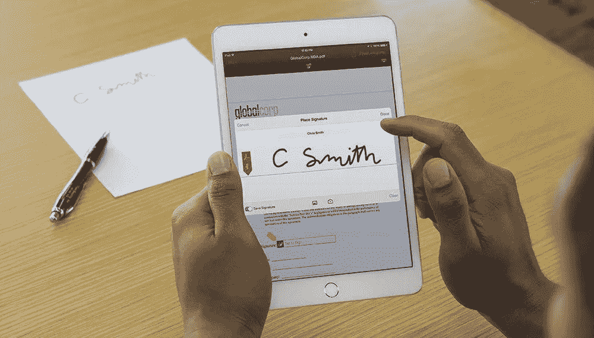

OCR 的应用是不完整的，没有提到它们在**自动驾驶汽车**中的使用。自动驾驶汽车广泛依赖 OCR 来读取路标和交通标志。对这些标志的有效理解使自动驾驶汽车对行人和路上行驶的其他车辆来说是安全的。

OCR 的应用肯定还有很多，比如车辆牌照识别、将扫描文档转换成可编辑的 word 文档等等。我很想听听你使用 OCR 的经历——请在下面的评论区告诉我。

使用 OCR 的数字化显然具有广泛的优势，如文本的轻松存储和操作，更不用说您可以应用于这些数据的深不可测的分析量了！OCR 绝对是计算机视觉最重要的领域之一。

现在，让我们来看看最著名和最广泛使用的文本识别技术之一——tessera CT。

# 使用 Tesseract OCR 进行文本识别

Tesseract 是一个开源的 OCR 引擎，最初是由惠普公司开发的专有软件，但后来在 2005 年被开源。从那以后，谷歌采纳了这个项目并赞助了它的开发。

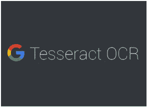

截至今天，Tesseract 可以检测超过 100 种语言，甚至可以处理从右向左的文本，如阿拉伯语或希伯来语！难怪它被谷歌用于移动设备、视频和 Gmail 的图像垃圾检测算法中的文本检测。

从版本 4 开始，Google 对这个 OCR 引擎进行了重大改进。Tesseract 4.0 增加了新的 OCR 引擎，该引擎使用基于 [LSTM](https://www.analyticsvidhya.com/blog/2017/12/fundamentals-of-deep-learning-introduction-to-lstm/?utm_source=blog&utm_medium=build-your-own-ocr-google-tesseract-opencv) (长短期记忆)的神经网络系统，这是序列预测问题最有效的解决方案之一。尽管它以前使用模式匹配的 OCR 引擎仍然可以作为遗留代码使用。

一旦[将](https://tesseract-ocr.github.io/tessdoc/Home.html)宇宙魔方下载到你的系统上，你就可以很容易地[使用下面的命令从命令行运行](https://tesseract-ocr.github.io/tessdoc/Command-Line-Usage.html):

```
***tesseract <test_image> <output_file_name> -l <language(s)> --oem <mode> --psm <mode>***
```

您可以更改立方体配置，以获得最适合您的图像的结果:

1.  **Langue (-l)** —您可以使用 Tesseract 检测单一语言或多种语言
2.  **OCR 引擎模式(-oem)** —众所周知，Tesseract 4 同时拥有 LSTM 和传统 OCR 引擎。然而，基于它们的组合，有 4 种有效操作模式

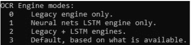

3.**页面分割(-psm)** —可根据图像中的文字进行调整，以获得更好的效果

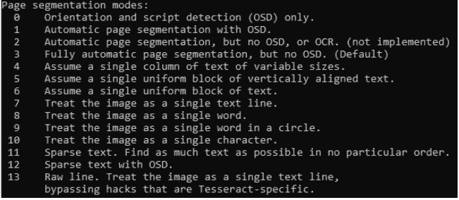

# Pyteseract

然而，除了命令行方法，您还可以使用[pytesseracat](https://github.com/madmaze/pytesseract)——Tesseract 的 Python 包装器。使用它，您可以通过编写一个简单的 Python 脚本，使用 Tesseract OCR 轻松实现自己的文本识别器。

您可以使用***pip install pytesserac***命令下载 pytesserac。

Pytesseract 中的主函数是 **image_to_text()** ，它将图像和命令行选项作为其参数:

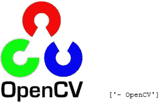

# 宇宙魔方的挑战是什么？

众所周知宇宙魔方并不完美。当图像有很多噪声或者当语言的字体不是 Tesseract OCR 训练的字体时，它的性能很差。其他条件如文本的亮度或偏斜度也会影响 Tesseract 的性能。然而，这是一个低投入、高产出的文本识别的良好起点。

# 文本检测的不同方法

Tesseract 假设输入文本图像相当干净。不幸的是，许多输入图像将包含过多的对象，而不仅仅是一个干净的预处理文本。因此，必须有一个好的文本检测系统，能够检测文本，然后可以很容易地提取。

文本检测有几种方法:

*   OpenCV 的传统使用方式
*   使用深度学习模型的当代方式，以及
*   构建您自己的定制模型

# 使用 OpenCV 进行文本检测

使用 **OpenCV** 进行文本检测是经典的做法。您可以应用[各种操作](https://www.analyticsvidhya.com/blog/2019/03/opencv-functions-computer-vision-python/?utm_source=blog&utm_medium=build-your-own-ocr-google-tesseract-opencv)，如图像大小调整、模糊、阈值、形态学操作等。来清理图像。

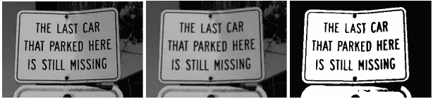

在这里，我们有灰度，模糊和阈值图像，在这个顺序。

完成后，您可以使用 OpenCV 轮廓检测来检测轮廓，以提取大块数据:

最后，您可以在预测文本的轮廓上应用文本识别:

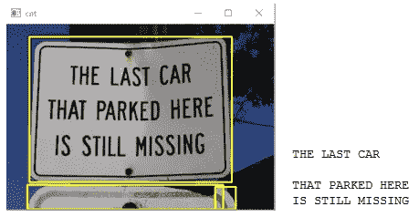

上图中的结果是通过最少的预处理和轮廓检测，然后使用 Pytesseract 进行文本识别而获得的。显然，轮廓并没有每次都检测到文本。

但是，使用 OpenCV 进行文本检测仍然是一项单调乏味的任务，需要对参数进行大量修改。此外，它在推广方面做得不好。更好的方法是使用东方文本检测模型。

# 当代深度学习模型— EAST

EAST，即高效准确的场景文本检测器，是一种深度学习模型，用于从自然场景图像中检测文本。它非常快速和准确，因为它能够以 13.2fps 的速度检测 720p 的图像，F 值为 0.7820。

该模型由一个完全卷积网络和一个非最大抑制级组成，用于预测单词或文本行。然而，该模型不包括在其他先前模型中涉及的一些中间步骤，如候选提议、文本区域形成和词分割，这允许优化的模型。

你可以看看作者在他们的论文中将 EAST 模型与以前的其他模型进行比较时提供的下图:

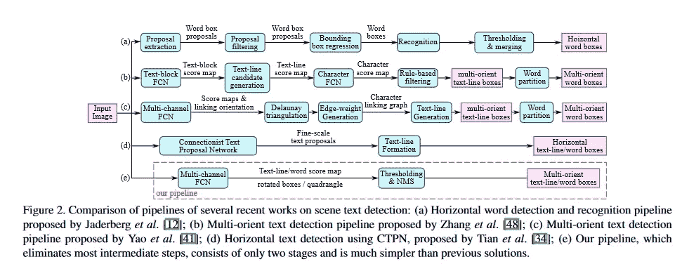

东部有一个 U 型网络。网络的第一部分由在 ImageNet 数据集上训练的卷积层组成。下一部分是特征合并分支，其将当前特征图与来自前一阶段的未缓冲的特征图连接起来。

随后是卷积层，以减少计算并产生输出特征图。最后，使用卷积层，输出是显示文本存在的分数图和覆盖文本的旋转框或四边形的几何图。这可以从研究论文中包含的架构图像中直观地理解:

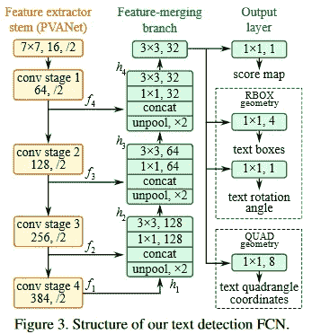

*我强烈建议你通过* [*论文*](https://arxiv.org/abs/1704.03155) *自己去好好了解一下东方模式。*

OpenCV 从 3.4 版本开始包含了东方文本检测器模型。这使得实现你自己的文本检测器非常方便。生成的本地化文本框可以通过 Tesseract OCR 来提取文本，您将拥有一个完整的端到端 OCR 模型。

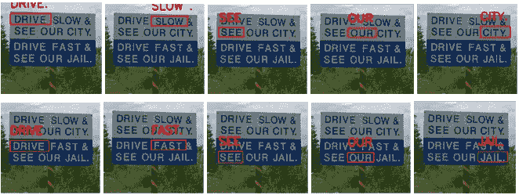

# 使用 TensorFlow 对象 API 进行文本检测的自定义模型

构建文本检测器的最后一种方法是使用定制的文本检测器模型，该模型使用了 [TensorFlow 对象 API](https://github.com/tensorflow/models/tree/master/research/object_detection) 。它是一个开源框架，用于为对象检测任务建立深度学习模型。要详细了解，建议先过一遍这篇详细的[文章](https://www.analyticsvidhya.com/blog/2020/04/build-your-own-object-detection-model-using-tensorflow-api/?utm_source=blog&utm_medium=build-your-own-ocr-google-tesseract-opencv)。

要构建您的自定义文本检测器，您显然需要一个包含相当多图像的数据集，至少超过 100 个。然后你需要对这些图像进行注释，这样模型就可以知道目标物体在哪里，了解它的一切。最后，你可以根据性能和速度之间的权衡，从预先训练好的模型中选择一个，来自 [TensorFlow 的检测模型 zoo](https://github.com/tensorflow/models/blob/master/research/object_detection/g3doc/detection_model_zoo.md) 。你可以参考这篇全面的[博客](https://tensorflow-object-detection-api-tutorial.readthedocs.io/en/latest/training.html#configuring-a-training-pipeline)来构建你的定制模型。

现在，训练可能需要一些计算，但是如果你真的没有足够的计算，不要担心！您可以使用 Google Colaboratory 来满足您的所有需求！这篇[文章](https://www.analyticsvidhya.com/blog/2020/03/google-colab-machine-learning-deep-learning/?utm_source=blog&utm_medium=build-your-own-ocr-google-tesseract-opencv)将教你如何有效地使用它。

最后，如果您想更进一步，构建一个 YOLO 最先进的文本检测器模型，[这篇](https://www.analyticsvidhya.com/blog/2018/12/practical-guide-object-detection-yolo-framewor-python/?utm_source=blog&utm_medium=build-your-own-ocr-google-tesseract-opencv)文章将是理解它的所有本质的垫脚石，您将有一个良好的开端！

# 结束注释

在本文中，我们讨论了 OCR 中的问题以及可以用来解决该任务的各种方法。我们还讨论了这些方法的各种缺点，以及为什么 OCR 不像看起来那么容易！

你以前使用过 OCR 应用程序吗？在此之后，您计划构建什么样的 OCR 用例？请在下面告诉我您的想法和反馈。

# 你也可以在分析 Vidhya 的 Android 应用上阅读这篇文章

*原载于 2020 年 5 月 16 日 https://www.analyticsvidhya.com**的* [*。*](https://www.analyticsvidhya.com/blog/2020/05/build-your-own-ocr-google-tesseract-opencv/)