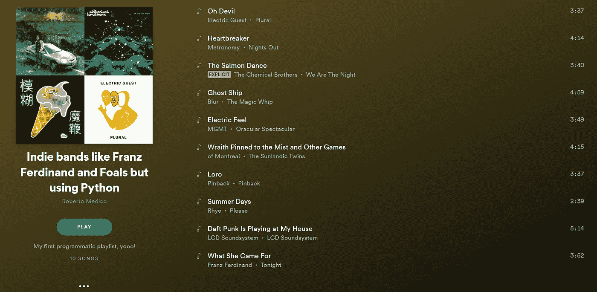

# 使用 Spotify 的 API 构建您自己的播放列表生成器🎧(用 Python！)

> 原文：<https://medium.com/analytics-vidhya/build-your-own-playlist-generator-with-spotifys-api-in-python-ceb883938ce4?source=collection_archive---------1----------------------->


Heidi Sandstrom 拍摄的照片。 on [Unsplash](https://unsplash.com/search/photos/spotify?utm_source=unsplash&utm_medium=referral&utm_content=creditCopyText)

[Spotify](http://spotify.com) 在为我们提供 maaaany 方面做得很好(而且总是新鲜的！)播放列表，基本上 100%保证你会在任何场合找到一个令你满意的。

> **但是。有时，根据你能想到的任何标准，生成你自己的播放列表也很有趣。**

对于真正喜欢这种乐趣的人(比如我)，Spotify 提供了 [Web API](https://developer.spotify.com/documentation/web-api/reference-beta/) ，允许人们根据特定属性，如艺术家、流派、快乐、BPMs、声音等等，生成即时播放列表。

因为这些是 web API，所以您可以使用任何您喜欢的开发环境和语言进行查询并从中获得结果。

在这篇文章中，我将使用 **Python** ，但是举例来说，没有什么可以阻止你勇敢的使用 C++。


照片由 [Hitesh Choudhary](https://unsplash.com/@hiteshchoudhary?utm_source=unsplash&utm_medium=referral&utm_content=creditCopyText) 在 [Unsplash](https://unsplash.com/search/photos/python?utm_source=unsplash&utm_medium=referral&utm_content=creditCopyText) 上拍摄

要使用该 API，首先需要一个 OAuth 令牌，它允许您对请求进行身份验证。要获得一个，最简单的方法是前往[https://developer.spotify.com/console/get-recommendations/,](https://developer.spotify.com/console/get-recommendations/)滚动到底部并点击“获取令牌”按钮。

选择我们需要的作用域(在本例中，只有*playlist-modify-private*)并登录后，您将获得一个代码，您可以复制粘贴并使用它来验证请求。

> N B:这只是一个短暂的令牌；要为实际的*严重*应用程序生成和刷新令牌，您可以遵循以下指南

一旦你有了令牌，我们就可以开始构建我们自己的播放列表生成器。

为此，我们将设置一些过滤器并查询推荐和播放列表端点来创建和填充我们的播放列表。

我们将通过直接调用 Web APIs，使用(amazing) [requests](https://2.python-requests.org/en/master/) 库来生成所需的 HTTP 请求(duh)来实现这一点。

具体来说，我们要做的是:

1.对/recommendations 端点的 HTTP GET 请求，以获取磁道；

2.向/playlists 端点发送 HTTP POST 请求以创建新的播放列表；

3.向/playlist 端点发送 HTTP POST 请求以添加歌曲。

首先，我们导入请求库，并设置端点和过滤器。

在这里，我们为推荐设置了一些基本的过滤器(10 首独立歌曲，非常适合舞池)。

接下来，我们创建我们的*查询*，并向 API 服务发送一个 HTTP GET 请求。将 YOUR_TOKEN_HERE 替换为前面解释的获得的令牌。

最后，我们从 API 获得 JSON 响应，并解析它以打印推荐的曲目:

如果一切顺利，你现在应该看到推荐的 10 首曲目。例如，这是我得到的输出(注意，这可能与您通过运行代码得到的不同，因为在所有合适的音轨之间随机抽样了 10 个推荐):

```
1) "Rawnald Gregory Erickson the Second" by STRFKR
2) "Oh Devil" by Electric Guest
3) "Where I'm From" by Digable Planets
4) "Fidelity" by Regina Spektor
5) "Wraith Pinned to the Mist and Other Games" by of Montreal
6) "Pretty Girl" by Clairo
7) "Summer Days" by Rhye
8) "Psychic City - Classixx Remix" by YACHT
9) "This Must Be the Place (Naive Melody) - 2005 Remaster" by Talking Heads
10) "FACE" by BROCKHAMPTON
```

> 相当不错！看来我们的建议是对的。

目前，我们只设置了几个基本的过滤器，但是也可以指定更具体的设置，如“*我想要听起来像法兰兹·费迪南*的歌曲”或“*我想要听起来像小马驹乐队*的卡修斯的歌曲”。


照片由 [Cedrik Mosquera](https://unsplash.com/@cedrikm?utm_source=unsplash&utm_medium=referral&utm_content=creditCopyText) 在 [Unsplash](https://unsplash.com/search/photos/guitar-girl-electric?utm_source=unsplash&utm_medium=referral&utm_content=creditCopyText) 上拍摄

为此，我们可以为我们希望播放列表听起来像的曲目(或艺术家)设置*种子*。

我们试试吧！要在艺术家上添加过滤器，我们需要在查询中设置 *seed_artists* 属性:

如上所示，种子作为艺术家的 ID 被传递。要检索它(快速简单的方法),你可以在 Spotify 上浏览到该艺术家，右击它并选择“共享->复制 Spotify URI ”,这将复制一个字符串到剪贴板，如下所示:

*spotify:艺人:0XNa1vTidXlvJ2gHSsRi4A*

*spotify:artist:* 后面的部分就是你需要的 ID。

完成后，我们得到的输出是:

```
1) "What She Came For" by Franz Ferdinand
2) "Rawnald Gregory Erickson the Second" by STRFKR
3) "Oh Devil" by Electric Guest
4) "Wraith Pinned to the Mist and Other Games" by of Montreal
5) "Where I'm From" by Digable Planets
6) "Summer Days" by Rhye
7) "Ghost Ship" by Blur
8) "Wide Awake" by Parquet Courts
9) "Psychic City - Classixx Remix" by YACHT
10) "FACE" by BROCKHAMPTON
```

正如我们所观察到的，这些建议确实被修改了，以更好地反映我们的新过滤器。像 Blur 和 Parquet Courts 这样的吉他乐队(事实上在法兰兹·费迪南注册的更多)现在已经取代了像瑞金娜·斯派克特和 Clairo 这样的艺术家。


梅尔文·达雷尔在 [Unsplash](https://unsplash.com/search/photos/guitar?utm_source=unsplash&utm_medium=referral&utm_content=creditCopyText) 上的照片

类似地，我们可以通过设置 *seed_tracks* 属性来设置轨道上的过滤器:

同样，可以通过 Spotify URI 获得曲目的 ID。

这是相应的输出:

```
1) "Rawnald Gregory Erickson the Second" by STRFKR
2) "Oh Devil" by Electric Guest
3) "Where I'm From" by Digable Planets
4) "Wraith Pinned to the Mist and Other Games" by of Montreal
5) "Summer Days" by Rhye
6) "FACE" by BROCKHAMPTON
7) "Heartbreaker" by Metronomy
8) "Psychic City - Classixx Remix" by YACHT
9) "Daft Punk Is Playing at My House" by LCD Soundsystem
10) "The Salmon Dance" by The Chemical Brothers
```

> 像 LCD Soundsystem、化学兄弟乐团和 Metronomy 这样的电子舞曲乐队正在流行，很好！

这很酷，但是现在我们只打印出了我们推荐的标题和艺术家。

> 当然，我们想要的是自动构建一个包含这些推荐的播放列表。

为此，我们将使用[播放列表端点](https://developer.spotify.com/documentation/web-api/reference/playlists/create-playlist)。

首先，让我们创建一个名为“像法兰兹·费迪南一样的独立乐队，但使用 Python”的新播放列表。与以前不同，我们现在将向 API 发出 POST 请求，在请求体中包含新播放列表的详细信息。

这个请求的端点是[https://api.spotify.com/v1/users/{user_id}/playlists,](https://api.spotify.com/v1/users/{user_id}/playlists)，它需要指定 user_id(在本例中是我们的 id)。要检索这些内容，我们可以再次使用 Spotify URI，浏览我们的个人资料并点击“分享- >复制 Spotify URI”。ID 也是 URI 的最后一部分。

如果响应返回一个状态代码 201，那么一切都正常了，我们的播放列表已经准备好了。

要添加歌曲，我们需要新创建的播放列表的 ID(可以在响应的 JSON 中找到):

再说一遍，201 意味着一切都好！

我们现在可以浏览我们的个人资料，并且…



> 在那里！
> 
> 我们终于可以享受新生成的自定义播放列表了:

 [## 独立乐队喜欢法兰兹·费迪南和小马驹乐队，但使用 Python，一个由 Roberto Medico 在…

### 我们和我们的合作伙伴使用 cookies 来个性化您的体验，根据您的兴趣向您显示广告，以及…

open.spotify.com](https://open.spotify.com/playlist/4ZEuiByazvp0MaZNvMZEnc?si=fAggUaatQ_Gm4OlkpuPQcQ) 

> →您可以在此找到包含所有代码[的完整笔记本。←](https://nbviewer.jupyter.org/gist/rob-med/167bc67169133712ee0e75f76103fbc5)

> 在运行之前，不要忘记填写您自己的令牌和用户 ID！

## 只需插入您自己的令牌并开始使用新的过滤器，t [这里有一大堆](https://developer.spotify.com/documentation/web-api/reference/browse/get-recommendations/)！

最后，你可以在这里找到一个定制生成器的现场版本:这个工具使用我们刚刚看到的 API，通过选择流派、情绪或两者来生成定制播放列表。

在这种情况下，不需要登录，因为所有内容都使用一个帐户进行身份验证，即创建的播放列表的所有者。

