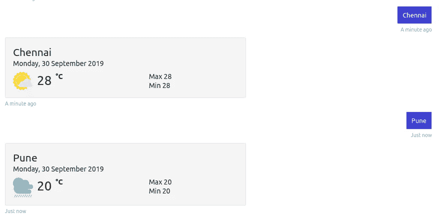
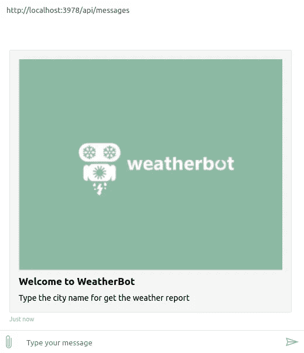
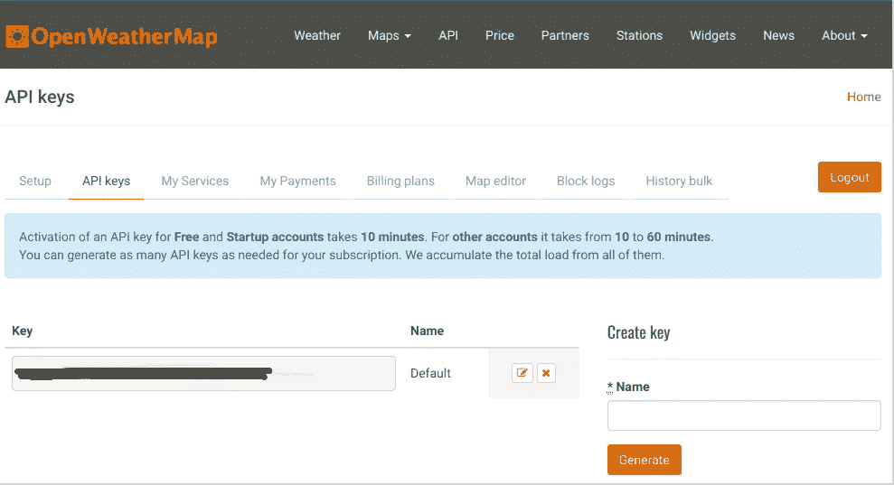
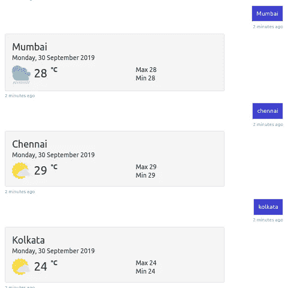

# 用 bot framework+Openweathermap+Adaptive cards UI 构建自己的 WeatherBot

> 原文：<https://medium.com/analytics-vidhya/build-your-own-weatherbot-with-botframework-openweathermap-adaptive-cards-ui-5d097b37ab8a?source=collection_archive---------5----------------------->



> 当今世界正全面展开人工智能的发展，聊天机器人在这一领域发挥着至关重要的作用。由于 FB messenger、WhatsApp、Skype、Telegram、Slack 等消息应用的用户数量迅速增加。仅 FB messenger 月活用户就超过 12 亿。

现在是时候开发一个聊天机器人应用程序来解决社会和商业需求了。根据 gartner 的预测，到 2020 年，超过 85%的客户互动将在无人参与的情况下进行。然而，聊天机器人系统提供的机会远不止是对客户的询问做出回应。难怪聊天机器人市场的规模正呈指数级增长。

在这篇文章中，我将使用微软 bot 框架、Openweathermap API 和自适应卡来构建一个基于交互式 UI 的 weatherbot。

聊天机器人的第一次互动如下图所示，内容很少。



天气机器人的首次互动

在这个机器人中，用户可以输入城市名称来获得当前的天气状况。bot 必须调用 Openweathermap API 来获取当前的天气报告。然后将更新 Json 模板中的报告，以显示它的下一次交互。

在开始构建之前，我们需要为项目构建做一些预设置。

# 先决条件

*   [。NET Core SDK](https://dotnet.microsoft.com/download) 版本 2.1
*   Visual Studio 2017/ visual studio 代码
*   Bot 框架 V4
*   OpenWeathermap API
*   Bot 框架模拟器(测试)
*   用于用户界面的适配卡

## **第一步:** - **下载。NET Core SDK 并安装在您的系统中。**

安装后检查 dotnet 的版本

```
# determine dotnet version
dotnet --version
```

## **第二步:-** **OpenWeatherMap 账户设置**

如果你想玩 API， [OpenWeatherMap](https://openweathermap.org/api) 是一个不错的起点。他们实际上提供了 11 个不同的 API，都与天气有关，你可以访问。

对于这个项目，我们使用免费的“当前天气”API。前往[此链接](https://openweathermap.org/appid)并注册一个账户。

登录后，选择 **API 密钥**选项卡。在这里，您可以在页面的右侧创建一个键。输入一个名称，然后选择生成。您的 API 密钥将出现在左侧。复制这把钥匙以备后用。



现在进入 [API 页签](https://openweathermap.org/api)了解 API 的详细知识，选择**当前天气数据**的 **API 文档**。并来到“ **By 地理坐标**”部分，看一下 API 会如何显示数据。

## **步骤 3:-创建一个项目**

该项目的完整代码可在 [**GitHub Repo**](https://github.com/zayedrais/WeatherBot) 中获得

**尝试该样品**

*   克隆存储库

```
git clone [https://github.com/zayedrais/WeatherBot.git](https://github.com/zayedrais/WeatherBot.git)
```

*   在终端中，导航至`WeatherBot/Bots/WeatherBot.cs`
*   bot 首次欢迎交互将在名为**onmembersaddasync 的用户方法的新成员上启动。**
*   这里使用英雄卡作为欢迎内容，下面突出显示的代码是英雄卡的代码。

```
protected override async Task **OnMembersAddedAsync**
(IList<ChannelAccount> membersAdded, ITurnContext<IConversationUpdateActivity> 
turnContext, CancellationToken cancellationToken)
{
IConversationUpdateActivity iConversationUpdated = turnContext.Activity as IConversationUpdateActivity;foreach (var member in membersAdded)
{
if (member.Id != turnContext.Activity.Recipient.Id)
{
***var card = new HeroCard
{
Title = "Welcome to WeatherBot",
Text = @"Type the city name for get the weather report",
Images = new List<CardImage>() { new CardImage(ImageToBase64(_images[0])) },
};***
await turnContext.SendActivityAsync(MessageFactory.Attachment
(card.ToAttachment()), cancellationToken);
}
}
}
```

-在欢迎信息后，用户可以输入城市名称以获取当前天气报告。

-然后调用方法作为 **OnMessageActivityAsync。**该方法包含当前城市名称，即天气的用户类型。

*   只是将 API 键替换到了 **OpenwetherMapAPI** 处。
*   **这个方法里面做了以下事情:-**
*   调用 weathermap API
*   选择并更新模板的图像。
*   选择并更新 UI 的 Json 模板的当前数据。
*   发送更新的 Json 模板来显示天气预报。

```
protected override async Task **OnMessageActivityAsync**(ITurnContext
<IMessageActivity> turnContext, CancellationToken
cancellationToken){
var client = new OpenWeatherMapClient("**OpenwetherMapAPI**");
var CloudImage = "http://messagecardplayground.azurewebsites.net/assets/Mostly%20Cloudy-Square.png";var DizzleImage = "http://messagecardplayground.azurewebsites.net/assets/Drizzle-Square.png";var rainImage  = "https://raw.githubusercontent.com/zayedrais/WeatherBot/master/Resources/rain.png";var stormImage = "https://raw.githubusercontent.com/zayedrais/WeatherBot/master/Resources/storm.png";var sunImage = "https://raw.githubusercontent.com/zayedrais/WeatherBot/master/Resources/sun.png";var currentWeather = await client.CurrentWeather.GetByName(turnContext.Activity.Text);var search =await client.Search.GetByName("Chennai");var forcast  = await client.Forecast.GetByName("Chennai");var curtTemp = currentWeather.Temperature.Value - 273.15;var MaxTemp  = currentWeather.Temperature.Max -273.15;var MinTemp  = currentWeather.Temperature.Min -273.15;var updateCard = readFileforUpdate_jobj(_cards[0]);JToken cityName = updateCard.SelectToken("body[0].text");JToken tdyDate = updateCard.SelectToken("body[1].text");JToken curTemp = updateCard.SelectToken("body[2].columns[1].items[0].text");JToken maxTem = updateCard.SelectToken("body[2].columns[3].items[0].text");JToken minTem = updateCard.SelectToken("body[2].columns[3].items[1].text");JToken weatherImageUrl = updateCard.SelectToken("body[2].columns[0].items[0].url");cityName.Replace(currentWeather.City.Name);curTemp.Replace(curtTemp.ToString("N0"));tdyDate.Replace(DateTime.Now.ToString("dddd, dd MMMM yyyy"));maxTem.Replace("Max" +" "+MaxTemp.ToString("N0"));minTem.Replace("Min" + " "+MinTemp.ToString("N0"));var n = currentWeather.Clouds.Name;if(n=="overcast clouds")
{
weatherImageUrl.Replace(rainImage);
}
else if (n.Contains("clouds"))
{
weatherImageUrl.Replace(CloudImage);
}
else if (n.Contains("sky"))
{
weatherImageUrl.Replace(sunImage);
}
else if (n.Contains("rain"))
{
weatherImageUrl.Replace(rainImage);
}
else if(n.Contains("storm") || n.Contains("thunder"))
{
weatherImageUrl.Replace(stormImage);
}
var updateWeatherTem = UpdateAdaptivecardAttachment(updateCard);await turnContext.SendActivityAsync(MessageFactory.Attachment
(updateWeatherTem), cancellationToken):
}
```

## 运行项目:-

*   从终端或 Visual Studio 运行 bot，选择选项 A 或 b。
*   a)从终端

```
# run the bot 
dotnet run
```

*   b)或来自 Visual Studio
*   启动 Visual Studio
*   文件->打开->项目/解决方案
*   导航到`WeatherBot/Bots`文件夹
*   选择`WeatherBot.csproj`文件
*   按`F5`运行项目

## 步骤 4:-使用 bot 框架仿真器测试 Bot

[bot Framework Emulator](https://github.com/microsoft/botframework-emulator) 是一个桌面应用程序，允许 Bot 开发者在本地主机上测试和调试他们的 Bot，或者通过隧道远程运行。

*   从[这里](https://github.com/Microsoft/BotFramework-Emulator/releases)安装 Bot 框架模拟器版本 4.3.0 或更高版本

## 使用 bot 框架模拟器连接到 Bot

*   启动 Bot 框架模拟器
*   文件->打开 Bot
*   输入一个`[http://localhost:3978/api/messages](http://localhost:3978/api/messages)`的机器人网址

## 最终看起来像下图:-



该项目的完整代码可在 [**GitHub Repo**](https://github.com/zayedrais/WeatherBot) 中找到