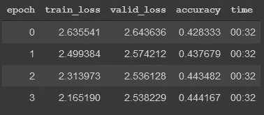

# 构建你自己的 WhatsApp 文本生成器(并学习所有关于语言模型的知识)

> 原文：<https://medium.com/analytics-vidhya/build-your-own-whatsapp-text-generator-and-learn-all-about-language-models-a1d6d96cd32e?source=collection_archive---------4----------------------->

## 一个实用的端到端深度学习 NLP 例子


WhatsApp 上的正常对话，但一切并不像看上去的那样。人民是真实的；聊天是假的。它是由一个基于真实对话历史训练的语言模型生成的。在这篇文章中，我将带你通过使用*循环神经网络*和*转移学习*的力量来构建你自己的版本。

## 要求

我使用了谷歌免费数据科学研究工具 [Colab](https://colab.research.google.com/) 中的 [fastai 库](https://docs.fast.ai/)。这意味着很少的时间(也没有钱)来设置。要构建自己的模型，你只需要这篇文章中列出的代码(这里也是[和下面的代码:](https://colab.research.google.com/drive/1UcX4p1Icw0quNrhuA2B912DRTwcIDEQA)

*   访问互联网的设备
*   一个谷歌账户
*   WhatsApp 聊天记录

我讨论了一些理论并深入研究了一些源代码，但是更多的细节有各种学术论文和文档的链接。如果你想了解更多，我强烈建议你去看看优秀的 fastai 课程。

## 驱动器和 Colab 初始设置

首先，我们将在 [Google Drive](http://drive.google.com) 上为您的笔记本电脑创建一个空间。点击“新建”，给文件夹起个名字(我用的是“whatsapp”)。


然后进入你的新文件夹，再次点击“新建”，打开一个 Colab 笔记本，给它一个合适的名字。


最后，我们希望为笔记本电脑启用 GPU。这将大大加快训练和文本生成过程(对于矩阵乘法，即神经网络中的主要计算，GPU 比 CPU 更有效)。

单击顶部菜单中的“运行时”，然后单击“更改运行时类型”，并为硬件加速器选择“GPU”。


## WhatsApp 数据

现在我们来获取一些数据。越多越好，所以你会想选择一个有相当长历史的聊天。此外，向参与谈话的其他人解释你正在做什么，并首先获得他们的许可。

要下载聊天，请单击选项(右上角的三个垂直点)，选择“更多”，然后选择“导出聊天”，“不带媒体”，如果您的移动设备上安装了驱动器，您应该可以选择保存到新创建的文件夹中(否则，保存文件并手动添加到驱动器中)。


## 数据准备

回到笔记本。让我们从更新 fastai 库开始。

```
!curl -s [https://course.fast.ai/setup/colab](https://course.fast.ai/setup/colab) | bash
```

然后是一些标准的魔法命令，我们引入了三个库:fastai.text(用于模型)、pandas(用于数据准备)和 re(用于正则表达式)。

```
## magic commands
%reload_ext autoreload
%autoreload 2
%matplotlib inline## import required packages
from fastai.text import *
import pandas as pd
import re
```

我们希望将这个笔记本链接到 Google Drive，以便使用我们刚刚从 WhatsApp 导出的数据，并保存我们创建的任何模型。为此，运行以下代码，转到提供的链接，选择您的 google 帐户，并将授权代码复制回您的笔记本。

```
## Colab google drive stuff
from google.colab import drive
drive.mount('/content/gdrive', force_remount=True)
root_dir = "/content/gdrive/My Drive/"
base_dir = root_dir + 'whatsapp/'
```

我们有一些清理工作要做，但数据目前还在。txt 格式。不理想。这里有一个函数，它将文本文件转换成 pandas 数据帧，每个聊天条目占一行，并带有时间戳和发送者的姓名。

```
## function to parse the whatsapp extract file
def parse_file(text_file):
    '''Convert WhatsApp chat log text file to a Pandas dataframe.'''

    # some regex to account for messages taking up multiple lines
    pat = re.compile(r'^(\d\d\/\d\d\/\d\d\d\d.*?)(?=^^\d\d\/\d\d\/\d\d\d\d|\Z)',
                     re.S | re.M)
    with open(text_file) as f:
        data = [m.group(1).strip().replace('\n', ' ') 
                for m in pat.finditer(f.read())] sender = []; message = []; datetime = []
    for row in data:

        # timestamp is before the first dash
        datetime.append(row.split(' - ')[0]) # sender is between am/pm, dash and colon
        try:
            s = re.search(' - (.*?):', row).group(1)
            sender.append(s)
        except:
            sender.append('')

        # message content is after the first colon
        try:
            message.append(row.split(': ', 1)[1])
        except:
            message.append('')

    df = pd.DataFrame(zip(datetime, sender, message), 
                      columns=['timestamp',
                               'sender',
                               'text'])    

    # exclude any rows where format does not match 
    # proper timestamp format
    df = df[df['timestamp'].str.len() == 17]
    df['timestamp'] = pd.to_datetime(df.timestamp, 
                                     format='%d/%m/%Y, %H:%M') # remove events not associated with a sender
    df = df[df.sender != ''].reset_index(drop=True)

    return df
```

让我们看看它是如何工作的。创建数据的路径，将该函数应用于聊天导出，并查看生成的数据帧。

```
## path to directory with your file
path = Path(base_dir)## parse whatsapp extract, replace chat.txt with your 
## extract filename
df = parse_file(path/'chat.txt')## take a look at the result
df[205:210]
```


完美！这是我和我可爱的妻子之间的一小段对话。这种格式的一个优点是，我可以很容易地用小写字母创建一个参与者姓名列表，用下划线代替任何空格。这个以后会有帮助的。

```
## list of conversation participants
participants = list(df['sender'].str.lower().
                    str.replace(' ', '_').unique())
participants
```


在这种情况下，只有两个名字，但它将与任何数量的参与者。

最后，我们需要考虑如何将文本输入到我们的模型网络中。通常，我们会有多个独立的文本片段(例如维基百科文章或 IMDB 评论)，但我们这里只有一个正在进行的文本流。一次连续的谈话。这就是我们创造的。一个长字符串，包括发件人姓名。

```
## concatenate names and text into one string
text = [(df['sender'].str.replace(' ', '_') + ' ' + df['text']).str.cat(sep = ' ')]## show part of string
text[0][8070:8150]
```


看起来不错。我们已经准备好让学生学习这个了。

## 学习者创造

为了使用 fastai API，我们现在需要创建一个 [DataBunch](https://docs.fast.ai/data_block.html#The-data-block-API) 。这是一个可以在学习者内部用来训练模型的对象。在这种情况下，它有三个关键输入:数据(分为训练集和验证集)、数据标签和批量。

*数据*

为了将培训和验证分开，让我们在我们的长对话字符串中间选择一个点。我把前 90%用于培训，后 10%用于验证。然后我们可以创建几个[文本列表](https://docs.fast.ai/text.data.html#TextList)对象，并快速检查它们看起来和以前一样。

```
## find the index for 90% through the long string
split = int(len(text[0])*0.9)## create TextLists for train/valid
train = TextList([text[0][:split]])
valid = TextList([text[0][split:]])## quick look at the text
train[0][8070:8150]
```


这个文本列表值得更深入一点。

它或多或少是一个文本列表(在本例中只有一个元素)，但是让我们快速查看一下源代码，看看还有什么。


好了，TextList 是一个有一堆方法的类(函数，上面任何以“def”开头的，都最小化)。它继承自一个[项目列表](https://docs.fast.ai/data_block.html#ItemList)，换句话说，它是一种项目列表。尽一切办法去查找一个项目列表，但我最感兴趣的是“_ 处理器”变量。处理器是一个带有 TokenizeProcessor 和 NumericalizeProcessor 的列表。这些在 NLP 环境中听起来很熟悉:

*标记化* —处理文本并将其分解成单个单词

*数字化* —用与单词在词汇库中的位置相对应的数字来替换这些标记

为什么我要强调这一点？当然，理解用于处理文本的规则是有帮助的，深入研究这部分源代码和文档将有助于你做到这一点。但是，具体来说，我想添加我自己的新规则。我觉得我们应该表明文本中的发送者姓名在某些方面是相似的。理想情况下，我希望在每个发送者姓名前有一个标记，告诉模型“这是一个发送者姓名”。

我们如何做到这一点？这就是 _processor 派上用场的地方。文档告诉我们，我们可以用它来传入一个定制的记号赋予器。


因此，我们可以创建自己的规则，并用定制的处理器将它传入。我仍然希望保留以前的默认值，所以我需要做的就是将新函数添加到现有的默认规则列表中，并将这个新列表添加到我们的自定义处理器中。

```
## new rule
def add_spk(x:Collection[str]) -> Collection[str]:
  res = []
  for t in x:
        if t in participants: res.append('xxspk'); res.append(t)
        else: res.append(t)
  return res## add new rule to defaults and pass in customer processor
custom_post_rules = defaults.text_post_rules + [add_spk]
tokenizer = Tokenizer(post_rules = custom_post_rules)processor = [TokenizeProcessor(tokenizer=tokenizer), 
             NumericalizeProcessor(max_vocab=30000)]
```

该函数在每个名称前添加标记“xxspk”。

**加工前:**“……鸡蛋，牛奶保罗 _ 所罗门好……”

**加工后:**“…鸡蛋，牛奶 xxspk 保罗 _ 所罗门 xxmaj ok…”

请注意，我已经应用了其他一些默认规则，即识别大写单词(在大写单词前添加“xxmaj”)和分隔标点符号。

*标签*

我们将创建一个叫做*语言模型*的东西。这是什么？很简单，这是一个预测单词序列中的下一个单词的模型。为了准确地做到这一点，模型需要理解语言规则和上下文。在某些方面，它需要*学习语言。*

那么标签是什么呢？简单，是下一个词。更具体地说，在我们使用的模型架构中，对于一个单词序列，我们可以通过获取相同的标记序列并将其向右移动一个单词来创建一个目标序列。在输入序列中的任何一点，我们都可以查看目标序列中的同一点，并找到要预测的正确单词(即标签)。

**输入顺序:**“…鸡蛋，牛奶 spkxx paul_solomon xxmaj …”

**标签/下一个单词:**“ok”

**目标序列:**“…，牛奶 spkxx 保罗 _ 所罗门 xxmaj ok …”

我们通过使用 label_for_lm 方法(上面的 TextList 类中的函数之一)来实现这一点。

```
## take train and valid and label for language model
src = ItemLists(path=path, train=train, valid=valid).label_for_lm()
```

*批量*

神经网络是通过并行传递成批数据来训练的，因此 databunch 的最终输入是我们的 batchsize。我们使用 48，这意味着一次有 48 个文本序列通过网络。默认情况下，这些文本序列的长度都是 70 个标记。

```
## create databunch with batch size of 48
bs = 48
data = src.databunch(bs=bs)
```

我们现在有数据了！让我们创建学习者。

```
## create learner
learn = language_model_learner(data, AWD_LSTM, drop_mult=0.3)
```

Fastai 给了我们一个快速创建[语言模型学习者](https://docs.fast.ai/text.learner.html#language_model_learner)的选项。我们需要的只是我们的数据(我们已经有了)和一个现有的模型。默认情况下，此对象的参数“pretrained”设置为“True”。这意味着我们将采用一个*预先训练的*语言模型，然后*根据我们的数据对其进行微调*。

这叫*迁移学习*，我很喜欢。语言模型需要大量的数据才能很好地工作，但在这种情况下我们没有足够的数据。为了解决这个问题，我们可以采用现有的模型，根据大量数据进行训练，并根据我们的文本对其进行微调。

在这种情况下，我们使用一个 [AWD_LSTM](https://arxiv.org/abs/1708.02182) 模型，它已经在 [WikiText-103](https://arxiv.org/abs/1609.07843) 数据集上进行了预训练。AWD·LSTM 是一种语言模型，它使用一种叫做递归神经网络的结构。它是在文本上训练的，在这种情况下，它是在维基百科的全部数据上训练的。我们可以查一下。


该模型已经在超过*100 亿*个来自 *28k* 维基百科文章的令牌上进行了训练，具有最先进的性能。听起来像是我们的一个很好的起点！

让我们快速了解一下模型架构。

```
learn.model
```


我来分解一下。

1.  **编码器** —我们文本的词汇库将包含任何使用两次以上的单词。在这种情况下，有 2，864 个单词(您的会有所不同)。这些单词中的每一个都使用长度为 2，864 的向量来表示，在适当的位置使用 1，在其他位置使用全 0。编码采用该向量，并将其乘以权重矩阵，以将其压缩成长度为 400 的*字嵌入*。
2.  **LSTM 细胞**——长度为 400 字的嵌入物然后被送入 LSTM 细胞。我不会深入到单元格的细节，你只需要知道一个长度为 400 的向量进入第一个单元格，然后一个长度为 1152 的向量出来。另外两件值得注意的事情:这个细胞有一个*记忆*(它正在记住前面的单词)并且细胞的输出被反馈回自身并与下一个单词结合(这是循环部分)，以及被推入下一层。一排有三个这样的单元。
3.  **解码器** —第三个 LSTM 单元的输出是一个长度为 400 的向量，它被再次扩展成一个与你的 vocab 长度相同的向量(在我的例子中是 2，864)。这给了我们对下一个单词的预测，并可以与实际的下一个单词进行比较，以计算我们的损失和准确性。

请记住，这是一个*预训练的*模型，因此只要有可能，权重就与使用 WikiText 数据训练的完全一样。这将是 LSTM 单元的情况，以及两个词汇库中的任何单词的情况。任何新单词都是通过所有嵌入的平均值来初始化的。

现在让我们用我们自己的数据对它进行微调，使它生成的文本听起来像我们的 WhatsApp 聊天，而不是维基百科的文章。

## 培养

首先，我们要做一些*冷冻*训练。这意味着我们只更新模型的某些部分。具体来说，我们只训练*最后一层组*。上面我们可以看到最后一层组是“(1): LinearDecoder”，解码器。在训练过程中，所有的单词嵌入和 LSTM 单元将保持不变，只是在最后的解码阶段会被更新。

最重要的超参数之一是学习率。Fastai 给了我们一个有用的小工具，可以快速找到一个好的值。

```
## run lr finder
learn.lr_find()## plot lr finder
learn.recorder.plot(skip_end=15)
```


经验法则是找到曲线最陡的部分(即最快学习的点)。1.3e-2 看起来就在这里。

让我们继续进行一个时期的训练(一次通过所有的训练数据)。

```
## train for one epoch frozen
learn.fit_one_cycle(1, 1e-2, moms=(0.8,0.7))
```


在纪元结束时，我们可以看到训练集和验证集的损失，以及验证集的准确性。我们正确预测了验证集中 41%的下一个单词。还不错。

冻结训练是从迁移学习开始的一个很好的方式，但是现在我们可以通过*解冻*来打开整个模型。这意味着编码器和 LSTM 细胞现在将包括在我们的培训更新。也意味着模型会更灵敏，所以我们把学习速率降低到 1e-3。

```
## train for four further cycles unfrozen
learn.fit_one_cycle(4, 1e-3, moms=(0.8,0.7))
```



准确率高达 44.4%。注意，现在训练损失低于验证，这是我们希望看到的，验证损失已经见底。

请注意，您几乎肯定会发现您的损失和准确性与上述不同(有些对话比其他对话更容易预测)，因此我建议您调整参数(学习率、培训协议等。)尝试从您的模型中获得最佳性能。

## 文本生成

我们现在有了一个语言模型，针对你的 WhatsApp 对话进行了微调。要生成文本，我们需要做的就是让它运行，只要你要求，它就会开始一遍又一遍地预测下一个单词。

Fastai 为我们提供了一个有用的 predict 方法来实现这一点，我们需要做的就是给它一些文本来启动它，并告诉它要运行多长时间。输出仍然是标记化的格式，所以我写了一个函数来清理文本并在笔记本中很好地打印出来。

```
## function to generate text
def generate_chat(start_text, n_words):
  text = learn.predict(start_text, n_words, temperature=0.75)
  text = text.replace(" xxspk ", 
                      "\n").replace(" \'", 
                                    "\'").replace(" n\'t", 
                                                  "n\'t")
  text = re.sub(r'\s([?.!"](?:\s|$))', r'\1', text)

  for participant in participants:
    text = text.replace(participant, participant + ":")

  print(text)
```

让我们开始吧。

```
## generate some text of length 200 words
generate_chat(participants[0] + " are you ok ?", 200)
```


不错！它读起来肯定很像我的一段对话(主要集中在每天下班回家的路上)，上下文是持续的(这是 LSTM 记忆在起作用)，文本甚至看起来是为每个参与者量身定制的。

## 最后的想法

我将以一句警告结束我的发言。与许多其他人工智能应用一样，虚假文本生成可以大规模用于不道德的目的(例如在互联网上传播旨在伤害的消息)。我在这里使用它来提供一种有趣的和动手的方式来学习语言模型，但是我鼓励您考虑如何将上述方法用于其他目的(例如，作为文本分类系统的输入)或其他类型的类似序列的数据(例如，音乐创作)。

这是一个令人兴奋的快速发展的领域，有潜力构建创造价值和造福社会的强大工具。我希望这篇文章告诉你*任何人*都可以参与其中。