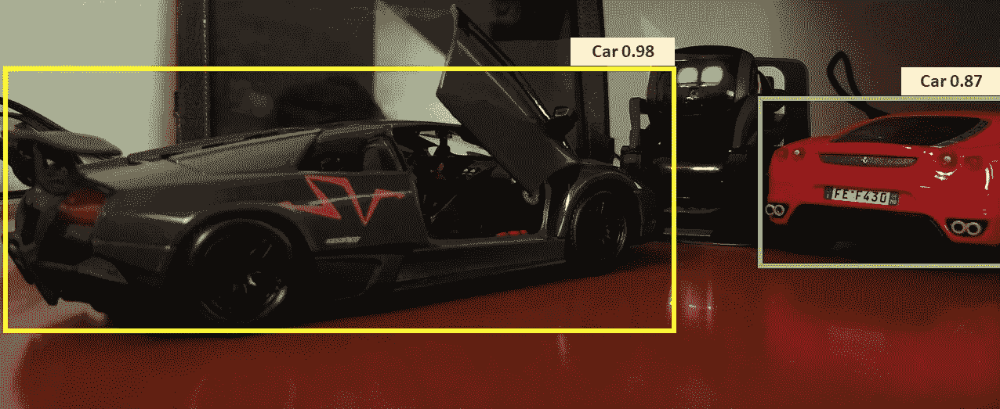

# 使用 YOLOv3 构建您的实时自定义对象检测器

> 原文：<https://medium.com/analytics-vidhya/build-your-realtime-custom-object-detector-using-yolov3-f61af825153f?source=collection_archive---------9----------------------->

在这篇文章中，我们将一步一步地学习使用 YOLOv3 网络构建一个实时物体检测器。如果你已经知道了关于架构的细节，并且你对代码更好奇，那么你可以直接开始实现，或者你可以通过这篇[论文](https://pjreddie.com/media/files/papers/YOLOv3.pdf)来阅读。