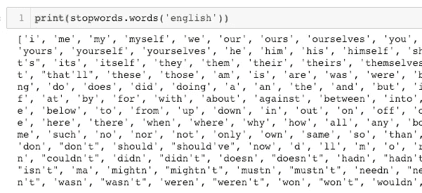
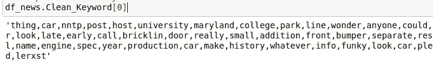
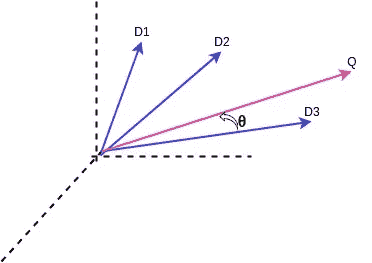
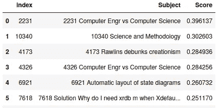
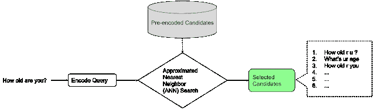
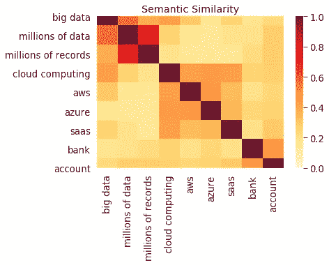
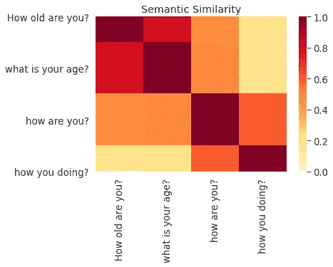
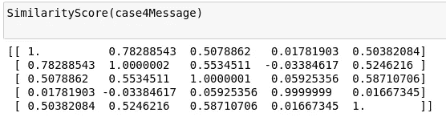
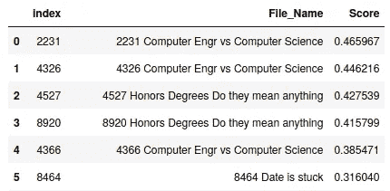

# 用 TF-IDF 和 Google-USE 构建你的语义文档搜索引擎

> 原文：<https://medium.com/analytics-vidhya/build-your-semantic-document-search-engine-with-tf-idf-and-google-use-c836bf5f27fb?source=collection_archive---------3----------------------->


来源: [inmyownterms](http://inmyownterms.com/six-document-search-engines-use/)

让我们来了解一下如何使用 python 语言来构建一个文档搜索引擎。

在本帖中，我们将利用 [20newsgroup 开源数据集](http://qwone.com/~jason/20Newsgroups/)构建一个**语义文档搜索引擎**。

# 先决条件

*   [Python 3.5](https://www.python.org/) +
*   [pip 19](https://pypi.org/project/pip/) +或 pip3
*   [NLTK](https://www.nltk.org/)
*   [Scikit-learn](https://scikit-learn.org/stable/)
*   [TensorFlow-GPU](https://www.tensorflow.org)

# 1.做好准备

对于这个职位，我们将需要上述先决条件**，**如果你还没有，请做好准备。

# 2.数据收集

这里，我们使用 20 个新闻组数据集来分析给定输入关键词/句子输入的文本搜索引擎。

20 个新闻组数据集是大约 11K 个新闻组文档的集合，平均分布在 20 个不同的新闻组中。

```
news = pd.read_json('[https://raw.githubusercontent.com/zayedrais/DocumentSearchEngine/master/data/newsgroups.json](https://raw.githubusercontent.com/zayedrais/DocumentSearchEngine/master/data/newsgroups.json)')
```

## 2.1 数据清理:

在进入清理阶段之前，我们从文本中检索文档的主题。

```
for i,txt in enumerate(news['content']):
    subject = re.findall('Subject:(.*\n)',txt)
    if (len(subject) !=0):
        news.loc[i,'Subject'] =str(i)+' '+subject[0]
    else:
        news.loc[i,'Subject'] ='NA'
df_news =news[['Subject','content']]
```

现在，我们从文本内容和数据集的主题中删除不需要的数据。

```
df_news.content =df_news.content.replace(to_replace='from:(.*\n)',value='',regex=True) ##remove from to email 
df_news.content =df_news.content.replace(to_replace='lines:(.*\n)',value='',regex=True)
df_news.content =df_news.content.replace(to_replace='[!"#$%&\'()*+,/:;<=>?@[\\]^_`{|}~]',value=' ',regex=True) #remove punctuation except
df_news.content =df_news.content.replace(to_replace='-',value=' ',regex=True)
df_news.content =df_news.content.replace(to_replace='\s+',value=' ',regex=True)    #remove new line
df_news.content =df_news.content.replace(to_replace='  ',value='',regex=True)                #remove double white space
df_news.content =df_news.content.apply(lambda x:x.strip())  # Ltrim and Rtrim of whitespace
```

## 2.2 数据预处理

预处理是我们处理任何文本模型的主要步骤之一。在此阶段，我们必须查看数据的分布情况，需要什么技术以及应该清理多深。

## 小写字母

将文本转换成小写形式。即'**狗'**变成'**狗**

```
df_news['content']=[entry.lower() for entry in df_news['content']]
```

## 单词标记化

单词标记化是将句子分成单词形式的过程。

“**约翰在轨道**上跑”→“**约翰**”、“**是**”、“**跑**”、“中的**”、“**中的**”、“**轨道**”**

```
df_news['Word tokenize']= [word_tokenize(entry) for entry in df_news.content]
```

## 停止言语

停用词是最常见的词，它不会给文档向量带来任何附加值。事实上，删除这些将增加计算和空间效率。NLTK 库有一个下载停用词的方法。



## 单词词汇化

引理化是一种将单词简化为单词的词根同义词的方法。与词干提取不同，词汇匹配确保缩减后的单词再次成为词典中的单词(同一种语言中的单词)。WordNetLemmatizer 可用于对任何单词进行词汇化。

即**岩石→岩石，更好→好，语料库→语料库**

这里创建了 wordLemmatizer 函数来删除一个**单字符**、**停用词**和**单词。**

```
# WordNetLemmatizer requires Pos tags to understand if the word is noun or verb or adjective etc. By default it is set to Noun
def wordLemmatizer(data):
    tag_map = defaultdict(lambda : wn.NOUN)
    tag_map['J'] = wn.ADJ
    tag_map['V'] = wn.VERB
    tag_map['R'] = wn.ADV
    file_clean_k =pd.DataFrame()
    for index,entry in enumerate(data):

        # Declaring Empty List to store the words that follow the rules for this step
        Final_words = []
        # Initializing WordNetLemmatizer()
        word_Lemmatized = WordNetLemmatizer()
        # pos_tag function below will provide the 'tag' i.e if the word is Noun(N) or Verb(V) or something else.
        for word, tag in pos_tag(entry):
            # Below condition is to check for Stop words and consider only alphabets
            if len(word)>1 and word not in stopwords.words('english') and word.isalpha():
                word_Final = word_Lemmatized.lemmatize(word,tag_map[tag[0]])
                Final_words.append(word_Final)
            # The final processed set of words for each iteration will be stored in 'text_final'
                file_clean_k.loc[index,'Keyword_final'] = str(Final_words)
                file_clean_k.loc[index,'Keyword_final'] = str(Final_words)
                file_clean_k=file_clean_k.replace(to_replace ="\[.", value = '', regex = True)
                file_clean_k=file_clean_k.replace(to_replace ="'", value = '', regex = True)
                file_clean_k=file_clean_k.replace(to_replace =" ", value = '', regex = True)
                file_clean_k=file_clean_k.replace(to_replace ='\]', value = '', regex = True)
    return file_clean_k
```

通过使用这个函数，花费了大约 **13 小时**的时间来检查和词条化 20 个新闻组数据集的 11K 个文档的单词。在下面找到这个单词的 JSON 文件。

```
[https://raw.githubusercontent.com/zayedrais/DocumentSearchEngine/master/data/WordLemmatize20NewsGroup.json](https://raw.githubusercontent.com/zayedrais/DocumentSearchEngine/master/data/WordLemmatize20NewsGroup.json)
```

## 2.3 数据已准备就绪

查看干净数据的示例-

```
df_news.Clean_Keyword[0]
```



# 3.文档搜索引擎

在这篇文章中，我们用三种方法来理解文本分析。

1.使用 **TF-IDF** 的文档搜索引擎

2.带有**谷歌通用语句编码器**的文档搜索引擎

## 3.1 使用[余弦相似度](https://en.wikipedia.org/wiki/Cosine_similarity)计算排名

这是根据输入关键字/句子计算文档文本之间的相似性的最常见的度量。数学上，它测量的是在多维空间中投影的两个向量的角度 b/w 的余弦值。



要查询的黑白文档的余弦相似度

在上图中，空间中有 3 个文档向量值和一个查询向量。当我们计算 3 个文档的余弦相似度 b/w 时。最相似值将是三个文档中的 D3 文档。

# 1.使用 TF-IDF 的文档搜索引擎:

[**TF-IDF**](https://en.wikipedia.org/wiki/Tf%E2%80%93idf) 代表**“词频—逆文档频”**。这是一种计算每个单词的权重的技术，表示该单词在文档和语料库中的重要性。该算法主要用于信息检索和文本挖掘领域。

## 术语频率(TF)

单词在文档中出现的次数除以文档中的总单词数。每个文档都有其词频。


## 反向数据频率(IDF)

日志中的文档数除以包含单词 ***w*** 的文档数。逆数据频率决定了语料库中所有文档中稀有词的权重。


最后， **TF-IDF** 就是 TF 乘以 IDF。

```
**TF-IDF = Term Frequency (TF) * Inverse Document Frequency (IDF)**
```


我们可以使用 [Sklearn](https://scikit-learn.org/stable/modules/generated/sklearn.feature_extraction.text.TfidfVectorizer.html) 提供的类，而不是自己手动实现 [TF-IDF](http://www.tfidf.com/) 。

## 使用 Sklearn 的 TfidfVectorizer 生成 TF-IDF

导入包:

```
import pandas as pd
import numpy as np
import os 
import re
import operator
import nltk 
from nltk.tokenize import word_tokenize
from nltk import pos_tag
from nltk.corpus import stopwords
from nltk.stem import WordNetLemmatizer
from collections import defaultdict
from nltk.corpus import wordnet as wn
from sklearn.feature_extraction.text import TfidfVectorizer
```

TF-IDF

```
from sklearn.feature_extraction.text import TfidfVectorizer
import operator## Create Vocabulary
vocabulary = set()for doc in df_news.Clean_Keyword:
    vocabulary.update(doc.split(','))vocabulary = list(vocabulary)# Intializating the tfIdf model
tfidf = TfidfVectorizer(vocabulary=vocabulary)# Fit the TfIdf model
tfidf.fit(df_news.Clean_Keyword)# Transform the TfIdf model
tfidf_tran=tfidf.transform(df_news.Clean_Keyword)
```

上面的代码已经创建了整个数据集的 TF-IDF 权重，现在必须创建一个函数来为输入查询生成一个向量。

## 为查询/搜索关键字创建向量

```
def gen_vector_T(tokens):Q = np.zeros((len(vocabulary)))    
    x= tfidf.transform(tokens)
    #print(tokens[0].split(','))
    for token in tokens[0].split(','):
        #print(token)
        try:
            ind = vocabulary.index(token)
            Q[ind]  = x[0, tfidf.vocabulary_[token]]
        except:
            pass
    return Q
```

## 用于计算的余弦相似函数

```
def cosine_sim(a, b):
    cos_sim = np.dot(a, b)/(np.linalg.norm(a)*np.linalg.norm(b))
    return cos_sim
```

## 余弦相似度黑白文档到查询函数

```
def cosine_similarity_T(k, query):
    preprocessed_query = preprocessed_query = re.sub("\W+", " ", query).strip()
    tokens = word_tokenize(str(preprocessed_query))
    q_df = pd.DataFrame(columns=['q_clean'])
    q_df.loc[0,'q_clean'] =tokens
    q_df['q_clean'] =wordLemmatizer(q_df.q_clean)
    d_cosines = []

    query_vector = gen_vector_T(q_df['q_clean'])
    for d in tfidf_tran.A:
        d_cosines.append(cosine_sim(query_vector, d))

    out = np.array(d_cosines).argsort()[-k:][::-1]
    #print("")
    d_cosines.sort()
    a = pd.DataFrame()
    for i,index in enumerate(out):
        a.loc[i,'index'] = str(index)
        a.loc[i,'Subject'] = df_news['Subject'][index]
    for j,simScore in enumerate(d_cosines[-k:][::-1]):
        a.loc[j,'Score'] = simScore
    return a
```

## 测试功能

```
cosine_similarity_T(10,’computer science’)
```



**关于“计算机科学”单词的前 5 个相似性文档的结果**

# 2.带有谷歌通用句子编码器的文档搜索引擎

## 谷歌使用简介

预先训练的[通用语句编码器](https://ai.googleblog.com/2018/05/advances-in-semantic-textual-similarity.html)在 [Tensorflow-hub](https://www.tensorflow.org/hub/) 中公开。它有两种变化，即一种用 [**变压器编码器**](https://tfhub.dev/google/universal-sentence-encoder-large/5) 训练，另一种用 [**深度平均网络(DAN)**](https://tfhub.dev/google/universal-sentence-encoder/4) 训练。它们是在大型语料库上预先训练的，可以用于各种任务(情感分析、分类等)。这两者在准确性和计算资源需求之间有一个折衷。虽然具有变换器编码器的方法具有更高的精度，但是它在计算上更昂贵。使用 DNA 编码的方法在计算上花费较少，并且准确性也稍低。

在这里，我们使用第二个丹通用句子编码器，可在这个网址:- [谷歌使用丹模型](https://tfhub.dev/google/universal-sentence-encoder/4)

两个模型都以一个单词、句子或段落作为输入，并输出一个 **512** 维度向量。



一个原型语义检索管道，用于文本相似性。

在使用张量流枢纽模型之前。

**先决条件:**

```
!pip install --upgrade tensorflow-gpu
 #Install TF-Hub.
!pip install tensorflow-hub
!pip install seaborn
```

现在导入包:

```
import pandas as pd
import numpy as np
import re, string
import os 
import tensorflow as tf
import tensorflow_hub as hub
import matplotlib.pyplot as plt
import seaborn as sns
from sklearn.metrics.pairwise import linear_kernel
```

从调用直接 URL 的 [TensorFlow-hub](https://tfhub.dev/google/universal-sentence-encoder/4) 下载模型:

```
! curl -L -o 4.tar.gz "[https://tfhub.dev/google/universal-sentence-encoder/4?tf-hub-format=compressed](https://tfhub.dev/google/universal-sentence-encoder/4?tf-hub-format=compressed)"or
module_url = "[https://tfhub.dev/google/universal-sentence-encoder/4](https://tfhub.dev/google/universal-sentence-encoder/4)"
```

加载谷歌丹通用句子编码器

```
#Model load through local path:module_path ="/home/zettadevs/GoogleUSEModel/USE_4"
%time model = hub.load(module_path)#Create function for using model training
def embed(input):
    return model(input)
```

## 用例 1:-单词语义

```
WordMessage =[‘big data’, ‘millions of data’, ‘millions of records’,’cloud computing’,’aws’,’azure’,’saas’,’bank’,’account’]
```



## 用例 2:句子语义

```
SentMessage =['How old are you?','what is your age?','how are you?','how you doing?']
```



## 用例 3:单词、句子和段落语义

```
word ='Cloud computing'Sentence = 'what is cloud computing'Para =("Cloud computing is the latest generation technology with a high IT infrastructure that provides us a means by which we can use and utilize the applications as utilities via the internet."
        "Cloud computing makes IT infrastructure along with their services available 'on-need' basis." 
        "The cloud technology includes - a development platform, hard disk, computing power, software application, and database.")Para5 =(
    "Universal Sentence Encoder embeddings also support short paragraphs. "
    "There is no hard limit on how long the paragraph is. Roughly, the longer "
    "the more 'diluted' the embedding will be.")Para6 =("Azure is a cloud computing platform which was launched by Microsoft in February 2010."
       "It is an open and flexible cloud platform which helps in development, data storage, service hosting, and service management."
       "The Azure tool hosts web applications over the internet with the help of Microsoft data centers.")
case4Message=[word,Sentence,Para,Para5,Para6]
```



# 训练模型

这里，我们以批处理方式训练数据集，因为生成数据集的图形需要很长的执行时间。因此，更好地训练批量数据。

```
Model_USE= embed(df_news.content[0:2500])
```

**保存模型**，以便重用模型。

```
exported = tf.train.Checkpoint(v=tf.Variable(Model_USE))
exported.f = tf.function(
    lambda  x: exported.v * x,
    input_signature=[tf.TensorSpec(shape=None, dtype=tf.float32)])tf.saved_model.save(exported,'/home/zettadevs/GoogleUSEModel/TrainModel')
```

**从路径:**加载模型

```
imported = tf.saved_model.load(‘/home/zettadevs/GoogleUSEModel/TrainModel/’)
loadedmodel =imported.v.numpy()
```

**文件搜索功能:**

```
def SearchDocument(query):
    q =[query]
    # embed the query for calcluating the similarity
    Q_Train =embed(q)

    #imported_m = tf.saved_model.load('/home/zettadevs/GoogleUSEModel/TrainModel')
    #loadedmodel =imported_m.v.numpy()
    # Calculate the Similarity
    linear_similarities = linear_kernel(Q_Train, con_a).flatten() 
    #Sort top 10 index with similarity score
    Top_index_doc = linear_similarities.argsort()[:-11:-1]
    # sort by similarity score
    linear_similarities.sort()
    a = pd.DataFrame()
    for i,index in enumerate(Top_index_doc):
        a.loc[i,'index'] = str(index)
        a.loc[i,'File_Name'] = df_news['Subject'][index] ## Read File name with index from File_data DF
    for j,simScore in enumerate(linear_similarities[:-11:-1]):
        a.loc[j,'Score'] = simScore
    return a
```

**测试搜索:**

```
SearchDocument('computer science')
```



找到该项目的[](https://github.com/zayedrais/DocumentSearchEngine)

# ****结论:****

****在本教程的最后，我们得出结论，“谷歌通用句子编码器”模型提供了语义搜索结果，而 TF-IDF 模型不知道单词的意思。只是根据文档中可用的单词给出结果。****

******一些参考文献:******

*   ****[TF-IDF](https://towardsdatascience.com/tf-idf-for-document-ranking-from-scratch-in-python-on-real-world-dataset-796d339a4089)****
*   ****[谷歌使用](https://ai.googleblog.com/2018/05/advances-in-semantic-textual-similarity.html)****

# ****别忘了给我们你的👏！****