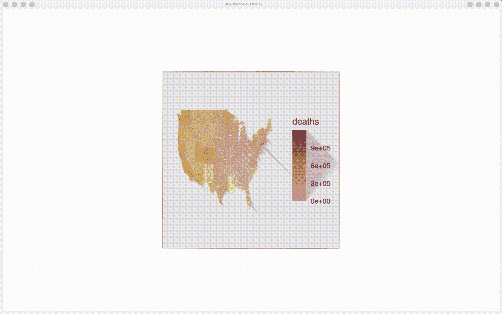

# 在美国按收入构建 R-Covid 密度的 3D 地图

> 原文：<https://medium.com/analytics-vidhya/building-a-3d-map-in-r-covid-density-in-the-us-by-income-fab409544fcb?source=collection_archive---------8----------------------->



我们正处于数据可视化和数据的黄金时代！有如此多的信息可用，但它需要时间和精力来理解它。在我看来，哪里适用映射可以是最好的方式*“查看”*数据。这里有一个在 R 中制作 3D 地图的方法，使用 rayshader 给一个简单的散点图以高度，该散点图覆盖在背景地图的 png 上。这是根据 Carrie Lo 的精彩教程改编的，可以在[这里](https://towardsdatascience.com/introducing-3d-ggplots-with-rayshader-r-c61e27c6f0e9)找到。请在[推特](https://twitter.com/KyleBenzle)上提出任何改进或想法，谢谢。

# 很多图书馆

```
# Lots of librarieslibrary(sp)
library(choroplethrMaps)
library(tidyverse)
library(tidyverse)
library(rgl)
library(rayshader)
library(png)
library(ggplot2)
library(grid)
library(mapproj)
library(av)
```

# 加载并预处理第一个数据集

```
# Preprocess 1st data setincome = read.csv('income.csv', stringsAsFactors = F)
income2017 <- income[-c(3:36)]
income2017$X2017 = as.integer(gsub(',', '', income2017$X2017))
colNames = c('region', 'value')
colnames(income2017) <- colNames
map_outline = data(state.map)
income2017$region = tolower(income2017$region)
income2017 <- income2017 %>%  mutate(., region = replace(region, region=='d.c.', 'district of columbia') )
joinedData <- left_join(state.map, income2017, by = 'region')
keep = c(1,2,3,6,10,13)
joinedData <- joinedData[, keep]
map_data = joinedData
map_data$value = as.numeric(map_data$value)
map_data <- map_data %>% arrange(., order)
map_data <- map_data %>% filter(., region != 'alaska')
map_data <- map_data %>% filter(., region != 'hawaii')
```

# 地图

```
# Mapmap_us = ggplot(map_data, aes(long, lat, group=group, fill = value)) +
  geom_polygon() + # Shape
  scale_fill_gradient(limits=range(map_data$value), 
                      low="#FFF3B0", high="#E09F3E") + 
  layer(geom="path", stat="identity", position="identity", 
        mapping=aes(x=long, y=lat, group=group, 
                    color=I('#FFFFFF'))) + 
  theme(legend.position = "none", 
        axis.line=element_blank(), 
        axis.text.x=element_blank(), axis.title.x=element_blank(),
        axis.text.y=element_blank(), axis.title.y=element_blank(),
        axis.ticks=element_blank(), 
        panel.background = element_blank()) +
        coord_map(projection = "mercator")map_us# Save as PNG
xlim = ggplot_build(map_us)$layout$panel_scales_x[[1]]$range$range
ylim = ggplot_build(map_us)$layout$panel_scales_y[[1]]$range$range
ggsave('map_us.png')
```

# 加载并映射第二个数据集

```
# Load and map 2nd data setcovid_df = read.csv('covidbycounty.csv')
geocode_df = read.csv('geocodedcounties.csv')
uniqueGeocode <- geocode_df[,-1]
uniqueCountyGeocode <- unique(uniqueGeocode)
uniqueCountyGeocode$state_county <- paste0(uniqueCountyGeocode$state, uniqueCountyGeocode$county)
uniqueCountyGeo$county <- paste0(uniqueCountyGeo$county, " County")
uniqueCountyGeo <- uniqueCountyGeo[!duplicated(uniqueCountyGeocode$state_county), ]covid_df = left_join(covid_df, uniqueCountyGeo[c(2,3,4,5)], by =c('county', 'state'))
covid_df = na.omit(covid_df)
covid_df <- covid_df %>% filter(., state != 'HI')
covid_df <- covid_df %>% filter(., state != 'AK')map_us_png = readPNG('map_us.png')us_covid_deaths = ggplot(covid_df) + 
    annotation_custom(rasterGrob(map_us_png, width=unit(1,"npc"), height=unit(1,"npc")),
                    -Inf, Inf, -Inf, Inf) + # Background

   xlim(xlim[1]-2,xlim[2]+1) + # x-axis Mapping
   ylim(ylim[1]-6,ylim[2]+6.5) + # y-axis Mapping

  geom_point(aes(x=longitude, y=latitude, color=deaths), size=0.1) + 
  scale_colour_gradient(name = 'deaths', 
                        limits=range(covid_df$deaths), 
                        low="#FCB9B2", high="#B23A48") + 
  theme(axis.line=element_blank(), 
        axis.text.x=element_blank(), axis.title.x=element_blank(),
        axis.text.y=element_blank(), axis.title.y=element_blank(),
        axis.ticks=element_blank(), 
        panel.background = element_blank())us_covid_deaths
ggsave('covid_deaths.png')
```

# 使这些点成为 3D 并录制视频

```
# Make the points 3D and record videoplot_gg(us_covid_deaths, multicore = TRUE)par3d(windowRect = c(0, 0, diff(xlim) * 2500, diff(ylim) * 2500))render_camera(fov = 70, zoom = 0.2, theta = 30, phi = 20)
render_depth(focus = 0.8, focallength = 600) phivechalf = 30 + 60 * 1/(1 + exp(seq(-7, 20, length.out = 180)/2))
phivecfull = c(phivechalf, rev(phivechalf))
thetavec = 0 + 45 * sin(seq(0,359,length.out = 360) * pi/180)
zoomvec = 0.45 + 0.2 * 1/(1 + exp(seq(-5, 20, length.out = 180)))
zoomvecfull = c(zoomvec, rev(zoomvec))
render_movie(filename = 'output1', type = "custom", frames = 360,  phi = phivecfull, zoom = zoomvecfull, theta = thetavec) transition_values <- function(from, to, steps = 10, one_way = FALSE, type = "cos") {
  if (!(type %in% c("cos", "lin"))){stop("type must be one of: 'cos', 'lin'")}
  range <- c(from, to)
  middle <- mean(range)
  half_width <- diff(range)/2
  if (type == "cos") {scaling <- cos(seq(0, 2*pi / ifelse(one_way, 2, 1), length.out = steps))}
  else if (type == "lin"){
    if (one_way) {xout <- seq(1, -1, length.out = steps)} 
    else {xout <- c(seq(1, -1, length.out = floor(steps/2)), seq(-1, 1, length.out = ceiling(steps/2)))}
    scaling <- approx(x = c(-1, 1), y = c(-1, 1), xout = xout)$y }
  middle - half_width * scaling
}
theta <- transition_values(from = 0, to = 360, steps = 360, one_way = TRUE, type = "lin")
phi <- transition_values(from = 10, to = 70, steps = 360, one_way = FALSE, type = "cos")
zoom <- transition_values(from = 0.4, to = 0.8, steps = 360, one_way = FALSE, type = "cos")
render_movie(filename = 'output2', type = "custom", frames = 360,  phi = phi, zoom = zoom, theta = theta) rgl.close()
```