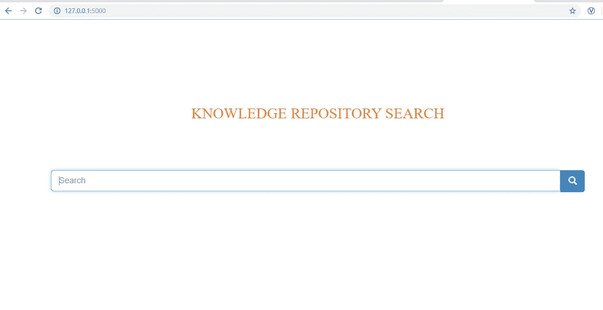
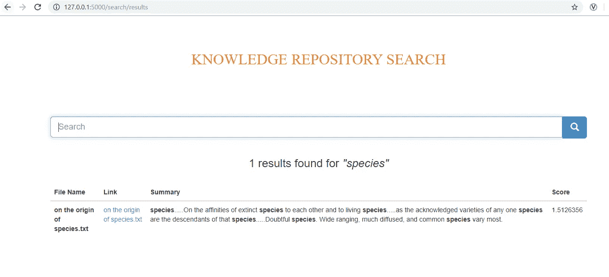
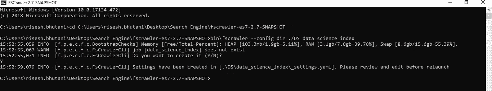
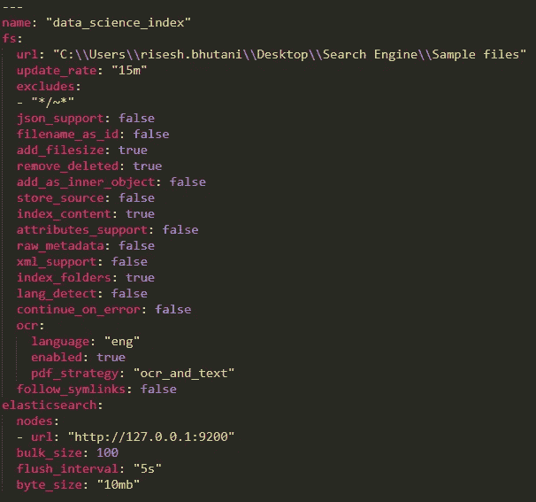
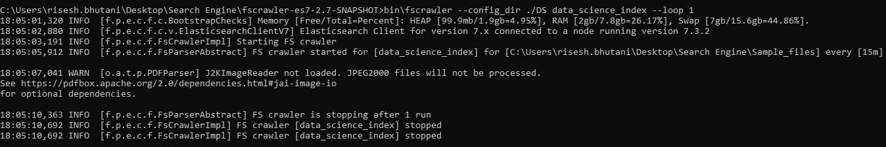

# 使用 Elasticsearch & fscrawler 构建一个基本的搜索引擎

> 原文：<https://medium.com/analytics-vidhya/building-a-basic-search-engine-using-elasticsearch-fscrawler-97104c1ea220?source=collection_archive---------0----------------------->

所以，最近我的公司需要建立一个搜索引擎，以便更容易地从过去的项目中获取信息。从本质上说，有一个巨大的信息宝库，以 Powerpoint 幻灯片和 PDF 文档的形式存储在多个平台上，如我们的共享驱动器、Confluence 存储库等。搜索引擎将在以下方面有所帮助:

*   支持通过单一门户访问各种信息源
*   允许高级搜索功能帮助人们轻松解析信息

下面是我们将在本文中构建的搜索引擎的截屏。这里，很明显，我没有花太多时间来格式化最终的 HTML 页面，因为我只是想展示 Elasticsearch 和 fscrawler 以及 Python 和 flask。

**登陆页面**



**结果页面**



在本文中，我将展示如何在您自己的本地机器上使用以下代码运行快速而肮脏的搜索引擎:

*   fscrawler —代表文件系统爬网程序。顾名思义，它有助于索引 pdf、MS Office 等二进制文档。
*   elastic search——elastic search 是一个基于 Lucene 库的开源搜索引擎。它提供了全文搜索功能，并返回与模式无关的 JSON 文档
*   python——高级解释编程语言
*   Flask——Flask 是一个用 Python 编写的微型 web 开发框架

让我们开始吧…

**设置弹性搜索客户端**

*   Elasticsearch 可以从[这个位置](https://www.elastic.co/downloads/elasticsearch)下载。然后将其提取到“搜索引擎”文件夹中
*   导航到终端中的安装位置。以下是我使用的位置:

```
cd C:\Users\risesh.bhutani\Desktop\Search Engine\elasticsearch-7.3.2
```

*   接下来，在终端中输入以下命令来运行 Elasticsearch:

```
bin\elasticsearch.bat
```

*   要确认 elasticsearch 现在正在您的笔记本电脑上运行，您可以导航到 [http://localhost:9200](http://localhost:9200) ，这将显示有关 elasticsearch 模块的信息

**设置 fscrawler**

*   我们需要做的第一件事是找到并安装 fscrawler。在这里，我们要小心下载与我们的版本 Elasticsearch 兼容的正确版本 fscrawler(你可以在 [this github 页面](https://github.com/dadoonet/fscrawler)确认版本兼容性)。这里，我们将使用与 Elasticsearch V7 兼容的 fscrawler 2.7。fscrawler 安装文件可以在[这里](https://fscrawler.readthedocs.io/en/latest/installation.html)找到，我们已经下载了一个稳定的压缩版本(fs crawler-es7–2.7–2019 09 27 . 070712–49)
*   下载完成后，解压缩文件并安装在首选位置。让我们在桌面上设置一个名为“搜索引擎”的文件夹，我将使用这个文件夹来提取 fscrawler。
*   我还在“搜索引擎”中创建了另一个名为“样本文件”的文件夹。该文件夹包含我们希望能够搜索到的所有文件。就我而言，我刚刚从[www.gutenberg.org](http://www.gutenberg.org)下载了一些免费书籍的文本版本
*   接下来打开终端并导航到安装位置:

```
cd C:\Users\risesh.bhutani\Desktop\Search Engine\fscrawler-es7–2.7-SNAPSHOT
```

*   现在，键入以下命令来运行 fscrawler，创建一个名为`‘data_science_index’`的索引。这将运行一次并创建索引。我不需要它重复运行，因为这纯粹是为了演示目的。

```
bin\fscrawler — config_dir ./DS data_science_index — loop 1
```



现在，导航到 fscrawler 安装位置> DS > data_science_index 并打开' _settings '文件以执行以下步骤:

*   将 url 更改为您保存 ppt 和 pdf 文件的位置(“Sample_files”文件夹)—这告诉 fscrawler 它需要对“Sample_files”文件夹中的文件进行爬网
*   保存并关闭设置文件
*   从步骤 5 开始在终端中重新运行该命令。此步骤为放置在“Sample_files”文件夹中的所有文件创建索引



**设置 Python 依赖关系**

现在为 python 应用程序设置库:

打开终端并运行以下命令

```
python -m pip install flaskpython -m pip install Elasticsearch
```

**设置 python 代码**

*   让我们从构建 python 代码开始，该代码将定义我们将在搜索引擎中执行的操作和响应。我正在调用我的 python 脚本`‘Search_Engine_python.py’`
*   导入依赖项，如 flask 和 elasticsearch:

```
from flask import Flask, render_template, request
from elasticsearch import Elasticsearch
import os
```

*   设置 flask app 和 elasticsearch api 连接:

```
os.chdir(“C:\\Users\\risesh.bhutani\\Desktop\\Search Engine\\”)
app = Flask(__name__)
es = Elasticsearch(‘127.0.0.1’, port=9200)
```

*   点击 URL 时呈现主页:

```
[@app](http://twitter.com/app).route(‘/’)
def home():
 return render_template(‘search.html’)
```

*   接下来，定义请求搜索时的响应:

```
[@app](http://twitter.com/app).route(‘/search/results’, methods=[‘GET’,’POST’])
def request_search():
 search_term = request.form[“input”]
 res = es.search(
 index=’data_science_index’,
 body={
 “query” : {“match”: {“content”: search_term}},
 “highlight” : {“pre_tags” : [“<b>”] , “post_tags” : [“</b>”], “fields” : {“content”:{}}}})
 res[‘ST’]=search_termfor hit in res[‘hits’][‘hits’]:
 hit[‘good_summary’]=’….’.join(hit[‘highlight’][‘content’][1:])
 return render_template(‘results.html’, res=res)
```

这个步骤基本上定义了当网页请求搜索时会发生什么。

1.  首先，使用请求库从网页中检索搜索词，并将其存储到名为“search_term”的变量中
2.  来自 Elasticsearch 的数据以 JSON 文件的形式接收。因此，使用 Elasticsearch 中定义的搜索方法，我们查询之前创建的‘data _ science _ index’来进行匹配。检索到的数据存储在名为“res”的字典中
3.  我们还从“highlight”键中提取了一些字段，因为这包含一个摘要，并且还向搜索词添加了一些格式化标签。这可以在我们的前端使用，以更好地格式化结果。
4.  此外，我们还在“res”字典中为搜索词创建了另一个条目
5.  最后，我们对每次点击的摘要进行格式化，这可以在每次点击的`[‘highlight’][‘content’]`部分找到，以便于阅读
6.  这个字典“res”被返回，名为`‘results.html’`的模板被呈现

默认情况下，在 main()中运行应用程序:

```
if __name__ == ‘__main__’:
 app.run(‘127.0.0.1’, debug=True)
```

**设置网页**

*   让我们首先构建一些基本的网页来访问我们的搜索引擎并显示结果。
*   名为“search.html”的登录页面是在“搜索引擎”文件夹中名为“模板”的文件夹中创建的
*   编写一些基本的 html 代码来格式化页面:

```
<!DOCTYPE html>
<html lang=”en”>
<head>
 <meta charset=”utf-8">
 <link rel=”stylesheet” href=”[https://fonts.googleapis.com/css?family=Pacifico](https://fonts.googleapis.com/css?family=Pacifico)">
 <link rel=”icon” href=”[http://obj-cache.cloud.ruanbekker.com/favicon.ico](http://obj-cache.cloud.ruanbekker.com/favicon.ico)">
 <link href=”//netdna.bootstrapcdn.com/bootstrap/3.0.0/css/bootstrap.min.css” rel=”stylesheet”>
 <title>Knowledge Repository Search</title>
</head>
<body>
 <br/> <br/>
 <div class=”container”>
 <div style=”background:transparent !important” class=”jumbotron”>
 <div style=”font-family: ‘Times New Roman’”>
 <p>
 <center>
 <font size=”6" style=”color:rgb(239,127,26);”> <br/>KNOWLEDGE REPOSITORY SEARCH</font>
 </center>
 </p>
 </div>
 </div>
```

*   现在，创建一个带有输入文本框和搜索按钮的基本表单。这就完成了我们的登录页面:

```
<form action=”/search/results” method=”post”>
 <div class=”input-group”>
 <input type=”text” class=”form-control input-lg” name=”input” placeholder=”Search” autofocus>
 <div class=”input-group-btn”>
 <button class=”btn btn-primary btn-lg” type=”submit”>
 <i class=”glyphicon glyphicon-search”></i>
 </button>
 </div>
 </div>
 </form><br><br>

 </div>
 </div>
 </body>
</html>
```

*   现在，对于名为“results.html”的搜索结果页面。

```
<!DOCTYPE html>
<html lang=”en”>
 <head><meta charset=”utf-8">
 <link rel=”stylesheet” href=”[https://fonts.googleapis.com/css?family=Pacifico](https://fonts.googleapis.com/css?family=Pacifico)">
 <link rel=”icon” href=”[http://obj-cache.cloud.ruanbekker.com/favicon.ico](http://obj-cache.cloud.ruanbekker.com/favicon.ico)">
 <link href=”//netdna.bootstrapcdn.com/bootstrap/3.0.0/css/bootstrap.min.css” rel=”stylesheet”><title>Knowledge Repository Search</title>
 </head>
```

*   在结果页面上重新呈现搜索栏和标题:

```
<div class=”container”>
 <div style=”background:transparent !important” class=”jumbotron”>
 <div style=”font-family: ‘Times New Roman’”>
 <p>
 <center>
 <font size=”6" style=”color:rgb(239,127,26);”> 
 KNOWLEDGE REPOSITORY SEARCH</font>
 </center>
 </p>
 </div>
 </div><form action=”/search/results” method=”post”>
 <div class=”input-group”>
 <input type=”text” class=”form-control input-lg” name=”input” placeholder=”Search” autofocus>
 <div class=”input-group-btn”>
 <button class=”btn btn-primary btn-lg” type=”submit”>
 <i class=”glyphicon glyphicon-search”></i>
 </button>
 </div>
 </div>
 </form>
```

*   使用 Jinja(python 的 web 模板引擎)访问 res 字典的元素，并构建一个表结构:

```
<center>
 <br/> <h3>{{ res[‘hits’][‘total’][‘value’] }} results found for <em>”{{res[‘ST’]}}” </em> </h3>
 </center>
 <br/><table class=”table”>
 <thead>
 <tr>
 <th>File Name</th>
 <th>Link</th>
 <th>Summary</th> 
 <th>Score</th>
 </tr>
 </thead>
```

*   现在，通过使用 Jinja 遍历`‘Res’`中的数据来填充表格:

```
<tbody>
 <tr>
 <th scope=”row”>{{ hit[‘_source’][‘file’][‘filename’] }}</th>
 <td><a href=”{{ hit[‘_source’][‘file’][‘url’] }}”>{{ hit[‘_source’][‘file’][‘filename’] }}</a></td>
 <td id=”{{loop.index}}” name=”goodSummary”> {{ hit[‘good_summary’]}} </td> 
 <td>{{ hit[‘_score’] }}</td>
 </tr>
 </tbody>
</table></div>
 </div>
 </body>
</html>
```

这里，注意第三个元素被命名为 goodSummary。这是因为我们希望使用 Javascript 重新呈现这一部分，以确保文本中出现的高亮标记不会被视为常规文本。

*   将以下代码段添加到 results.html 代码的头部分之后和正文部分之前。这基本上将文本转换成 innerHTML 格式。代码的最后一行运行 Javascript 函数`populateText()`

```
<script language=”Javascript”>
 function populateText() {
 var data = document.getElementsByName(“goodSummary”);
 for (const item of data) {
 item.innerHTML = item.textContent
 }
 }
</script><body onload=”populateText()”>
```

**查看结果**

现在我们完成了构建。打开浏览器并导航至 [http://127.0.0.1:5000](http://127.0.0.1:5000) ，这将打开“search.html”页面。进行的任何搜索都会在“results.html”页面中显示结果。希望你能够跟随并为自己建立一个令人敬畏的搜索引擎。编码快乐！