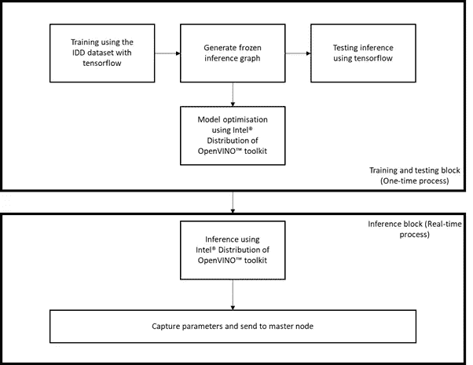
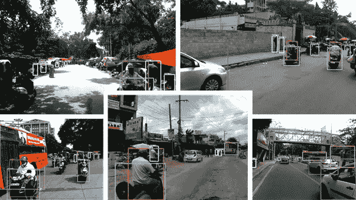
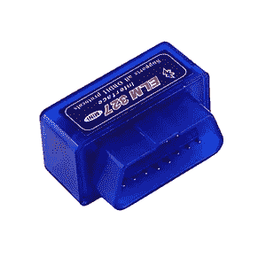
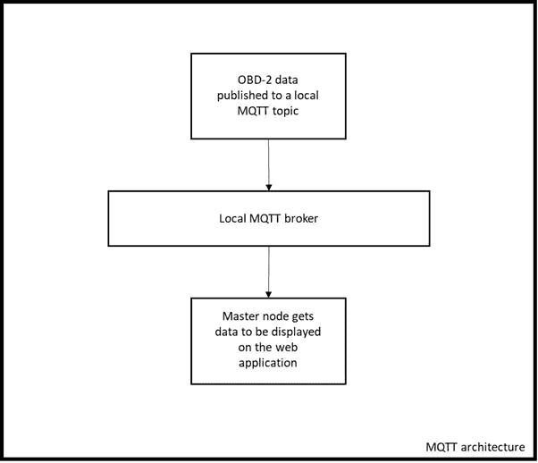
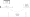
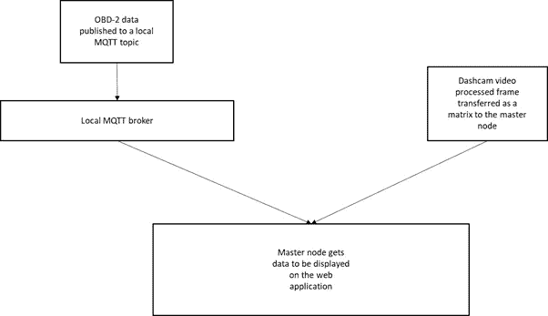
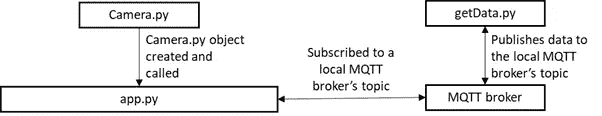

# 使用机器学习构建基本的车辆监控系统

> 原文：<https://medium.com/analytics-vidhya/building-a-basic-vehicle-monitoring-system-using-machine-learning-and-computer-vision-d55ef2dd9893?source=collection_archive---------8----------------------->

[亚历山大·波波夫](https://unsplash.com/@5tep5?utm_source=medium&utm_medium=referral)在 [Unsplash](https://unsplash.com?utm_source=medium&utm_medium=referral) 上拍照

# 介绍

监控内部遥测数据和外部交通数据并叠加到单一系统中的建议系统。这更倾向于智能汽车的概念，该系统可以根据用途或需求有多个附加功能。该系统有两个主要组件:

1.利用 CAN 总线进行遥测数据采集

2.从 dash-cam feed 监控和捕捉外部信息

然后将上述组件叠加到单个数据帧中，然后本地存储。一旦与云建立了连接，数据就会被转储。第一点是使用 CAN 总线和后台进程定期发布数据来解决的。该系统的第二部分包括在其核心的物体识别系统，其主要目的是检测以下内容。

1.道路上的交通密度

2.车辆行驶的道路类型

以上两个参数都是使用在 IDD 数据集上实现的对象识别来获得的。

最终的主节点将这两段数据组合起来，并将其保存在本地。只有当互联网连接建立后，数据才会发布到云中。在本文中，我们将找出如何处理上述用例的每一部分。

# 视觉处理系统(VPS):

VPS 负责核心的视频处理工作。VPS 的核心是英特尔发布的 OpenVINO toolkit，它可以进行推理。但是在推断之前，我们必须在特定的数据集上训练一个模型。

VPS 的总体流程如下所示。

VPS 的流程

让我们来看看 VPS 的培训前景。

**培训和测试(一次性流程):**

印度驾驶数据集用于训练主要有两个原因。

1.它完全基于印度的路况

2.它具有可驱动和不可驱动对象的一些特征

数据集可在中的 [https://idd.insaan.iiit.ac .上获得](https://idd.insaan.iiit.ac.in/)

我们的应用程序依赖于移动车辆上的实时推理。这意味着我们需要速度而不是准确性。这就是为什么 mobilenet ssd 被用作我们的对象识别架构。作为训练和评估的管道，Tensorflow 对象识别 API 也用于此目的。让我们来看一下所有相关的步骤。

**预处理:**基于可用的 api，第一步是为整个数据集生成 tfrecord 文件。为了使示例代码适合我们的目录结构，我们做了一些修改来生成 csv 和 tfrecord 文件。

**训练:**训练执行了大约 50000 个周期，最终的对数损失值在 1.0-3.0 之间振荡。然后从最终的检查点文件中获得冻结的推理图。

**注意:本文不会深入讨论相关培训的技术细节。示例培训代码被更新到 Github repo 中。**

训练的结果是冻结的推理图文件、检查点文件、元数据文件和 pipeline.config 文件。

**使用 TensorFlow 进行测试和推理:**

使用 TensorFlow 对最终的冻结推理图进行推理，一些示例图像如下所示。

基于样本图像的张量流推理

一旦培训完成，使用 Tensorflow 完成测试，我们就可以使用英特尔发布的 open vino toolkit 进行优化和推理。

从前面的过程中，我们获得了存储模型文件的标准文件夹。现在，我们必须使用英特尔发布的 open vino toolkit 优化模型，然后进行最终推断。优化将是一次性过程，而最终推理将是实时过程。

**使用英特尔发布的 open vino toolkit 进行优化**

模型优化是整个项目中重要的一步。英特尔发布的 open vino toolkit 具有一些内置功能来优化 tensorflow 模型。让我们来看看涉及的步骤。

**先决条件:**

1.假设您的电脑上安装了英特尔发布的 open vino toolkit。如果没有，请参考此处的[了解整个安装过程。](https://software.intel.com/en-us/openvino-toolkit)

2.冻结的推理图以及 pipeline.config 文件。这是在训练和冻结你的模型后获得的。

安装 open vino toolkit 的英特尔发行版后，浏览到以下位置。

**注意:我在整个过程中使用的是 Ubuntu 系统**

/opt/Intel/open vino/deployement _ tools/model _ optimizer

在这个位置，我们有一个名为 **mo_tf.py 的 python 脚本。**这个脚本将用于优化模型。为此，我们需要传递某些参数。

**1。****–输入 _ 模型:**输入模型的路径。这里我们需要冻结的推理图。

**2。****–tensor flow _ use _ custom _ operations _ config:**定制模型所需的配置文件。它附带了 OpenVINO 工具包，位于以下目录下。
/opt/Intel/open vino/deployement _ tools/model _ optimizer/extensions/front/TF

**3。****–tensor flow _ object _ detection _ API _ pipeline _ config:**自定义模型冻结后生成的 pip line . config 文件。

**4。** **-o:** 输出文件所在位置的路径。xml 和。bin 文件将被保存。

优化过程完成后，我们得到了两个文件。。xml 和。我们定制模型的框。这将用于推理过程。对于推理，我们将使用推理机。

我们将坚持使用 python 来实现推理引擎。在开始编写代码之前，让我们看一下我们将要使用的不同组件

推理引擎文档可在此处获得。推理引擎文档可在此处获得。

[https://docs . openvinotoolkit . org/latest/_ docs _ IE _ DG _ Deep _ Learning _ Inference _ Engine _ dev guide . html](https://docs.openvinotoolkit.org/latest/_docs_IE_DG_Deep_Learning_Inference_Engine_DevGuide.html?source=post_page-----a873a8bd38b9----------------------)

## 使用英特尔发布的 open vino toolkit 和 Python 实现推理引擎

这一部分将集中在两个主要方面:

1.IE 引擎的实现

2.从 VPS 向主节点发送数据

推理引擎是一个统一的 API，允许在许多硬件类型上进行高性能推理，包括英特尔 CPU、英特尔处理器显卡、英特尔 FPGA、英特尔 m ovidius Neural Compute Stick 和英特尔 Neural Compute Stick 2。

IE 引擎的常见工作流程如下所述。

**1。** **读取中间表示:**这将加载 IR 文件(。xml 和。bin ),它是在对象的优化阶段早期生成的。

**2。** **准备输入和输出格式:**一旦加载，我们必须指定网络的输入和输出配置。

**3。** **创建 IE 核心对象:**这将创建一个 IE 核心对象，可用于不同的设备。插件将使用这个进行内部管理。

**4。** **编译并加载网络到设备:**这一步就是简单的将网络加载到指定的设备。

**5。** **设置输入数据:**网络加载后，我们需要通知输入缓冲器加载输入和输出。

**6。** **执行网络:**网络现在需要执行。做这件事有两种方法。

**a.** **同步:**在单个时间点执行一个推理。

**b.** **异步:**异步执行，检查状态，等待或指定完成回调。

**7。** **获得输出:**获得网络的输出

**注意:**更多细节和 API 文档可从这里获得。

[https://docs . openvinotoolkit . org/latest/_ docs _ IE _ DG _ inference _ engine _ intro . html](https://docs.openvinotoolkit.org/latest/_docs_IE_DG_inference_engine_intro.html)

我们来看看这到底是怎么实现的。

在下面的函数 initialise _ inference()中，我们简单地用上面讨论的所有参数设置了推理引擎。

基于网络拓扑，我们必须定义输入和输出 blobs。最后，我们调用处理器类，它确切地执行网络，如下所示。

在上面的类中，最初我们执行网络，然后根据输出放置边界框。

处理/执行发生在 processframe 函数上，而带有边界框和文本的图像叠加发生在 placeBoxes 函数上。

总结整个类，github 上的代码是 detect.py 文件。

接下来，我们需要一个驱动 python 脚本来驱动它，并处理摄像机输入和消息传输机制。让我们看一下回购中的脚本 camera.py 来了解一下同样的情况。

名为 VideoCamera 的类是用非参数化的构造函数定义的。我们还使用配置文件 config.json 来初始化参数。

包括提供摄像机输入或视频文件的选项，可以使用 config.json 文件进行修改。在构造函数中，我们还初始化了检测器类来初始化推理机。

在函数 get_frame()中，我们获取叠加的图像，并将生成的最终帧返回给 app.py

总结一下脚本 **camera.py** ，我们调用 **detect.py** 用 **config.json** 中定义的所有参数初始化并执行**推理机**，最终得到合成的叠加帧返回给 **app.py.**

到目前为止，我们一直专注于视觉数据的处理，其中没有物联网组件。

有点混乱吧！放松和冷静，因为这是进入物联网的地方。

下面的视频展示了推理后的一些结果:

IE 使用在 IDD 数据集上训练的 Tensorflow 对象检测 API 实现英特尔发布的 OpenVINO 工具包

# 获取车辆遥测数据:

车辆遥测数据可以通过一个称为 OBD-2 端口的特殊端口进行访问。OBD-2 端口使用的协议是控制局域网或 CAN。我们将使用一个微型硬件设备来访问数据。理想情况下，有两种类型的硬件。
1。BLE 接口
2。USB 接口
在这种情况下，我们将使用 BLE 接口。

图 3: OBD-2 设备 ELM 327 IC

该设备插入 OBD-2 端口。端口的位置因车辆而异。它通常位于方向盘下方 2 英尺以内。使用 CAN 协议进行数据交换。

我们使用 python 脚本来获取数据。我们使用 python-obd 模块进行通信。

[https://python-obd.readthedocs.io/en/latest/](https://python-obd.readthedocs.io/en/latest/)

在这种情况下，我们要考虑 3 个参数。
1。发动机转速
2。车速
3。发动机冷却液温度

然后，这些参数被发布到 MQTT 主题。让我们再次看看我们已经实现的 MQTT 架构。

我们使用本地托管的 MQTT 代理。在这种情况下，使用 VerneMQ，

[https://docs.vernemq.com/](https://docs.vernemq.com/?source=post_page-----a873a8bd38b9----------------------)

图 4:实现的 MQTT 架构——数据流

在上面的例子中，我们的 python 脚本 getdata.py 是第一个块，VerneMQ broker 是第二个块，主节点是 app.py python 脚本。

现在，让我们看看数据是如何获得的。

[https://gist . github . com/avirup 171/f9e 3685 b5 a 869 f 232929655782d 94 B3 c](https://gist.github.com/avirup171/f9e3685b5a869f232929655782d94b3c)

我们使用 obd 模块通过蓝牙和 paho mqtt 客户机与设备进行交互，以便与本地 mqtt 代理进行通信。另外，json 用于形成 json 对象。

最初，我们定义所有与 MQTT 和 OBD 相关的回调和方法。

在 main 函数中，我们声明回调并从 mqtt_config.json 文件中获取配置数据。

在上面的代码中，当连接成功时，on_connect 被触发。如前所述，我们可以订阅 MQTT 主题，因此作为推荐过程，在 on_connect 方法中订阅是安全的，因为这将允许我们在连接重新建立时进行订阅。

以上，是 OBD 回调的实现。请注意，client.publish 是如何插入其中一个方法的。这一行将数据传输到主节点或该节点，无论哪个节点订阅了主题。

要执行上面的代码，你需要一辆实体车，插入 OBD-2 端口，并添加你的蓝牙设备作为 RFCOMM。该地址需要输入到 mqtt_config.json 文件中。

到目前为止，我们已经完成了以下任务。

1.训练 IDD 数据集

2.已训练模型的优化

3.实现推理引擎

4.实施物联网部分(OBD 和 MQTT)

现在，我们将在主节点上工作，这是一个 python flask 应用程序，将所有内容放在一个框架下。让我们看看下面的图表来看看流程。

图 5:描述整个流程的流程图

主节点只是将 web 应用程序中接收到的两组数据进行组合。我们不会详细讨论如何编写 web 应用程序的代码，但是下图显示了它是如何发生的。这里要注意的一点是，我们已经将代码库分成了多个子模块。这允许我们触发任何需要的节点。此外，这种技术可以用于几乎任何计算机视觉网络应用。只要确保正确处理所有参数。

图 6:数据流

基于上面的图像，让我们看看代码，让事情更容易理解。

我们首先导入所有需要的依赖项。mqtt 通信需要 Flask_mqtt。实时更新数据需要 Flask_socketio。

我们从 mqtt_config.json 获取所有 MQTT 参数

这里，我们初始化不同的类。请注意参数。

上面定义了 MQTT 的回调。

这里我们定义了应用程序的路径，在方法 def gen(camera)中，我们从前面创建的 camera 对象中调用 get_frame 方法。这将在 web 应用程序上显示摄像机画面。我们还有一个 html 文件，在本例中是在 index 方法中调用的。html 文件位于 templates 文件夹下。

它是纯基本的 html，带有使用 jquery 和 javascript 实现的 socket.io。 **app.py** 是主节点，我们只需运行这个脚本来获取可视提要。然而，负责从车辆获取遥测数据的 getdata.py 是完全独立的，它自己运行，需要事先触发。虽然可以从这个 web 应用程序调用它，但这不是本文的范围。运行代码后，我们得到了一个很好的 raw，其中几乎没有显示视频馈送以及 RPM 和速度值的设计元素。

# 结论:

如果你已经通读了整篇文章，那太好了！！

我们确实有一篇非常长的文章，展示了我们如何将包括计算机视觉和物联网在内的多个模块结合到一个平台中。

让我们回顾一下我们在这篇文章中学到了什么。

1.使用 Tensorflow 和英特尔发布的 open vino toolkit 进行训练和推理

a.训练 IDD 数据集

b.冻结模型文件

c.优化模型

d.推理机的实现

2.从车辆获取数据

a.从车辆获取遥测数据

b.使用本地托管的 MQTT 将数据作为 json 传递

3.主网点

a.获取图像帧

b.通过订阅 MQTT 主题获取可用的遥测信息

c.使用 html 页面显示所有内容

VAMS —第一次道路测试

对背景音乐好奇的人，可以在这里找到。这很糟糕，但确实有用。

[https://soundcloud.com/avirup-basu-833490551](https://soundcloud.com/avirup-basu-833490551)

# 未来工作:

这个项目最重要的方面是让它尽可能地对消费者友好。理想情况下，只需轻触一个 UI 元素，整个应用程序就应该启动和配置，所有这些都应该使用移动应用程序来完成。正在努力使其更加方便用户。这里感兴趣的第二点是使用更多的数据点重新训练数据集。因为我没有时间进行更多的训练，但这肯定会提高成绩。最后的改进范围是执行一些真正的分析，以找出车辆是如何驾驶的。也就是说，另一篇关于在此基础上实现云的文章即将发表。

这个项目的一个更高级的版本正在制作中，被称为 VAMS

英特尔软件特色项目