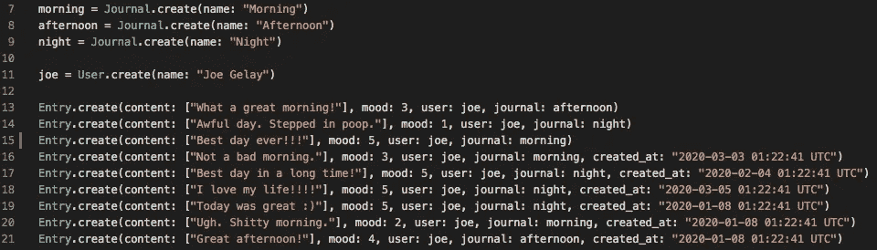

# 使用 Ruby、SQLite 和 ActiveRecord 构建 CLI 日志应用程序

> 原文：<https://medium.com/analytics-vidhya/building-a-cli-journal-app-with-ruby-sqlite-and-activerecord-2c1f5be00f93?source=collection_archive---------12----------------------->

让我们面对现实吧，如果你是编程新手，很少有什么事情比学习使用命令行更酷了。

我学习如何“光盘”到一个目录后的实际镜头。

也许更酷的是当你真正开始做东西时的感觉。那么，为什么不把两个很酷的东西放在一起，使用 good ol' terminal 作为一个轻量级的、易于管理的用户界面来制作您的第一个 Ruby 应用程序呢！

除了给你的朋友留下深刻印象和让你的妈妈困惑之外，学习在命令行上构建一个完整的 CRUD 应用程序是一种很好的方式，可以练习 OOP 设计基础，巩固你对多对多数据关系的理解，如果你是一个想要成为 ruby 爱好者的人，在继续使用 Rails 构建更复杂的浏览器应用程序之前，先了解一下“幕后”发生了什么。

首先，我将向您介绍我构建一个具有用户友好界面的快速日志应用程序的基本步骤。

## 1.规划你的人际关系

在决定一个项目想法后，花几分钟时间思考一下你的人际关系将如何构建。在我的例子中，一个用户可以有许多条目和许多日志，一个日志可以有许多条目和许多用户。一个条目属于一个用户和一个日志，因此是“连接”。

在使用 [Rake](https://www.rubyguides.com/2019/02/ruby-rake/) 创建我的数据库和表格后，我的整个应用程序的模式如下所示…


注意“entries”如何接受 user_id 和 journal_id 作为参数，从而在我的数据库表中创建多对多关系。

然后，我的用户、条目和日志模型通过它们的对应关系捆绑在一起，如下所示…


结合屏幕抓取。在实际代码中，每个模型都驻留在自己的文件中。

## 2.植入虚拟数据以测试您的数据库和关系

让我们仔细检查一下 ActiveRecord 是否一切正常 [ActiveRecord 的事情](https://guides.rubyonrails.org/active_record_basics.html)。在我的 seeds.rb 文件中，我创建了几个日志、一个用户和一些与用户和日志相关联的随机条目，以便验证我的所有数据都保存到了数据库中，并且我的关系正常工作。



我可以通过使用序列化器将数组传递给条目的内容，但这是另一篇文章的主题。

我使用[撬](https://github.com/pry/pry)作为调试工具，它允许我一步一步地检查我的代码，确保一切正常。

```
**User.all** #=> [#<User:0x00007fb9aa1d03d8 id: 1, name: "Joe Gelay">]**Entry.all** #=> [#<Entry:0x00007fb9a8b76d08 id: 1, content: ["What a great morning!"], mood: 3, user_id: 1, journal_id: 1, created_at: 2020-03-10 03:37:24 UTC, updated_at: 2020-03-10 03:37:24 UTC>, #<Entry:0x00007fb9a8bc8478 id: 2, ...]**Journal.all** #=> [#<Journal:0x00007fb9a8d64ac0 id: 1, name: "Morning">, #<Journal:0x00007fb9a8d71590 id: 2, name: "Afternoon">, #<Journal:0x00007fb9a8d71428 id: 3, name: "Night">]etc...
```

太好了！现在让我们进入有趣的部分…

## 3.想象几个用户故事

在迷失在你的代码中之前，给你自己一些简单直接的目标，告诉你用户应该如何与你的应用程序交互。试着用这样的结构来表达这些目标: ***作为一个用户，我希望能够…这样…***

对于 journal 应用程序，以下是我首先想到的一些用户故事:

1.  作为一名用户，我希望能够创建一个新的日志条目，这样我就可以跟踪我的一天和心情。
2.  作为一名用户，我希望能够阅读旧的日志条目，以便能够记住过去的日子。
3.  作为用户，我希望能够更新日志条目，以防出错。
4.  作为一名用户，我希望能够分析我所有日志中的情绪，这样我就可以看到我的想法与我的情绪之间的关系。

写出这样的故事可以让你确定应用程序最重要的功能，帮助你设计一个以用户为中心的界面，并作为下一步工作的检查点。

## 4.创建 CLI 模型来启动您的应用程序


在获得用户名、检查它们是否存在于数据库中，然后设置一个@current_user 变量之后，我们就开始比赛了。CLI 模型保持简洁明了，以遵循 OOP 原则。CLI 是否使用应用程序创建日志条目？不。那是使用者。因此，我们希望将大部分代码放在我们的“用户”模型中。


runner.rb 文件来启动应用程序。

应用程序通过 runner.rb 文件启动，该文件清除终端，实例化一个新的 CLI，然后调用上面的' welcome '方法。

## 5.世界(即命令行)是你的牡蛎！

现在是激动人心的部分，您可以自由地让您的应用程序做您想让它做的任何事情！体验宝石的乐趣，如 [TTY 提示](https://github.com/piotrmurach/tty-prompt)为您的界面添加时尚菜单，尝试添加 ASCII 艺术[或深入 ActiveRecord 并发现查询数据库的新方法，以将有趣的数据返回给您的用户。](https://www.asciiart.eu/)

为了获得灵感，下面是我完成的 CLI journal 应用程序的视频概述。在这里看 GitHub [上的代码。](https://github.com/joegelay/cli_journal_app)