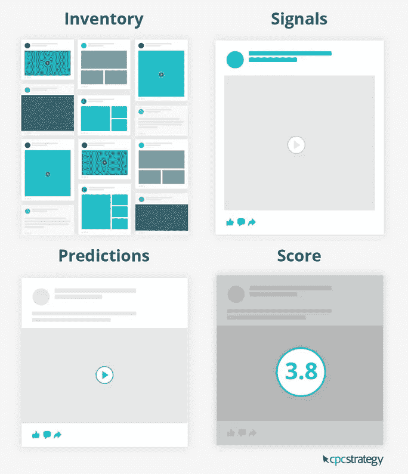
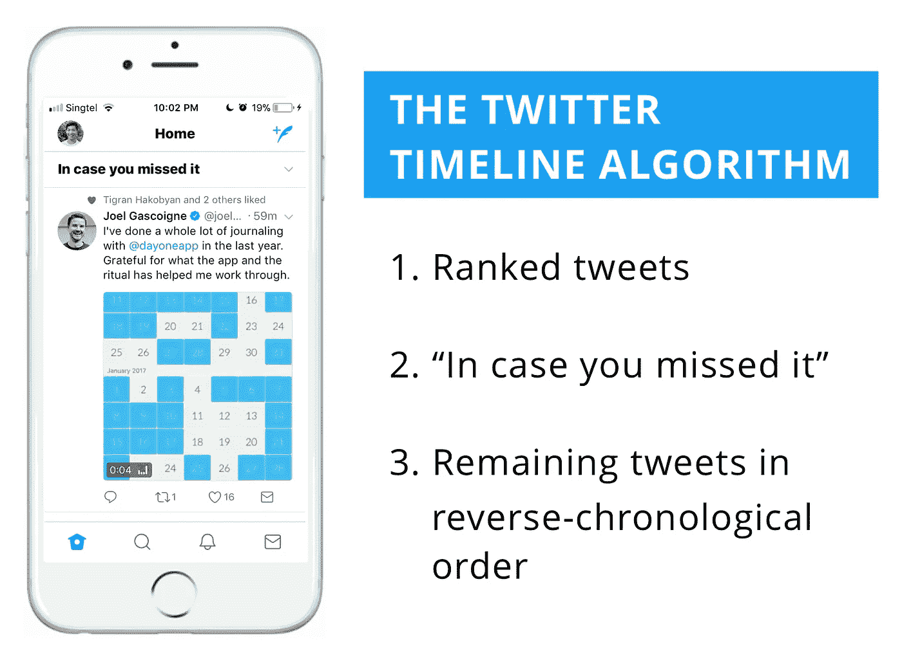
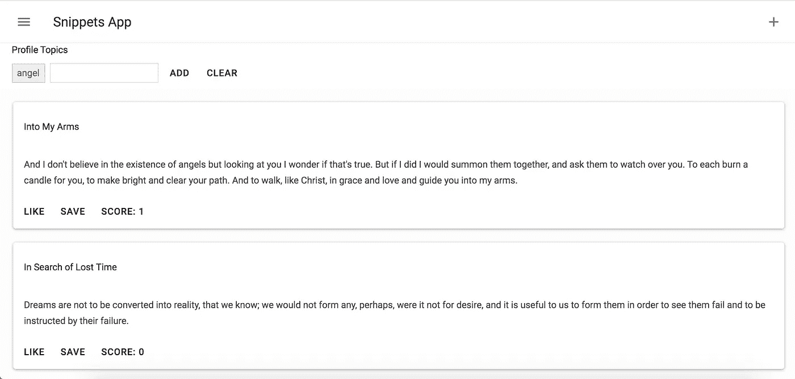

# 使用 MithrilJS 构建一个自我改进的推荐提要

> 原文：<https://medium.com/analytics-vidhya/building-a-client-side-recommendation-feed-in-mithriljs-3af0b6ca3ba1?source=collection_archive---------22----------------------->

最近，我遇到了一个任务，为一个文章收集 web 应用程序设计一个推荐源。该应用程序帮助用户收集文章片段，并允许用户喜欢出现在提要中的其他用户的某些片段。

一个新闻源…听起来很熟悉？这种设计模式实际上出现在脸书或推特这样的社交网络中。为什么我们不看看这些推荐算法是如何工作的，然后设计我们自己的推荐算法呢？

# 脸书算法

在脸书，新闻订阅会根据库存、信号和预测显示最受推荐的帖子([https://tinuiti.com/blog/paid-social/facebook-algorithm/](https://tinuiti.com/blog/paid-social/facebook-algorithm/))。

*   可显示的所有帖子的**清单**。
*   **告诉脸书每个帖子是什么的信号**。
*   预测你对每篇帖子的反应。
*   基于所有考虑的因素分配给内容的**最终分数**。

脸书的[算法因素]

# Twitter 的算法

在 Twitter 上，你可以看到热门帖子，或者你关注的人根据最近度、参与度、富媒体和活动转发的帖子。根据 Twitter 2017 年的博客帖子，它是基于。([https://blog . Twitter . com/engineering/en _ us/topics/insights/2017/using-deep-learning-at-scale-in-twitters-timelines . html](https://blog.twitter.com/engineering/en_us/topics/insights/2017/using-deep-learning-at-scale-in-twitters-timelines.html))

*   **最近度:**一条推文发布的时间。
*   **参与度:**与一条推文获得多少转发、点击、收藏和印象有关。
*   **富媒体:**你在推文中包含的媒体类型，比如图像、视频和 gif。
*   **活跃度:**指用户的活跃度。例如，用户上次登录该网站有多久了，他们有多少追随者，他们使用该平台的次数有多少。

Twitter 的[时间轴算法]

# 从头再来

为了想出我们自己的算法，我们需要从头开始。我们将讨论几个与 snippets 应用程序的用户故事相关的问题:

1.  这些建议的目的是什么？
2.  用户对推荐的反应如何？
3.  作为一种反馈机制，如何衡量推荐的质量，以产生更好的长期推荐？

# 建议的目的

对于不同用户收集的代码片段，显示所有代码片段的地方应该是用户可以找到新的和有趣的代码片段的地方。因为我们希望用户喜欢这些建议，甚至采取行动。我们希望这些建议能够提高用户参与度。

让我们先来看看数据结构，然后再来看看相关的属性。

*   文章标题
*   出版者
*   片段内容
*   时间戳
*   其他元数据…

与社交媒体帖子不同，文章片段的时间戳不应该引起普通用户的关注。片段的顺序应该根据每个用户之前对类似内容的反应来定制。考虑到这一点，我们可以将推荐问题分解成更小的部分，即:

*   存储、检索和转换用户反应
*   为推荐设置分数

很明显，推荐的质量越高，用户对 snippet 应用的粘性就越大。

# 用户对建议的反应

与 HackerNews 等链接聚合器不同，文章片段只能被“喜欢”。所以不存在“否决”或“不喜欢”一个片段的机制。这意味着每个片段的受欢迎程度与用户偏好直接相关。此外，用户还可以将代码片段保存到自己的帐户中。这种节约的行动自然应该比仅仅是喜欢更有分量。因此，我们的片段可爱分数的公式如下:

得分=“喜欢”数* 0.5 +“保存”数* 0.75 +关键词相关性* 1

我们现在把权重放在第一位，把关键词相关性放在喜欢和保存的最前面。经过一点测试后，它可能会改变。

# 演示

让我们为片段搭建舞台。如果你想看到最终的结果，就去看看演示:[https://mithril-recommendation.netlify.com](https://mithril-recommendation.netlify.com/)。

演示时间

# 衡量建议的质量

在这个演示中，我们允许用户通过直接与片段交互来影响喜欢的分数，例如喜欢、保存或指示他们的主题偏好。随着更多用户的加入，我们应该把 rooom 留给需要改进的建议。要做到这一点，我们需要定义一个推荐有多好。

一种方法是当一个片段位于 web 应用程序的中心视图时，测量屏幕空闲时间的持续时间。通过这种方式，我们可以获得每个用户对每个片段的关注持续时间，这又可以反馈到评分算法中。

# 我们将何去何从？

在生产应用程序中，这种推荐提要可以在特定库的帮助下实现，这些库使用协作过滤来实现快速有效的结果。在本教程中，我们试图实现一种不同的方式来推荐项目，而不是重炮。这种方法对于不消耗大量服务器资源的客户端应用程序可能很有用。

感谢您阅读本教程！希望它能帮助你在你的项目中开始你自己的推荐 feed。