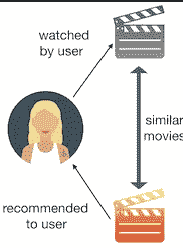
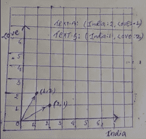
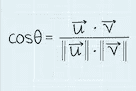

# 构建基于内容的电影推荐系统。

> 原文：<https://medium.com/analytics-vidhya/building-a-content-based-movie-recommendation-system-f7585ca35ed0?source=collection_archive---------22----------------------->

*****完成这个项目后，不要忘记谷歌这个***********


根据 Arthur Samuel(1959 年):机器学习是
研究中的“**领域，它赋予计算机在没有明确编程的情况下学习的能力”。**我试着用简单的真实世界的例子来解释机器学习的所有基础和分类…
下面是链接:-
[https://medium . com/@ 143 jshubham/Machine-Learning-and-its-impact-on-our-generation-4c 0 DBC 201 C1 a](/@143jshubham/machine-learning-and-its-impact-on-our-generation-4c0dbc201c1a)

你想过谷歌是如何推荐一部与你喜欢的电影相似的电影吗？相信我，读完这篇文章后，你将能够理解这背后的逻辑，也能够为用户建立一个这样的推荐系统。

没有特定类型的推荐系统，人们找到三四种不同的方法来构建推荐引擎:-

1.  基于内容的推荐引擎。
2.  基于协同过滤的推荐引擎。
3.  基于流行度的推荐引擎。
4.  混合内容协作推荐引擎。

现在在你的头脑中有一个问题，我们如何去识别它们。让我来帮你…

**基于内容的推荐引擎:-**



在这种类型的推荐引擎中，首先我们要从用户那里输入一部电影。然后分析里面的内容。假设我们要建立一个电影推荐系统。然后我们分析所有电影的内容，比如-(故事情节:类型:演员:导演)和所有其他有相似内容的电影。然后根据他们的相似性得分对他们进行排名，然后向用户推荐最相似的电影。

**基于协同过滤的推荐引擎:-**


该算法首先试图根据用户的活动发现用户之间的相似性。为了更好地理解，假设我们举了一个例子(假设我们有一本书的数据和读过这本书的用户的数据。假设用户 A 阅读了图书 X，用户 B 也阅读了图书 X，因此用户 A 和用户 B 的品味有一些相似之处。因此，将来如果用户 A 阅读了图书 Y，但用户 B 没有阅读图书 Y，那么我们可以向用户 B 推荐图书 Y。

**基于流行度的推荐引擎:-**


这是最简单但有效的算法，跟踪每个领域最流行的东西，并推荐特定的东西。你在 YouTube 或网飞看到的趋势列表就是基于这种算法。它跟踪每部电影/视频的观看次数，然后根据观看次数按降序列出电影，并向所有用户推荐该电影或歌曲。

**混合内容协作推荐引擎:-**

混合内容-协作型推荐引擎是最准确的，它结合了基于内容和协作算法。在这种类型推荐引擎中，我们首先推荐用户由于他们自己的内容而喜欢的两种类型的东西，其次我们也推荐基于他们与不同用户的品味相似性的东西。

在本文中，我们将使用 s [cikit-learn](https://scikit-learn.org/stable/) 库实现一个基于**内容的**推荐系统。

所以为了实现基于内容的推荐系统，我们知道我们感兴趣的是发现内容之间的相似性。逻辑很简单。如果我们有内容的相似性得分。

但是等等，我们如何找到两个或更多内容之间的相似性，我们如何知道这个内容-A 与内容-B 有多少相似性？

为了让你更好地理解，让我从一些简单的例子开始:我从某个地方拿了这个例子，因为这个例子确实帮助我理解这个推荐引擎背后的整个逻辑。我还补充了一些要点，并尝试探索整个逻辑-

假设我们有两个内容:-
text-A :-印度热爱印度
text-B :-热爱印度

这里我们有两个文本。我们怎么知道，文本 A 和文本 B 有多少相似之处？

现在，如果我们试图在一个 2D 平面(X 轴是“印度”，Y 轴是“爱”)上表现这两个文本，会发生什么？让我们试着这样做。

它看起来会像这样-



在这里，我们看到顶点为(2，1)的第一行表示文本 A，顶点为(1，2)的第二行表示文本 b。

现在我们已经用图形表示了这两个文本。那么，现在我们能找出这两篇文章的相似之处吗？

这两个文本被表示为向量。因此，我们可以很容易地说，如果两个向量之间的距离很小或角度( *θ* )很小，则它们是相似的。假设如果它们之间的角度为 0(零)，则意味着相同的向量意味着 100%相似。因此，随着它们之间的角度增加，它们之间的相似性降低。正如我们所知，单独的 *θ没有意义，但当我们进入机器学习时，Cosθ有意义，并且我们知道 Cosθ在 0 和 1 之间的第一象限中的值。*

我们知道如何在二维中找到两个向量之间的 cos *θ的值*



但是我们不会计算所有向量的 cos *θ* ，因为这是不可能的。我们让我们的朋友 Scikit 学会为我们计算:-

现在我们的第一个目标是以向量的形式表示文本。
为此，我们有 sk learn . feature _ extraction . text 的 CountVectorizer()类
我们需要在创建新的`CountVectorizer()`对象之前导入这个库。

```
text = ['India Love India','Love Love India']
```

首先，我们的目标制作一个文本列表。这样我们就可以将列表传递给 CountVectorizer()对象，以获得数组中所有元素(text-A，text-B)向量位置的稀疏矩阵。

```
from sklearn.feature_extraction.text import CountVectorizer
cvr = CountVectorizer()
counts_matrix = cvr.fit_transform(text)
```

如果我们要把它打印出来，看起来像这样:-
print(count _ matrix)
print(count _ matrix . toarray())

```
print(text)
print(count_matrix)
```

输出:-

```
text = ['India Love India','Love Love India'] ** (*0*, 0)   2 
  (*0*, 1)   1**
  (1, 0)   1
  (1, 1)   2
```

这里特征名称是印度和爱，并且**计数 _ 矩阵**有(0，0)，(0，1)这里这些**深色部分**表示文本中唯一单词的数量-A 是“印度”和“爱”，其中 2 表示文本中出现两次单词“印度”，1 表示文本中出现一次“爱”

**现在为了更好地理解，我们将 Count_matrix 转换为 Array。**

```
print(cv.get_feature_names())
print(count_matrix.toarray())
```

输出:-

```
['India','Love']
[[2 1]
 [1 2]]
```

这里二维数组的每一行也是一个代表一个文本的数组。这里我们知道有两个文本文本-A 和文本-B，所以在外部的二维数组中有两个数组。特定一维数组的长度表示唯一单词的数量，这里我们在 text-A 中看到，或者在第一行中，长度是 2，意味着在 text-A 中有两个唯一的单词，即“India”和“Love ”,而第一个数组或 text-A 的每个元素或第一行表示该唯一单词在 text-A 中的出现次数。因此，最后这意味着在 text-A 中有 2 个唯一的单词，即“India”和“Love ”,而在 text-A 中，India 出现了 2 次，而 Love 出现了 1 次

现在我们已经把所有的文本转换成一个矢量。所以现在我们的目标是找到所有向量之间的 Cos **θ** ..意思是(找出第一个和所有其他文本的 Cos **θ** 然后第二个和所有其他文本的 Cos……所有其他人也是如此)。而且我们看到在这个 count_matrix.toarray()中每一行都是文本的一个向量位置。其中[2 1]是文本 A 向量，而[1，2]是文本 B 向量。

现在我们的目标是找到这些向量之间的相似性，为此我们有来自`sklearn.metrics.pairwise`库中的`[cosine_similarity()](https://scikit-learn.org/stable/modules/generated/sklearn.metrics.pairwise.cosine_similarity.html)`函数。

```
from sklearn.metrics.pairwise import cosine_similarity
similarity_scores = cosine_similarity(count_matrix)
print(similarity_scores)
```

它给我们的输出是所有向量与所有其他向量的相似性分数，但在我们的例子中有两个向量。因此，我们收到两行，其中第一行表示第一个文本(text-A)与自己和他人相似性得分。类似地，第二行表示第二文本(文本 B)与自己和他人的相似性得分。

```
[[1\.  0.8]
 [0.8 1\. ]]
```

对此的解释是，文本 A 与文本 A(本身)相似度为 100%(位置[0，0])，文本 A 与文本 B 相似度为 80%(位置[0，1])。通过观察它给出的输出类型，我们可以很容易地说，它总是会输出一个对称矩阵。因为，如果文本 A 和文本 B 有 80%的相似度，那么文本 B 也会和文本 A 有 80%的相似度。

让我们做一些计算:-

正文-A:-[2，1]
正文-B:-[1，2]

用 1st:-
Cos**θ= vector(text-A)求 1st 的 Cos **θ** 。vector(text-B)/| vector(text-A)|。|vector(text-B)|
cosθ=(2i+j)。(2i+j)/{(2*2+1*1)**1/2。(2 * 2+1 * 1)* * 1/2 }
cosθ= 4+1/5
cosθ= 5/5
cosθ= 1**

用第二个求第一个的 Cos**θ**:-
Cos**θ= vector(text-A)。vector(text-B)/| vector(text-A)|。| vector(text-B)|
cosθ=(2i+j)。(i+2j)/{(2*2+1*1)**1/2。(1 * 1+2 * 2)* * 1/2 }
cosθ= 2+2/5
cosθ= 4/5
*cosθ= 0.8***

用 1 号求 2 号的 Cos**θ**:-
Cos**θ= vector(text-A)。vector(text-B)/| vector(text-A)|。| vector(text-B)|
cosθ=(2i+j)。(i+2j)/{(2*2+1*1)**1/2。(1 * 1+2 * 2)* * 1/2 }
cosθ= 2+2/5
cosθ= 4/5
cosθ= 0.8**

用 2nd-
Cos**θ= vector(text-A)求 2nd 的 Cos **θ** 。vector(text-B)/| vector(text-A)|。| vector(text-B)|
cosθ=(I+2j)。(i+2j)/{(1*1+2*2)**1/2。(1 * 1+2 * 2)* * 1/2 }
cosθ= 1+4/5
cosθ= 5/5
*cosθ= 1***

所以这个表格相似度分数:-

```
[[1\.  0.8]
 [0.8 1\. ]]
```

现在是时候开始我们的项目了。我们已经看到了算法是如何工作:-

首先安装所有的包并导入 python 文件中的所有包

```
import pandas as pd
import numpy as np
from sklearn.feature_extraction.text import CountVectorizer
from sklearn.metrics.pairwise import cosine_similarity
```

现在我们需要这个项目的电影数据集，所以我们从 Kaggle 下载并读取这个特定文件中的数据集。

```
data=pd.read_csv('movie_dataset_github.csv')
```

在此之后，我们试图清理我们的数据，所以我们在这里删除那些在训练我们的模型中不重要的列。

```
data.drop(columns=['budget','homepage','original_language','runtime','spoken_language'  ,'status'],inplace=True)
```

如果你看到数据集，你会意识到它有许多关于电影的额外信息。我们不需要全部。因此，我们选择“关键词”、“演员”、“类型”、“导演”、“标语”等栏目作为我们的特色。这就是所谓的电影的“内容”)。

```
Movie_features = ['keywords','cast','genres','director','tagline']
```

我们的下一个目标是创建一个函数，将这些列的值组合成一个字符串

```
def combined_movie_features(row):
 return row['keywords']+" "+row['cast']+" "+row['genres']+" "+row['director']+" "+row['tagline']
```

现在，我们将为 data_Frame 的每一行调用该函数，在此之前，我们应该清理数据，我们将用空白字符串替换所有 Nan 值。

```
for feature in Movie_features:
    data[feature] = data[feature].fillna('')data['combined_movie_features'] = df.apply(combined_movie_features,axis=1)
```

现在，我们的数据集中有了一个额外的列 combined_feature，其中有不同行或不同电影的所有功能列表，因为一行是一部特定的电影。

现在是时候考虑这个**特性栏**类似于**文本列表*了，那时我们只有两个文本(即文本 A 和文本 B ),但是现在我们有一个列表，其中有 1000 个文本，每个文本都是电影 _ 细节*中的一个**

所以现在是时候使用 CountVectorizer()对象将文本转换为矢量了。

```
cvr = CountVectorizer()
count_matrix = cvr.fit_transform(df['combined_features'])
```

现在我们有了一个 count_matrix，其中有“combined_features”列中所有文本的向量

```
count_matrix=[[0 0 0 ... 0 0 0]
 [0 0 0 ... 0 0 0]
 [0 0 0 ... 0 0 0]
 ...
 [0 0 0 ... 0 0 0]
 [0 0 0 ... 0 0 0]
 [0 0 0 ... 0 0 0]]
```

现在我们感兴趣的是发现所有“组合 _ 特征”的文本或所有计数 _ 矩阵的行与其自身以及与其他人的相似性。为此，我们从`sklearn.metrics.pairwise`库中调用了`[cosine_similarity()](https://scikit-learn.org/stable/modules/generated/sklearn.metrics.pairwise.cosine_similarity.html)`函数。

```
cosine_similarity = cosine_similarity(count_matrix)
```

你能猜出余弦相似度的大小吗？

```
**cosine_similarity** =[[1\.         0.25692801 0.21021383 ... 0.2306328  0.25391836 0.13543224]
 [0.25692801 1\.         0.15384615 ... 0.10127394 0.1672484  0.08920516]
 [0.21021383 0.15384615 1\.         ... 0.10127394 0.13937367 0.0594701 ]
 ...
 [0.2306328  0.10127394 0.10127394 ... 1\.         0.13762047 0.11744404]
 [0.25391836 0.1672484  0.13937367 ... 0.13762047 1\.         0.09697623]
 [0.13543224 0.08920516 0.0594701  ... 0.11744404 0.09697623 1\.        ]]
```

cosine_sim 的形状是 1000 x 1000 意味着有 1000 行和 1000 列，因为每 1000 部电影都找到了与每 1000 部电影的相似性。因此余弦 sim 的每一行都是该行与所有其他行的相似性得分。

您可以在第一行中看到余弦 _sim 的第一个元素是 1，因为它找到了与自身的相似性得分 1，然后是 0.25692801，这意味着 1 个元素与第二个元素的相似性得分，然后是 0.21021383，这意味着第一个元素与第三个元素的相似性……
现在您可以看到余弦 _sim 的第二行第一个元素是 0.25692801，它表示第二个元素与第一个元素的相似性得分。那么 1 表示第二个与第二个的相似性得分。像怀斯…

为此，我们需要制作两个函数，第一个接受标题并返回 id，第二个接受 id 作为输入并返回标题，在用户请求后显示标题。

```
def get_title_from_index(index):
    return df[df['index'] == index]['title'].values[0]
def get_index_from_movie_title(title):
    return df[df['title'] == title ]['index'].values[0]#Here index shows the  index .
# And title is the name of the movie title.
```

现在，在这种情况下，我们有相似性得分，现在如果任何用户输入电影名称，那么在 dataFrame 的帮助下，我们将找到该特定电影的 id，然后如果我们*在余弦 _sim 中传递该 id，就像这样余弦 _sem[id]* ，那么我们将获得该电影与所有其他电影的相似性得分，我们将该列表存储在一个变量 name="similar_movie "中。然后我们在枚举函数的帮助下给列表中的所有元素一个 id。在我们使用枚举函数之后，列表被转换成字典，其中键是索引，值是该元素与用户输入的元素的相似性分数。如果我们按价值降序排列字典。

```
**movie_user_likes="X-Men: Apocalypse"** 
movie_index = get_index_from_movie_title(movie_user_likes)
similar_movies=list(enumerate(cosine_similarity[movie_index])) 
```

现在，我们有了一个 Similar_movie 的字典，因此在这之后，我们将根据值来缩短 Similar_movie，我们存储除第一个索引值之外的所有值，因为这是元素与其自身的相似性得分，最大相似性为 1。

```
sorted_similar_movies = sorted(similar_movies,key=lambda x:x[1],reverse=True)[1:]
```

现在我们有了用户输入的电影的所有索引和相似性得分，现在我们的目标是从 sorted_similar_movie 中获取索引，并借助于 **get_title_from_index(Rank)函数获取名称并向用户显示该名称。**

```
i=0
print("Top 5 similar movies to "+ movie_user_likes)
for element in sorted_similar_movies:
    print(get_title_from_index(element[0]))
    i=i+1
    if i>4:
        break
```

这里我们运行 for 循环 5 次，得到 5 部最相似的电影。

这里我们按照用户输入打印相似的电影:-

```
Top 5 similar movies to **X-Men: Apocalypse**
X-Men: Days of Future Past
X-Men: First Class
X-Men
X2
Ant-Man
```

## **谷歌一下这部{类似《x 战警:天启》的电影}。** 你看有 80%到 82%的准确率。其中四个和谷歌推荐的一样…

这里的 Github 链接，如果你想看完整的代码，你可以访问我的 Github repo

[](https://github.com/143jshubham/Content_Based-Movie-Recommendation-Engine) [## 143 jshubham/基于内容的电影推荐引擎

### 在这个报告中，我们推出了基于内容的推荐系统的木星文件…

github.com](https://github.com/143jshubham/Content_Based-Movie-Recommendation-Engine) 

# 结论:-

在这篇文章中，你可以理解谷歌推荐一部与你喜欢的电影相似的电影的逻辑。所以这里重要的是数据。你可以建立任何推荐引擎，为此你需要数据。没有一个具体的方法来建立或判断一个推荐引擎，无论这是好是坏，重要的是准确性。可能发生的情况是，构建推荐引擎的特定方式在某些情况下是好的(比如 85%的准确度)，但在其他一些情况下可能是坏的(40%的准确度)。这是基本的推荐引擎，所以尝试通过实现逻辑来升级它。