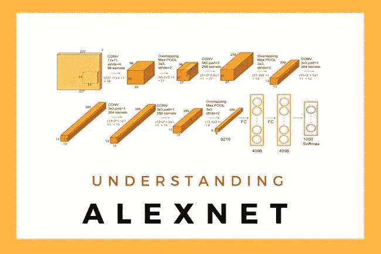

# 计算机视觉—基于 AlexNet 架构构建卷积神经网络

> 原文：<https://medium.com/analytics-vidhya/building-a-convolutional-neural-network-based-on-the-alexnet-architecture-89f8e70c8de4?source=collection_archive---------14----------------------->

归功于 OpenCV.com

在本文中，我们将尝试探索 CNN 架构之一 AlexNet，并应用该架构的修改版本来构建分类器，以区分猫和狗。

它是修改版本的原因:

*   在这里，我们正在建立一个二元分类器，这是为了…