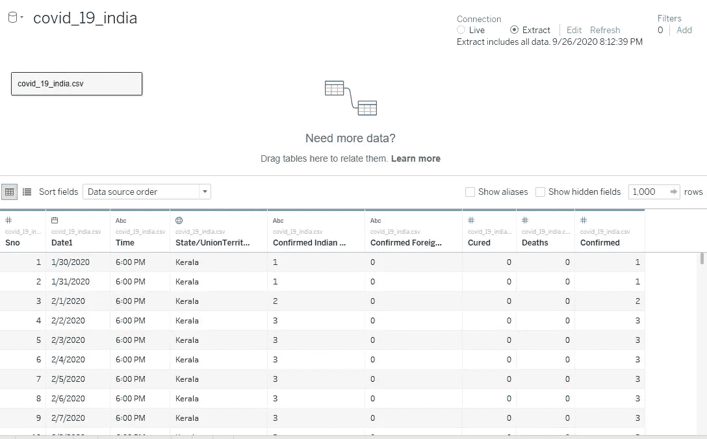
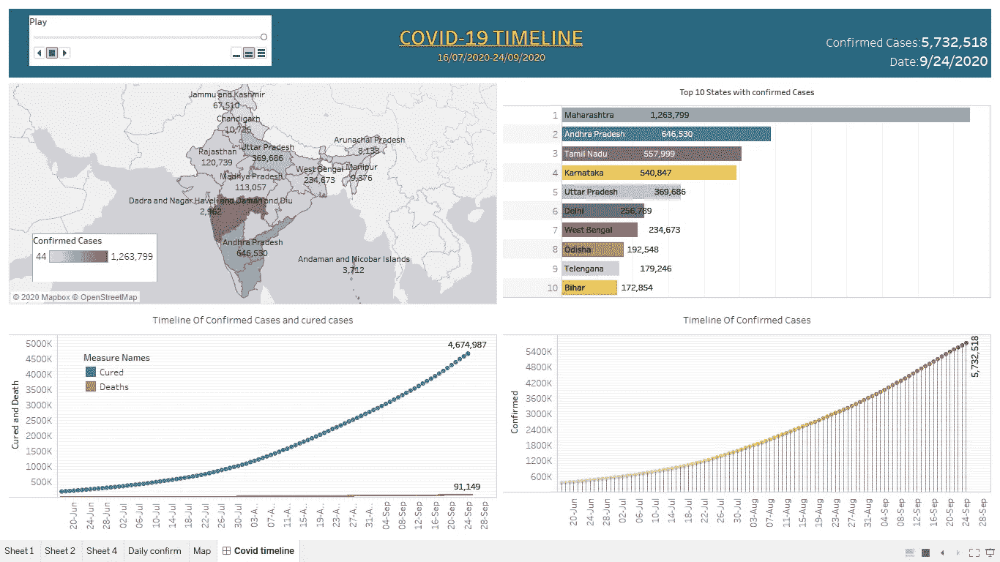
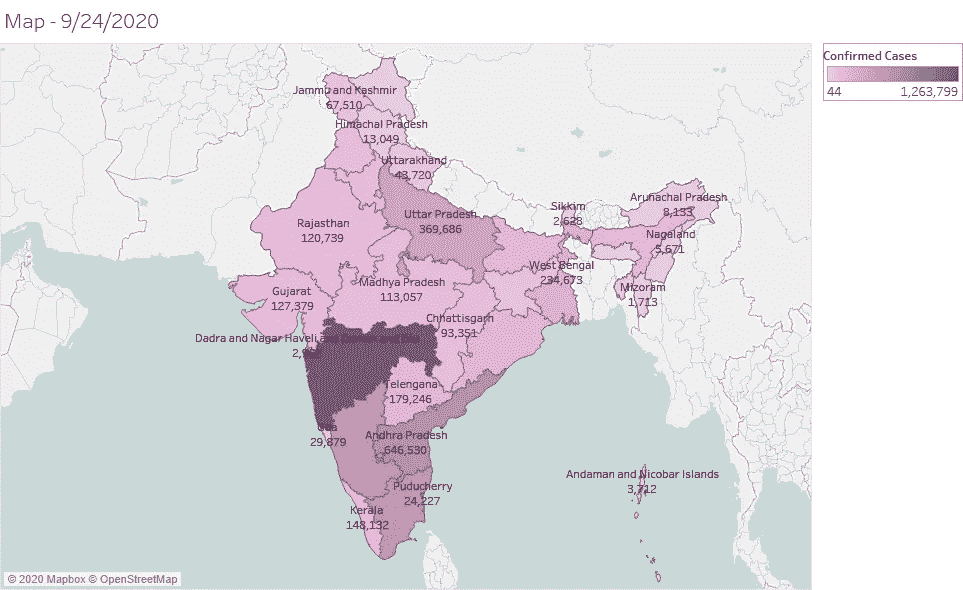
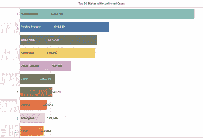
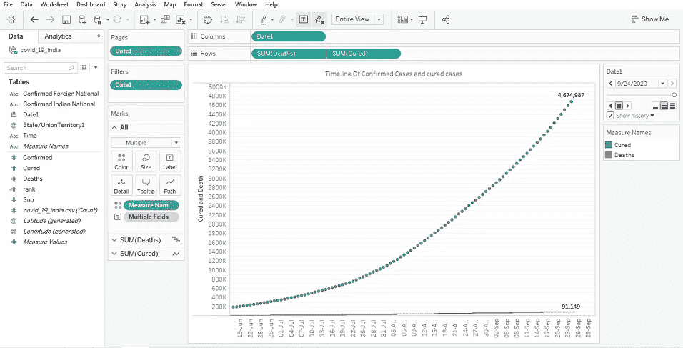
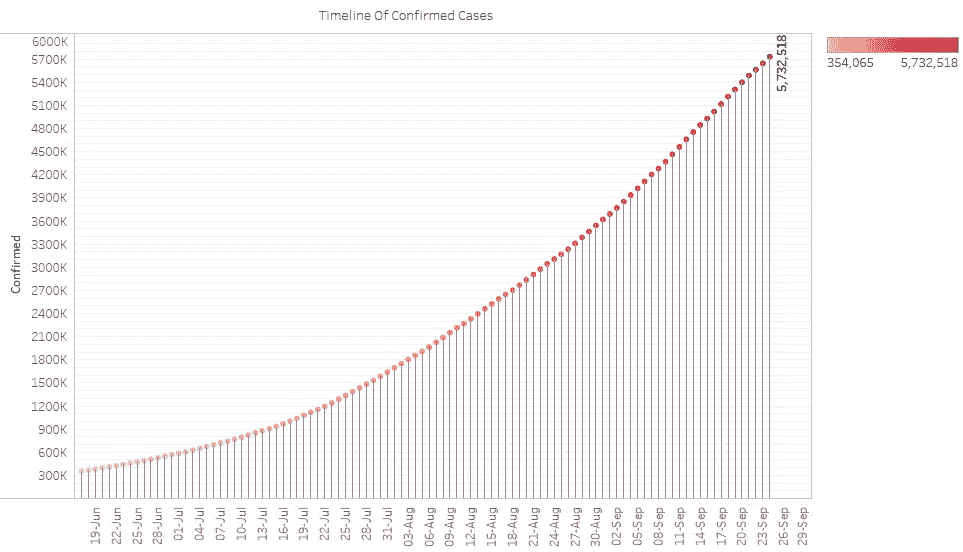

# 用 Tableau 构建新冠肺炎仪表板

> 原文：<https://medium.com/analytics-vidhya/building-a-covid-19-dashboard-with-tableau-f42ee7df94e?source=collection_archive---------31----------------------->

**冠状病毒**是一个可以致病的病毒家族，可以从*普通感冒*和*咳嗽*到有时更严重的疾病。中东呼吸综合征(MERS-CoV) 和严重急性呼吸综合征(SARS-CoV) 就是世界已经面临的严重病例。
是 2019 年**12 月**始于**武汉**的*连发*病毒。由于全球高利率差，该地区后来被世卫组织宣布为疫情。Tableau 是一个广泛使用的数据可视化平台。因此，使用该软件制作了一个清晰的冠状病毒传播仪表板。

# 数据

从[卡格尔](https://www.kaggle.com/sudalairajkumar/covid19-in-india)那里得到了数据。数据收集自印度卫生部、家庭福利部和维基百科。

# 仪表板

此[仪表板](https://public.tableau.com/profile/vaishnav.srivastava#!/vizhome/Bookcovid_16011356278070/Covidtimeline)包含工作表，其中包含印度确诊、治愈和死亡病例的数据分析，以及出现确诊病例的前 10 个邦的动画时间轴。

# **1。地图**

拖动列中的经度和行中的纬度，通过过滤国家和州，我们得到了印度地图(但它不包含试图修复它的 POK 部分)。然后拖动 SUM(已确认)案例的颜色和页面中的日期，并转换为准确的日期。

# **2。案例数最多的前 10 个州的动画条形图**

案例数量最多的前 10 个州的动画条形图。我们可以清楚地看到受疫情影响的前 10 个州的分布。

# 3.确诊和治愈病例的时间表

**印度各邦总病例、痊愈病例和死亡病例的时间序列:**上图显示了印度各邦死亡病例和痊愈病例的增长情况。用同步轴制作双轴图形。

# 4.确诊病例时间表

确认时间。我们可以清楚地看到，在两个月内，案例数量呈指数增长。

# 结论:

冠状病毒正在影响我们的日常生活，并且与日俱增。我们可以清楚地看到，与现在人们认为理所当然的情况相比，禁闭和社交距离时间有所不同。所以做任何事情都要安全，除了安全，社会距离和采取一切预防措施。

我的 [tableau 公共仪表盘](https://public.tableau.com/profile/vaishnav.srivastava#!/vizhome/Bookcovid_16011356278070/Covidtimeline)。你可以看看这个。你会如何改进这个仪表板？请随意回复其他有趣的可视化或数据源！。你可以查看我的 [LinkedIn](http://www.linkedin.com/in/vaishnav-srivastava-88a030119) 账号。

带着快乐的字条谢谢。