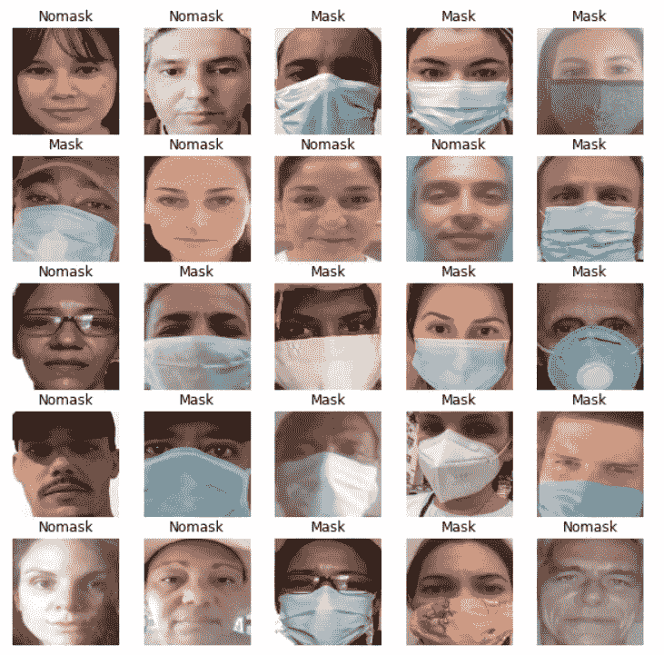
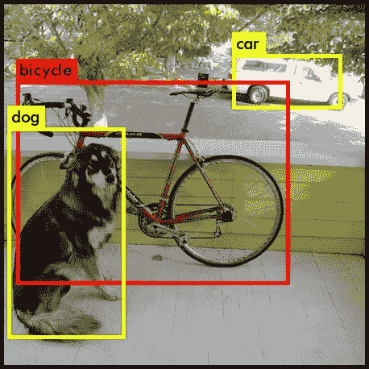
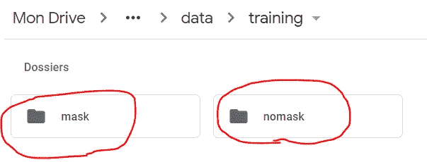
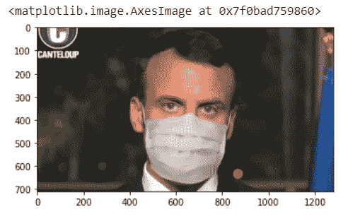
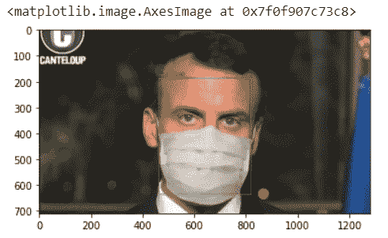

# 使用 OpenCV、Keras 和 Tensorflow 构建 Covid19 掩模检测器

> 原文：<https://medium.com/analytics-vidhya/building-a-covid19-mask-detector-with-opencv-keras-and-tensorflow-fc5e311071f9?source=collection_archive---------9----------------------->

在 COVID19 隔离期间，我决定构建自己的面具检测器实现，该检测器能够检测图像或视频中的人是否只是为了好玩而戴面具。

像每个机器学习项目一样，第一步是收集必要的数据。由于我们试图建立一个面具检测器模型，它应该能够输出“面具”或“没有面具”，给定一个输入人脸图像，所以我们需要收集戴面具和不戴面具的人的图像。

## **收集数据**

我只是来让我所有的朋友给我发一张他们戴着面具的自拍照和一张他们没戴面具的自拍照。我能够收集大约 200 张图像，这对于训练一个精确的机器学习模型来说似乎非常差，但是结果是相当可以接受的。



## 构建解决方案

要构建一个屏蔽检测器，让我们首先将问题分成两个主要步骤:

1.给定一个输入图像，我们需要检测它上面的人脸，这是一个在计算机视觉世界中称为“对象检测”的任务。对象检测是检测图像上对象位置及其类型的任务，如下例所示:



在我们的问题中，我们只需要检测面部，并输出它们的边界框来限定它们的位置，这样我们就可以将它们传递到下一步:

2.给定一幅或多幅人脸图像，我们需要将它们分为“有面具”或“无面具”。在机器学习词汇中，这被称为“二进制分类”，其中我们需要将一些输入数据分为两个可能的类别(在这种情况下[“掩码”、“无掩码”])。
我们的输入数据将是人脸的 RGB 图像表示。

因此，考虑到前面提到的 2 个步骤，我们在这里建立了一个处理管道，第一步是获取一个输入图像并输出在该图像中找到的人脸的边界框，第二步是获取由边界框分隔的裁剪后的人脸图像，并将它们分类为“遮罩”或“无遮罩”。

让我们从讨论第二步开始:“分类问题”，因为这是本文的主要焦点。

## 关键概念

**迁移学习**:迁移学习是机器学习中的一个研究问题，专注于存储在解决一个问题时获得的知识，并将其应用于另一个不同但相关的问题。例如，在学习识别汽车时获得的知识可以应用于识别卡车。[维基百科](https://en.wikipedia.org/wiki/Transfer_learning)

**数据扩充**:数据扩充是一种策略，使从业者能够显著增加可用于训练模型的**数据**的多样性，而无需实际收集新的**数据**。**数据扩充**裁剪、填充和水平翻转等技术通常用于训练大型神经网络

## 人脸图像预处理

为了建立以人脸作为输入并检测面具的面具检测器模型，我需要从收集的图像中裁剪出人脸。我没有在这里复制/粘贴代码，以避免这篇文章太大，但你可以在这里找到代码:[labeling _ images . ipynb](https://github.com/fnandocontreras/mask-detector/blob/master/labelling_images.ipynb)

## 训练模型

让我们从一步一步编写模型训练算法开始。我在带有 GPU 的 Google Colab 环境中使用了 python 和 Jupyter 笔记本，但是您也可以在您喜欢的任何 Python 环境中运行代码。

如果您想直接查看完整的代码，可以在我的 Github 存储库中找到培训笔记本:[https://Github . com/fnandocontreras/mask-detector/blob/master/training _ model . ipynb](https://github.com/fnandocontreras/mask-detector/blob/master/training_model.ipynb)

让我们导入一些依赖项:

```
**import** **tensorflow** **as** **tf**
**import** **pathlib**
**import** **numpy** **as** **np**
**import** **IPython.display** **as** **display**
**from** **PIL** **import** Image
**import** **matplotlib.pyplot** **as** **plt**
**import** **os**
**from** **keras.preprocessing.image** **import** ImageDataGenerator
**from** **keras.callbacks** **import** EarlyStopping
```

我使用 Google drive 来存储训练图像，但是如果您想在本地运行代码，也可以使用您的本地机器。
让我们将 Google drive 存储安装到笔记本中，并将收集到的图像的路径设置为 *base_path* ，并使用 pathlib 获取一个目录信息对象，如下所示:

```
from google.colab import drive
drive.mount(‘/content/drive’)base_path = '/content/drive/My Drive/Colab Notebooks/mask-detector/'
data_dir_collected = pathlib.Path(os.path.join(base_path, 'data/training'))
data_dir_test = pathlib.Path(os.path.join(base_path, 'data/test'))image_count_collected = len(list(data_dir_collected.glob('**/*.jpg')))
test_images_count = len(list(data_dir_test.glob('**/*.jpg')))
print('images collected', image_count_collected)
print('test images', test_images_count)
```

在我的 google drive 中，图像以以下文件夹结构存储:
名为“mask”的文件夹，包含所有带遮罩的图像
名为“nomask”的文件夹，包含所有不带遮罩的图像



让我们检查一下我们是否在正确的路径上加载了图像:

```
CLASS_NAMES = np.array([item.name **for** item **in** data_dir_collected.glob('*')])
print(CLASS_NAMES)
```

这应该打印:['nomask' 'mask']

让我们定义一些常数并创建 tensorflow 图像生成器，该生成器将加载图像并将其提供给模型训练过程:

```
IMG_WIDTH = 160
IMG_HEIGHT = 160
IMG_SIZE = (IMG_WIDTH, IMG_HEIGHT)image_generator = ImageDataGenerator(rescale=1./255)
train_data_gen = image_generator.flow_from_directory(directory=str(data_dir_collected), shuffle=True, target_size=IMG_SIZE, classes = list(CLASS_NAMES))
```

让我们展示由训练数据生成器加载的图像:

```
**def** show_batch(image_batch, label_batch):
    plt.figure(figsize=(10,10))
    **for** n **in** range(25):
        ax = plt.subplot(5,5,n+1)
        plt.imshow(image_batch[n])
        plt.title(CLASS_NAMES[label_batch[n]==1][0].title())
        plt.axis('off')

image_batch, label_batch = next(train_data_gen)
show_batch(image_batch, label_batch)
```

让我们定义一些对数据预处理有用的辅助方法:

```
**def** get_label(file_path):
  *# convert the path to a list of path components*
  parts = tf.strings.split(file_path, os.path.sep)
  *# The second to last is the class-directory*
  **return** parts[-2] == CLASS_NAMES

**def** decode_img(img):
  *# convert the compressed string to a 3D uint8 tensor*
  img = tf.image.decode_jpeg(img, channels=3)
  *# Use `convert_image_dtype` to convert to floats in the [0,1] range.*
  img = tf.image.convert_image_dtype(img, tf.float32)
  *# resize the image to the desired size.*
  **return** tf.image.resize(img, [IMG_WIDTH, IMG_HEIGHT])

**def** process_path(file_path):
  label = get_label(file_path)
  *# load the raw data from the file as a string*
  img = tf.io.read_file(file_path)
  img = decode_img(img)
  **return** img, label
```

现在，让我们从存储中加载所有图像，包括我们将用于评估模型的测试图像:

```
list_ds_collected = tf.data.Dataset.list_files(str(data_dir_collected/'*/*'))
list_ds_test = tf.data.Dataset.list_files(str(data_dir_test/'*/*'))
```

现在，让我们将之前定义的预处理函数应用于加载的图像:

```
train_ds = list_ds_collected.map(process_path)
validation_ds = list_ds_collected.map(process_path)
```

让我们定义一个 ImageDataGenerator，这将定义一个生成器类，它将对加载的图像执行数据扩充，这将允许我们在更大的数据分布上训练模型，它对图像执行一些操作，如:缩放、旋转、水平翻转等。

在许多情况下，当我们没有足够的训练数据时，或者当模型过度拟合训练数据集时，数据增强是有用的。直觉上，我们正在训练一个模型来预测人们是否戴着面具，而我们包含人脸的训练数据可能会通过对每张人脸图片应用变换来增强。事实上，这些转换不会修改生成的类(“掩码”、“nomask”)，所以让我们开始吧。

```
**def** get_data_generator():
    **return** ImageDataGenerator(
        rotation_range=20,
        zoom_range=0.10,
        width_shift_range=0.1,
        height_shift_range=0.1,
        shear_range=0.15,
        horizontal_flip=**True**,
        fill_mode="nearest")
```

让我们生成一批包含所有收集/训练和验证图像的图像，并使图像生成器适合这些图像。

```
train_ds = train_ds.batch(image_count_collected)
validation_ds = validation_ds.batch(test_images_count)datagen = get_data_generator()
image_batch, label_batch = next(iter(train_ds))
datagen.fit(image_batch)
```

现在，我们可以开始构建深度学习模型了。
如前所述，我们正在使用迁移学习，即使用预先训练的模型作为最终模型的一部分，这使我们能够利用通用计算机视觉模型所学习的参数来构建适合我们要求的模型。

在下面的代码块中，我们正在加载 MobileNET V2，如果您想了解网络架构的更多细节，您可以在这里找到研究论文:[https://arxiv.org/abs/1801.04381](https://arxiv.org/abs/1801.04381)

```
IMG_SHAPE = (IMG_WIDTH, IMG_HEIGHT, 3)

*# Create the base model from the pre-trained model MobileNet V2*
base_model = tf.keras.applications.MobileNetV2(input_shape=IMG_SHAPE,
                                               include_top=**False**,
                                               weights='imagenet')
base_model.trainable = **False**
```

我们正在将模型正确地设置为“假”,因为我们不想重新训练这个模型。

现在我们已经有了基本模型，让我们通过添加一些预测输出所需的层来完成它:

```
model = tf.keras.Sequential([
base_model,
GlobalAveragePooling2D(),
Dense(len(CLASS_NAMES), activation='softmax')
])
model.summary()
```

您应该会看到如下模型摘要:

```
Model: “sequential_3” _________________________________________________________________ Layer (type) Output Shape Param # ================================================================= mobilenetv2_1.00_160 (Model) (None, 5, 5, 1280) 2257984 _________________________________________________________________ global_average_pooling2d_4 ( (None, 1280) 0 _________________________________________________________________ dense_4 (Dense) (None, 2) 2562 ================================================================= Total params: 2,260,546 Trainable params: 2,562 Non-trainable params: 2,257,984
```

我们正在向基本模型的输出添加一个全局平均池层和一个具有“softmax”激活功能的密集层，请在官方 Keras 文档中找到关于该层的更多详细信息:
[**全局平均池 2D**](https://www.tensorflow.org/api_docs/python/tf/keras/layers/GlobalAveragePooling2D)
[**密集**](https://www.tensorflow.org/api_docs/python/tf/keras/layers/Dense)

模型的输出是“(无，2)”，其中:“无”表示可能变化的批量，而“2”表示对应于类数量的 softmax 层的大小。softmax 层输出可能的输出类别的概率分布。

既然我们已经有了模型，让我们继续训练。让我们迭代训练图像 50 次，以生成图像，之后我们将使用我们的数据增强生成器对这些图像进行转换:

```
reps = 50
training_ds = train_ds.repeat(reps)
X_training, Y_training = next(iter(training_ds))
for X, Y in training_ds:
   X_training = tf.concat([X, X_training], axis=0)
   Y_training = tf.concat([Y, Y_training], axis=0)
```

现在，我们可以编译并拟合我们的模型:
我们在这里使用“Adam”作为训练期间的优化算法，我们正在对模型进行 10 个时期的训练，并且我们正在使用提前停止，如果通过 6 次训练迭代精度没有变得更高，这将停止训练过程。

```
model.compile(optimizer='adam', loss='categorical_crossentropy', metrics=['accuracy'])
initial_epochs = 10
earlystopping = EarlyStopping(monitor='val_loss', patience=6)
batch_size = 100history = model.fit(
datagen.flow(X_training, Y_training, batch_size=batch_size), 
steps_per_epoch=len(X_training) / batch_size,
epochs=initial_epochs,
validation_data=validation_ds,
use_multiprocessing=False)
```

在训练结束时，我得到了以下结果:
*纪元 10/10 98/97[= = = = = = = = = = = = = = = = = = = = = = = = = = =]—46s 466 ms/step—损耗:0.0018 —精度:1.0000—val _ loss:6.2493 e-04—val _ accuracy:1.0000*

准确度:1.00 表示模型以 100%的准确度预测了测试数据集。但这并不意味着该模型在每个数据集上都表现相同。请记住，在这个实验中，我在训练过程中只使用了近 200 幅图像，这对于大多数机器学习问题来说是不够的。

为了建立一个在大多数情况下表现良好并能正确概括的模型，我们可能需要成千上万的图像。然而，为了概念验证的目的，这已经足够了，而且该模型似乎在我使用网络摄像头视频流进行实时测试的几个人身上工作得非常好。

现在我们有了训练好的模型，让我们保存它，看看如何使用它:

```
model.save(os.path.join(base_path,'model.h5'))
```

现在，您可以从另一个 python 程序加载保存的模型，如下所示:

```
from tensorflow.keras.models import load_model
model = load_model(‘model.h5’)
```

现在我们有了一个面具检测器模型，我们需要管道的第一部分:“人脸检测器”。目标检测是计算机视觉的主要任务之一。你可以找到很多预先训练好的模型用于物体检测，有时有几千个不同的类。这里我用了 MTCNN，它代表“多任务卷积神经网络”。你可以在这里找到 github 库:[https://github.com/ipazc/mtcnn](https://github.com/ipazc/mtcnn)

让我们导入 MTCNN 并创建一个人脸检测器实例:

```
from mtcnn import MTCNN
detector = MTCNN()
```

让我们用 opencv 加载一个图像进行测试:

```
import cv2
from matplotlib import pyplot as plt
test_img_path = os.path.join(data_dir_test, 'macron.jpg')
img = cv2.imread(test_img_path,cv2.IMREAD_COLOR)
plt.imshow(img[:,:,::-1])
```



让我们在图像上运行面部检测器:

```
face_boxes = detector.detect_faces(img)
print(face_boxes)
```

[{
' box]:[463，187，357，449]，
' confidence ':0.9995754361152649，
' key points ':{
' left _ eye ':(589，346)，
'right_eye': (750，357)，【T10]' nose ':(678，442)，
'mouth_left': (597

我们可以看到面部被检测到，并且我们有所有相关信息，如边界框和感兴趣点的位置。在这种情况下，我们只需要边界框，这将有助于我们裁剪界定面部的图像。

现在让我们看看这个模型在法国总统身上的表现:
我使用了一些辅助功能来裁剪和绘制人脸，这些功能可以在 [tools.py](https://github.com/fnandocontreras/mask-detector/blob/master/tools.py) 中找到

```
face_boxes, faces = extract_faces(face_boxes, img)
preds = model.predict(tf.data.Dataset.from_tensors(faces))
probas = preds.max(axis=1)
y_preds = [CLASS_NAMES[c] for c in preds.argmax(axis=1)]
draw_boxes(img, face_boxes, (y_preds, probas))
plt.imshow(img[:,:,::-1])
```



瞧，模特说法国总统马克龙戴着面具。

你可以用你自己的图片自己试试，你可以在 Github 中找到完整的代码和训练好的模型:[https://github.com/fnandocontreras/mask-detector](https://github.com/fnandocontreras/mask-detector)

您可以使用 opencv 和您的网络摄像头实时运行它，有关如何运行该程序的详细信息，请在 readme.md 中找到说明

这就是本教程的全部内容，请记住这只是一个实验，由于其局限性，不打算在真实生活环境中使用。一个重要的限制是，面部检测器在许多情况下无法检测到被掩盖的面部，因此它中断了流水线的第一步，并且将无法如预期的那样工作。

我希望你喜欢阅读。

保持冷静，戴上口罩，帮助阻止#covid19