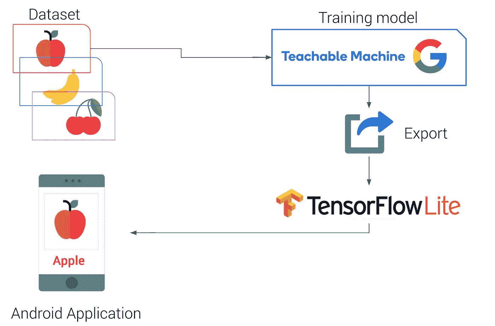
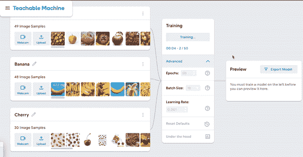
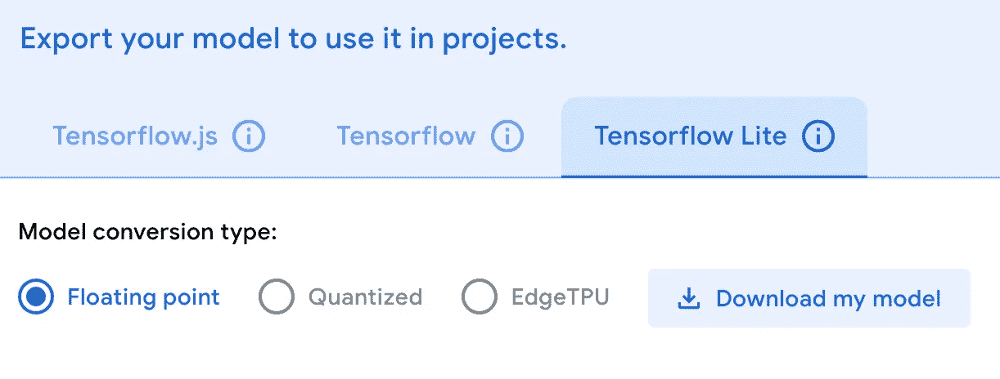

# 为您的 android 应用程序构建自定义图像分类器。

> 原文：<https://medium.com/analytics-vidhya/building-a-custom-image-classifier-for-your-android-application-f6ab4e1e3a33?source=collection_archive---------2----------------------->

图像分类或图像识别是一个概念，在这个概念中，你向设备的摄像头传感器展示一幅图像，它会告诉你该图像中存在什么，或者告诉我们它属于哪一类。

在本教程中，我将通过谷歌的一个令人兴奋的在线工具:[teacheble machine with Google](https://teachablemachine.withgoogle.com/)的帮助下训练一个简单的深度学习模型，然后将模型导出到与 android 设备兼容的 TensorFlow lite 版本，来引导您进行自定义图像分类。最后，我们将把这个模型部署到一个 android 设备上。

让我们以一个简单的 android 应用程序**的水果分类为例。**

android 中图像分类的工作流程

# 模型

用于训练自定义图像分类器的训练平台是带谷歌的[教学机](https://teachablemachine.withgoogle.com/)。这是一个令人兴奋的平台，只需点击一下，通过上传不同类别的数据集或使用网络摄像头，就可以学习深度学习训练过程，然后很容易地训练它。最后，经过训练，您可以导出您选择的模型。我已经将它导出到 TensorFlow lite 版本，因为我必须在 android 设备上运行它。你可以选择任何你想要的格式并下载模型。

训练过程可教机器与谷歌

# 要求

*   不同类的图像数据集(用于自定义训练)(可以下载流程下载链接中用到的水果数据集:)[水果](https://drive.google.com/file/d/12fQWCDOsEY9IXvKEg3BtbMMTnd-rOjBE/view?usp=sharing)
*   Android Studio 3.2(安装在 Linux、Mac 或 Windows 机器上)
*   处于[开发者模式](https://developer.android.com/studio/debug/dev-options)的 Android 设备启用了 USB 调试
*   USB 线(将 Android 设备连接到您的电脑)

# 构建并运行

# 第一步。上传数据集(自定义数据集)

准备数据集并上传到[带谷歌网站的可教学机器](https://teachablemachine.withgoogle.com/)中，并相应定义班级数量。在那边训练图像分类模型，最后以 TensorFlow lite 格式导出模型。

在训练过程中，您可以更改**超参数**的编号，如下所示:

*   纪元数量
*   批量
*   学习率

训练完成后，您必须以 TensorFlow lite 格式导出模型，以便在 android 设备中部署。的。tflite 文件应该放在 android 项目目录的 asset 文件夹中，并在读取它的 java 文件中更改名称。此外，您可以下载量化以及浮动文件格式的 tflite。

导出模型

# 第二步。使用深度学习克隆这个用于图像分类的存储库

将下面这个 GitHub 库克隆到你的电脑上，并保存到你选择的文件夹中。这是 android 应用程序的 java 代码。

放置。tflite 文件添加到 asset 文件夹，并替换名称，现在就可以构建应用程序了。

# 第三步。构建 Android Studio 项目

选择`Build -> Make Project`并检查项目是否构建成功。您需要在设置中配置 Android SDK。您至少需要 SDK 版本 23。`build.gradle`文件将提示您下载任何缺失的库。你要把 fruits.tflite 放到 android structure 项目目录的 asset 文件夹里，根据你训练过的类的编号来改变标签。

# 第四步。安装并运行应用程序

将 Android 设备连接到计算机，并确保批准手机上出现的任何 ADB 权限提示。选择`Run -> Run app.`,在要安装应用的设备的连接设备中选择部署目标。这将在设备上安装应用程序。

**下载代码:**

 [## rafiuddinkhan/自定义-图像-分类-Android

### 自定义图像分类，对从 android 设备的后置摄像头看到的任何东西进行连续分类。推论…

github.com](https://github.com/rafiuddinkhan/Custom-Image-Classification-Android) 

参考资料:

 [## TensorFlow Lite 示例| TensorFlow

### TensorFlow Lite Android 和 iOS 应用程序的集合。

www.tensorflow.org](https://www.tensorflow.org/lite/examples)  [## 可教机器

### 训练计算机识别你自己的图像、声音和姿势。为…创建机器学习模型的快速、简单的方法

teachablemachine.withgoogle.com](https://teachablemachine.withgoogle.com/)