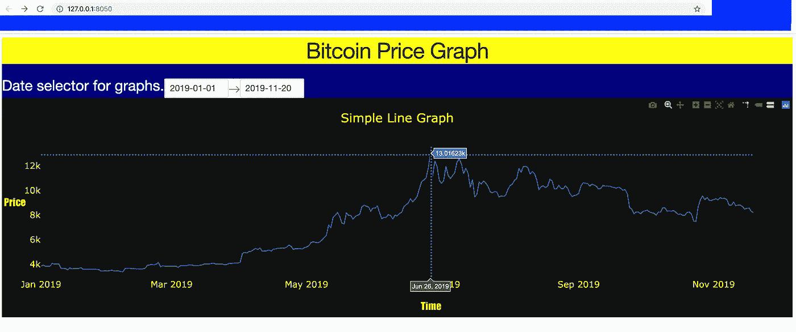

# 使用 Plotly 的 Dash 构建仪表板应用程序:从初学者到专业人员的完整指南

> 原文：<https://medium.com/analytics-vidhya/building-a-dashboard-app-using-plotlys-dash-a-complete-guide-from-beginner-to-pro-61e890bdc423?source=collection_archive---------0----------------------->


[**富士山**](https://en.wikipedia.org/wiki/Mount_Fuji) 的景色(3776 米)来自 [**库莫多里**](https://en.wikipedia.org/wiki/Mount_Kumotori) (2017 米)。

## 使用 Dash 构建交互式仪表板应用程序并将其部署到 Heroku 的完整指南，第 1 部分:创建基本仪表板

仪表板可以使数据可视化更具交互性、交流性、简单性和用户友好性。假设有这样一种情况，您需要构建一个交互式仪表板，但是您只熟悉 python。在这种情况下，Dash 会来救你。

> **Dash** 是一个用于构建分析性 web 应用程序的 Python 框架。不需要 JavaScript。建造在**顶端的**。js、React 和 Flask， **Dash** 将下拉菜单、滑块、数据表和图表等现代 UI 元素直接绑定到您的分析性 Python 代码。

我将把整个教程分为两部分。第一部分将涵盖创建一个基本的仪表板，然后添加更多的选项。在第二部分，我将写更多关于 dash 组件、用户认证和将应用程序部署到 Heroku 的内容。

在本文中，我们将构建上述仪表板。

> 查看使用 Dash 创建的真实仪表板示例，以跟踪印度的 **Covid19 案例。**

 [## COVID19 印度跟踪器

### 编辑描述

covid19-india-tracker.herokuapp.com](https://covid19-india-tracker.herokuapp.com/) 

## **初始设置**

首先用`mkdir dashboard_demo`命令创建一个新文件夹(例如:dashboard_demo)并用`cd dashboard_demo`改变工作目录。我假设您已经安装了 anaconda，并且运行良好。现在用`conda create --name dashboard`命令创建一个 conda 虚拟环境，并用`source active dashboard`或`conda activate dashboard` 命令激活它。

通过 pip 安装依赖项，并将它们保存到“requirements.txt”文件中。

```
pip install Flask
pip install dash
pip install plotly
pip install dash_html_components # dash html components
pip install dash_core_components # dash core components 
pip install PriceIndices # will used for this tutorial for data 
pip install lxml # Needed for PriceIndices package
pip install dash-table # data table components
pip install dash-auth # for user authentication
pip install gunicorn # needed for deployment 
```

用`pip freeze --> requirements.txt`命令将上述 python 包保存到“requirements.txt”中。“requirements.txt”如下图所示。

```
dash==1.6.1
dash-core-components==1.5.1
dash-html-components==1.0.2
dash-auth==1.3.2
dash-table==4.5.1
Flask==1.0.2
gunicorn==19.9.0
numpy==1.15.4
pandas==0.23.4
plotly==4.2.1
PriceIndices==1.1.1
lxml==4.4.1
```

# 仪表板应用程序

在这一节中，我将介绍 dash 组件的基本介绍以及如何使用它们来制作仪表板。

## **1。简介**

在我们构建仪表板应用程序之前，我将对 dash 组件做一个简单的总结。Dash html 组件和 Dash 核心组件用于构建交互式仪表板。

**破折号 html 组件**作为 html 标签工作。它将 python 代码转换成 html 代码。请参见下面的示例:

**Dash 核心组件**有不同的组件来构建交互式仪表盘。

> 一、[图形](https://dash.plot.ly/dash-core-components/graph):用于制作图形。
> 
> 二。选项卡:制作选项卡的组件
> 
> 三。Dropdown:它创建一个下拉菜单来选择项目。
> 
> 四。滑块:它是一个数值范围滑块。
> 
> 动词 （verb 的缩写）日期选择器:日期选择器用于选择日期或日期范围。
> 
> 动词 （verb 的缩写）Table:这个组件用于显示表格。
> 
> 不及物动词降价:它的工作原理是降价。
> 
> 七。清单:它提供了清单选项。
> 
> 八。radio items:radio items 用于制作单选按钮。
> 
> 九。[位置](https://dash.plot.ly/dash-core-components/location):表示您的网络浏览器中的地址栏。
> 
> X.Store:用于在用户的浏览器中存储数据。

推荐阅读 [**官方文档**](https://dash.plot.ly/?_ga=2.171682729.828752419.1574214165-1322431847.1545115553) 入门 Dash。

我们将在本教程中看到上述几个组件的用法。

## **2。第一个简单的应用程序**

现在用`touch`命令在`dashboard_demo`目录下创建 2 个文件(app.py 和 index.py)。`touch app.py`T24`touch index.py`

“app.py”对于大多数使用 dash 构建的仪表板应用程序来说是相同的。在应用程序文件中，我们创建一个 dash 应用程序，服务器，并使用 css 文件定义应用程序的整体风格。`external_stylesheets`是一个 css 文件，用来定义 app 的整体风格。

app.py

“index.py”将拥有 app 的 html 和核心组件。dash 应用程序有两个主要部分将在索引文件中定义，即应用程序布局和回调。应用程序布局描述了应用程序的外观，回调描述了应用程序的交互性。

让我们写一个简单的“index.py”来制作一个线图。

index.py 示例-1

用`$ python3 index.py`命令运行 index.py。您应该可以在 [http://127.0.0.1:8050/](http://127.0.0.1:8050/) 上看到仪表板应用程序。仪表板将如下图所示。


仪表板应用程序示例-1

## **3。添加回调并改进图形布局**

上面的仪表板看起来很简单。让我们引入回调并改变图形布局。

回调是如何进行的？

> 我们的应用程序接口的“输入”和“输出”是通过`app.callback`装饰器以声明方式描述的，它们只是特定组件的属性。每当输入属性改变时，回调装饰器包装的函数将被自动调用，输出将在应用程序布局中改变。

我们可以在图形布局中定义样式、颜色、文本格式、图形背景等。请参见下面的代码示例，其中包含回调和更新的图形布局。

index.py 示例-2

如果我们比较“index.py example-1”和“index.py example-2 ”,我们可以看到“index.py example-2”中增加了一个`app.callback`,并且图形布局也增加了几个 now 项。刷新应用程序页面以查看更改。


仪表板示例-2

> 注意:只有当我们想要根据特定的输入改变输出时，我们才应该使用回调。在上面的例子中不需要`app.callback` 。我只是用它来演示它的用法。

## **4。添加 DateRangePicker 并使用真实数据绘制图表**

在这一部分中，我们将添加一个 DateRangePicker 到布局中，并为图形使用真实数据。

我将使用比特币价格数据为选定的日期范围制作价格与时间的折线图。比特币价格数据可在 [**CoinMarketCap**](https://coinmarketcap.com/) 上获得。我将使用`[**PriceIndices**](https://github.com/dc-aichara/PriceIndices)` python 库从 CoinMarketCap 获取价格数据。

**DateRangePicker 的组件解释如下。**

> **允许最小日期:**允许选择的最小日期
> 
> **最大允许日期:**允许选择的最大日期
> 
> **初始可见月:**点击选择日期时初始可见月
> 
> **开始日期:**日期范围选取器的开始日期
> 
> **结束日期:**日期范围选取器的结束日期
> 
> **显示的月数:**选择日期时显示的月数
> 
> **月格式:**显示月和年的格式
> 
> **显示 _ 格式:**日期显示格式

我还会将 DateRangePicker 的开始日期和结束日期添加到`app.callback`中，这样就可以显示所选日期范围的图表。

index.py 示例-3



仪表板示例-3

上面的应用程序有一个 DateRangePicker。图表显示在选定的日期范围内。

## **5。添加数据表和降价**

在本节中，我们将向 app 添加数据表和 markdown。先写一个函数获取数据表。可以使用`dash-table`库创建数据表。`dash-table`呈现一个 html 表格。

```
df = history.get_price('bitcoin', '20130428', '20200510')
def get_data_table():
    data_table = dash_table.DataTable(
        id='datatable-data',
        data=df.to_dict('records'),
        columns=[{'id': c, 'name': c} for c in df.columns],
        style_table={'overflowY': 'scroll'},
        fixed_rows={'headers': True, 'data': 10},
        style_cell={'width': '100px'},
        style_header={
            'backgroundColor': 'rgb(230, 230, 230)',
            'fontWeight': 'bold'
        }
    )
    return data_table
```

现在添加 2 个 html 组件到`app.layout`,用于数据表和 markdown。破折号降价和其他降价方式一样。我已经使用 markdown 在应用程序页面底部的权利版权。

```
html.Div(children=[html.H1(children="Data Table", # html for table
                   style={
                          'textAlign': 'center',
                           "background": "yellow"}),
                      get_data_table()]),
html.Div(children=[dcc.Markdown( # markdown
    " © 2019 [DCAICHARA](https://github.com/dc-aichara)  All Rights Reserved.")], style={
                 'textAlign': 'center',
                 "background": "yellow"})
```

index.py 示例-4(虚线表示与 index.py 示例-3 相同)

让我们看看 app 的变化。


仪表板示例-4

## 6.**添加下拉菜单**

下拉菜单用于从给定选项中选择一个或多个项目。到目前为止，我们仅使用比特币价格数据来绘制图表。让我们创建一个下拉菜单，可以选择不同的加密货币。

我将在 DateRangePicker 旁边添加下拉列表。这里我们需要为数据表添加一个新的`app.callback`，它将从下拉列表中获取输入，并提取给定输入硬币的数据。我们还将添加下拉输入到图形回调，以绘制所选硬币的图形。下面的流程图解释了回调是如何工作的。


流程图-1

添加下拉菜单和更新回调后，查看“index.py”中的变化。

index.py 示例-5

我们的 Dash 应用程序现在有一个日期范围选择器来选择日期范围，下拉菜单来选择加密货币、图表和数据表。


仪表板示例-5

这是第一部分的结尾。我将在第 2 部分介绍**选项卡、回调之间的数据共享、多输出回调**、**用户认证、登录&注销按钮，以及将应用程序部署到 Heroku** 。

[](/analytics-vidhya/building-a-dashboard-app-using-plotlys-dash-a-complete-guide-from-beginner-to-pro-e7657a4eb707) [## 使用 Plotly 的 Dash 构建仪表板应用程序:从初学者到专业人员的完整指南

### 使用 Dash 构建交互式仪表盘应用并将其部署到 Heroku 的完整指南

medium.com](/analytics-vidhya/building-a-dashboard-app-using-plotlys-dash-a-complete-guide-from-beginner-to-pro-e7657a4eb707) 

*   在 [**awesome-dash**](https://github.com/ucg8j/awesome-dash) 页面查看 Dash 资源的精美收藏。

感谢您的阅读！如果您有任何疑问，请通过 [**LinkedIn**](https://www.linkedin.com/in/dcaichara/) 或 [**Twitter** 联系我。](https://twitter.com/dc_aichara)

**参考:**

1.  [https://dash.plot.ly/?_ ga = 2.11360765-13224365555](https://dash.plot.ly/?_ga=2.113607566.828752419.1574214165-1322431847.1545115553)