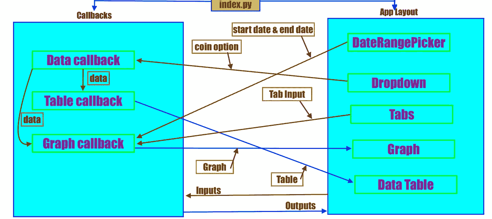
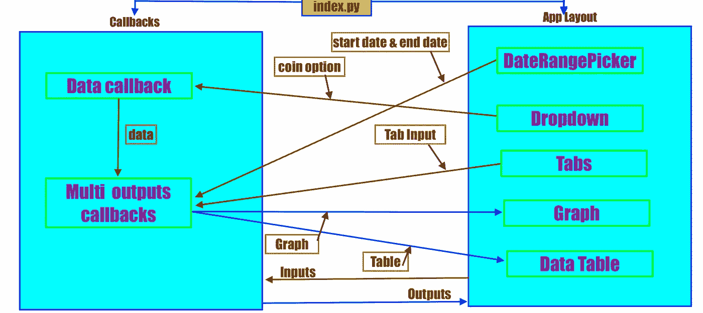
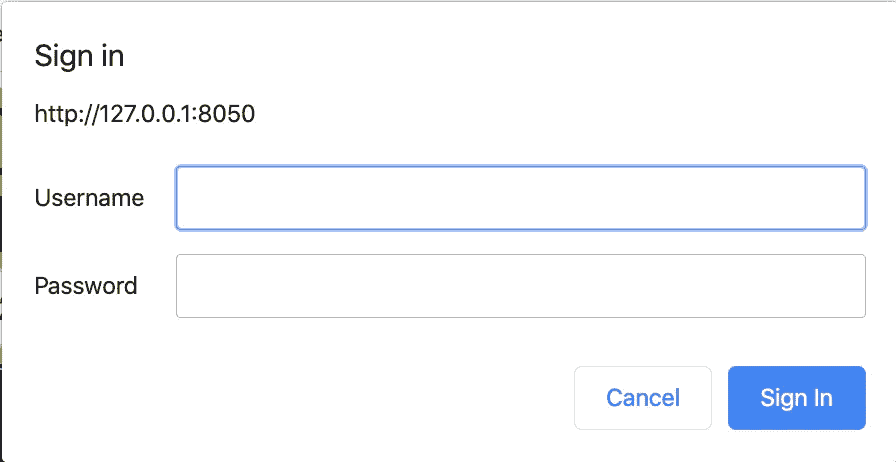

# 使用 Plotly 的 Dash 构建仪表板应用程序:从初学者到专业人员的完整指南

> 原文：<https://medium.com/analytics-vidhya/building-a-dashboard-app-using-plotlys-dash-a-complete-guide-from-beginner-to-pro-e7657a4eb707?source=collection_archive---------0----------------------->


[**观富士山**](https://en.wikipedia.org/wiki/Mount_Fuji) (3776 米)来自 [**库莫多里**](https://en.wikipedia.org/wiki/Mount_Kumotori) (2017 米)。

## 使用 Dash 构建交互式仪表盘应用并将其部署到 Heroku 的完整指南，第 2 部分:回调、认证和 Heroku 部署

在第 1 部分中，我们学习了如何从 dash 开始，添加 Dash 组件，改进图形布局，以及定义回调。在第 2 部分中，我们将学习**如何添加多个标签，在回调之间共享数据，编写多输出回调，进行用户认证，以及将应用程序部署到 Heroku。**

我将从我们在第 1 部分离开的地方开始。如果您错过了第 1 部分，请阅读它。

[](/analytics-vidhya/building-a-dashboard-app-using-plotlys-dash-complete-guide-beginner-to-pro-part-1-61e890bdc423) [## 使用 Plotly 的 Dash 构建仪表板应用程序-初学者到专业版完全指南第 1 部分

### 使用 Dash 构建交互式仪表板应用程序并将其部署到 Heroku 仪表板的完整指南可以生成数据…

medium.com](/analytics-vidhya/building-a-dashboard-app-using-plotlys-dash-complete-guide-beginner-to-pro-part-1-61e890bdc423) 

# 仪表板应用程序

## 7.**标签页和回调之间的数据共享**

假设我们想为给定的加密货币制作不同价格技术指标的图表。为此，我们将添加选项卡到我们的应用程序布局，并修改图形的`app.callback`，以便它返回所选选项卡的图表。

到目前为止，我们已经分别为表格和图形提取了数据。但是，为了节省时间和计算量，我们应该只为所有回调提取一次价格数据。所以我们需要在回调之间共享数据。为了使数据共享变得容易，我们将编写另一个`app.callback`，它将从下拉列表中获取输入，并给出一个 json 数据文件作为输出。此回调的输出将与其他回调共享。

7.1 **调整片**

我将在`app.layout`的图表上方添加标签。

```
tabs_styles = {
    'height': '51px'
}
tab_style = {
    'borderBottom': '1px solid #d6d6d6',
    'padding': '2px',
    'fontWeight': 'bold'
}

tab_selected_style = {
    'borderTop': '1px solid #d6d6d6',
    'borderBottom': '1px solid #d6d6d6',
    'backgroundColor': 'black',
    'color': 'yellow',
    'padding': '10px'
}
dcc.Tabs(id="all-tabs-inline", value='tab-1', children=[
            dcc.Tab(label='Simple Moving Average', value='tab-1', style=tab_style, selected_style=tab_selected_style),
            dcc.Tab(label='Volatility Index', value='tab-2', style=tab_style, selected_style=tab_selected_style),
            dcc.Tab(label='Relative Strength Index', value='tab-3', style=tab_style, selected_style=tab_selected_style),
            dcc.Tab(label='Moving Average Divergence Convergence', value='tab-4', style=tab_style, selected_style=tab_selected_style),
            dcc.Tab(label='Exponential Moving Average', value='tab-5', style=tab_style, selected_style=tab_selected_style),
            dcc.Tab(label='Bollinger Bands', value='tab-6', style=tab_style,
                    selected_style=tab_selected_style),
        ], style=tabs_styles,
            colors={
            "border": "yellow",
            "primary": "red",
            "background": "orange"
            }),
```

我为 6 个指示器添加了 6 个抽头。在上面的代码中，`tab_style`、`tab_selected_style`和`tabs_styles`是常规标签外观、选择后标签外观和标签行外观的预定义样式。


制表符

**7.2 数据**

我们需要数据来创建图表和数据表。我们将使用`[**PriceIndices**](https://github.com/dc-aichara/PriceIndices)` python 包获取价格数据，计算技术指标。让我们编写一个脚本(`data.py`)来获取`dashboard_demo`目录中的数据。

data.py

会给我们一个熊猫数据框架，其中有图表所需的所有数据。

**7.3 回调和数据共享**

我们添加一个新的回调来获取数据。

*   数据回调

```
# import get_coin_data function from data.py
from data import get_coin_data @app.callback(Output('intermediate-value', 'children'),
              [Input('dropdown', 'value')])
def get_data(option): # option from drop down 
    df = get_coin_data(crypto=option, save_data=True)
    return df.to_json(date_format='iso', orient='split')
```

现在修改数据表回调和图形回调。

*   数据表回调

```
@app.callback(Output('table-output', 'children'), 
              [Input('intermediate-value', 'children')])
def get_data_table(data):
    df = pd.read_json(data, orient='split')
    df['date'] = pd.to_datetime(df['date'])
    data_table = dash_table.DataTable(
        id='datatable-data',
        data=df.to_dict('records'),
        columns=[{'id': c, 'name': c} for c in df.columns],
        style_table={'overflowY': 'scroll'},
        fixed_rows={'headers': True, 'data': 10},
        style_cell={'width': '100px'},
        style_header={
            'backgroundColor': 'rgb(230, 230, 230)',
            'fontWeight': 'bold'
        }
    )
    return data_table
```

*   图形回调

图形回调

**数据表和图形回调共享来自数据回调的数据。数据回调的输出被用作数据表和图形回调的输入。**图形回调函数根据选项卡选择制作图形。有些图形有两个 y 轴，以获得更好的图形外观。`yaxis2`定义第二个 y 轴的样式。我在下面的流程图中解释了应用程序的工作流程。



流程图-2

刷新应用页面以查看我们所做的更改。也尝试不同的硬币，日期范围和标签，看看他们如何改变结果。

## 8.多输出回调

到目前为止我们有 3 次试镜。制作一个数据表和图形回调的单个`app.callback`来给出多个输出怎么样？听起来很酷？让我们开始吧。

我们将结合图形和数据表回调，这将给出两个输出:图形和数据表。我们也可以结合其他两个数据回调，但如果我们这样做，数据将是每个标签或日期范围或硬币选择的请求。我们应该只为硬币选择和硬币输入更改请求一次数据。

多输出回调

> 注意:如果我们在`app.callback"`中把输出放在一个列表中，回调函数必须返回一个输出列表。

流程图 3 解释了组合两个回调后的输入和输出流程。



流程图-3

## **9。用户认证**

Dash 通过一个单独的 python 包`dash-auth`提供用户认证。`dash-auth`提供两种认证方式: **HTTP 基本认证**和 **Plotly OAuth** 。

**9.1 HTTP 基本认证**

HTTP 基本身份验证是 web 上最简单的身份验证形式之一，但它有一些限制。

*   用户不能注销应用程序
*   您有责任通过安全通道将用户名和密码发送给您的观众
*   您的观众不能创建自己的帐户，也不能更改他们的密码
*   您负责在代码中安全地存储用户名和密码对。

我们需要在 HTTP 基本身份验证的源代码中添加用户和密码。我会在“app.py”中添加 HTTP 基本 Auth 代码。建议将用户和密码详细信息保存在单独的文件中。

```
import dash
import dash_auth
external_stylesheets = ['https://codepen.io/chriddyp/pen/bWLwgP.css']
app = dash.Dash(__name__, external_stylesheets=external_stylesheets)
server = app.server
app.config.suppress_callback_exceptions = True

VALID_USERNAME_PASSWORD_PAIRS = {
    'dash_demo': 'dash@demo'
}

auth = dash_auth.BasicAuth(
    app,
    VALID_USERNAME_PASSWORD_PAIRS
)
```

当我们重新运行或刷新应用程序页面时，会出现一个身份验证弹出窗口。我们只需认证应用一次。



身份验证弹出窗口

**9.2 Plotly OAuth**

Plotly Auth 需要付费 Plotly 订阅帐户。Plotly 0Auth 通过注册的在线 Plotly 帐户或通过公司的 [Plotly 企业服务器](https://plot.ly/products/on-premise)提供认证。

请看这里的例子。

 [## 证明

### 编辑描述

dash.plot.ly](https://dash.plot.ly/authentication) 

**10。登录和注销按钮**

在这一节中，我将演示如何使用登录和注销按钮进行身份验证。我们可以通过用户认证来保护回调的输出。

> 继续之前，请从“app.py”中删除 HTTP 基本身份验证。

按照下面写的步骤，用登录和注销按钮实现身份验证。

**一、在** `**dashboard_demo**` **目录下创建一个“user.py ”,包含用户和密码。**

```
user_pwd = {'dash': 'dash@123',
            'dash1': 'dash1@123',
            }
user_names = {'dash': 'User1, welcome to the crypto indicators dashboard',
              'dash1': 'User1, welcome to the crypto indicators dashboard',
              }

def users_info():
    return user_pwd, user_names
```

**二。写登录路线**

登录路由验证用户和密码组合，并根据身份验证结果重定向到 url。

```
import flask
from users import users_info
user_pwd, user_names = users_info()
_app_route = '/'# Create a login route
@app.server.route('/login', methods=['POST'])
def route_login():
    data = flask.request.form
    username = data.get('username')
    password = data.get('password')

    if username not in user_pwd.keys() or  user_pwd[username] != password:
        return flask.redirect('/login')
    else:

        # Return a redirect with
        rep = flask.redirect(_app_route)

        # Here we just store the given username in a cookie.
        # Actual session cookies should be signed or use a JWT token.
        rep.set_cookie('custom-auth-session', username)
        return rep
```

**三。定义一个登录表单**

```
# Simple dash component login form.
login_form = html.Div([
    html.Form([
        dcc.Input(placeholder='username', name='username', type='text'),
        dcc.Input(placeholder='password', name='password', type='password'),
        html.Button('Login', type='submit')
    ], action='/login', method='post')
])
```

**四。在 DateRangePicker** 前的 `app.layout` **添加按钮**

```
html.Div(id='custom-auth-frame'),
html.Div(id='custom-auth-frame-1',
           style={
                  'textAlign': 'right',
                  "background": "black",
           }
           ),
```

**五、创建注销路径**

当用户单击注销按钮时，注销路由重定向到登录页面。

```
# create a logout route
@app.server.route('/logout', methods=['POST'])
def route_logout():
    # Redirect back to the index and remove the session cookie.
    rep = flask.redirect('/login')
    rep.set_cookie('custom-auth-session', '', expires=0)
    return rep
```

六。编辑多输出回调

多输出回调

这个更新的回调将基于身份验证结果产生三个输出。回调函数将验证用户和密码组合，如果验证失败，将重定向到登录页面，否则将显示图形和数据表。我们将在回调函数中编写 **LogoutButton** 。

我们的应用程序现在有密码保护。让我们参观一下我们到目前为止所建造的东西。

仪表板参观视频。

一切看起来都很好。根据您的要求，Dash 可以为您做很多事情。在这里 阅读更多用例及教程 [**。**](https://dash.plot.ly/?_ga=2.104688649.828752419.1574214165-1322431847.1545115553)

## 11.部署到 Heroku

> **免责声明:**下面写的程序是在 MacBook Pro 上测试的。它应该在 Linux 上运行良好，但在 Windows 上可能无法运行。请按照这里的窗口说明:[https://devcenter.heroku.com/articles/heroku-cli](https://devcenter.heroku.com/articles/heroku-cli)

按照下面编写的过程将 Dash 应用程序部署到 Heroku。

一、 [**注册一个免费的 Heroku 账号**](https://signup.heroku.com/login) 。

**二。**在 mac 或 linux 上用`brew tap heroku/brew && brew install heroku` 安装 **Heroku 命令行界面(CLI)** 。

**三**。用`git init`命令启动 GitHub 存储库。

**四。**将`Procfile`和`.gitignore`文件写入`dashboard_demo`目录，如下图。

`Procfile`

```
web: gunicorn index:server
```

`.gitignore`

```
*.pyc
.DS_Store
```

您的`dashboard_demo`目录应该如下所示。

```
dashboard_demo
|--.gitignore
|--app.py
|--index.py
|--Procfile
|--requirements.txt
|--users.py
```

使用`**heroku login**` 命令通过 CLI 登录 Heroku，运行以下命令创建并部署 app。

```
$ heroku create dash-app-name # change dash-app-name to a unique name
$ git add . # add all files to git
$ git commit -m 'Initial app commit'
$ git push heroku master # deploy code to heroku
$ heroku ps:scale web=1  # run the app with a 1 heroku "dyno"
```

现在，您可以在[https://](https://my-dash-app.herokuapp.com)dash-app-name[. heroku app . com](https://my-dash-app.herokuapp.com)上看到您的应用。

我在 Heroku 上创建了一个名为`crypto-indicators-dashboard`的应用程序。这是我们在本教程(第 1 部分和第 2 部分)中创建的同一个应用程序。

 [## 破折号

### 加密货币指示器仪表板

crypto-indicators-dashboard.herokuapp.com](https://crypto-indicators-dashboard.herokuapp.com/) 

不及物动词如果您对代码进行了任何更改，请执行以下操作来更新应用程序。

```
$ git add . # add changes
$ git commit -m 'change description'
$ git push heroku master # push to heroku
```

如果您遵循了所有的步骤，现在您应该能够构建 app 并将其部署到 Heroku。您可能会遇到部署错误，因此尝试先部署简单的应用程序。还可以使用`heroku logs --tail`命令检查最近的应用程序日志，以检查应用程序/代码错误。

你可以用 Dash 做很多事情。你可以在同一个页面上有多个图表，有子标签，装饰特定值的数据表，制作一个数据表下载按钮等。对于本教程，我只想制作一个仪表板，显示给定日期范围和加密货币的价格指标图表。

## 摘要

*   首先了解和理解你对 dashboard 的需求。
*   用简单的布局和回调来启动应用程序。
*   逐个添加 dash 组件和回调。
*   添加或删除后，刷新本地主机上的应用程序页面以查看更改。
*   为应用程序、索引、数据、用户等编写单独的代码，以便于调试和理解。
*   尝试不同的风格和应用程序布局，以获得更好的外观。
*   在回调之间共享数据，并使用多个输出回调。
*   部署前在本地测试应用程序。
*   首先部署一个简单的应用程序，然后进行扩展。

让我知道你对 Dash 的第一次体验。😉

你可以在 [**Github**](https://github.com/dc-aichara/DS-ML-Public/tree/master/Medium_Files/dashboard_demo) 上找到这个 app。

感谢您的阅读！😊

我随时准备回答您的问题，请通过 [**、LinkedIn**](https://www.linkedin.com/in/dcaichara/) 或 [**Twitter** 联系我。](https://twitter.com/dc_aichara)

> 如果你想在你的 Dash 应用程序中添加谷歌分析跟踪、favicon、自定义 CSS 文件等，请阅读第 3 部分。

[](/game-of-data/building-a-dashboard-app-using-plotlys-dash-favicon-google-analytics-custom-css-75f7a1e95a88) [## 使用 Plotly 的 Dash 构建仪表板应用程序:Favicon、Google analytics、自定义 CSS

### 第三部分:如何给 Dash App 添加 App favicon，App title，App description，Google Analytics，自定义 CSS 文件？

medium.com](/game-of-data/building-a-dashboard-app-using-plotlys-dash-favicon-google-analytics-custom-css-75f7a1e95a88) 

参考资料/资源:

1.  [https://dash.plot.ly/?_ ga = 2.11360766-132243553](https://dash.plot.ly/?_ga=2.113607566.828752419.1574214165-1322431847.1545115553)
2.  [https://plot.ly/dash/](https://plot.ly/dash/)
3.  [https://towards data science . com/how-to-build-a-complex-reporting-dashboard-using-dash-and-plotl-4f 4257 c 18 a 7 f](https://towardsdatascience.com/how-to-build-a-complex-reporting-dashboard-using-dash-and-plotl-4f4257c18a7f)
4.  [https://devcenter.heroku.com/articles/heroku-cli](https://devcenter.heroku.com/articles/heroku-cli)