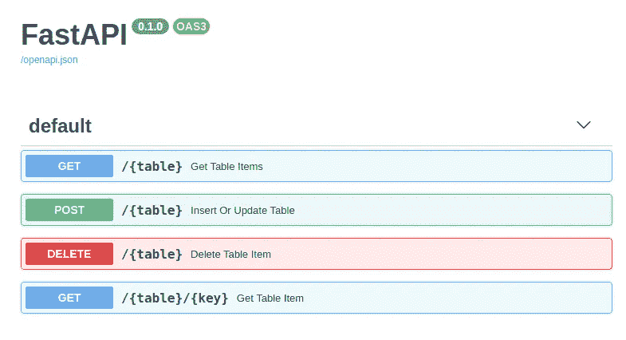
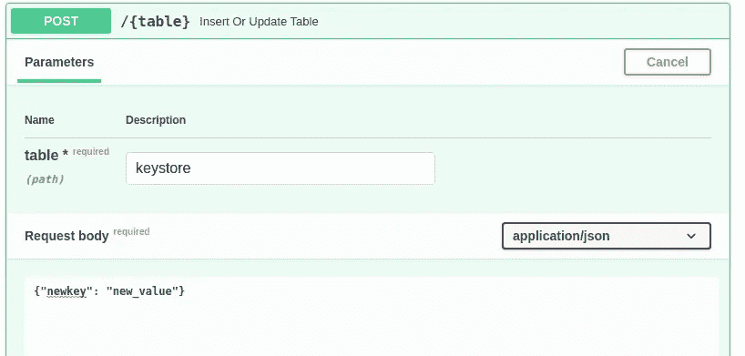
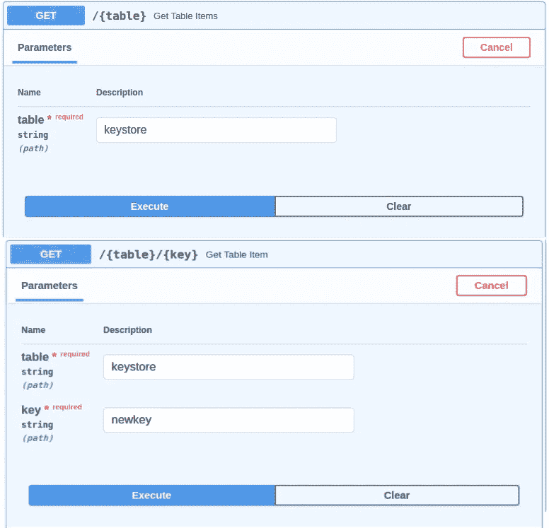
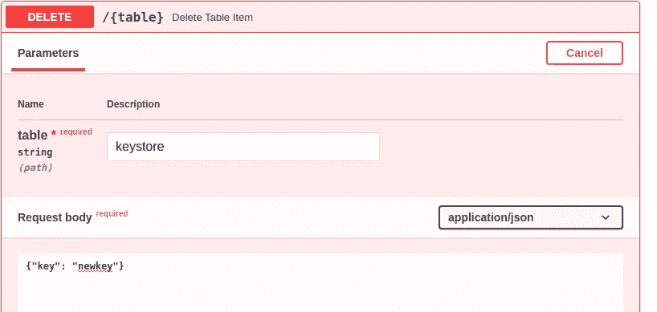
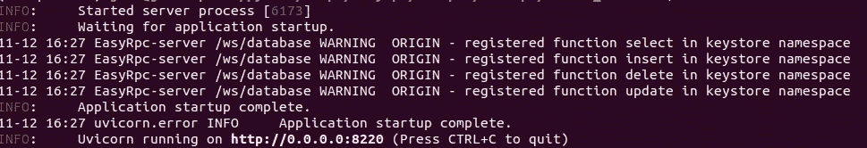
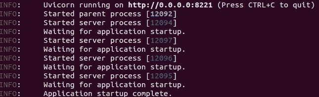

# 用 Python 构建数据库 REST API

> 原文：<https://medium.com/analytics-vidhya/building-a-database-rest-api-with-python-ab3d8c2354ff?source=collection_archive---------6----------------------->



在本文中，我将在尽可能短的时间内为数据库构建一个 REST API。

快速构建 API 可能很重要，但 API 的性能也很重要。出于这个原因，将使用 [FastAPI](https://fastapi.tiangolo.com/) 结合[uvicon](https://github.com/encode/uvicorn)、 [easyrpc](https://github.com/codemation/easyrpc) 和 [aiopyql](https://github.com/codemation/aiopyql) 来构建 API，用于处理请求、数据库访问和缓存。

对于本文，可以使用 python 3.7 或更高版本，这是上述包所需的最低版本。

创建并激活 python 环境。

```
$ virtualenv -p python3.7 db-api
$ source db-api/bin/activate
```

安装我们的依赖

```
(db-api)$ pip install easyrpc aiopyql
```

API 将由两层构成:

*   数据库访问层:数据库访问和缓存
*   API 访问层:处理客户端 API 请求

这通常会耦合到一个单独的层中，但其好处将在下面解释。

# 数据库层

```
server = FastAPI()
```

FastAPI()实例服务器参考是 API 层中用于客户端请求的主要 URL 路由器，也是数据库层中用于 EasyRpcServer 的 Websocket 路由器。

```
@server.on_event('startup')
```

FastAPI on_event 提供了两个有用的钩子，用于在应用程序启动时执行安装/拆卸。on_event(启动|关闭)

```
# Rpc Server    
rpc_server = await EasyRpcServer.create(
    server, 
    '/ws/database', 
    server_secret='abcd1234'
)
```

EasyRpcServer.create 是一个类工厂方法，它返回一个 EasyRpcServer()实例:使用我们的 FastAPI 服务器、web-socket 路径(其中 ASGI 服务器将接受 Websocket 协商)、server _ secret(EasyRpcProxy 将用于连接的密码)以及可选的 encryption_enabled=True|False。

EasyRpcServer 引用 rpc_server 将用于在名称空间中注册我们的数据库函数，该名称空间将与连接的 EasyRpcProxies 共享——稍后将详细介绍。

```
db = await Database.create(
    database='easy_db',
    cache_enabled=True
)
```

Database.create 是一个工厂方法，它使用 database=name，cache_enabled=True|False 返回 Database()实例。默认的数据库类型是 sqlite，因此需要最少的参数。详见 [aiopyql](https://github.com/codemation/aiopyql) 。

这里使用 aiopyql 是因为它的简单性、对 asyncio 的支持以及缓存特性，这些特性在证明 API /数据库层分离时非常有用。使用的模式可以转换成任何共享数据库访问的 ORM。

```
# Table Creation    
if not 'keystore' in db.tables:        
    await db.create_table(
        'keystore',            
        [
          ('key', str, 'UNIQUE NOT NULL'),
          ('value', str)
        ],
        prim_key='key',            
        cache_enabled=True
     )
```

我们的数据库()实例“db”自动发现表模式(如果存在的话)并在 db.tables 中创建一个 table()对象。

通过上面的检查，用一个非常简单的键值 schama 创建了一个名为“keystore”的表。这可以被认为是持久性 python 字典——具有缓存的额外好处。

```
server.data = {'keystore': db}
```

数据库实例引用存储在我们的 FastAPI 路由器中，这是清理步骤所需要的。

```
# register each table method in table namespace 
for table in db.tables:
    for func in {'select', 'update', 'insert', 'delete'}:
        rpc_server.origin(
            getattr(db.tables[table], func), namespace=table)
server.db_server = db_server
```

db.tables 中的每个 Table()实例都包含选择、更新、插入和删除方法。

对于每个函数，EasyRpcServer()实例。使用函数引用和 namespace=table_name 调用 origin 方法。

如果有不止一个表，上面的例子将在一个与表名匹配的名称空间中注册这些方法。

注册实际上是做什么的？

register 方法“dictionarifies”函数元数据，并将其存储在名称空间中。所谓元数据，我指的是用于调用方法的所有东西(参数、参数类型、方法名)。

EasyRpcProxy 实例使用此函数元数据来“镜像”代理函数，并验证正确的输入。

```
[@server](http://twitter.com/server).on_event('shutdown')
async def shutdown():
    await server.data['keystore'].close()
```

内务关闭方法允许我们的实例优雅地清理。

# API 层

```
from fastapi import FastAPI
from easyrpc.proxy import EasyRpcProxy
```

就像我们的数据库层一样，FastAPI 路由器将用于客户端 API 请求。用于访问我们的数据库层。

```
[@server](http://twitter.com/server).on_event('startup')
async def setup():

    server.data = {}
    server.data['keystore'] = await EasyRpcProxy.create(
        '0.0.0.0', 
        8220, 
        '/ws/database', 
        server_secret='abcd1234',
        namespace='keystore'
    )
```

在 startup on_event 中，在 FastAPI 路由器实例中创建一个数据字典，然后使用主机地址、端口、目标 websocket 路径、密码和与数据库层 EasyRpcServer 对应的名称空间创建一个 EasyRpcProxy()实例。

启动时，EasyRpcProxy()实例将联系目标 EasyRpcServer，并在指定的名称空间中创建所有已注册函数的代理。

[aiopyql](https://github.com/codemation/aiopyql) 表方法接受完全 JSON 可序列化的输入，从而使函数完全符合 EasyRpcProxy->EasyRpcServer 函数调用约束。

## 插入和更新



```
[@server](http://twitter.com/server).post("/{table}")
async def insert_or_update_table(table, data: dict):
    for key, value in data.items():
        exists = not (await server.data['keystore']['select']('*', where={'key': key}) == [] )
        if exists:
            await server.data['keystore']['update'](
                value=value,
                where={'key': key}
            )
        else:
            await server.data['keystore']['insert'](
                key=key,
                value=value
            )
```

[@服务器](http://twitter.com/server)。post("/{table} ")接受表名的文本输入，以及包含我们的插入或更新的字典。

在决定这是否是插入/更新操作之前，检查主键的存在。

插入/更新方法的行为就像它们是本地的一样，从语法上验证参数输入

## 选择



```
[@server](http://twitter.com/server).get("/{table}")
async def get_table_items(table: str):
    return await server.data['keystore']['select']('*')[@server](http://twitter.com/server).get("/{table}/{key}")
async def get_table_item(table: str, key: str):
    return await server.data['keystore']['select'](
        '*', 
        where={'key': key}
    )
```

下面是访问存储数据的两种实现。get_table_items 发出 select(*)，返回所有键值。get_table_item 发出带有 where 子句的 select(*)命令

## 删除



```
[@server](http://twitter.com/server).delete("/{table}")
async def delete_table_item(table: str, where: dict):
    return await server.data['keystore']['delete'](where=where)
```

该方法接受提供的表名和 where 子句{'col': 'value'}，能够删除一个或多个匹配的表行。

# 启动实例

首先启动数据库层实例

```
(db-api)$ uvicorn --host 0.0.0.0 --port 8220 db_api_database:server
```



然后用可选的 workers 参数启动 API 层实例:

```
(db-api)$ uvicorn --host 0.0.0.0 --port 8221 db_api:server --workers 5
```



要进行测试，请在浏览器中打开[**http://0 . 0 . 0 . 0:8221**](http://0.0.0.0/8221)**/docs/**。

每个创建的 uvicorn worker 对应于一个 API 层代码的独立版本。

uvicorn 工作人员不能够直接相互通信，但是在这种架构中，共享相同的数据库连接、函数和缓存。

当一个工作者通过一个客户机 REST 请求进行修改或访问数据时，就会加载缓存(如果启用的话)，所有的 uvicorn 工作者都会受益。

如果没有这种分层分离，每个 uvicorn worker 都可以创建自己的数据库连接，但是如果同一个数据库被另一个 worker 访问，就不应该使用缓存。

许多数据库可以支持多个连接，但是如果进程不能传递更改，则很少缓存层是可信的。

有了 [FastAPI](https://fastapi.tiangolo.com/) ，开发者可以快速有效地创建同样易于使用的 API。

使用 [aiopyql](https://github.com/codemation/aiopyql) ，对数据库的访问是很简单的，而且有了缓存和查询队列，访问速度很快。

[EasyRpc](https://github.com/codemation/easyrpc) 允许简单的扩展/共享功能，并且可以有效地允许一个应用的多个子代共享状态、连接等等。