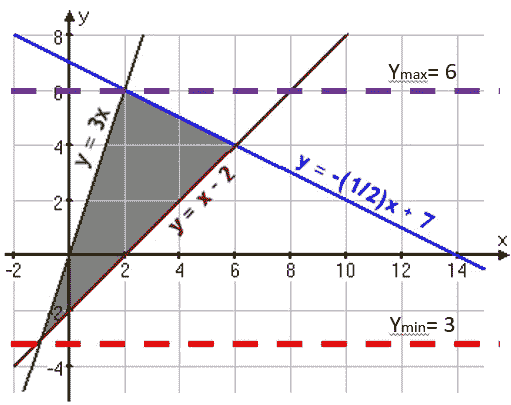

# 用 Python 纸浆构建资本预算的决策支持工具

> 原文：<https://medium.com/analytics-vidhya/building-a-decision-support-tool-for-capital-budgeting-with-python-pulp-f56785f6668e?source=collection_archive---------5----------------------->

# **汇总**

*像线性规划这样的优化技术通常仍然是许多决策支持系统背后的可靠工作。不幸的是，与花哨的机器学习算法相比，它们往往没有得到应有的重视。在本文中，我们将了解线性规划应用于资本预算优化问题的基本原理，以及如何使用线性规划的 Python 库*来优化资本预算

# 概述


来源:阿拉米股票照片

1.  [**什么是资本预算？**](#49bf)
2.  [什么是线性/整数规划？](#21f4)
3.  [**优化纸浆项目组合的资本预算**](#eef4)
4.  [**结论**](#698f)
5.  [T21 更多资源](#5098)

# **1 什么是资本预算？**


图像来源:Dreamstime.com 股票照片

“资本预算”问题是许多组织面临的一种情况，即有一长串的项目要完成，但有限的预算(或其他资源，如人力)限制了项目的执行。

[](https://www.investopedia.com/articles/financial-theory/11/corporate-project-valuation-methods.asp) [## 资本预算导论

### 资本预算包括选择能为公司增加价值的项目。资本预算过程可能涉及…

www.investopedia.com](https://www.investopedia.com/articles/financial-theory/11/corporate-project-valuation-methods.asp) 

因此，面临的挑战是如何在这些稀缺资源下的项目组合中做出“最佳”选择，以使公司价值最大化

# 2 什么是线性/整数规划？

有许多优化资本预算流程的方法，但线性规划应用起来相对直接，理解起来也比较直观。

如果变量之间的关系(即≤ , ≥ , =)本质上是线性的(即 X + Y = Z，而不是 X + Y = Z，这将是非线性的)，则线性规划是一种可用于解决优化问题的技术

[](https://www.analyticsvidhya.com/blog/2017/02/lintroductory-guide-on-linear-programming-explained-in-simple-english/) [## (有抱负的)数据科学家线性规划入门指南

### 引言优化是生活的方式。我们都有有限的资源和时间，我们想充分利用…

www.analyticsvidhya.com](https://www.analyticsvidhya.com/blog/2017/02/lintroductory-guide-on-linear-programming-explained-in-simple-english/) 

例如，如下所示——如果目标是最大化/最小化“y”变量，则需要做的就是上下移动一条直线，并读取与灰色三角形相交的 y 坐标(y max = 6 或 y min = 3)



图像来源:[http://www.purplemath.com/modules/linprog.htm](http://www.purplemath.com/modules/linprog.htm)

二进制整数线性规划是线性规划的特例，其中决策变量被约束为 1 或 0，并且是可用于“解决”资本预算优化问题的主要方法

# 3 使用 Python PuLP 优化资本预算

如果您想继续学习，可以通过以下链接获得源代码和输入文件:

[](https://github.com/ZhijingEu/Optimizing_Capital_Budgeting_With_ILP_Methods/tree/master/PreviewArticle) [## ZhijingEu/Optimizing _ Capital _ Budgeting _ With _ ILP _ Methods

### 这是一个包含示例脚本和文件的存储库，附带了一个 Youtube 视频系列和一篇关于如何…

github.com](https://github.com/ZhijingEu/Optimizing_Capital_Budgeting_With_ILP_Methods/tree/master/PreviewArticle) 

## **3.1 为什么选择 Python？**

你们中的一些人可能熟悉 Excel 的规划求解加载项，它是一种提供建模优化问题的简单方法的工具。

[](https://support.microsoft.com/en-us/office/load-the-solver-add-in-in-excel-612926fc-d53b-46b4-872c-e24772f078ca) [## 在 Excel 中加载规划求解加载宏

### 在 Excel 2010 和更高版本中，转到文件>选项注意:对于 Excel 2007，请单击 Microsoft Office 按钮，然后单击…

support.microsoft.com](https://support.microsoft.com/en-us/office/load-the-solver-add-in-in-excel-612926fc-d53b-46b4-872c-e24772f078ca) 

然而，使用电子表格运行优化模型存在许多问题:

*   电子表格将数据模型和规划求解模型的逻辑“耦合”在一起——虽然这有时对临时建模很方便，但这会*限制跨大型数据集推广模型的能力*,因为“逻辑”与数据的外观紧密相关
*   与拥有更强大版本控制工具如 Git 或 SVN 的*编程代码不同，对电子表格的修订管理是有限的，这使得出错的可能性更大，尤其是当多方在同一个模型上工作时(除了求解器插件之外还使用 VBA 代码，这使得事情变得更加混乱，这也并不罕见)*
*   电子表格(通常)是“独立”的工具，而像 Python 这样的编程语言可以让你在数据库或可视化工具之间来回移动信息


图片来源:[https://www.decusoft.com/nightmare-on-spreadsheet/](https://www.decusoft.com/nightmare-on-spreadsheet/)

因此，代替 Excel，我们将使用 [PuLP](https://coin-or.github.io/pulp/index.html) 一个用于线性编程的 Python 编程库来对问题建模。


[https://coin-or.github.io/pulp/index.html](https://coin-or.github.io/pulp/index.html)

## 3.2 问题描述

一家公司有 5 个潜在项目，每个项目都有单独的资本支出成本阶段和净现值估算，如下所示:


必须在这些限制条件下选择最大化总 NPV 的项目入围名单

a)每年分别需要满足 1000 万、1000 万和 600 万的 3 年资本支出阈值

b)项目 1 和 2 互为条件，即要么一起选择，要么根本不选择

c)项目 3 和项目 5 是互斥的，即不能一起选择(尽管也可以两者都不选择)

## **3.3。将问题转化为关系**

这个**【决策变量】**就是我们要解决的。这里是所有 5 个项目的选择状态，我们可以将其建模为 a list = [ StatusProject1，StatusProject2，…，StatusProject5]其中每行为 1(是)或 0(否)


我们试图最大化的**【目标】**是 NPV，所以它只是每个项目的选择状态的总和乘以每个项目的 NPV。(即上表中的黄色单元格)

```
Total NPV = SUM ( [Selection Status] X [NPV] For Each Project)
```

**约束条件**:对于约束条件(a)，情况类似，即第 1 年、第 2 年和第 3 年的资本支出总和乘以选择状态(蓝色单元格)，选择状态必须小于年度限额(绿色单元格)

```
Total Selected CAPEX Yr 1 = 
              SUM ([Selection Status]X[CAPEX Yr 1] For Each Project)...and so on for Yr 2 , 3 
```

对于约束(b ),它是这样处理的

```
Selection Status[Project1] = SelectionStatus[Project2]
```

因为这意味着它们总是要么被选择，要么不被一起选择

和约束(c)

```
Selection Status[Project3] + SelectionStatus[Project5] <= 1
```

因为这意味着要么两者都没有被选择，所以 0+0 ≤ 1，要么两者中只有一个可以“开”，所以 0+1 ≤ 1 或 1+ 0 ≤ 1，它们是互斥的

## **3.4。用 Python 纸浆代表问题**


不是我——尽管我希望我有 3 个屏幕(来源:Dreamstime.Com 股票图片)

完整的代码如下

步骤 1 和 2 很简单，因为它只是加载库并将数据放入 Python。

```
#Step 1 : Import Libraries
import pandas as pd
import numpy as np
import pulp#Step 2: Load Data for Project List and Yrly CAPEX Limits
proj_list= 
    pd.read_csv('Example1_ProjList.csv', index_col=['ID']).fillna(0)capexconstraints=
    pd.read_csv('Example1_AnnualCAPEX.csv')['CAPEX'].values.tolist()
```

第 3 步开始变得有点有趣，因为我们开始构建所有互斥项目对、偶发项目等的列表。这将是我们以后要利用的东西…

```
#Step 3: Build Sub-Lists Of Projects With Dependency Relationshipsrelationships=proj_list[['Relationship','RelationshipProjID']].dropna(thresh=2)
relationships['RelationshipProjID2']=relationships.indexMutuallyExclusive=relationships.loc[relationships['Relationship'] == 'Mutually_Exclusive'].sort_values(['RelationshipProjID2'])
MutuallyExclProjectsList=list(set(map(lambda x: tuple(sorted(x)),[[i , j] for i, j in zip(MutuallyExclusive['RelationshipProjID2'].values.tolist(), MutuallyExclusive['RelationshipProjID'].values.tolist())])))Contingent=relationships.loc[relationships['Relationship'] == 'Contingent'].sort_values(['RelationshipProjID2'])
ContingentProjectsList = list(set(map(lambda x: tuple(sorted(x)),[[i , j] for i, j in zip(Contingent['RelationshipProjID2'].values.tolist(), Contingent['RelationshipProjID'].values.tolist())])))Mandatory=relationships.loc[relationships['Relationship'] == 'Mandatory'].sort_values(['RelationshipProjID2'])
MandatoryProjectsList = Mandatory['RelationshipProjID2'].values.tolist()
```

在步骤 4-5 中，实际纸浆代码和过程是相似的，其中决策变量和目标被定义。

```
# Step 4: Create A Modelphasing = pulp.LpProblem("Maximise", pulp.LpMaximize)Selection = pulp.LpVariable.dicts("Selection", proj_list.index, cat='Binary')# Step 5 : Set The Objective Function                                                                                                         
phasing += pulp.lpSum(Selection[idx]*proj_list.loc[idx]["NPV"] for idx in proj_list.index)
```

第 6 步是最有趣的一步，因为代码使用 Python 编程的强大功能迭代约束，而不是逐行定义每个约束…

例如，对于互斥项目，代码并不明确表示选择状态[项目 3] +选择状态[项目 5] = 1，而是使用互斥项目的列表，并将这些项目对传递到一个循环中以分配关系。

```
# Step 6 : Set The Constraints#Loop over the individual Years
for m in range(0,len(capexconstraints)):
    year=str(m+1)
    phasing += sum([Selection[idx] * proj_list.loc[idx]["CAPEX Yr"+year] for idx in proj_list.index]) <= capexconstraints[m]# Loop over for mutually exclusive projects
for i in range(0,len(MutuallyExclProjectsList)):
    phasing += Selection[MutuallyExclProjectsList[i][0]] + Selection[MutuallyExclProjectsList[i][1]] == 1

# Loop over contingent projects
for j in range(0,len(ContingentProjectsList)):
    phasing += Selection[ContingentProjectsList[j][0]] == Selection[ContingentProjectsList[j][1]]# Loop over mandatory projectsfor k in range(0,len(MandatoryProjectsList)):
    phasing += Selection[MandatoryProjectsList[k]] == 1# Step 7: Run The Solver(s)%time phasing.solve() #equivalent to phasing.solve(pulp.PULP_CBC_CMD()) as CBC is PulP's default solverpulp.LpStatus[phasing.status]# Print our objective function value and Output Solution
print (pulp.value(phasing.objective))
```

**PulP 运行求解算法后的最后一步是将数据输出为用户友好的格式。**

```
# Step 8 : Convert output into user friendly output for viewing or downloading 
outputtablecolumns=[]
outputtablecolumns.append('Selection Y/N')
for n in range(0,len(capexconstraints)):
    year=str(n+1)
    outputtablecolumns.append("CAPEX Yr"+year+" Selected")
outputtablecolumns.append('NPV Selected')pulpsolution=pd.DataFrame()
pulpsolution['Selection Y/N']= [Selection[idx].value() for idx in proj_list.index]for n in range(0,len(capexconstraints)):
    year=str(n+1)
    pulpsolution["CAPEX Yr"+year+" Selected"]= [Selection[idx].value()*proj_list.loc[idx]["CAPEX Yr"+year] for idx in proj_list.index]pulpsolution['NPV Selected']= [Selection[idx].value()*proj_list.loc[idx]["NPV"] for idx in proj_list.index]pulpsolutionpulpsolution.index += 1 
pulpsolutionpulpoutput = pd.concat([proj_list, pulpsolution], axis=1)
pulpoutputyearSumCapexColumns=[]
for p in range(0,len(capexconstraints)):
    year=str(p+1)
    yearSumCapexColumns.append("CAPEX Yr"+year+" Selected")
yearSumCapexColumnsCAPEX_Totals=[pulpsolution[yr].sum() for yr in yearSumCapexColumns]CAPEX_CheckSum= pd.DataFrame()
CAPEX_CheckSum['Year'] = np.arange(len(yearSumCapexColumns))+1
CAPEX_CheckSum['CAPEX Phasing'] = CAPEX_Totals
CAPEX_CheckSum['Constraints'] = capexconstraints
CAPEX_CheckSum['Budget Utilisation%'] = round(CAPEX_CheckSum['CAPEX Phasing']/CAPEX_CheckSum['Constraints'],2)*100print("Summary")
print()
print('Total NPV=', round(pulpsolution['NPV Selected'].sum(),2))
print()
print(len(pulpoutput.loc[pulpoutput['Selection Y/N'] == 1]), "out of" ,len(proj_list.index) ,"total projects submitted were shortlisted for execution" )
print()
print(CAPEX_CheckSum.to_string(index = False))print("Selected Projects")
print("-----------------")
pulpoutput.loc[pulpoutput['Selection Y/N'] == 1]print("Dropped Projects")
print("----------------")
pulpoutput.loc[pulpoutput['Selection Y/N'] == 0]
```

**在任何情况下，解决当前问题都会产生以下结果:**

****

**选择了项目 1、2、5**

****

**现在，这看起来不太像，但如果我们再次尝试，但有一个更长的 30 个项目和 4 年的资本支出阶段(而不是 3 年)，代码仍然能够发现最佳解决方案，而不需要对代码进行任何修改…**

****

**该表包含 30 个项目 X 4 年资本支出阶段，而之前的 5 个项目 X 3 年资本支出阶段**

****

## **3.5 到云和更远！**

****

**图片来源: [Getty Images](https://www.gettyimages.com/)**

**在上面的例子中，输入来自 CSV 文件，输出显示在 Python JupyterNotebook 文件中。**

**但是，可以使用 Python 直接从中央数据库(如 SAP 等)加载实时输入，并将输出发送到可视化工具(如 Power BI、Tableau 或其他仪表板)与他人共享。**

**由于这只是一个代码片段，它甚至可以由虚拟机托管和运行，以利用云计算资源(类似于一些机器学习模型的工作方式)**

**这对于资本预算可能没有意义，因为这通常与年度财务计划周期相关，但同样的整数/线性规划技术也经常用于调度、生产计划或库存管理(通常有数百甚至数千个变量，因此“求解”最优值在计算上变得更加困难)，这些都需要每周、每天甚至每小时的运营决策，而这种方法肯定会有所帮助。**

# **4.结论**

**希望通过上面的例子，我已经设法…**

*   **帮助您理解线性编程背后的基本思想**
*   **演示如何使用纸浆优化资本预算**
*   **围绕为什么编程语言应该是构建和维护复杂优化模型而不是电子表格求解器插件模型的首选方法，提出一些优点。**

# **5.更多资源**

**如果您对这个主题感兴趣，这实际上是一个更全面的教程系列的一部分，它更详细地介绍了资本预算问题和线性规划**

**[](/@zhijingeu/optimizing-capital-budgeting-using-linear-programming-tools-dfd1dec5a64d) [## 使用线性规划工具优化资本预算

### (Excel 解算器、Open Solver、Solver Studio、Python PulP / Pyomo、Frontline Systems 分析解算器)

medium.com](/@zhijingeu/optimizing-capital-budgeting-using-linear-programming-tools-dfd1dec5a64d) 

涉及的一些主题包括:-

*   如何为多个项目具有灵活开始日期的投资组合建模优化
*   如何对 NPV 或 CAPEX 估计不确定的项目组合进行优化建模
*   如何应用其他开源(免费！)除了 Excel Solver 和 Python PuLP 之外的建模工具，例如 Python [Pyomo](https://www.pyomo.org/) (用于非线性建模)、更高级的 Excel AddIns ( [Open Solver](https://opensolver.org/) 、 [Solver Studio](https://solverstudio.org/) )与商业工具如[Frontline System Analytic Solver](https://www.solver.com/)**