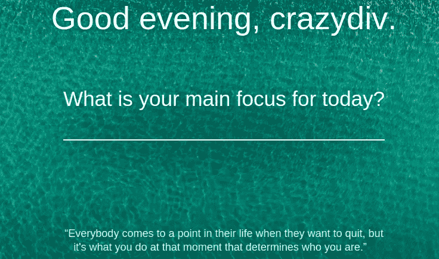

# 使用 GTK 和 Python 构建一个桌面应用程序来显示激励性名言——第一部分

> 原文：<https://medium.com/analytics-vidhya/building-a-desktop-app-using-gtk-and-python-to-display-motivational-quotes-part-1-81ec9e69eb1d?source=collection_archive---------13----------------------->

Ubuntu 工具提示正在运行

# 动机:

我有看书和励志名言的爱好。但是如果你像我一样，你也会读到一段很好的引言，然后把它忘掉。这是因为人类的思维方式(或者至少是我的思维方式)，我们需要重复。

> 正是肯定的重复导致了信念。一旦这种信念成为一种深刻的信念，事情就开始发生了。— **穆罕默德·阿里**

接下来，我开始探索各种已经存在的工具，它们可以帮助我在两者之间进行选择

*   新的激励名言
*   在 goodreads 上引用我已经读过并喜欢的书

首先，我使用 chrome 扩展 [Momentum](https://chrome.google.com/webstore/detail/momentum/laookkfknpbbblfpciffpaejjkokdgca?hl=en) 已经有一段时间了，它显示了一个新的标签，有一个漂亮的背景和一个报价。

Chrome 浏览器的新标签页中每天都有激励性的引语/短语

然而，我想要的东西有以下特点:

*   控制显示的内容
*   一些快捷方便的东西。就像一个键盘快捷键或一个鼠标点击！
*   一段时间后逐渐消失

因此，我开始寻找在 Ubuntu 桌面屏幕上显示数据的定制方式，看起来类似于通知弹出窗口或工具提示，而不是一个包含所有按钮的完整应用程序。

# 探索:

我已经使用过像 [Guake](http://guake-project.org/) 这样的终端，它有半透明的背景，也允许字体定制。我开始做关键词搜索，比如:

> 如何在 Ubuntu 中显示自定义通知？

## 通知-发送

我接触的第一个库是 Ubuntu 处理通知的方式，即 [notify-send](http://manpages.ubuntu.com/manpages/xenial/man1/notify-send.1.html) 。它还有一个 python 包装器。但是 API 是有限制的，如果文本更长，那么它会被自动截断并替换为省略号。这不是我要找的 UX。

Ubuntu 通知系统，我无法删除截断

在对 notify-send 进行了一段时间的试验并意识到存在限制之后，我转向了其他库，如 [zenity](https://help.gnome.org/users/zenity/2.32/zenity-usage.html.en) 和 [yfiton](https://github.com/yfiton/yfiton) 。

## Zenity

Zenity 是一个预装在 Ubuntu 中的极简对话创建器。它还支持超时，以便对话会在一定时间后自动关闭。

Zenity 解决了这个目的，但是没有魅力。

## Yfiton

通过 StackOverflow 和 AskUbuntu 搜索，我登陆了 Yfiton，这是一个 Java 内置的通知发送器。它也支持 slack 和 twitter 等渠道，但我的用例不需要这些。

y 信息通知示例

YFiton 的桌面通知程序正是我所需要的，但有一些限制。例如，左边的图标只能是信息/成功/警告/错误。这意味着，为了使用它，我必须修改它的源代码。在深入研究代码之后，我发现一些定制，比如[定制定位](https://docs.oracle.com/javase/8/javafx/api/javafx/geometry/Pos.html)在当前的实现中是不可能的。我花了足够的时间搜索其他的实现或库来帮助我实现我的目标。然后我想起来了:

> 除非你这样做，否则什么都不会起作用。——**玛娅·安杰洛**

## GTK

我的下一步是通过使用 Python 和跨平台用户界面开发工具包 [GTK](https://www.gtk.org/) 来尝试做这件事。考虑到我以前从未做过桌面应用程序开发，我不确定我是否愿意投入足够的时间来学习它。但是由于我一直在引用，我想起了下面的引用，这激励我尝试构建一个定制的应用程序。

> 活着吧，就像你明天就会死去一样。学习吧，就像你会永远活着一样。— **圣雄甘地**

# 实施:

GTK python 的 v0 实现

## 透明度和菜单栏删除:

有了 Guake 这样的终端，我知道应用程序有可能拥有半透明的背景。为了在 GTK 实现它，我从一个简单的例子[脚本](https://gist.github.com/fcwu/5794494)开始创建一个窗口并设计它的样式。然而，它没有工作，经过一些搜索，最终在一个[解决方案](https://discourse.gnome.org/t/top-level-window-transparency-in-newer-versions-of-gtk/2210)上。菜单栏删除原来是一个非常简单的标志`window.set_decorated(False)`

动作栏已移除

添加了透明度和 CSS 更改

## 文本显示和格式:

准备好样板文件后，下一步是浏览 GTK 的 python 文档。GTK 允许修改 CSS 样式，因此我很容易根据自己的需要进行修改。事实证明，它非常简洁、简单且易于理解(感觉像是无休止地搜索一些设置，比如缺少一个 ***最大宽度*** 属性)。创建标签的代码片段比预期的要短。

添加到文本的自动换行和居中对齐

## 自动超时:

我努力寻找一个解决方案，让弹出窗口自动关闭。然后我提醒自己:

> 完美是好的敌人——伏尔泰

最后，我使用了一个基于快速线程的 hack 来发送退出信号，让弹出通知在 X 秒后关闭。

## **数据集:**

为了显示作者的引用，我决定首先使用来自可用数据集[的随机引用，这里是](https://www.kaggle.com/akmittal/quotes-dataset)。数据集是一个 json 文件，包含大约 50k 个引号。它并不完美，但通过一些过滤器，它可以工作。

## 键盘快捷键:

我现在需要做的就是将 python 脚本绑定到键盘快捷方式上。在 Ubuntu 中，步骤是 ***设置- >键盘- >(向下滚动)- >自定义快捷键- > (+)***

请注意，任何组合键都可以作为快捷方式，只要它不与任何现有的命令冲突(如 Ctrl+V)。键盘快捷键是通用的，所以当焦点在任何窗口时都可以被触发:浏览器、终端或文件浏览器。

## 结果:

在几个小时内，从构建桌面应用程序的零知识开始，我能够编写一个 python 脚本，当通过键盘快捷键触发时，它会给出以下结果:

继续按快捷键，保持冷静！

在这个周末项目中，我学到了很多东西。然而，最重要的学习是:

*   事情远比看起来容易。
*   有很多社区支持来帮助你。
*   建立自己感兴趣的东西感觉非常好。

如果我没有在谷歌搜索、stackoverflow 和 askubuntu threads 上搜索的话，我可能要花几个月的时间才能完成同样的工作。

代码的完成版本可在[这里](https://gist.github.com/dk-crazydiv/69876a65f9cfc0f409a2744da60f16e1)和[这里](https://jovian.ml/kartik.godawat/gtk-desktop-notifications)获得。已经可以安装使用了。如果你面临任何问题，请在评论中告诉我。

就是这样！在下一部分，我将尝试与 Goodreads 和 Kindle 整合，并在 GTK 进行更多的定制更改。或者，我可能会放弃这个实现，去寻找更好的东西。谁知道呢！

非常感谢您抽出时间。如果你喜欢阅读，请给我一些掌声。下次再见，祝你愉快:)