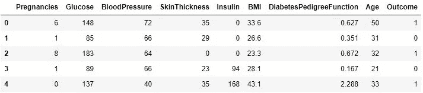
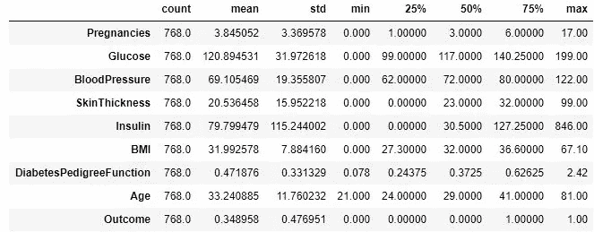
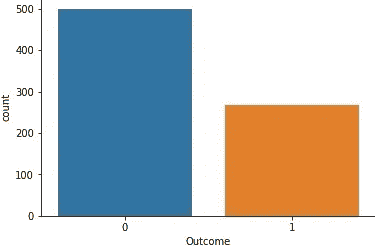
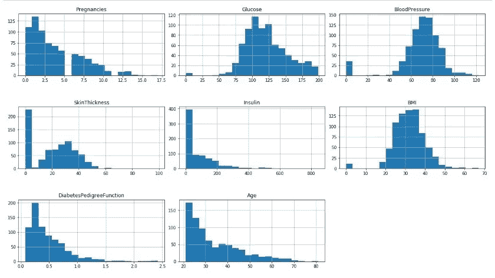
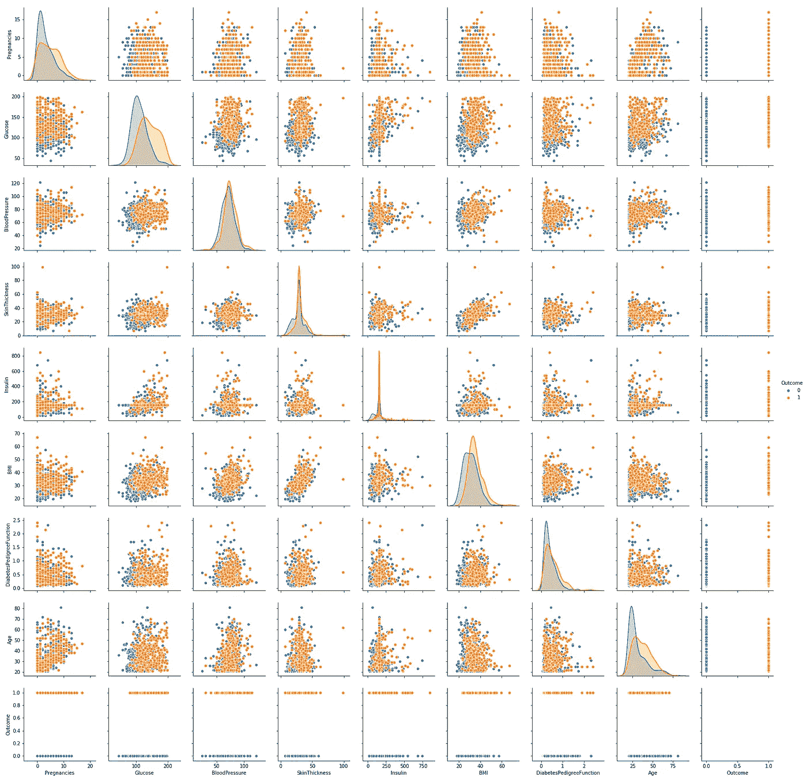
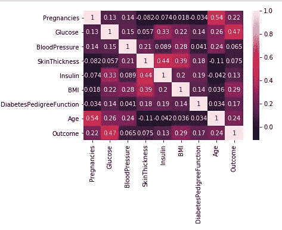
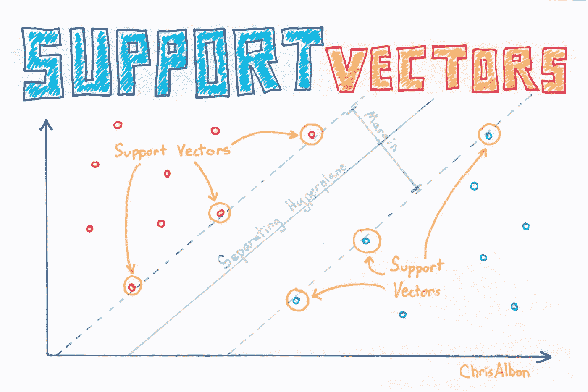
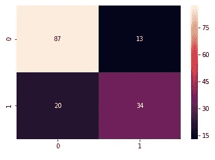
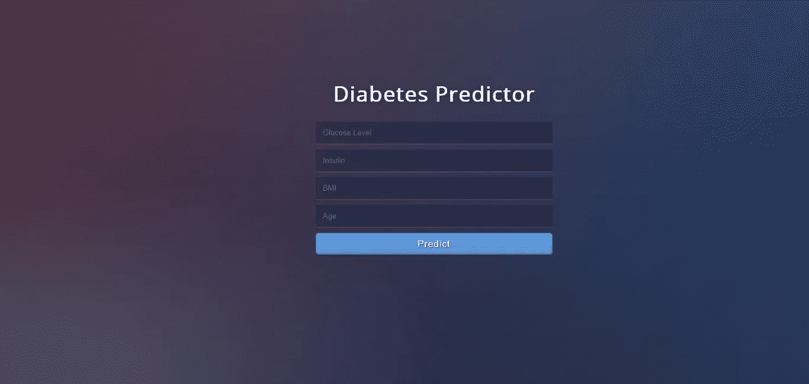

# 建立糖尿病预测器

> 原文：<https://medium.com/analytics-vidhya/building-a-diabetes-predictor-4702b99bc7e4?source=collection_archive---------1----------------------->

## 机器学习方法。

在这个项目中，目标是根据葡萄糖水平、胰岛素、年龄、身体质量指数等各种特征来预测该人是否患有糖尿病。我们将使用来自 UCI 机器学习资源库的 [**皮马印第安人数据集**](https://www.kaggle.com/uciml/pima-indians-diabetes-database) 。我们将在数据收集到模型部署之后的六个步骤中开发这个项目。


照片由 [Akash Deep](https://unsplash.com/@controld?utm_source=medium&utm_medium=referral) 在 [Unsplash](https://unsplash.com?utm_source=medium&utm_medium=referral) 上拍摄

## 动机:

由于我们不积极的生活方式，糖尿病日益成为一个健康问题。如果及时发现，然后通过适当的医疗，可以防止不良影响。为了帮助早期检测，可以非常可靠和有效地使用技术。使用机器学习，我们建立了一个预测模型，可以预测患者是否是糖尿病阳性。

## 步骤 0:数据收集和导入库。

所有的标准库如 numpy、pandas、matplotlib 和 seaborn 都在这一步导入。我们使用 numpy 进行线性代数运算，pandas 使用数据框，matplotlib 和 seaborn 绘制图形。使用 pandas 命令 *read_csv()* 导入数据集。

```
*# Importing libraries*
import pandas as pd
import numpy as np 
import matplotlib.pyplot as plt
import seaborn as sns*# Importing dataset*
dataset = pd.read_csv('diabetes.csv')
```

## 步骤 1:描述性分析

```
*# Preview data*
dataset.head()
```



数据预览

```
# Dataset dimensions - (rows, columns)
dataset.shape**output:** (768, 9)*# Features data-type*
dataset.info()**output:**
<class 'pandas.core.frame.DataFrame'>
RangeIndex: 768 entries, 0 to 767
Data columns (total 9 columns):
Pregnancies                 768 non-null int64
Glucose                     768 non-null int64
BloodPressure               768 non-null int64
SkinThickness               768 non-null int64
Insulin                     768 non-null int64
BMI                         768 non-null float64
DiabetesPedigreeFunction    768 non-null float64
Age                         768 non-null int64
Outcome                     768 non-null int64
dtypes: float64(2), int64(7)
memory usage: 54.1 KB*# Statistical summary*
dataset.describe().T
```



统计摘要

```
*# Count of null values*
dataset.isnull().sum()**output:**
Pregnancies                 0
Glucose                     0
BloodPressure               0
SkinThickness               0
Insulin                     0
BMI                         0
DiabetesPedigreeFunction    0
Age                         0
Outcome                     0
dtype: int64
```

> 观察结果:
> 
> 1.数据集中总共有 768 条记录和 9 个要素。
> 
> 2.每个特征可以是整数或浮点数据类型。
> 
> 3.一些特征如葡萄糖、血压、胰岛素、身体质量指数具有零值，表示缺失数据。
> 
> 4.数据集中没有 NaN 值。
> 
> 5.在结果栏中，1 代表糖尿病阳性，0 代表糖尿病阴性

## 步骤 2:数据可视化

```
*# Outcome countplot*
sns.countplot(x = 'Outcome',data = dataset)
```



结果计数图

```
*# Histogram of each feature*
import itertoolscol = dataset.columns[:8]
plt.subplots(figsize = (20, 15))
length = len(col)for i, j in itertools.zip_longest(col, range(length)):
    plt.subplot((length/2), 3, j + 1)
    plt.subplots_adjust(wspace = 0.1,hspace = 0.5)
    dataset[i].hist(bins = 20)
    plt.title(i)
plt.show()
```



每个特征的直方图

```
*# Pairplot* 
sns.pairplot(data = dataset, hue = 'Outcome')
plt.show()
```



所有特征的配对图

```
*# Heatmap*
sns.heatmap(dataset.corr(), annot = True)
plt.show()
```



特征关联热图

> 观察结果:
> 
> 1.countplot 告诉我们，数据集是不平衡的，因为没有糖尿病的患者数量比有糖尿病的患者多。
> 
> 2.从相关热图中，我们可以看到结果与[葡萄糖、身体质量指数、年龄、胰岛素]之间有很高的相关性。我们可以选择这些特性来接受用户的输入并预测结果。

## 步骤 3:数据预处理

```
*# Replacing zero values with NaN*
dataset[["Glucose", "BloodPressure", "SkinThickness", "Insulin", "BMI"]] = dataset[["Glucose", "BloodPressure", "SkinThickness", "Insulin", "BMI"]].replace(0, np.NaN)*# Count of NaN*
dataset.isnull().sum()**Output:**
Pregnancies                   0
Glucose                       5
BloodPressure                35
SkinThickness               227
Insulin                     374
BMI                          11
DiabetesPedigreeFunction      0
Age                           0
Outcome                       0
dtype: int64*# Replacing NaN with mean values*
dataset["Glucose"].fillna(dataset["Glucose"].mean(), inplace = True)
dataset["BloodPressure"].fillna(dataset["BloodPressure"].mean(), inplace = True)
dataset["SkinThickness"].fillna(dataset["SkinThickness"].mean(), inplace = True)
dataset["Insulin"].fillna(dataset["Insulin"].mean(), inplace = True)
dataset["BMI"].fillna(dataset["BMI"].mean(), inplace = True)
```

在该数据集中，缺失值由需要替换的零值表示。零值由 NaN 代替，这样，使用 *fillna()* 命令可以很容易地输入缺失值。

```
*# Feature scaling using MinMaxScaler*
from sklearn.preprocessing import MinMaxScaler
sc = MinMaxScaler(feature_range = (0, 1))
dataset_scaled = sc.fit_transform(dataset_new)dataset_scaled = pd.DataFrame(dataset_scaled)
```

我们使用 *Minmaxscaler()* 对数据集执行特征缩放，以便缩放整个数据集，使其位于 0 和 1 之间。对于许多算法来说，这是一个重要的预处理步骤。

```
*# Selecting features - [Glucose, Insulin, BMI, Age]*
X = dataset_scaled.iloc[:, [1, 4, 5, 7]].values
Y = dataset_scaled.iloc[:, 8].values*# Splitting X and Y*
from sklearn.model_selection import train_test_split
X_train, X_test, Y_train, Y_test = train_test_split(X, Y, test_size = 0.20, random_state = 42, stratify = dataset_new['Outcome'] )*# Checking dimensions*
print("X_train shape:", X_train.shape)
print("X_test shape:", X_test.shape)
print("Y_train shape:", Y_train.shape)
print("Y_test shape:", Y_test.shape)**Output:** X_train shape: (614, 4)
X_test shape: (154, 4)
Y_train shape: (614,)
Y_test shape: (154,)
```

在特征相关热图中，我们可以观察到葡萄糖、胰岛素、年龄和身体质量指数与结果高度相关。因此，我们选择这些特征作为 X，结果作为 y。然后使用 *train_test_split* 以 80:20 的比率分割数据集。

## 步骤 4:数据建模

```
*# Support Vector Classifier Algorithm*
from sklearn.svm import SVC
svc = SVC(kernel = 'linear', random_state = 42)
svc.fit(X_train, Y_train)*# Making predictions on test dataset*
Y_pred = svc.predict(X_test)
```

> 算法:



信用:【chrisalbon.com】T4

支持向量分类器(SVC)是一种监督分类模型，其目标是使用支持向量基于最大间隔超平面构建对数据进行分类。这个超平面是在各种类之间分类的决策边界。它是使用支持向量构建的，支持向量是离群值。选择具有最高边缘的超平面作为决策边界。

SVCs 可以使用将输入隐式映射到高维向量空间的核技巧来分类线性和非线性数据。这种核技巧将低维特征空间转换成线性可分的高维特征空间。例如，2D 中的数据可能不是线性可分的，但是当使用核函数将其转换为 3D 时，它会变成线性可分的。

SVC 有三个影响模型性能的主要参数，它们是内核、gamma 和 c。内核参数表示内核的类型，对于线性可分离数据可以是“线性”,对于非线性可分离数据可以是“rbf”和“poly”。伽马参数是核系数。随着 gamma 值的增加，它会尝试精确拟合数据集，这会产生泛化错误并导致过度拟合。c 参数是模型误分类的代价。C 的高值给出了低偏差和高方差，而 C 的低值给出了高偏差和低方差。

## 第五步:模型评估

```
*# Evaluating using accuracy_score metric*
from sklearn.metrics import accuracy_score
accuracy = accuracy_score(Y_test, Y_pred)print("Accuracy: " + str(accuracy * 100))**Output:**
Accuracy: 73.37662337662337*# Confusion matrix*
from sklearn.metrics import confusion_matrix
cm = confusion_matrix(Y_test, Y_pred)
cm**Output:** array([[87, 13],
       [20, 34]], dtype=int64)*# Heatmap of Confusion matrix*
sns.heatmap(pd.DataFrame(cm), annot=True)
```



混乱矩阵热图

```
*# Classification report*
from sklearn.metrics import classification_report
print(classification_report(Y_test, Y_pred))**Output:** precision    recall  f1-score   support

         0.0       0.81      0.87      0.84       100
         1.0       0.72      0.63      0.67        54

   micro avg       0.79      0.79      0.79       154
   macro avg       0.77      0.75      0.76       154
weighted avg       0.78      0.79      0.78       154
```

我们选择了三个度量准确性的指标——分数、混淆矩阵和分类报告来评估我们的模型。

## 步骤 6:模型部署



烧瓶应用

在这一步中，我们将使用 Flask micro-framework 来创建我们模型的 web 应用程序。所有需要的文件都可以在我的 GitHub 仓库中找到。

至此，我们已经完成了从数据收集到模型部署的项目。

## 更多应用:

可以为乳腺癌、疟疾等多种疾病建立非常详细的类似模型，一旦达到足够高的精确度，该模型就可以非常可靠。

Github 资源库:

[](https://github.com/Aditya-Mankar/Diabetes-Prediction) [## aditya-Mankar/糖尿病预测

### 使用机器学习预测糖尿病。在这个项目中，我们的目标是预测患者是否患有糖尿病…

github.com](https://github.com/Aditya-Mankar/Diabetes-Prediction)