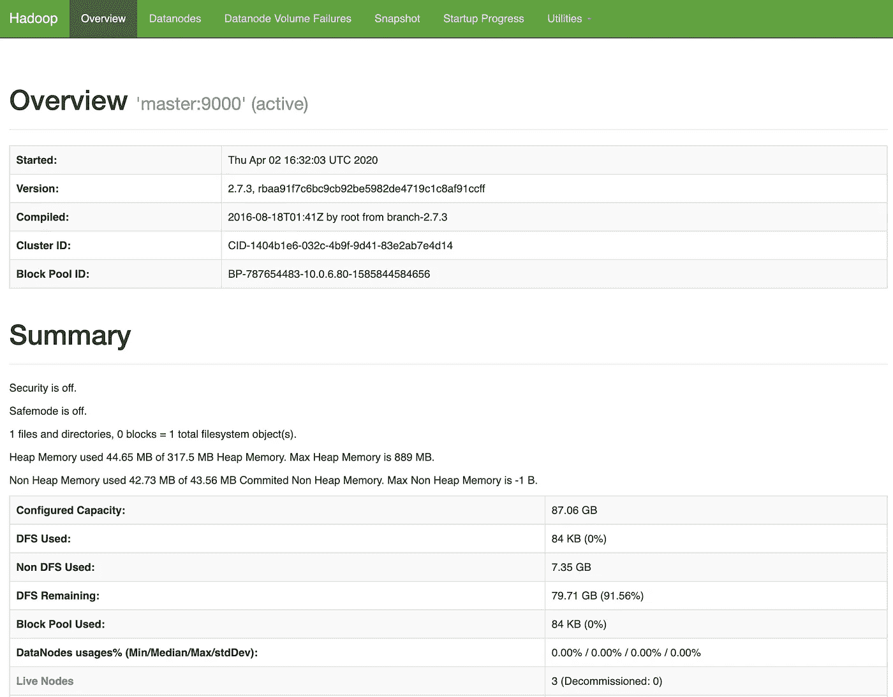
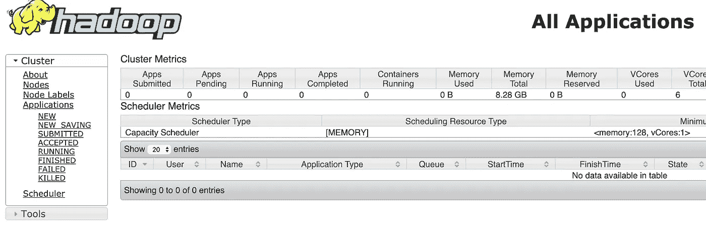
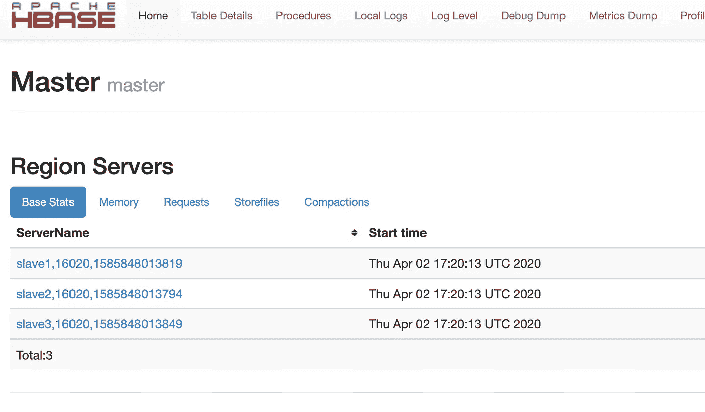

# 在 Amazon EC2 上使用 HBase 从头开始构建分布式 Hadoop 集群

> 原文：<https://medium.com/analytics-vidhya/building-a-distributed-hadoop-cluster-with-hbase-on-amazon-ec2s-from-scratch-84d503cf36b8?source=collection_archive---------9----------------------->


如果你想在 AWS EC2 上用 HBase 构建一个分布式 Hadoop 集群，那么最好的选择就是使用 AWS EMR。但是如果你像我一样，想从头开始构建集群，那么你就来对地方了。建立你的集群可能有很多原因，对我来说，是为了理解主从之间的联系是如何发生的，并更深入地挖掘系统。或者，如果您只想调整 EMR 中不可用的 come 配置或代码，并运行生产负载。

# Hadoop 先决条件

首先，让我们启动 4 个 EC2 实例(1 个主实例和 3 个从实例)。为了简单起见，我没有使用 bastion 主机，启用了公共 IP，并且将安全组限制为仅我的 IP。一旦实例准备就绪，就将它们标记为 master、slave1、slave2 和 slave3。我用过 ubuntu 18.04 AMI，下面是我的`~/.ssh/config`文件

```
#OnLocalHost master
  User ubuntu
  IdentityFile ~/.aws/key.pem
  ProxyCommand ssh -q -W %h:%p ubuntu@ec2-x-x-x-x.us-west-2.compute.amazonaws.com -i ~/.aws/key.pem
  StrictHostKeyChecking no
  UserKnownHostsFile=/dev/null
  HostName 10.0.x.xHost slave1
  User ubuntu
  IdentityFile ~/.aws/bds.pem
  ProxyCommand ssh -q -W %h:%p ubuntu@x-x-x-x.us-west-2.compute.amazonaws.com -i ~/.aws/key.pem
  StrictHostKeyChecking no
  UserKnownHostsFile=/dev/null
  HostName 10.0.x.xHost slave2
  User ubuntu
  IdentityFile ~/.aws/bds.pem
  ProxyCommand ssh -q -W %h:%p ubuntu@x-x-x-x.us-west-2.compute.amazonaws.com -i ~/.aws/key.pem
  StrictHostKeyChecking no
  UserKnownHostsFile=/dev/null
  HostName 10.0.x.xHost slave3
  User ubuntu
  IdentityFile ~/.aws/key.pem
  ProxyCommand ssh -q -W %h:%p ubuntu@x-x-x-x.compute.amazonaws.com -i ~/.aws/bds.pem
  StrictHostKeyChecking no
  UserKnownHostsFile=/dev/null
  HostName 10.0.x.x
```

记住用 ec2 实例的实际公共 DNS 替换 ubuntu@x-x-x-x.us-west-2.compute.amazonaws.com，并将主机名更改为私有 IPv4。

现在配置好了`~/.ssh/config`,我可以使用`ssh master`或`ssh slave1`等简单地 ssh 到机器中。

让我们在继续安装 Hadoop 之前更新一下。

```
#OnAllsudo apt update && sudo apt dist-upgrade -y
```

接下来，设置主服务器的静态主机名。

```
#OnMastersudo hostnamectl set-hostname --static master
```

奴隶也是如此。

```
#OnSlavessudo hostnamectl set-hostname --static slave1
sudo hostnamectl set-hostname --static slave2
sudo hostnamectl set-hostname --static slave3
```

现在打开文件`sudo vim /etc/cloud/cloud.cfg`并配置下面的属性。

```
#OnAllpreserve_hostname=true
```

现在用主实例和从实例的私有 IP 更新`/etc/hosts`文件。这是我的 IP 列表。记住从`/etc/hosts`文件中删除第一行`127.0.0.1 localhost`。

```
#OnAllsudo vim /etc/hosts10.0.6.80     master
10.0.6.174    slave1
10.0.6.252    slave2
10.0.6.35     slave3
```

接下来，让我们在实例上安装 OpenJDK 8

```
#OnAllsudo apt install openjdk-8-jdk openjdk-8-jre -y
```

现在将重新启动实例

```
#OnAllsudo reboot
```

现在让我们为实例启用并设置密码。这样做是为了更容易在主节点和从节点之间传输文件。我们可以在以后禁用它。

现在，在所有节点上进行以下更改

```
#OnAllsudo vim /etc/ssh/sshd_config# Set the below value in the file
PasswordAuthentication yes
```

然后重启`sshd`并为`ubuntu`用户设置密码。

```
#OnAllsudo service ssh restart
sudo passwd ubuntu
# Enter the password and remember it for future use
```

现在只在主节点上执行下一条指令。我们将生成公共/私有 ssh 密钥，并将其从主设备复制到所有从设备。

```
#OnMasterssh-keygen -b 4096ssh-copy-id -i $HOME/.ssh/id_rsa.pub ubuntu@master
ssh-copy-id -i $HOME/.ssh/id_rsa.pub ubuntu@slave1
ssh-copy-id -i $HOME/.ssh/id_rsa.pub ubuntu@slave2
ssh-copy-id -i $HOME/.ssh/id_rsa.pub ubuntu@slave3
```

注意，如果上面的命令`ssh-copy-id`被冻结，那么您需要查看一下安全组，以确保您可以从主设备 ssh 到从设备。一种方法是，将一个公共安全组(SG)附加到所有实例，并将该 SG 添加到自身。

# 让我们安装和设置 Hadoop！

在主节点上，

运行以下命令将 Hadoop 下载、解压缩并复制到`/usr/local/hadoop`。让我们也给同一个目录许可。

```
#OnMasterwget [https://archive.apache.org/dist/hadoop/core/hadoop-2.7.3/hadoop-2.7.3.tar.gz](https://archive.apache.org/dist/hadoop/core/hadoop-2.7.3/hadoop-2.7.3.tar.gz)
sudo mkdir /usr/local/hadoop
tar -xzf hadoop-2.7.3.tar.gz
sudo mv hadoop-2.7.3/* /usr/local/hadoop/
ls -ltr /usr/local/hadoop/
sudo chown -R ubuntu:ubuntu /usr/local/hadoop
```

现在让我们添加一些到`~/.bashrc`文件的路径，使它更容易向前导航。设置路径总是会使它更容易。将下面的配置附加到您的`~/.bashrc`文件中。

```
#OnMaster# Java
export JAVA_HOME=/usr/lib/jvm/java-8-openjdk-amd64
export JRE_HOME=/usr/lib/jvm/java-8-openjdk-amd64/jre# Hadoop
export HADOOP_INSTALL=/usr/local/hadoop
export PATH=$PATH:$HADOOP_INSTALL/bin
export PATH=$PATH:$HADOOP_INSTALL/sbin
export HADOOP_MAPRED_HOME=$HADOOP_INSTALL
export HADOOP_COMMON_HOME=$HADOOP_INSTALL
export HADOOP_HDFS_HOME=$HADOOP_INSTALL
export YARN_HOME=$HADOOP_INSTALL
export HADOOP_COMMON_LIB_NATIVE_DIR=$HADOOP_INSTALL/lib/native
export HADOOP_OPTS="-Djava.library.path=$HADOOP_INSTALL/lib"
```

一旦保存，运行命令`source ~/.bashrc`在当前会话中更新它。

现在，让我们对 Hadoop 环境进行更改，使其支持分布式模式。接下来会有一长串的变化。

首先，让我们进入`cd /usr/local/hadoop/etc/hadoop`目录。

1.  将`JAVA_HOME`设置在`hadoop-env.sh`中。

```
#OnMasterexport JAVA_HOME=/usr/lib/jvm/java-8-openjdk-amd64
```

2.在`yarn-site.xml`中添加纱线配置。

```
#OnMaster<property>
    <name>yarn.acl.enable</name>
    <value>0</value>
</property>
<property>
    <name>yarn.resourcemanager.hostname</name>
    <value>master</value>
</property>
<property>
    <name>yarn.nodemanager.aux-services</name>
    <value>mapreduce_shuffle</value>
</property>
<property>
    <name>yarn.nodemanager.resource.memory-mb</name>
    <value>2826</value>
</property>
<property>
    <name>yarn.scheduler.maximum-allocation-mb</name>
    <value>2726</value>
</property>
<property>
    <name>yarn.scheduler.minimum-allocation-mb</name>
    <value>128</value>
</property>
<property>
    <name>yarn.nodemanager.vmem-check-enabled</name>
    <value>false</value>
</property>
<property>
    <name>yarn.nodemanager.resource.cpu-vcores</name>
    <value>2</value>
</property>
```

确保在`<configuration>`和`</configuration>`之间添加上述属性。

3.将以下配置添加到`core-site.xml`。

```
#OnMaster<property>
    <name>fs.default.name</name>
    <value>hdfs://master:9000</value>
</property>
```

4.将 HDFS 配置添加到`hdfs-site.xml`。

```
#OnMaster<property>
    <name>dfs.replication</name>
    <value>3</value>
    <description>
        Default block replication.
        The actual number of replications can be specified when the file is created.
        The default is used if replication is not specified in create time.
    </description>
</property>
<property>
    <name>dfs.namenode.name.dir</name>
    <value>file:/usr/local/hadoop_store/hdfs/namenode</value>
</property>
<property>
    <name>dfs.datanode.data.dir</name>
    <value>file:/usr/local/hadoop_store/hdfs/datanode</value>
</property>
```

5.现在，让我们将 Map-Reduce 配置添加到`mapred-site.xml`。但是首先，我们需要复制模板。这可以通过以下方式实现

```
#OnMastercp mapred-site.xml.template mapred-site.xml
```

然后打开文件`mapred-site.xml`并添加以下配置

```
#OnMaster<property>
    <name>mapreduce.framework.name</name>
    <value>yarn</value>
</property>
<property>
        <name>yarn.app.mapreduce.am.resource.mb</name>
        <value>1024</value>
</property>
<property>
        <name>mapreduce.map.memory.mb</name>
        <value>1024</value>
</property>
<property>
        <name>mapreduce.reduce.memory.mb</name>
        <value>1024</value>
</property>
```

如果你有兴趣了解每个属性是做什么的，那么请参考 Hadoop 的[官方文档。](https://hadoop.apache.org/docs/r2.7.3/)

6.让我们为 HDFS 商店创建一个目录。

```
#OnMastersudo mkdir -p /usr/local/hadoop_store/hdfs/namenode
sudo mkdir -p /usr/local/hadoop_store/hdfs/datanode
sudo chown -R ubuntu:ubuntu /usr/local/hadoop_store/
```

7.现在我们已经在主节点上完成了所有需要的配置，让我们在从节点上进行更改。但是首先，让我们将`hadoop-2.7.3.tar.gz`复制到从节点。

```
#OnMastercd ~
scp hadoop-2.7.3.tar.gz ubuntu@slave1:/home/ubuntu/
scp hadoop-2.7.3.tar.gz ubuntu@slave2:/home/ubuntu/
scp hadoop-2.7.3.tar.gz ubuntu@slave3:/home/ubuntu/
```

一旦我们将文件复制到从属节点，就应该在那里进行类似的更改了。

在奴隶身上，

```
#OnSlavessudo mkdir /usr/local/hadoop
tar -xzf hadoop-2.7.3.tar.gz
sudo mv hadoop-2.7.3/* /usr/local/hadoop/
ls -ltr /usr/local/hadoop/
sudo chown -R ubuntu:ubuntu /usr/local/hadoop
```

现在让我们也在 slaves 中添加一些到`~/.bashrc`文件的路径。

```
#OnSlaves# Java
export JAVA_HOME=/usr/lib/jvm/java-8-openjdk-amd64
export JRE_HOME=/usr/lib/jvm/java-8-openjdk-amd64/jre# Hadoop
export HADOOP_INSTALL=/usr/local/hadoop
export PATH=$PATH:$HADOOP_INSTALL/bin
export PATH=$PATH:$HADOOP_INSTALL/sbin
export HADOOP_MAPRED_HOME=$HADOOP_INSTALL
export HADOOP_COMMON_HOME=$HADOOP_INSTALL
export HADOOP_HDFS_HOME=$HADOOP_INSTALL
export YARN_HOME=$HADOOP_INSTALL
export HADOOP_COMMON_LIB_NATIVE_DIR=$HADOOP_INSTALL/lib/native
export HADOOP_OPTS="-Djava.library.path=$HADOOP_INSTALL/lib"
```

一旦保存，运行命令`source ~/.bashrc`在当前会话中更新它。

让我们在从服务器中为 HDFS 商店创建一个目录。

```
#OnSlavessudo mkdir -p /usr/local/hadoop_store/hdfs/namenode
sudo mkdir -p /usr/local/hadoop_store/hdfs/datanode
sudo chown -R ubuntu:ubuntu /usr/local/hadoop_store/
```

现在我们已经配置了从节点，让我们回到主节点。

在 Master 上，

让我们将对 Hadoop 配置所做的所有更改也复制到从服务器。

```
#OnMasterscp /usr/local/hadoop/etc/hadoop/* ubuntu@slave1:/usr/local/hadoop/etc/hadoop/scp /usr/local/hadoop/etc/hadoop/* ubuntu@slave2:/usr/local/hadoop/etc/hadoop/scp /usr/local/hadoop/etc/hadoop/* ubuntu@slave3:/usr/local/hadoop/etc/hadoop/
```

让我们将从属名称添加到`/usr/local/hadoop/etc/hadoop/slaves`文件中。

```
#OnMasterslave1
slave2
slave3
```

现在我们已经完成了 Hadoop 设置。让我们启动 Hadoop 并进行测试！

又在主人身上，

让我们格式化`namenode`。

```
#OnMasterhdfs namenode -format
```

然后我们将启动 **DFS**

```
#OnMasterstart-dfs.sh
```

为了检查所有的配置是否正确，让我们检查一下`jps`

```
#OnMasterjps
```

在主节点上，输出应该是

```
#OnMaster4448 SecondaryNameNode
4572 Jps
4175 NameNode
```

在从节点上，

```
#OnSlaves2632 DataNode
2713 Jps
```

当然，PID 会有所不同。

现在让我们也开始纺纱。

```
#OnMasterstart-yarn.sh
```

现在，当我们运行`jps`时，我们应该看到 ResourceManager 被添加到主节点的列表中，NodeManager 被添加到从节点的列表中。

在主人身上

```
#OnMaster4448 SecondaryNameNode
4631 ResourceManager
4895 Jps
4175 NameNode
```

在奴隶身上

```
#OnSlaves2832 NodeManager
2632 DataNode
2943 Jps
```

此外，您还可以看到 UI 是否一切运行正常。首先，找出主节点的公共 IP。DFS UI 在端口 50070 上，YARN UI 在 8088 上。

## DFS: http:// <master_ip>:50070</master_ip>



## 纱线:http://<master_ip>:8088/簇</master_ip>



现在我们可以运行一个小的 Map Reduce 来计算文本中的单词。在主机中执行以下命令(当然)来运行作业。

```
#OnMastercd ~
mkdir sample_data
cd sample_data/
wget -O alice.txt [https://www.gutenberg.org/files/11/11-0.txt](https://www.gutenberg.org/files/11/11-0.txt)
cd ~hadoop fs -copyFromLocal sample_data/alice.txt hdfs://master:9000/
hdfs dfs -ls hdfs://master:9000/
yarn jar /usr/local/hadoop/share/hadoop/mapreduce/hadoop-mapreduce-examples-2.7.3.jar wordcount "hdfs://master:9000/alice.txt" hdfs://master:9000/output/
```

当作业正在运行时，您还可以访问 YARN UI 来跟踪作业。

# HBase

1.  让我们下载 HBase，然后解压并复制文件到`/usr/local/hbase`目录。下载 HBase 的官方链接可以在[这里](https://hbase.apache.org/downloads.html)找到。从那里你必须找到镜像并下载它。请根据您的位置随意替换链接。还有，我用 HBase 版本`1.4.13`测试过。

```
#OnMasterwget [https://downloads.apache.org/hbase/1.4.13/hbase-1.4.13-bin.tar.gz](https://downloads.apache.org/hbase/1.4.13/hbase-1.4.13-bin.tar.gz)
tar -zxvf hbase-1.4.13-bin.tar.gz
sudo mv hbase-1.4.13 /usr/local/hbase
sudo chown -R ubuntu:ubuntu /usr/local/hbase
```

2.将以下命令添加到`~/.bashrc`文件中

```
#OnMasterexport HBASE_HOME=/usr/local/hbase
export PATH=$PATH:$HBASE_HOME/bin
```

然后，像往常一样源文件。`source ~/.bashrc`。

3.更新 HBase 配置文件

```
#OnMastercd /usr/local/hbase/conf/
```

在`hbase-env.sh`文件中设置`JAVA_HOME`。

```
#OnMasterexport JAVA_HOME=/usr/lib/jvm/java-8-openjdk-amd64
```

然后，继续将属性添加到`hbase-site.xml`文件。

```
#OnMaster<property>
      <name>hbase.rootdir</name>
      <value>hdfs://master:9000/hbase</value>
   </property><property>
      <name>hbase.zookeeper.property.dataDir</name>
      <value>hdfs://master:9000/zookeeper</value>
   </property><property>
     <name>hbase.cluster.distributed</name>
     <value>true</value>
   </property>
<property>
    <name>hbase.zookeeper.quorum</name>
    <value>slave1,slave2,slave3</value>
  </property>
```

然后将从机名称添加到`regionservers`

```
#OnMasterslave1
slave2
slave3
```

现在，在从节点上，创建`/usr/local/hbase`目录并授予权限，以便我们可以将文件从主节点复制到从节点。在**从动装置上进行以下更改。**

```
#OnSlavessudo mkdir -p /usr/local/hbase
sudo chown -R ubuntu:ubuntu /usr/local/hbase
```

现在，我们需要从主机将 HBase 文件复制到从机。运行下面的命令来完成。

```
#OnMasterscp -rp /usr/local/hbase/* ubuntu@slave1:/usr/local/hbase/
scp -rp /usr/local/hbase/* ubuntu@slave2:/usr/local/hbase/
scp -rp /usr/local/hbase/* ubuntu@slave3:/usr/local/hbase/
```

现在是启动 HBase 的时候了。在启动 HBase 之前，确保 Hadoop 正在运行。

```
#OnMasterstart-hbase.sh
```

当你运行`jps`命令时，

在主人身上你看到了

```
#OnMaster7616 NameNode
7891 SecondaryNameNode
8851 Jps
8581 HMaster
8056 ResourceManager
```

在奴隶身上

```
#OnSlave4741 DataNode
5270 HQuorumPeer
5614 Jps
5438 HRegionServer
4927 NodeManager
```

HBase 还有一个 UI 来查看 RegionServers 信息以及其他信息。

## h base UI:http://<master_ip>:16010/master-status</master_ip>



**Hadoop 和 HBase 在分布式模式下启动并运行，AWS EC2 实例上的复制因子为 3！**

## 参考资料:

1.  [https://medium . com/@ zaman . nuces/setting-up-full-distributed-Hadoop-cluster-series-2-of-3-27b 9831 c 25 AE](/@zaman.nuces/setting-up-fully-distributed-hadoop-cluster-series-2-of-3-27b9831c25ae)
2.  [https://AWS . Amazon . com/premium support/knowledge-center/Linux-static-hostname-rhel 7-centos 7/](https://aws.amazon.com/premiumsupport/knowledge-center/linux-static-hostname-rhel7-centos7/)
3.  [https://www . digital ocean . com/community/questions/ssh-copy-id-not-work-permission-denied-public key](https://www.digitalocean.com/community/questions/ssh-copy-id-not-working-permission-denied-publickey)
4.  [https://AWS . Amazon . com/premium support/knowledge-center/ec2-password-log in/](https://aws.amazon.com/premiumsupport/knowledge-center/ec2-password-login/)
5.  [https://medium . com/@ yzhong . cs/h base-安装-分步指南-cb73381a7a4c](/@yzhong.cs/hbase-installation-step-by-step-guide-cb73381a7a4c)
6.  [https://unsplash.com/photos/gpjvRZyavZc](https://unsplash.com/photos/gpjvRZyavZc)
7.  [https://Hadoop . Apache . org/docs/stable/Hadoop-project-dist/Hadoop-common/cluster setup . html](https://hadoop.apache.org/docs/stable/hadoop-project-dist/hadoop-common/ClusterSetup.html)
8.  [https://hbase.apache.org/book.html#configuration](https://hbase.apache.org/book.html#configuration)