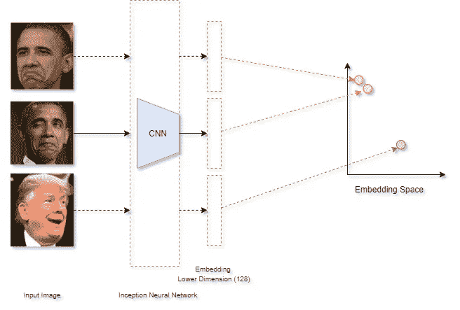
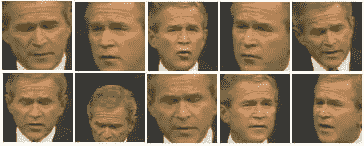
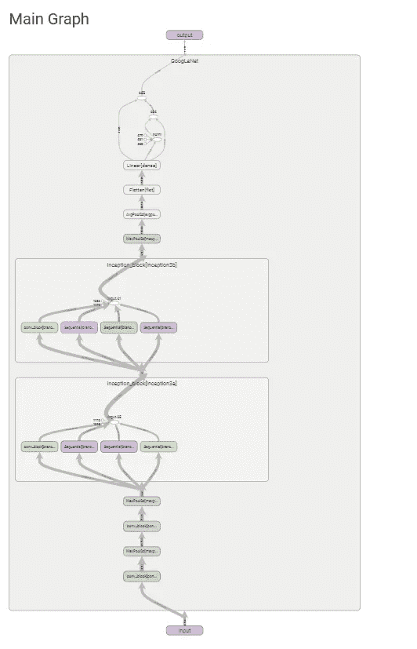
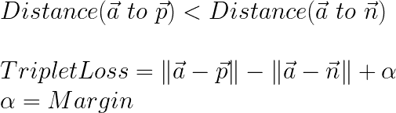
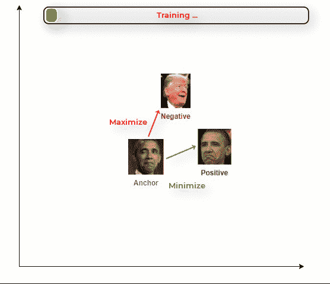
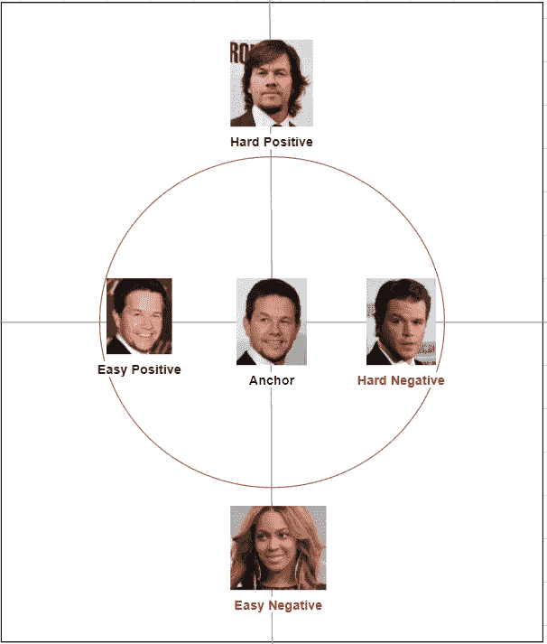
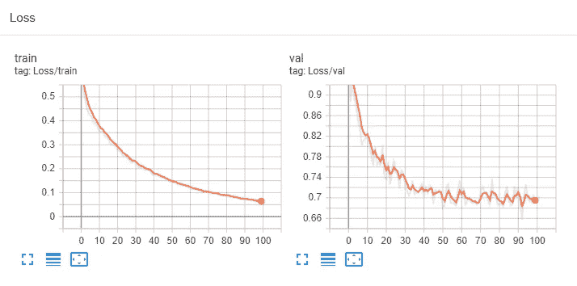
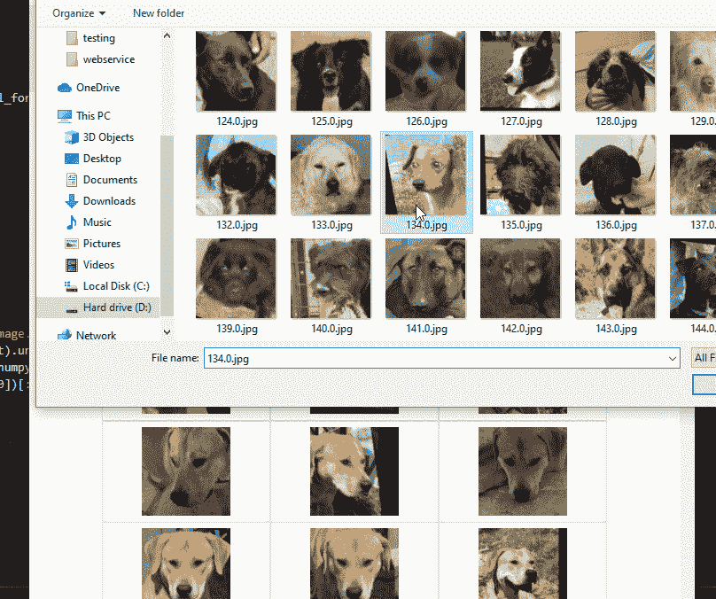

# 用 FaceNet 构建一个狗搜索引擎

> 原文：<https://medium.com/analytics-vidhya/building-a-dog-search-engine-with-facenet-65d1ae79dd8a?source=collection_archive---------6----------------------->

使用自定义在线硬三元组挖掘在 dog-face 数据集上实现 Facenet 的论文到代码

FaceNet 是目前最先进的人脸识别技术。它被广泛应用于几种现成的产品中。

> “FaceNet……直接学习从人脸图像到紧致欧几里得空间的**映射**,其中距离直接对应于人脸相似性的度量。一旦产生了这个空间，诸如人脸识别、验证和聚类之类的任务就可以使用标准技术以 FaceNet 嵌入作为特征向量来容易地实现”——FaceNet 论文

FaceNet 是一种神经网络，它学习在低维“嵌入”空间中表示或编码图像，以使同一张脸的图像彼此更接近。facenet 有效生成这种人脸编码表示(嵌入)的能力使其适用于一次性分类，即，为了构建人脸识别系统，该模型将只需要一张人脸图像来生成嵌入。然后，可以将它与一组图像嵌入的图像进行比较，以查看它是否接近潜在/嵌入空间中的另一个图像。

FaceNet 生成图像的嵌入

当图像具有不同的光照和姿态时，FaceNet 已经被证明是有效的。

面网是照明和姿态不可知的

> 在这篇文章中，我将演示在狗脸数据集上训练的 FaceNet 的自定义实现。我的方法是阅读论文(FaceNet:人脸识别和聚类的统一嵌入),并尝试根据我对论文的解释实现模型。我使用 pytorch 来实现。

# 模型架构和培训设计

本文描述了一个标准的 inception 风格的 CNN 模型来生成嵌入。

初始模型图

建筑很标准，对吧？让这个模型如此强大的秘密武器是它的训练哲学和损失函数——三重损失。

该模型的目标是生成满足这两个约束的嵌入:

1.  *相同的人脸在嵌入空间中彼此接近*
2.  *不同的面孔离得很远*

损失函数正是这样做的。

> 培训步骤将包括以下内容:

1.  选择 3 幅图像

*   锚点图像(a)—一个人的图像 A
*   正样本(p)——人 A 的另一个图像
*   负样本(n) —人 B 的图像

2.训练模型以最小化三重态损失:

三连音丢失训练:最小化 a-p 距离，最大化 n-p 距离

如果你不清楚三重损失函数是如何工作的，可以看看 OG 吴恩达本人的这个视频:[https://www.youtube.com/watch?v=d2XB5-tuCWU&ab _ channel = deep learning . ai](https://www.youtube.com/watch?v=d2XB5-tuCWU&ab_channel=Deeplearning.ai)

本文提出的对训练过程的优化之一是三元组选择过程——硬三元组挖掘。为了减少模型收敛所需的时间，需要仔细选择有助于模型改进的三元组。

对于每个锚图像，我们选择嵌入距离锚最远的正片图像——硬正片。我们选择一个嵌入最接近锚的负片图像——硬负片。

啊…古老的马克·沃尔伯格 vs 马特达蒙难题。在硬三元组挖掘方法中，我们挑选出硬阳性和硬阴性样本，使模型变得有趣😜

训练过程本质上是神经网络学习生成最小化三联体损失的嵌入。这确保了经过训练的模型将同一个人的图像彼此非常接近地嵌入。

# 建立一个狗搜索引擎

我使用实现硬三元组挖掘的自定义数据加载器在 DogFace 数据集上训练了 Facenet。请查看[我的 github](https://github.com/kvsnoufal/Pytorch-FaceNet-DogDataset) 获取代码。

NVIDIA GTX1080Ti 小时培训

嵌入空间可视化— PCA

Web 界面-快速查看

查看 YouTube 视频:

用狗脸测试反向图像搜索

> *我知道我在这里展示的远非完美。我的目标是从头开始实现一篇论文，并在此过程中了解更多关于 pytorch 的知识。我将更新我的* [*github*](https://github.com/kvsnoufal/Pytorch-FaceNet-DogDataset) *关于训练过程、架构和实施的更多细节。*

在我的 [github](https://github.com/kvsnoufal/Pytorch-FaceNet-DogDataset) 上查看完整实现

## 巨人的肩膀:

1.  FaceNet:人脸识别和聚类的统一嵌入
2.  [DogFace 数据集](https://github.com/GuillaumeMougeot/DogFaceNet/releases/)
3.  Thiemeyyah
4.  如何单元测试一个必读-([https://medium . com/@ keeper 6928/how-to-unit-test-machine-learning-code-57 cf 6 FD 81765](/@keeper6928/how-to-unit-test-machine-learning-code-57cf6fd81765))
5.  狗脸网([https://github.com/GuillaumeMougeot/DogFaceNet](https://github.com/GuillaumeMougeot/DogFaceNet))

> ***关于作者***
> 
> 我在阿联酋迪拜控股公司工作，是一名数据科学家。你可以在 kvsnoufal@gmail.com 或者*联系我*