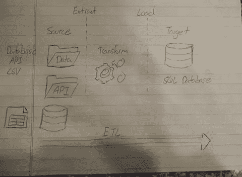
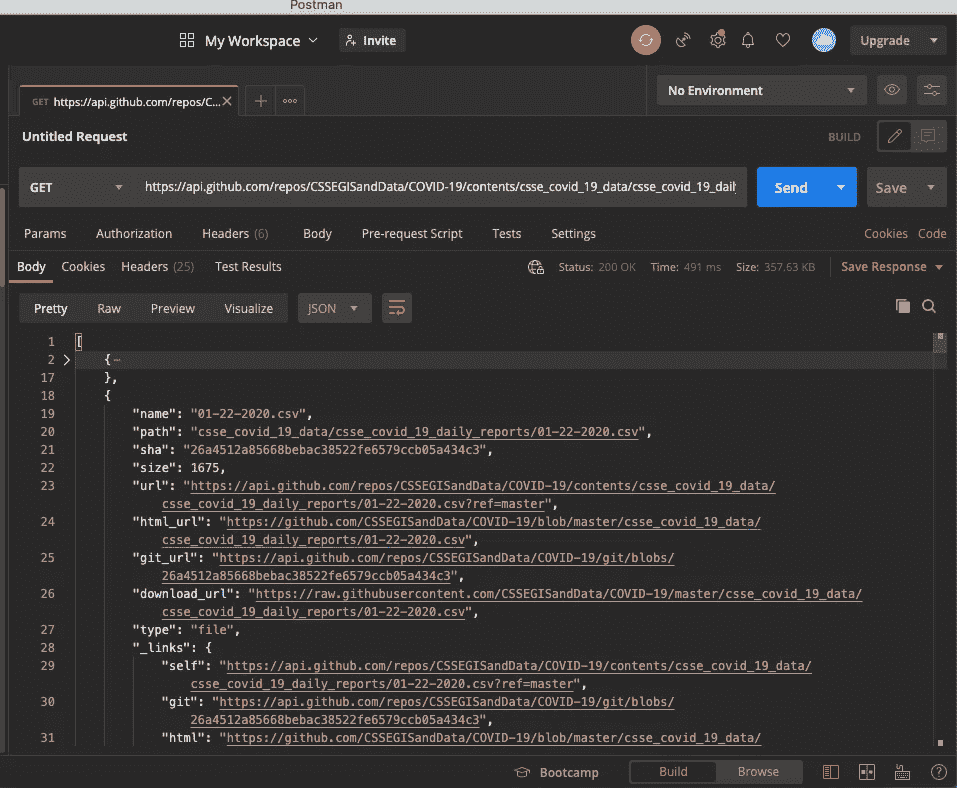

# 构建 ETL 管道

> 原文：<https://medium.com/analytics-vidhya/building-a-etl-pipeline-226656a22f6d?source=collection_archive---------1----------------------->

使用 Python、Pandas 和 SQLite

## 什么是 ETL 数据管道？



典型的 ETL 数据管道/流程

ETL(数据提取、转换、加载)管道是一组用于从源到目标提取、转换和加载数据的过程。

数据来源可以是一个或多个来源，例如 API 调用、CSV 文件、数据库中的信息等等。

我们获取这些信息源，然后以某种方式对其进行转换，以便其他客户端、用户或开发人员可以在某个目标存储中立即使用。

实际上，ETL 管道很少运行。一般来说，有大量的信息未经过滤，难以处理和清理，通常需要花费大量的时间和资源来转换。

## 为什么我们需要 ETL 管道？

假设我们有一组想要使用的数据。但问题是这些数据不干净，缺少信息，而且不一致。一种解决方案是让一个程序清理并转换这些信息

1.  没有遗漏的信息
2.  数据一致
3.  数据可以快速加载到另一个程序中

在当今的智能设备、在线社区和电子商务行业中，有如此多未经过滤的原始数据。但是大部分都被浪费了，因为它太难解释了，因为它太乱了。ETL 管道的存在就是为了通过自动化数据收集和转换来解决这个问题，以便分析师可以使用它来获得业务洞察力。

# ETL 管道

有许多不同的工具和技术可以用来建立我们的数据管道。这完全取决于我们的数据是如何收集的。在我们的例子中，我们将从约翰·霍普斯金大学的 GitHub 收集原始数据。具体来说，我们将关注[日报](https://github.com/CSSEGISandData/COVID-19/tree/master/csse_covid_19_data/csse_covid_19_daily_reports)。截至本文撰写时，数据跨度为 2020 年 1 月 22 日至 2020 年 12 月 16 日。

我们的技术栈将包括使用库**请求**和**熊猫**的 **Python** 。我们还将使用 **SQLite** 来存储这些信息。

## 1.提取

在我们进行任何类型的数据转换之前，我们需要有数据！这些数据将从约翰·霍普斯金大学的 Github 收集。我们对每日报告特别感兴趣。从 Github 的 API 文档中，我们可以向这个端点发送一个 GET 请求来接收一个 JSON 响应，告诉我们每个 csv 文件的 URL，这样我们就可以直接读取了。

*   所有者是 GitHub 存储库的所有者
*   REPO 是存储库的名称
*   路径是我们要检查的文件夹相对于回购的特定路径
*   URL 是用于发送 GET 请求的 api 端点

使用 Python 的请求库，我们将解释 JSON 响应并检查我们需要的信息。为了清楚起见，下图是使用名为 Postman 的程序返回的响应。使用 Python 的请求库将返回类似的响应。



来自 GitHub API 的 JSON 响应

返回的是 github repo 中每个文件的对象描述数组。我们对“下载网址”感兴趣。我们将使用这个“download_url”通过 Pandas 直接下载这些数据，然后按照我们认为合适的方式进行转换。

以下脚本将所有“下载 url”收集到一个 Python 列表对象中

## 2.改变

我们现在有了一个指向 csv 文件的直接链接列表！我们可以使用 **pandas.read_csv(url)** 直接读取这些网址。

看看这些信息，我们对特定的值感兴趣。如果这些值不在 DataFrame 内，我们将用空值替换/添加这些列(例如 numpy.nan)。

有些标签不一致。它们定义了相同类型的数据，但命名不同。比如，‘**最后更新**也叫“**最后 _ 更新**”。我们还将为**一致性**重新定义这些标签。这是一个非常基本的 ETL 管道，所以我们将只考虑少量的标签。这些标签将

```
labels = ['Province_State', 'Country_Region', 'Last_Update', 'Confirmed', 'Deaths', 'Recovered'] 
```

转换代码

上面的代码将已经收集的数据转换为 Pandas DataFrame add，通过添加和重新标记列使数据帧保持一致。随着我们的数据被清理、过滤和处理，下一步是将数据加载到数据库中。

## 3.负荷

我们可以使用 pandas 将 pandas 数据帧直接加载到 SQL 数据库中。DataFrame.to_sql。

如果数据库中的表已经创建，则用新表替换它。在生产中，这是一种非常糟糕的方式。但是为了这个练习的简单性，这就足够了。

下面的代码描述了如何使用 **sqlite3** 连接到 SQLite 数据库。

# 结论

*   我们描述了 ETL 管道在当今以数据为中心的行业和社会中的益处。
*   我们解释了 ETL 过程如何根据收集的数据、数据类型和数据量而变化。
*   我们使用 Python、Pandas、Requests 和 SQLite 实现了自己的基本 ETL 管道，并与 GitHub 的 API 进行了交互。

完整的代码可以在[这里找到](https://github.com/anth7310/Covid19-ETL-API)