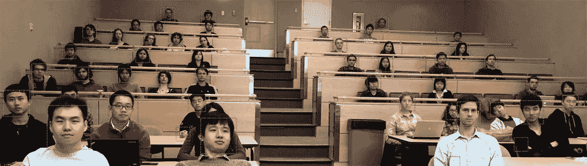
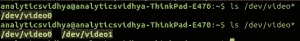
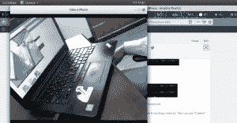

# 使用深度学习从视频构建人脸检测模型(Python 实现)

> 原文：<https://medium.com/analytics-vidhya/building-a-face-detection-model-from-video-using-deep-learning-python-implementation-9ac10148608c?source=collection_archive---------0----------------------->

> “计算机视觉和机器学习已经真正开始起步，但对大多数人来说，计算机在查看图像时看到的东西的整体概念相对模糊。”—迈克·克里奇

近年来，计算机视觉这个奇妙的领域已经自成一派。已经有相当多的应用程序在世界各地广泛使用，而我们才刚刚开始！

在这个领域，我最喜欢的事情之一是我们的社区接受开源概念的想法。即使是大型科技巨头也愿意与每个人分享新的突破和创新，以使这些技术不再是“富人的事情”。

一种这样的技术是人脸检测，它在现实世界的使用案例中提供了大量的潜在应用(如果使用正确且符合道德)。在本文中，我将向您展示如何使用开源工具构建一个强大的人脸检测算法。这里有一个演示，可以让您兴奋起来，并为接下来的工作做好准备:

你准备好了吗？接着读下去！

*注:如果你想了解计算机视觉的错综复杂，这门课程——*[*使用深度学习的计算机视觉*](https://trainings.analyticsvidhya.com/courses/course-v1:AnalyticsVidhya+CVDL101+CVDL101_T1/about)*——是完美的起点。*

# 目录

1.  人脸检测的潜在应用

2.设置系统—硬件/软件要求
2.1 硬件设置
2.2 软件设置

3.深入 Python 实现
3.1 简单演练
3.2 人脸检测用例

# 人脸检测的应用前景

让我举几个很棒的例子，在这些例子中，人脸检测技术得到了广泛的应用。我相信您一定在某个时候遇到过这些用例，但没有意识到在幕后使用了什么技术！

例如，脸书为上传到平台的每张图片自动生成标签建议，取代了手动图像标签。脸书使用一种简单的人脸检测算法来分析图像中人脸的像素，并与相关用户进行比较。我们将学习如何自己构建一个人脸检测模型，但在我们进入技术细节之前，让我们讨论一些其他的用例。

我们越来越习惯用最新的“面部解锁”功能解锁手机。这是一个非常小的例子，说明人脸检测技术是如何被用来维护个人数据的安全。这同样可以在更大的规模上实现，使相机能够捕捉图像和检测人脸。

在广告、医疗保健、银行等领域，还有一些其他不太为人所知的人脸检测应用。大多数公司，甚至在许多会议中，你应该携带身份证才能进入。但是，如果我们能想出一种方法，让你不需要携带任何身份证就可以进入呢？面部检测有助于使这一过程变得平滑和容易。这个人只要看着摄像头，摄像头就会自动检测他/她是否应该被允许进入。

人脸检测的另一个有趣的应用是统计参加活动(如会议或音乐会)的人数。我们安装了一个摄像头，可以捕捉与会者的图像，并给出总人数，而不是手动计算与会者人数。这有助于自动化流程，并节省大量人工。很有用，不是吗？



你可以想出更多这样的应用程序——欢迎在下面的评论区分享。

在这篇文章中，我将把重点放在人脸检测的实际应用上，而只是掩饰其中的算法实际上是如何工作的。如果你想更多地了解他们，你可以浏览[这篇文章](https://www.analyticsvidhya.com/blog/2018/06/understanding-building-object-detection-model-python/)。

# 设置系统—硬件/软件要求

既然您已经知道了可以使用人脸检测技术构建的潜在应用程序，那么让我们看看如何使用我们可用的开源工具来实现它。这就是我们社区的优势——共享和开放源代码的意愿是任何行业都无法比拟的。

具体到本文，以下是我使用过的并推荐使用的方法:

*   一个网络摄像头(Logitech C920)，用于在联想 E470 ThinkPad 笔记本电脑(酷睿 i5 第七代)上构建实时人脸检测器。你也可以使用你的笔记本电脑的内置摄像头，或闭路电视摄像头，在任何适当的系统进行实时视频分析，而不是我正在使用的设置
*   使用 GPU 进行更快的视频处理总是一个额外的好处
*   在软件方面，我们使用了安装了所有必备软件的 Ubuntu 18.04 操作系统

让我们更详细地探讨这些要点，以确保在构建面部检测模型之前，一切都设置妥当。

# 步骤 1:硬件设置

你要做的第一件事是检查网络摄像头是否设置正确。Ubuntu 中的一个简单技巧——查看设备是否已经被操作系统注册。您可以遵循下面给出的步骤:

1.  在将网络摄像头连接到笔记本电脑之前，请通过进入命令提示符并键入 *ls /dev/video*来检查所有连接的视频设备。*这将打印已经连接到系统的视频设备。


2.连接网络摄像头，然后再次运行该命令。



如果网络摄像头连接成功，命令将显示一个新设备。

3.你可以做的另一件事是使用任何网络摄像头软件来检查网络摄像头是否正常工作。你可以用 Ubuntu 中的“Cheese”来做这个。



这里我们可以看到网络摄像头设置正确。硬件方面就这些了！

# 步骤 2:软件设置

# 步骤 2.1:安装 Python

本文中的代码是使用 Python 版构建的。虽然有多种方法可以安装 Python，但我推荐使用 Anaconda——数据科学领域最流行的 Python 发行版。这里有一个在你的系统中安装 Anaconda 的[链接。](https://www.anaconda.com/download)

# 步骤 2.2:安装 OpenCV

[OpenCV](https://opencv.org/) (开源计算机视觉)是一个旨在构建计算机视觉应用的库。它有许多用于图像处理任务的预写函数。要安装 OpenCV，请对库进行 pip 安装:

```
pip3 install opencv-python
```

# 步骤 2.3:安装 face _ recognition API

最后，我们将使用[面部识别](https://github.com/ageitgey/face_recognition)，它被称为世界上最简单的 Python 面部识别 API。要安装:

```
pip install dlib 
pip install face_recognition
```

# 让我们深入研究一下实现

既然您已经设置了您的系统，现在终于到了开始实际实现的时候了。首先，我们将快速构建我们的程序，然后分解它以理解我们做了什么。

# 简单演练

首先，创建一个文件 *face_detector.py* ，然后复制下面给出的代码:

```
# import libraries
import cv2
import face_recognition

# Get a reference to webcam 
video_capture = cv2.VideoCapture("/dev/video1")

# Initialize variables
face_locations = []

while True:
    # Grab a single frame of video
    ret, frame = video_capture.read()

    # Convert the image from BGR color (which OpenCV uses) to RGB color (which face_recognition uses)
    rgb_frame = frame[:, :, ::-1]

    # Find all the faces in the current frame of video
    face_locations = face_recognition.face_locations(rgb_frame)

    # Display the results
    for top, right, bottom, left in face_locations:
        # Draw a box around the face
        cv2.rectangle(frame, (left, top), (right, bottom), (0, 0, 255), 2)

    # Display the resulting image
    cv2.imshow('Video', frame)

    # Hit 'q' on the keyboard to quit!
    if cv2.waitKey(1) & 0xFF == ord('q'):
        break

# Release handle to the webcam
video_capture.release()
cv2.destroyAllWindows()
```

然后，通过键入以下命令运行该 Python 文件:

```
python face_detector.py
```

如果一切正常，将弹出一个新窗口，运行实时人脸检测。

总而言之，这就是我们上面的代码所做的:

1.  首先，我们**定义了将要进行视频分析的硬件**
2.  由此，我们**一帧一帧地实时捕捉视频**
3.  然后我们**处理每一帧**和**提取图像中所有人脸的位置**
4.  最后，我们**以视频形式**渲染这些帧，以及脸部位置

很简单，不是吗？如果您想了解更详细的细节，我在每个代码部分都添加了注释。你可以随时回去回顾我们所做的事情。

# 人脸检测用例

乐趣不止于此！我们可以做的另一件很酷的事情——围绕上述代码构建一个完整的用例。而且不需要从头开始。我们可以对代码做一些小的修改，然后就可以开始了。

例如，假设您想要构建一个基于摄像头的自动系统来实时跟踪说话者的位置。根据他的位置，系统旋转摄像机，使说话者始终在视频中间。

我们该怎么做？第一步是建立一个系统来识别视频中的人，并关注说话者的位置。


让我们看看如何实现这一点。为了这篇文章，我从 Youtube 上拍摄了一个[视频，显示了一位发言者在 DataHack Summit 2017 大会上的讲话。](https://youtu.be/A_-KqX-RazQ)

首先，我们导入必要的库:

```
import cv2 
import face_recognition
```

然后，看视频，得出长度:

```
input_movie = cv2.VideoCapture("sample_video.mp4")
length = int(input_movie.get(cv2.CAP_PROP_FRAME_COUNT))
```

之后，我们创建一个具有所需分辨率和帧速率的输出文件，它类似于输入文件。

加载说话者的样本图像以在视频中识别他:

```
image = face_recognition.load_image_file("sample_image.jpeg")
face_encoding = face_recognition.face_encodings(image)[0]

known_faces = [
face_encoding,
]
```

所有这些都完成了，现在我们运行一个循环，它将执行以下操作:

*   从视频中提取一帧
*   找到所有的面孔并识别他们
*   创建一个新视频，将原始帧与带注释的说话者面部位置结合起来

让我们看看这个的代码:

```
# Initialize variables
face_locations = []
face_encodings = []
face_names = []
frame_number = 0

while True:
    # Grab a single frame of video
    ret, frame = input_movie.read()
    frame_number += 1

    # Quit when the input video file ends
    if not ret:
        break

    # Convert the image from BGR color (which OpenCV uses) to RGB color (which face_recognition uses)
    rgb_frame = frame[:, :, ::-1]

    # Find all the faces and face encodings in the current frame of video
    face_locations = face_recognition.face_locations(rgb_frame, model="cnn")
    face_encodings = face_recognition.face_encodings(rgb_frame, face_locations)

    face_names = []
    for face_encoding in face_encodings:
        # See if the face is a match for the known face(s)
        match = face_recognition.compare_faces(known_faces, face_encoding, tolerance=0.50)

        name = None
        if match[0]:
            name = "Phani Srikant"

        face_names.append(name)

    # Label the results
    for (top, right, bottom, left), name in zip(face_locations, face_names):
        if not name:
            continue

        # Draw a box around the face
        cv2.rectangle(frame, (left, top), (right, bottom), (0, 0, 255), 2)

        # Draw a label with a name below the face
        cv2.rectangle(frame, (left, bottom - 25), (right, bottom), (0, 0, 255), cv2.FILLED)
        font = cv2.FONT_HERSHEY_DUPLEX
        cv2.putText(frame, name, (left + 6, bottom - 6), font, 0.5, (255, 255, 255), 1)

    # Write the resulting image to the output video file
    print("Writing frame {} / {}".format(frame_number, length))
    output_movie.write(frame)

# All done!
input_movie.release()
cv2.destroyAllWindows()
```

然后，代码会给出如下输出:

人脸检测真的是一件很棒的事情。🙂

# 结论

恭喜你！您现在知道了如何为许多潜在的用例构建人脸检测系统。深度学习是一个如此迷人的领域，我非常期待看到我们接下来的发展方向。

在本文中，我们了解了如何利用开源工具来构建具有现实用途的实时人脸检测系统。我鼓励您构建大量这样的应用程序，并亲自尝试。相信我，有很多东西要学，而且非常有趣！

一如既往，如果你有任何疑问/建议，请在下面的评论区联系我们！

*原载于 2018 年 12 月 10 日*[*【www.analyticsvidhya.com*](https://www.analyticsvidhya.com/blog/2018/12/introduction-face-detection-video-deep-learning-python/)*。*