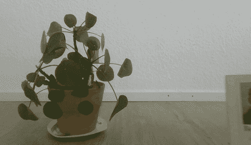

# 用 C++中的 OpenCV 构建人脸检测器

> 原文：<https://medium.com/analytics-vidhya/building-a-face-detector-with-opencv-in-c-8814cd374ea1?source=collection_archive---------8----------------------->


奥米德·阿明在 [Unsplash](https://unsplash.com?utm_source=medium&utm_medium=referral) 上拍摄的照片

在这篇博文中，我将解释如何用 [OpenCV](https://opencv.org/) 中的机器学习组件构建人脸检测算法。我们将使用 OpenCV 从相机中读取图像并检测其中的人脸。结果会是这样的。



贝多芬脸色阴沉

你可以在我的 github 上找到这篇博文[的所有代码。](https://github.com/bewagner/visuals/tree/blog-post-1)

# 安装 OpenCV

我们将使用 OpenCV 及其 OpenCV_contrib 模块的一些相当新的部分。确保您可以访问这些模块的最方便的方法是从源代码构建 OpenCV。我在 Ubuntu 16.04 上用的是 OpenCV 4 . 2 . 0 版。为了方便起见，我包含了一个 bash 脚本，它负责安装正确的 OpenCV 版本。它还将安装所有必要的依赖项。脚本存在于 GitHub repo 附带的[中。](https://github.com/bewagner/visuals/tree/blog-post-1)

我们将使用的`cv::dnn::Net`类是在 3.4.10 版本中添加到 OpenCV 中的，所以早期版本可能也适用。但是，我没有测试这个。

# CMake 设置

我们将使用 CMake 构建我们的代码。为此，我们创建了一个带有单个可执行文件的 CMake 项目，并将 C++标准设置为 14。

```
cmake_minimum_required(VERSION 3.0) 
project(OpenCVFaceDetector LANGUAGES CXX) add_executable(${PROJECT_NAME} main.cpp) target_compile_features(${PROJECT_NAME} PUBLIC cxx_std_14) target_include_directories(${PROJECT_NAME} PRIVATE include)
```

然后我们处理 OpenCV 依赖性。我们找到`OpenCV`包，并根据它链接我们的可执行文件。

```
# OpenCV setup 
find_package(OpenCV REQUIRED) 
target_link_libraries(${PROJECT_NAME} ${OpenCV_LIBS})
```

整个`CMakeLists.txt`文件应该是这样的。

```
cmake_minimum_required(VERSION 3.0) 
project(OpenCVFaceDetector LANGUAGES CXX)  
add_executable(${PROJECT_NAME} main.cpp) target_compile_features(${PROJECT_NAME} PUBLIC cxx_std_14) target_include_directories(${PROJECT_NAME} PRIVATE include) # OpenCV setup find_package(OpenCV REQUIRED) target_link_libraries(${PROJECT_NAME} ${OpenCV_LIBS})
```

# 从相机中获取图像

我们要做的第一件事是获取一个相机图像。幸运的是，`cv::videocapture`类使这变得容易。

我们包含了 OpenCV 头来访问 OpenCV 的功能。接下来，我们创建一个`cv::videocapture`对象，并尝试打开我们能找到的第一个相机。

```
#include <opencv4/opencv2/opencv.hpp>  
int main(int argc, char **argv) {
      cv::VideoCapture video_capture;
     if (!video_capture.open(0)) {
         return 0;
     }
```

之后，我们创建一个`cv::Mat`来保存该帧，并在一个无限循环中显示它。如果用户按下“Esc ”,我们中断循环，破坏显示窗口并释放视频捕获。

```
cv::Mat frame;
    while (true) {
        video_capture >> frame;

        imshow("Image", frame);
        const int esc_key = 27;
        if (cv::waitKey(10) == esc_key) { 
            break;
        }
    }

    cv::destroyAllWindows();
    video_capture.release();

    return 0;
}
```

到目前为止,`main.cpp`文件将如下所示。

```
#include <opencv4/opencv2/opencv.hpp>  
int main(int argc, char **argv) {
      cv::VideoCapture video_capture;
     if (!video_capture.open(0)) {
         return 0;
     } cv::Mat frame;
     while (true) {
         video_capture >> frame;
         imshow("Image", frame);
         const int esc_key = 27;
         if (cv::waitKey(10) == esc_key) {
              break;
         }
     }
     cv::destroyAllWindows();
     video_capture.release();
     return 0;
 }
```

我们现在可以显示从摄像机捕捉到的图像。😀


# 使用`cv:dnn::Net`类加载预训练的 SSD 人脸检测网络

现在我们将开始建立一个面部检测器。我们使用`cv::dnn::Net`类并从预训练的 caffe 模型中加载权重。

因为将所有功能放在一个地方很好，所以我们为模型创建了一个类`FaceDetector`。所以首先，我们创建两个新文件`src/FaceDetector.cpp`和`include/FaceDetector.h`。为了确保我们的代码仍然可以构建，我们将实现文件添加到 CMake 目标中。也就是说，转到您的`CMakeLists.txt`，将包含`add_executable(...)`的行更改为如下所示

`add_executable(${PROJECT_NAME} src/main.cpp src/FaceDetector.cpp)`

在`include/FaceDetector.h`中，我们定义了这个类。该模型有一个构造函数，我们将在其中加载模型权重。此外，它还有一个方法

`std::vector<cv::Rect> detect_face_rectangles(const cv::Mat &frame)`

它接收一个输入图像，给我们一个检测到的人脸向量。

```
#ifndef VISUALS_FACEDETECTOR_H 
#define VISUALS_FACEDETECTOR_H 
#include <opencv4/opencv2/dnn.hpp>  
class FaceDetector { 
public:     
explicit FaceDetector();
/// Detect faces in an image frame 
/// \param frame Image to detect faces in 
/// \return Vector of detected faces     
std::vector<cv::Rect> detect_face_rectangles(const cv::Mat &frame);
```

我们将实际的网络保存在私有成员变量中。除了模型，我们还将保存

*   `input_image_width/height_`输入图像的尺寸
*   `scale_factor_`将图像转换为数据块时的缩放因子
*   `mean_values_`训练网络的每个通道的平均值。将图像转换为数据 blob 时，将从图像中减去这些值。
*   `confidence_threshold_`检测人脸时使用的置信度阈值。该模型将为每个检测到的面部提供置信度值。置信度值为> = `confidence_threshold_`的人脸将被保留。所有其他面都将被丢弃。

```
private:     
/// Face detection network     
cv::dnn::Net network_;     
/// Input image width     
const int input_image_width_;     
/// Input image height     
const int input_image_height_;     
/// Scale factor when creating image blob     
const double scale_factor_;     
/// Mean normalization values network was trained with     
const cv::Scalar mean_values_;     
/// Face detection confidence threshold     
const float confidence_threshold_;  
};  

#endif //VISUALS_FACEDETECTOR_H
```

完整的头文件在这里是。

接下来，让我们开始实现上面定义的函数。我们从构造函数开始。对于大多数成员变量，我们输入正确的值。

```
#include <sstream> 
#include <vector> 
#include <string> 
#include <FaceDetector.h> 
#include <opencv4/opencv2/opencv.hpp> FaceDetector::FaceDetector() :
     confidence_threshold_(0.5),
     input_image_height_(300),
     input_image_width_(300),
     scale_factor_(1.0), 
     mean_values_({104., 177.0, 123.0}) {
```

在构造函数内部，我们将使用`cv::dnn::readNetFromCaffe`将模型加载到我们的`network_`变量中。`cv::dnn::readNetFromCaffe`需要两个文件来构建模型:第一个 [(deploy.prototxt)](https://github.com/bewagner/visuals/blob/blog-post-1/assets/deploy.prototxt) 是描述模型架构的模型配置。第二个[(res10 _ 300 x300 _ SSD _ ITER _ 140000 _ fp16 . caffemodel)](https://github.com/bewagner/visuals/blob/blog-post-1/assets/res10_300x300_ssd_iter_140000_fp16.caffemodel)是模型权重的二进制数据。

我们可以在构建后将这些文件移动到包含我们的二进制文件的目录中。但是这个解决方案是相当脆弱的，因为当二进制移动的时候它就崩溃了。因此，我们通过 CMake 传入文件位置。

# 快速跳回我们的 CMake 配置

在这篇 StackOverflow 文章中，我发现了一个传递文件路径给 C++的好方法。他们建议将路径作为`compile_definition`传递给目标。这样，CMake 可以计算出文件的正确路径，并将其传递给一个变量。这个变量在 C++中是可用的。

也就是说，我们将下面几行添加到 CMakeLists.txt 中。

```
# Introduce preprocessor variables to keep paths of asset files set(FACE_DETECTION_CONFIGURATION
 "${PROJECT_SOURCE_DIR}/assets/deploy.prototxt")set(FACE_DETECTION_WEIGHTS
 "${PROJECT_SOURCE_DIR}/assets/res10_300x300_ssd_iter_140000_fp16.caffemodel") target_compile_definitions(${PROJECT_NAME} PRIVATE  FACE_DETECTION_CONFIGURATION="${FACE_DETECTION_CONFIGURATION}") target_compile_definitions(${PROJECT_NAME} PRIVATE  FACE_DETECTION_WEIGHTS="${FACE_DETECTION_WEIGHTS}")
```

# 整理`FaceDetector.cpp`中的方法

既然我们找到了访问必要文件的方法，我们就可以构建模型了。

```
FaceDetector::FaceDetector() :
     confidence_threshold_(0.5),
      input_image_height_(300),
      input_image_width_(300),
     scale_factor_(1.0),
     mean_values_({104., 177.0, 123.0}) {
         // Note: The variables MODEL_CONFIGURATION_FILE
         // and MODEL_WEIGHTS_FILE are passed in via cmake
         network_ = cv::dnn::readNetFromCaffe(FACE_DETECTION_CONFIGURATION,
                 FACE_DETECTION_WEIGHTS);
      if (network_.empty()) {
         std::ostringstream ss;
         ss << "Failed to load network with the following settings:\n"
            << "Configuration: " + std::string(FACE_DETECTION_CONFIGURATION) + "\n"            
            << "Binary: " + std::string(FACE_DETECTION_WEIGHTS) + "\n";
         throw std::invalid_argument(ss.str());
     }
```

接下来就是实施`detect_face_rectangles`。我们首先将输入图像转换成数据块。函数`[cv::dnn::blobFromImage](https://www.pyimagesearch.com/2017/11/06/deep-learning-opencvs-blobfromimage-works/)`负责将图像重新缩放到网络的正确输入尺寸。它还会减去每个颜色通道中的平均值。

```
std::vector<cv::Rect> FaceDetector::detect_face_rectangles(const cv::Mat &frame) {
     cv::Mat input_blob = cv::dnn::blobFromImage(frame,
             scale_factor_,
             cv::Size(input_image_width_, input_image_height_),
             mean_values_,
             false,
             false);
```

接下来，我们可以通过网络转发我们的数据。我们将结果保存在变量`detection_matrix`中。

```
 network_.setInput(input_blob, "data");
     cv::Mat detection = network_.forward("detection_out");
     cv::Mat detection_matrix(detection.size[2],
             detection.size[3],
             CV_32F,
             detection.ptr<float>());
```

我们遍历矩阵的行。每行包含一个检测。当迭代时，我们检查置信度值是否超过我们的阈值。如果是这样，我们构造一个`cv::Rect`并保存在结果向量`faces`中。

```
std::vector<cv::Rect> faces;

    for (int i = 0; i < detection_matrix.rows; i++) {
        float confidence = detection_matrix.at<float>(i, 2);

        if (confidence < confidence_threshold_) {
            continue;
        }
        int x_left_bottom = static_cast<int>(
                detection_matrix.at<float>(i, 3) * frame.cols);

        int y_left_bottom = static_cast<int>(
                detection_matrix.at<float>(i, 4) * frame.rows);

        int x_right_top = static_cast<int>(
                detection_matrix.at<float>(i, 5) * frame.cols);

        int y_right_top = static_cast<int>(
                detection_matrix.at<float>(i, 6) * frame.rows);

        faces.emplace_back(x_left_bottom,
                y_left_bottom,
                (x_right_top - x_left_bottom),
                (y_right_top - y_left_bottom));
    }

    return faces;
}
```

这就结束了我们对`FaceDetector`的实现。点击[此](https://github.com/bewagner/visuals/blob/blog-post-1/src/FaceDetector.cpp)链接查看全文。cpp 文件。

# 可视化检测到的人脸

因为我们将人脸检测器实现为一个类，所以可视化矩形很容易。首先，包含`FaceDetector.h`头文件。然后，我们创建一个`FaceDetector`对象并调用`detect_face_rectangles`方法。接下来，我们使用 OpenCV 的`rectangle`方法在检测到的人脸上绘制一个矩形。

```
#include <opencv4/opencv2/opencv.hpp> 
#include "FaceDetector.h"
int main(int argc, char **argv) {
      cv::VideoCapture video_capture;
     if (!video_capture.open(0)) {
         return 0;
     } FaceDetector face_detector; cv::Mat frame;
     while (true) {
         video_capture >> frame; auto rectangles = face_detector.detect_face_rectangles(frame);
         cv::Scalar color(0, 105, 205);
         int frame_thickness = 4;
         for(const auto & r : rectangles){
             cv::rectangle(frame, r, color, frame_thickness);
         }
         imshow("Image", frame);
         const int esc_key = 27;
         if (cv::waitKey(10) == esc_key) {
             break;
         }
     }
     cv::destroyAllWindows();
     video_capture.release(); return 0;
 }
```

如果我们运行这个，我们会看到贝多芬的脸周围有一个矩形！


# 总结

我们关于 OpenCV 中人脸检测的帖子到此结束。我们看到了如何在 OpenCV 中使用预训练的 SSD 网络来抓取相机图像并在其中找到人脸。

如果你喜欢我的写作，考虑支持我，这样我可以继续为你创造内容！

[](https://ko-fi.com/bewagner)[](https://www.patreon.com/bewagner?fan_landing=true)

**在 Twitter 上关注我**[**@ be Wagner _**](https://twitter.com/bewagner_)**了解更多关于编程、机器学习和 C++！**

*最初发布于*[*https://be Wagner . github . io*](https://bewagner.github.io/programming/2020/04/12/building-a-face-detector-with-opencv-in-cpp/)*。*