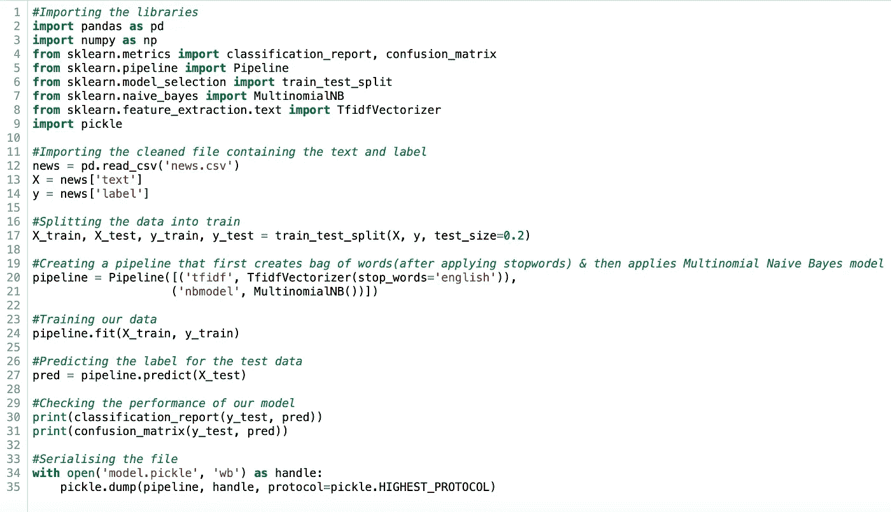
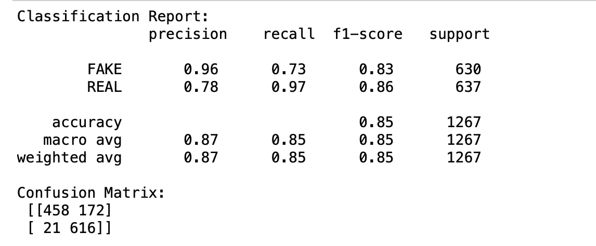
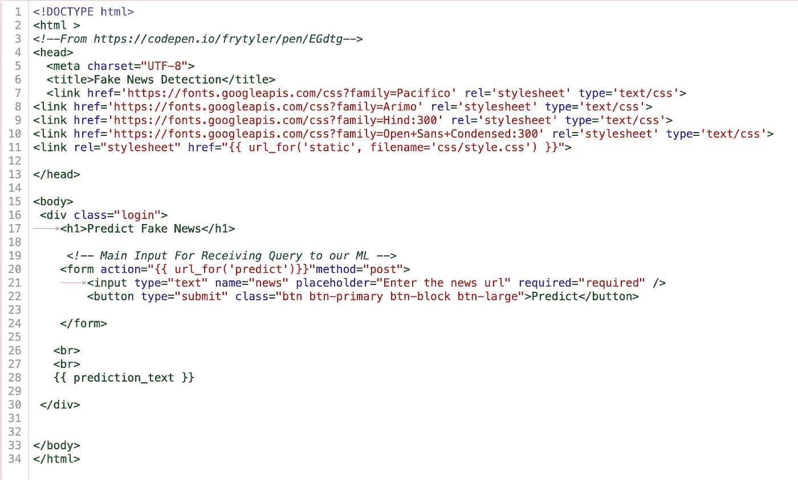
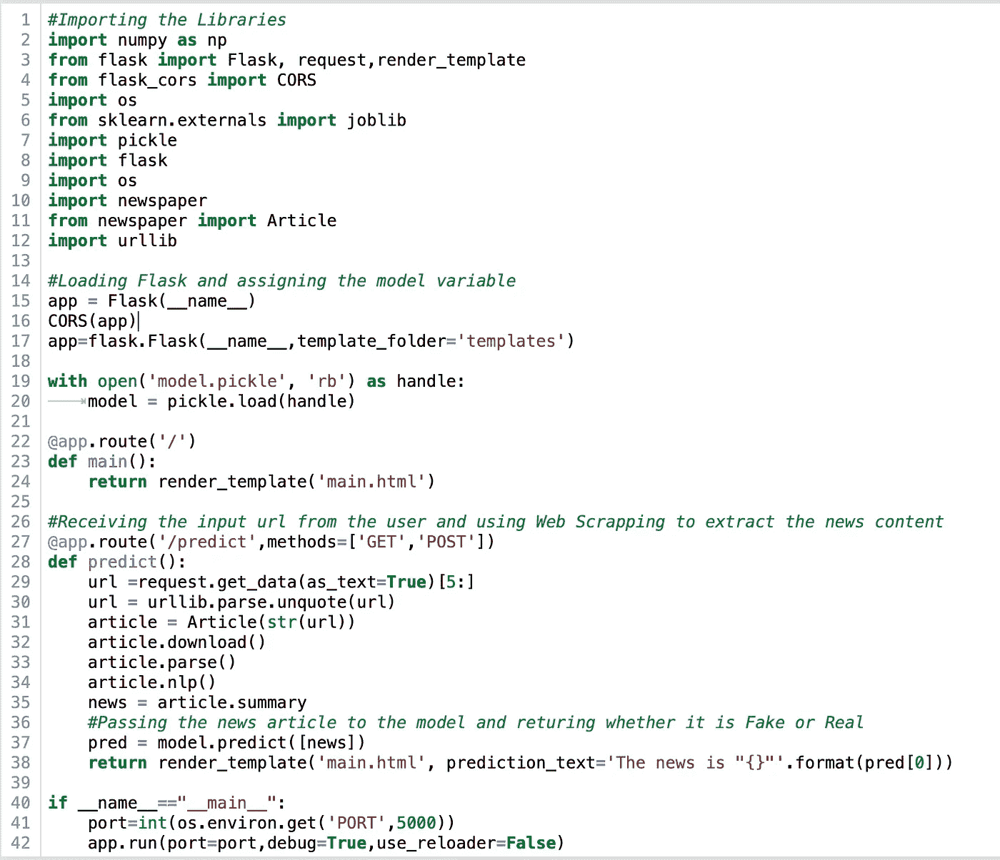
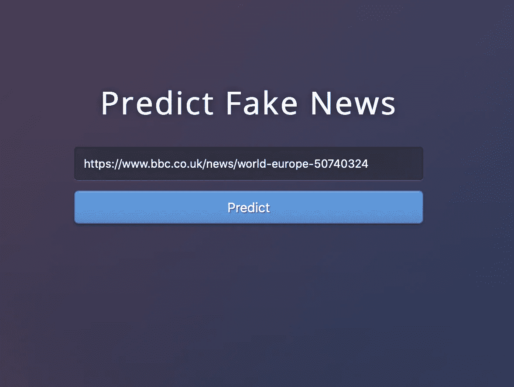
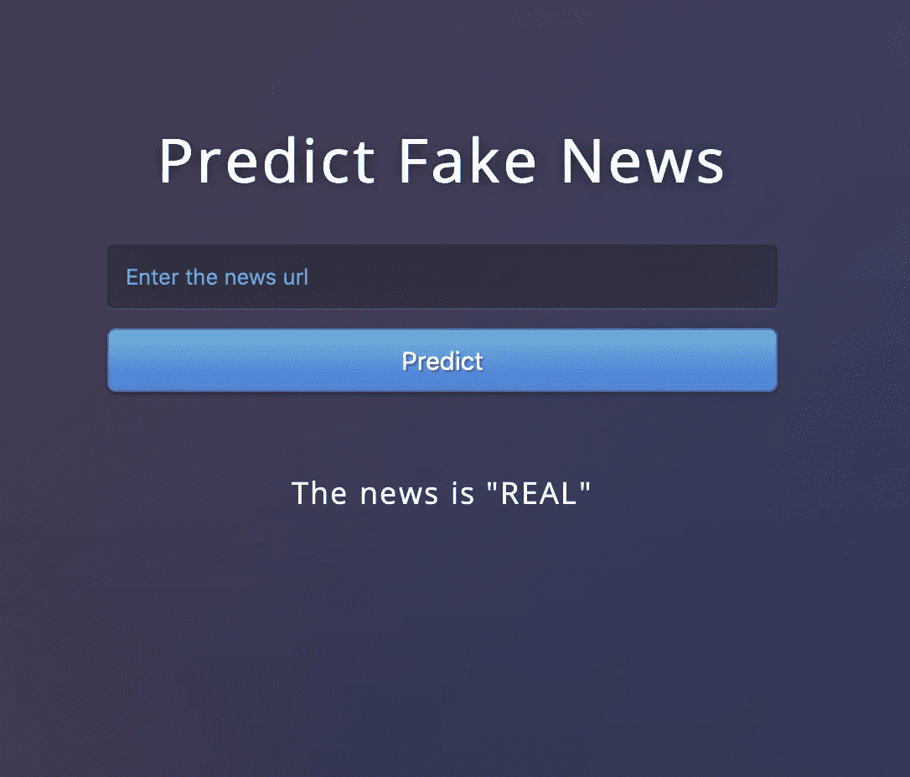
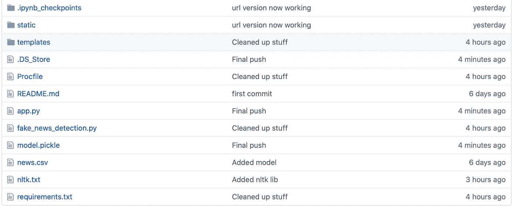
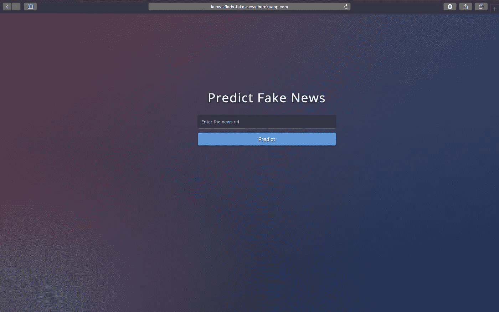

# 构建假新闻分类器&使用 Flask 部署它

> 原文：<https://medium.com/analytics-vidhya/building-a-fake-news-classifier-deploying-it-using-flask-6aac31dfe31d?source=collection_archive---------5----------------------->

在我们开始之前，为什么不试试[假新闻分类 app](https://ravi-finds-fake-news.herokuapp.com) 。

作为一名初露头角的数据科学家，我们为解决了一个问题并开发了一个模型来解决它而感到非常自豪。我们通过清理数据、可视化数据、为模型做准备，然后通过开发和改进模型的迭代过程来工作。

看起来大多数“数据科学的东西”似乎已经在这个阶段结束了。那么，除此之外还有什么呢？

这就是你在这里的原因。我们将学习部署我们的模型，并使其具有交互性。但在继续之前，我希望您熟悉以下内容:

1.  **Pickle:***【Pickle】*是将 Python 对象层次转换成字节流的过程，*【unpickling】*是逆操作，将字节流转换回对象层次。有关详细信息，请访问官方文档[此处](https://docs.python.org/3/library/pickle.html)。
2.  **Flask App:** 它是一个 web 服务器网关接口(WSGI) web 应用框架，旨在创建 Web 应用。超级方便，代码简单。公文[此处](https://flask.palletsprojects.com/en/1.0.x/api/#flask.Flask)。
3.  **Newspaper3k 库:** Newspaper 是一个了不起的 python 库，用于提取&策展文章。[官方文档](https://newspaper.readthedocs.io/en/latest/)解释得好。
4.  **TF-IDF:** 词频-逆文档频数是一种数字统计，旨在反映一个词对集合或语料库中的文档有多重要。在这里阅读它。
5.  **多项朴素贝叶斯:**它依赖于将文档非常简单地表示为“单词包”。它估计给定类别的特定单词的条件概率，作为属于类别(c)的文档中术语 t 的相对频率，在我们的情况下是假的或真实的。简单解释一下这个[环节](https://web.stanford.edu/~jurafsky/slp3/slides/7_NB.pdf)。

# 构建模型

是时候开始瞄准那些假新闻了。首先，让我们用通常的东西来建立模型。我上传了将用于部署模型的 python 文件的截图。我不能详细解释发生了什么，因为我们的主要焦点是模型部署。评论应该是自我解释的。

开发新闻分类模型

该模型在检测假新闻方面表现很好，对假新闻的准确率为 96%，对真实新闻的准确率为 78%

分类报告和混淆矩阵

# 太棒了。！让我们用 HTML 制作我们的网页

为此，我们必须在工作目录中创建一个名为“templates”的新文件夹，然后创建一个名为“main.html”的新 HTML 文件。

它从用户那里获取 url，并在页面上输出结果

# 是时候制作我们的 Flask 应用了

让我们在一个新的 python 文件中创建 flask 应用程序。

有趣的是，我们使用“Newspaper3k”库从新闻 url 中提取新闻文章。然后，它将文章提供给模型，模型返回文章的真假。

# 魔力

现在我们可以简单地运行包含 flask 应用程序的文件，它会在命令提示符下给你一个 url。在浏览器中复制粘贴即可。它看起来会像这样。

只需输入网址并点击预测

瞧，成功了

# 让我们把这个放到网上

用 heroku 把它放到网上很简单。我们只需要在工作目录中添加几个额外的文件。它们大多对应于 heroku 在构建和部署应用程序时需要导入的库。这些都可以在 heroku 网站上找到。所以，你只需要登录，选择你的应用程序的名称，连接你的 github 库并部署。网站上提供了步骤和终端命令。在流程的最后，存储库看起来像这样。

一旦模型部署完毕，heroku 将给出应用程序所在网站的名称。

实时应用程序

就是这样！！我们完了。所以，在你的下一个项目中，为什么不超越并为你已经制作的模型创建一个应用程序呢？

所有的文件都可以在我的 [github](https://github.com/ravidahiya74/Fake-news-detection) 库中找到。如果你学到了新的东西，请鼓掌，如果你需要任何帮助，请告诉我。