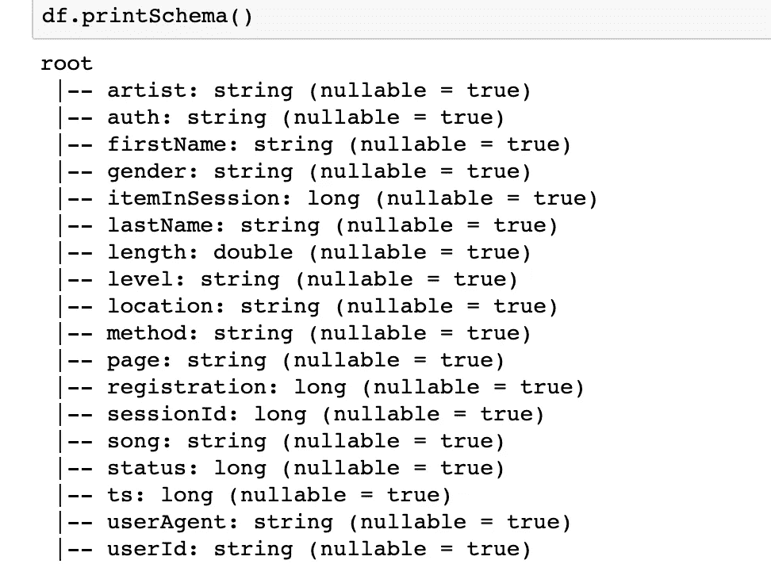

# 使用 PySpark 构建特征工程管道和 ML 模型

> 原文：<https://medium.com/analytics-vidhya/building-a-feature-engineering-pipeline-and-ml-model-using-pyspark-7036375cd081?source=collection_archive---------7----------------------->

这些天我们都在建立很多机器学习模型，但是如果数据集很大，你无法在本地处理它，或者你需要一些分布式计算来处理，并在更短的时间内进行特征工程，你会怎么办。想到的一件事就是**火花**。

大多数数据科学家都熟悉 python，但 Spark 是在 scala 中，所以我们是要学习一门新的语言，还是我们只能用 Python 做一些事情。接下来是 **PySpark** ，一个 Spark 的 python 包装器，用 python 提供 spark 的功能，语法非常类似于 Pandas。

在这篇博客中，我将介绍使用 PySpark 构建机器学习模型的步骤。对于这个项目，我们使用 Udacity 提供的名为 Sparkify 的音乐流媒体公司的事件数据。我们将创建一个 ML 模型来预测哪个客户可能会流失。

# **数据探索**

该数据集包含 225 个客户的应用事件，包含他们在应用上执行的所有活动，该数据集看起来很小，因为它是完整数据集的子集。我使用这个小的子集是因为我不打算在这个过程中使用任何 EMR 集群，我将在 Udacity 提供的工作空间中执行它。因此，我们将处理这些大约 30 万个事件数据。

提供的数据集的架构。

页面栏似乎对我们非常重要，它讲述了用户与应用程序的所有交互。用户与应用程序的互动越少，客户离开的可能性就越大。下面是几页。

页面数据

这样，我们就可以知道用户何时升级或取消订阅。

## 定义流失

在对提供的数据进行了一些分析后，我想到了一个问题，即客户是否访问了“取消确认”页面。

请查看以下页面，了解是否有用户访问过取消确认。

上面的图表清楚地显示，降级用户的活动比高级用户少得多。我根据上图为模型选择的页面是:

> 主页
> 
> 添加到播放列表
> 
> 添加朋友
> 
> 赞同
> 
> 下一首歌

性别一栏似乎也很重要，因为在搅拌或不搅拌的用户中有很大的差距。

## 数据预处理:

在数据准备中，我检查了数据中的空值和重复值。从前面数据中的所有列中，我发现很少有列(在下一节中提到)用作我们模型的特征。我在需要的地方处理数据副本和空值。

在数据准备期间，我面临的一个挑战是最初我为用户总量创建了每小时一次的窗口，但是在那种情况下，数据非常不平衡。然后，我尝试使用每周窗口大小在这些功能的基础上创建聚合，效果非常好。

这是我们的数据经过一些清理和处理后的样子。

## 特征工程

现在来看特征工程，我们将使用它来训练模型。

1.  用户性别。
2.  在应用程序上的最后一次活动时，客户是否获得了付款。
3.  用户的平均会话长度。
4.  最近 4 周会员资格的每周用户交互计数。

“ts”列包含以毫秒为单位的交互时间戳。首先，我将获得用户最后一次活动的周数。

我保持每周的交互次数，我用窗口函数来做。

这个**窗口**函数与 Groupby 非常相似，它只为我们创建的窗口创建聚合，在上面的示例中，我们只使用上周的窗口。

此外，我在功能创建过程中使用了很多 UDF 的作品。T2 UDF T3 只是 PySpark 中的一个匿名函数，非常类似于 python 中的 lambda 函数。你可以在下图中找到一些。

对于平均会话长度，我首先根据 user_id 和 session_id 进行分组，并通过删除重复项来保留最大会话记录，我们为每个用户保留一行会话长度。下面是我编写的创建平均会话长度特性的方法。

我创建了另一个窗口函数来获取用户在最后一次交互时的成员状态。下图显示了成员状态功能的代码。

为了训练 ML 模型，它只需要数字输入，所以我使用下面的代码将成员身份和性别转换为数字值。

生成特征后，下面是我们拥有的数据集的模式。

最终数据集架构

# 建模

spark 中机器学习模型的常用库有 ML 和 MLLib。我已经为这个项目使用了 ML，因为它是最新的一个。

现在，我们已经拥有了将用于训练模型的所有特征，我已经使用了 Standardscaler 来标准化这些特征，并使用 80:20 分割来训练和测试数据集。

我在这个项目中使用了逻辑回归和随机森林分类器，你也可以尝试其他算法。这里我没有使用 boosting 算法，因为数据集非常小。

我使用 ml.tuning 库的 ParamGridBuilder 函数进行超参数调优。下面是我用于线性回归算法的配置。

逻辑回归模型

随机森林模型的配置

随机森林分类器模型

对于逻辑回归，使用的**正则化参数**为 0.1 和 0.2，**弹性网**参数为 0.1 和 0.2，并且**最大迭代次数**为 10，对于随机森林算法，我们使用每个节点的最小实例为 1 和 3，Gini 和熵作为杂质算法，并且树的数量为 20 或 30。

# 指标:

逻辑回归模型的结果

随机森林分类器在测试数据集上的结果

选择正确的指标集来评估机器学习模型很重要，这里我选择了模型的 f1 分数和准确性作为评估指标。 **F1 分数**基本上说明了一个机器学习模型有多健壮和精确，对于这些模型，我在 F1 分数的基础上做了超参数调优，只是为了改善模型的结果。

最初，我从**逻辑回归**模型开始，我用几个参数进行了尝试，上面的截图显示了我从中获得的最佳结果，然后我认为**随机森林**可以在这里给出更好的结果，在几个超参数**调整后，**它领先于逻辑回归。

基于上述结果截图，我们可以说，与 F1 分数为 0.83 且准确率为 96%的逻辑回归相比，随机森林分类器在测试数据集上给出了更好的结果。

随机森林**比逻辑回归**工作得更好，因为根据我所做的分析，最终的特征集只包含重要的特征，因为数据中的噪声更少，随机森林给了**比逻辑回归更好的结果**。在数据准备过程中，我们删除了所有对模型预测客户流失没有帮助的特征。

# 特征重要性

逻辑回归模型的主要功能

我使用了内置的 featureImportances 属性来获取最重要的特性，这使用了树中使用的变量的频率。

随机森林分类器模型的主要特征

## 丰富

基于我对机器学习算法的了解，我想分享一些改进，这次我在一个小数据集上运行它，但当我们在一个更大的数据集上运行它时，我认为 boosting 算法会给出更好的结果，这里我没有使用任何 Boosting 算法，因为数据集很小，这与 Boosting 算法在小数据上的结果度量不相符。此外，在大型数据集中，我们可以使用每天的窗口，而不是我们在这个项目中使用的一周。

如果你是第一次在 pyspark 中编码，那么编码是很困难的，我建议你参考 PySpark 文档**，它对我帮助很大，对于任何你可以搜索堆栈溢出的问题，我在那里找到了大多数解决方案。**

# **结论**

**如果你已经使用 scikit-learn 建立了一个机器学习模型，那么使用 Pyspark 建立模型将会很容易，我觉得没有太大的区别。但对于第一次来说，这可能是一项艰巨的工作。我认为当我们在完整的数据集上使用这些 ML 模型时，它们也会给出相当好的结果。在群集上运行时，我们还可以尝试使用不同的超级参数。进一步的细节，你得查我的 [***GitHub 库***](https://github.com/gunanksood/Sparkify-ML_Pipeline)**

**我创建了这个博客，作为我的 Udacity 数据科学家 Nanodegree 项目的一部分。**

**请随时在 Linkedin 上与我联系。非常感谢你的阅读。**