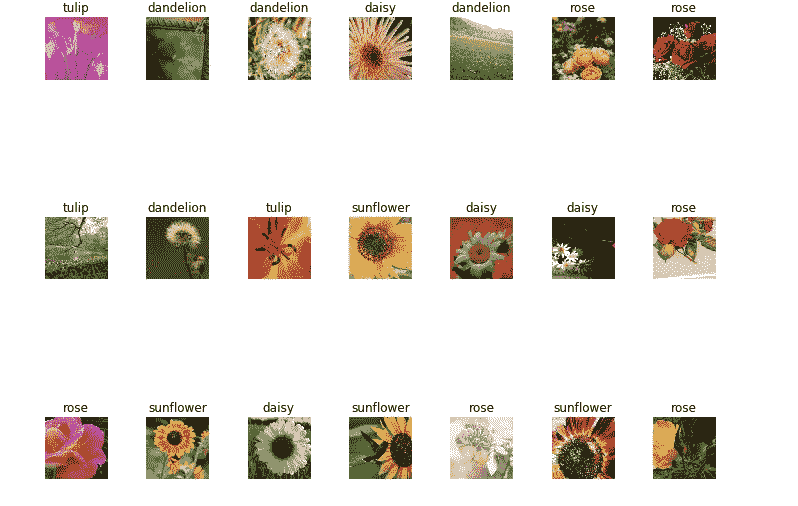
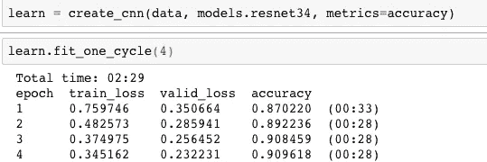
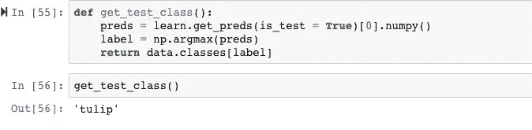

# 使用 Fast.ai 构建花卉分类器

> 原文：<https://medium.com/analytics-vidhya/building-a-flower-classifier-using-fast-ai-a815f9b25a04?source=collection_archive---------1----------------------->

## 使用 ResNet-34


为了构建我们的花分类器，我们将使用 Kaggle 提供的[花识别数据集](https://www.kaggle.com/alxmamaev/flowers-recognition/home)。图片分为五类:雏菊、郁金香、玫瑰、向日葵、蒲公英。每个班级大约有 800 张照片。

## 将数据分为训练集和验证集

由于我们的数据还没有被分成训练集和验证集，我们将使用“os”和“shutil”模块对它们进行单独划分。(假设数据集的当前路径是 data/flowers-kaggle)

## 导入包和设置批量大小

既然我们的训练和验证集已经就绪，让我们导入必要的包并设置我们的批量大小。我们将与位于 [Pytorch 1.0](https://hackernoon.com/pytorch-1-0-468332ba5163) 之上的 [fastai V1 库](http://www.fast.ai/2018/10/02/fastai-ai/)合作。

```
from fastai import *
from fastai.vision import *bs = 64
```

## 看着这些数据

我们*总是*需要很好地理解问题是什么，数据看起来像什么，然后才能想出如何解决它。查看数据意味着了解数据目录的结构，标签是什么，以及一些示例图像是什么样子。

您的输出应该如下所示:



## 培训:resnet34

我们现在使用 resnet34 卷积神经网络模型的预训练权重来[到](https://sajfd-hfafbjhd-akshaye.herokuapp.com)训练我们的模型。我们将为训练[4 个时期(通过我们所有数据的 4 个周期)。](http://people.tamu.edu/~akshayeap/sajfd-hfafbjhd.html)



恭喜你！我们的模型现在已经训练好了，你可以看到它的准确率超过了 90%。

## 在自定义输入上测试我们的分类器

我们可以测试我们的分类器，向它传递我们选择的任何图像，并观察它的工作情况。为此，我们需要创建一个名为 test 的文件夹，并将我们的自定义文件放入其中。要查看分类器的输出，我们首先获取图像上所有类别的预测，挑选具有最高预测的类别，然后返回该类别的类别标签:

输入图像:

