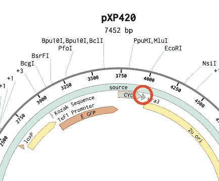

# 为 16 岁的 CRISPR 构建指导 RNA

> 原文：<https://medium.com/analytics-vidhya/building-a-guide-rna-for-crispr-as-a-16-year-old-c4d77d06ea77?source=collection_archive---------14----------------------->

对于渴望在 STEM 领域取得成功的年轻人来说，最具挑战性的部分之一是我们如何证明自己。我们怎样才能引起该领域更有权势的人的注意？

在过去的几个月里，我一直在努力争取一份实习工作或在实验室工作的机会，以发展我的基因编辑技能。但是因为新冠肺炎，这变得相当困难。

我知道我需要这些选项之外的另一种选择，于是我遇到了…

## 家用工具包

这些东西很贵，而且要花很长时间才能到达。

我决定继续研究，我遇到了板凳。

基准主页

Benchling 是一个奇妙的应用程序，对于对生物学领域感兴趣的人来说是一个非常受欢迎的程序。他们致力于让人们在不进入实验室的情况下也能获得同样的模拟和理解。

有两个原因让我决定在这个网站上做我的实验，而不是花钱和等待一个工具包。

## 1.查看和编辑质粒的能力

如果你想知道质粒是什么，它们基本上是盘状的 DNA。

查看和编辑质粒的能力允许我探索不同类型的质粒，以及我如何使用不同的东西如限制酶来改变它们。

## 2.查看和编辑 DNA 序列的能力

真正吸引我眼球的下一件大事是查看和编辑质粒的能力，这可以导致产生 CRISPR 指导 RNA。

# 我的第一个项目

这让我想到了我用 Benchling 做的第一个完整的实验，编辑酵母质粒以整合绿色荧光蛋白(GFP)。这意味着这些质粒形成的细菌会发绿光。

我设法完成了这个项目，使用了一种在生物学领域被低估的东西，叫做限制性内切酶。

现在，我没有任何特殊的训练或知识来完成这个项目。

我没有自己开始这些项目，而是在 YouTube 上寻找教程。对于这个项目，我以斯坦福生物群落的这个教程为基础:

斯坦福生物群落视频

让我们回顾一下我是如何做到这一点的。

1.  找到了一个可以使用的酵母质粒模板。我选择的模板 pxP420 可以在 addgene.org 找到

发现于 addgene.org

2.发现了一个被认为是单切酶的限制性位点。这意味着它可以通过一次切割从质粒上去除。我选择的限制性位点叫做 SAC I。

*酶是生物学中化学反应的催化剂(绿色荧光蛋白也是一种酶，这就是为什么我们把它换成另一种酶)

显示了我切下的限制性位点

3.接下来，我添加了 TEF1 启动子，它启动了 DNA →mRNA 的转录过程，因为 GFP 被认为是 mRNA。

显示了 TEF1 启动子

4.在这之后，我添加了科萨克序列，允许翻译过程(将 DNA 转变成蛋白质)发生。GFP 是一种蛋白质，所以我们需要一个科萨克序列来让质粒理解 GFP。

科萨克序列

5.GFP 被添加到质粒中。重要的是，这是真核绿色荧光蛋白，因为酵母是由真核细胞组成的。

质粒中的绿色荧光蛋白

6.添加 GFP 后，我们需要停止翻译过程。我们如何做到这一点？加入终止密码子。这很容易添加，因为它只有 3 个核苷酸长:TGA 和它相应的核苷酸一起形成 DNA。

这里可以看到终止密码子

7.我们停止了翻译过程，但现在我们需要停止转录过程。我们可以通过添加终止子序列来做到这一点。在这个质粒中已经发现了终止子序列，所以很容易将其复制到终止密码子之后。它被称为 CYC1 终结者。

CYC1 终止子

8.最后，为了允许多聚体的出现(GFP 就是这样，因为它是一种蛋白质)，加入营养缺陷型选择标记是必要的。斯坦福生物群落的教程中没有提供这一部分，但我设法在酵母质粒中找到了一个常见的标记。这被称为 URA 3 号。

在哪里可以找到 URA3

这是最后的结果

# 我的第二个项目

对于第二个项目，我花时间构建了一个 CRISPR guide RNA。在过去几周深入研究基因编辑之前，我从来不知道像我这样的 16 岁少年能够做到这一点。

这是我为了能够创建指导 RNA 而经历的过程。

同样，这个项目是基于另一个 YouTube 视频。

这个实验是基于

1.我做的第一件事是我找到了一个可以编辑的人类基因。这个人类基因叫做 SCO1。

SCO1 和其中的酶

2.接下来我选择了一个外显子进行编辑。一个外显子基本上是一个基因的一部分，其编码信息允许该部分转化为蛋白质。我最终选择了外显子 2。让我们深入一点，我是如何选择这个外显子的。

*   我跟随的教程想要用他们将用于 CRISPR 的序列来切掉整个基因。这意味着序列必须在基因的早期，这样它才能破坏它。
*   我们不能从 5 UTR 区选择序列(在基因的早期)
*   为了获得最有效的方法，我们不能专注于第一个外显子，因为它不会编辑下一个外显子，因为它在它之前。

这里你可以看到我们关注的第二个外显子。如果我选择了它之前的 4 个抄本区域，我当前高亮显示的下一个抄本(顶部的一个)不会受到影响。

3.我做的下一件事是让 Benchling 创建一个我可以在 CRISPR 中使用的潜在指导 RNA 的列表。

我可以使用的潜在指导 RNA 的列表

看这张图表时，你会看到一些东西。这些是什么？

**位置**:序列在基因中的位置

**链**:阳性表示可以转录成蛋白质，阴性表示不能

**序列**:该链的核苷酸序列

PAM: PAM 序列在 CRISPR 中是非常重要的东西。它向 CRISPR 机制指示它正在寻找的链，因为它后面将有一个特殊的三核苷酸序列。这也确保了 CRISPR 使用的蛋白质不会切断 crRNA。

**靶上评分:**链被用作指导 RNA 的效率，基于它将如何通过靶上切割来表现。

**脱靶得分:**链被用作指导 RNA 的效率，基于它将如何表现脱靶潜在问题。

4.最后，我根据目标值和非目标值，以及是否在转录物所在的地方找到了序列，寻找我可以使用的最佳指南。

我选择用作指导 RNA 的序列的序列图上的可视图像

我选择的序列位于基因的第 2 583 位。

5.总而言之，当与 tracrRNA 结合时，这将是形成 gRNA 的 crRNA。我可以使用我创建的 crRNA，并将其发送到实验室，以获得我将用它创建的 CRISPR 机制的副本。

为了更好地了解我是如何完成这些项目的，请查看我最新的两个 YouTube 视频:

第一个实验视频

第二个实验视频

感谢阅读！

我是阿里·海德尔，一名 16 岁的高中生，对医学领域的各种不同主题感兴趣。

领英:[https://www.linkedin.com/in/ali-haider-023906193](https://www.linkedin.com/in/ali-haider-023906193)

YouTube:[https://www . YouTube . com/channel/ucmoukvlpuqi 4 yppp 2 ouxqyg/featured](https://www.youtube.com/channel/UCMoUKVlPuqI4YpPP2OUXqYg/featured)

中:[https://aliehsanhaider.medium.com/](https://aliehsanhaider.medium.com/)

推特:[https://twitter.com/alihaider_04](https://twitter.com/alihaider_04)