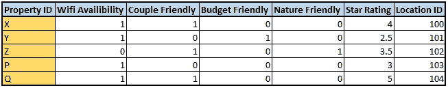
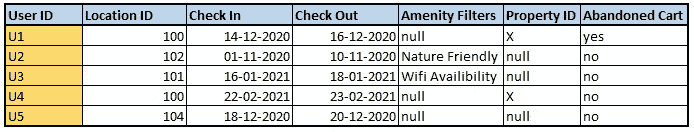
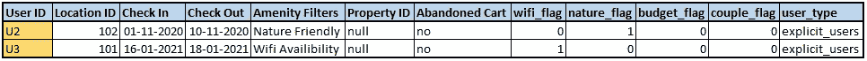
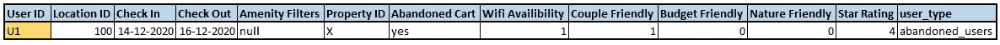
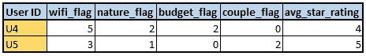
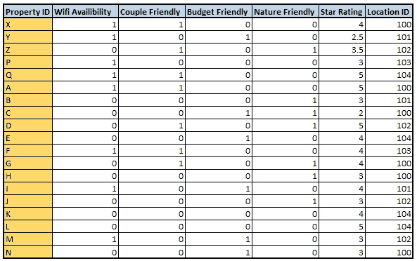
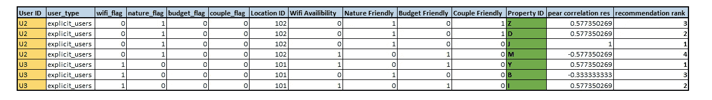
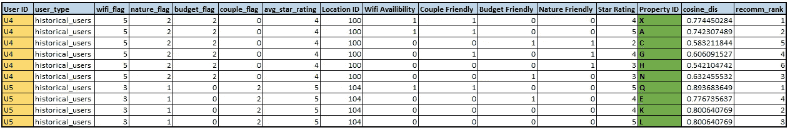
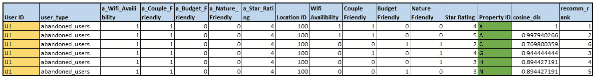
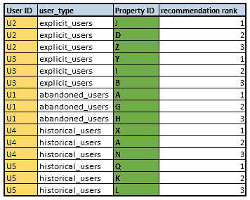

# 在 PySpark 中构建酒店推荐系统

> 原文：<https://medium.com/analytics-vidhya/building-a-hotel-recommendation-system-in-pyspark-f2d7a72dfa17?source=collection_archive---------17----------------------->

照片由[思想目录](https://unsplash.com/@thoughtcatalog?utm_source=medium&utm_medium=referral)在 [Unsplash](https://unsplash.com?utm_source=medium&utm_medium=referral) 上拍摄

> **简介:**

**什么是酒店推荐系统？**

酒店推荐系统旨在向用户推荐房产/酒店，使得他们更喜欢所推荐的房产。

**为什么需要酒店推荐系统？**

在当今这个数据驱动的世界，遵循传统的启发式方法向数百万用户推荐他们真正喜欢和偏好的商品几乎是不可能的。

因此，推荐系统解决了我们的问题，它结合了用户的输入、历史交互，有时甚至是用户的人口统计数据，以建立一个智能模型来提供推荐。

> **本博客的目标:**

在这篇博客中，我们将涵盖为下面提到的问题建立一个酒店推荐系统所需的所有步骤。我们将从数据理解、数据预处理和使用的算法及其 PySpark 代码进行端到端的实现。

***问题陈述:*** *构建一个推荐系统，为用户在 xyz.com 搜索的特定位置提供酒店推荐*

> 我们在寻找什么类型的数据？

建立一个推荐系统需要两个数据来源，**显性和隐性信号**。

显式数据是用户的直接输入，就像用户在搜索酒店时应用的过滤器(4 星级酒店或酒店游泳池的偏好)。年龄、性别和人口统计数据等信息也在明确的信号下。

隐性数据可以通过用户过去的交互获得，例如，用户偏好的平均星级，用户预订某一特定酒店类型(浪漫物业)的次数等。

> 我们将处理哪些数据？

我们将处理以下内容:

1.  用户提供偏好的明确信号，表明他们正在寻找的设施类型
2.  用户的历史房产预订
3.  用户当前的搜索结果，我们可能会也可能不会获得用户当前感兴趣的酒店信息
4.  此外，我们还有如下所示的属性信息表(hotel_info 表):

酒店信息表

*注意:我们可以创建多个属性类型(除了以上 4 个，wifi，情侣等。)巧妙地覆盖了至少一个属性类型中的最大数量的属性。然而，为了简单起见，我们将继续使用这 4 种属性类型。*

> **数据理解和准备:**

*考虑搜索数据的格式如下:*

用户 _ 搜索表

**了解用户 _ 搜索表:**

1.  可以从表中提取关于用户的信息(用户 ID)、他们正在搜索的位置(位置 ID)、他们的入住和退房日期、在进行搜索时应用的偏好(舒适性过滤器)、在搜索时专门查看的酒店(酒店 ID)以及他们是否要预订该酒店(废弃的购物车=“是”意味着他们还没有进行预订，只剩下付款)
2.  显然，我们没有用户进行搜索的所有信息，因此，我们将把用户分成 3 类，即**显式用户**(舒适性过滤器列不为空的用户)**放弃的用户**(放弃的购物车列为“是”的用户)，最后是**历史用户**(我们拥有其历史预订信息的用户)

**准备数据:**

为了将用户分成 3 个类别(显式、已放弃、历史)，我们按以下顺序给出优先级: ***已放弃用户>显式用户>历史用户。*** 这个优惠订单是因为以下原因:

*   *废弃的购物车为我们提供了关于用户正要购买的产品的信息。我们可以利用这些信息给出类似于购物车中产品的推荐，因为被放弃的产品代表了用户的偏好。因此，给予被放弃的用户最高的优先级。*
*   *显式信号是用户直接给出的输入。用户通过便利设施栏直接说出自己的偏好。因此，显式用户排在顺序的下一位。*

可以按照以下步骤分割用户:

*   首先，创建一个新列 user_type，在该列下，每个用户将被指定一个类型，即**已放弃、显式或历史**
*   使用以下逻辑可以创建 user_type 列:

现在，user_search 表也有了 user_type。此外，

*   对于**显式用户**，user_feature 列将如下所示:

显式用户信息表

*   对于**被放弃的用户**，将用户提供的属性 id 与 hotel_info 表中的属性 id 连接后，输出如下:

放弃的用户信息表

*   对于**历史用户**，对用户求和并计算用户预订特定酒店类型的总次数，数据如下所示:

历史 _ 用户 _ 信息表

*对于 historical_users_info 表中的 U4，我们有信息告诉我们用户偏好平均星级 4，已经预订了 5 次 WiFi 物业，等等，最终告诉我们用户的属性偏好…*

> **建立推荐系统:**

手头数据:

*   我们有用户分割和用户的偏好作为用户特征
*   我们有来自 hotel_type 表的酒店属性，假设它包含以下值:

酒店类型表

> 我们将使用基于内容的过滤来构建我们的推荐模型。对于每一次拆分，我们将使用一种算法来给出最佳结果。

*为了更好地理解推荐系统和基于内容的过滤，可以参考这里的***。**

*注意:我们必须根据用户搜索的位置给出建议。因此，我们将在键位置 ID 上执行一个左连接，以获取位置中的所有属性。*

***构建系统:***

*对于显式用户，我们将按以下方式进行:*

*   *我们有 wifi_flag，budget_flag 等用户属性。**将这个与 location ID 键上的 hotel_type 表连接起来，以获得所有的属性及其属性***
*   *执行 Pearson 关联将为我们提供用户和酒店特征之间的得分([-1，1])，最终帮助我们在该位置提供推荐*

***明确用户代码:***

*我们的输出将如下所示:*

**

*显式用户*

*对于被放弃的用户和历史用户，我们将进行如下操作:*

*   *使用上面创建的数据，即废弃用户信息和历史用户信息表，我们以 wifi 可用性或 WiFi 标志、星级或平均星级等形式获得用户偏好*
*   ***将其与 location ID 键上的 hotel_type 表连接，以获取所有酒店及其属性***
*   *执行余弦相似性来查找在该特定位置推荐给用户的最佳酒店*

***废弃用户代码:***

***历史用户代码:***

*我们的输出将如下所示:*

**

*历史用户*

**

*被遗弃的用户*

***给出推荐:***

*给每个用户 3 个建议，我们的最终输出将如下所示:*

**

**注:**

*   **可以注意到，我们没有使用被放弃的用户 U1 的酒店推荐 X 作为第一推荐，我们避免使用 so，因为酒店功能是从相同的酒店 ID 创建的，因此，它将始终位于排名 1**
*   **与余弦相似度不同，余弦相似度将 0 视为负面偏好，皮尔逊相关不会惩罚没有输入的用户，因此我们将后者用于显式用户**

> ***结论:***

*最终，目标是完全理解问题陈述，处理可用的数据，并为新生系统提供建议。*