# 使用 Python 对纽约出租车出行时长数据集建立线性回归模型

> 原文：<https://medium.com/analytics-vidhya/building-a-linear-regression-model-on-the-new-york-taxi-trip-duration-dataset-using-python-2857027c54f3?source=collection_archive---------0----------------------->

*Anuradha 参加了* [*应用机器学习*](https://courses.analyticsvidhya.com/courses/applied-machine-learning-beginner-to-professional) *课程，并在受欢迎的纽约市出租车旅行持续时间数据集上展示了她的项目。*


照片由[杨奇煜·巴赞内格](https://unsplash.com/@fbazanegue?utm_source=medium&utm_medium=referral)在 [Unsplash](https://unsplash.com?utm_source=medium&utm_medium=referral) 上拍摄

这是之前对同一数据集的探索性数据分析的延续。如果你还没有检查过，我强烈建议你先检查一下。这里可以找到[这里](/analytics-vidhya/exploratory-data-analysis-of-nyc-taxi-trip-duration-dataset-using-python-257fdef2749e)。使用的数据集可以从[这里](https://data.cityofnewyork.us/Transportation/2017-Yellow-Taxi-Trip-Data/biws-g3hs)下载

在这里，我们将从我们离开的地方继续下去。

EDA 完成的快速回顾。

1.  我们加载了相关的库和数据集。
2.  我们确定了分类的和连续的特征。
3.  对于目标列 trip_duration，我们对一些列进行了单变量分析，对一些列进行了双变量分析。我们通过这些过程确定了一些异常值，并用相关值对它们进行估算。
4.  我们根据 EDA 得出了一些结论。

这里我们将继续对一些特征进行**变换**和**分析**，以识别异常数据点。我们还将进行一些**异常值处理**。在进入最后的模型构建阶段之前，我们将估算或删除它们。

我们还将在需要的时候和地方导入新的 Python 库。

让我们先来看一些特性:

**行程 _ 持续时间**

我们将看看出现的最大和最小的 Trip_Duration 值。

```
print('The value of largest 5 trip duration values are as follows : \n {} '.format(df['trip_duration'].nlargest(5)))
print('The the number of rows with 1 as their trip duration values is {}'.format(len(df[df['trip_duration']==1 ])))
```

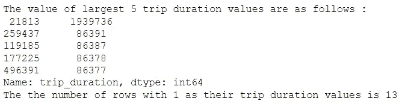

我们看到有 1 个非常大的值和 13 个持续时间为 1 秒的值，这是荒谬的。因此，我们将删除这些行。

```
df=df[df.trip_duration!=df.trip_duration.max()]
df=df[df.trip_duration!=df.trip_duration.min()]
```

我们现在将创建另一列，用小时表示 trip_duration。这将在以后用于找出每次旅行的速度

```
df['trip_duration_hour']=df['trip_duration']/3600 
```

**乘客数量**

我们将看看乘客计数频率

```
df.passenger_count.value_counts()
```

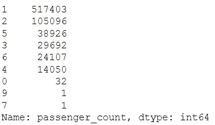

这里，与整个数据集相比，乘客数量为 0、9 和 7 的记录数量非常少。因此，我们将删除这些值。

```
df=df[df.passenger_count<=6]
df=df[df.passenger_count!=0]
```

**接送日期时间和接送日期时间**

在上一篇文章中，我们已经将这两列转换为 datetime 类型。现在我们创建新的列来描述特定旅行发生的月份和星期几。

```
df['pickup_day']=df['pickup_datetime'].dt.day_name()
df['dropoff_day']=df['dropoff_datetime'].dt.day_name()
df['pickup_month']=df['pickup_datetime'].dt.month
df['dropoff_month']=df['dropoff_datetime'].dt.month
```

让我们看一下接送月分布的分布

```
df['pickup_month'].value_counts()
```

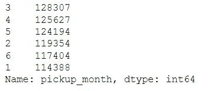

```
df['dropoff_month'].value_counts()
```

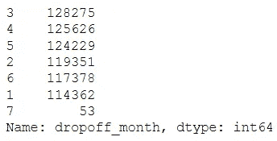

x

所有月份的行程分布均匀。没有 6 月份以后几个月的数据。7 月份几乎没有下降月份的数据。它也可能是异常值。我们将不得不对此进行调查。

对于 7 月完成的卸货，我们将找到相应提货月份的频率分布。我们也找到了相应的日期。

```
print(df[df.dropoff_month==7].pickup_datetime.dt.month.value_counts())
print(df[df.dropoff_month==7].pickup_datetime.dt.day.value_counts())
```

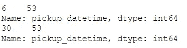

因此，我们看到所有的提货都是在 6 月 30 日完成的，而卸货是在 7 月完成的。所以数据看起来没问题。

**行程距离、速度、时间**

我们正在创建一个函数，它使用哈弗线距离公式返回一对纬度和经度之间的距离。

```
#a function is created to calculate the distance from latitudes and longitudes
from math import radians, cos, sin, asin, sqrtdef haversine(df):
    lat1, lon1, lat2, lon2 = df.pickup_latitude,df.pickup_longitude,df.dropoff_latitude,df.dropoff_longitude 
    R = 3959.87433 # this is in miles.  For Earth radius in kilometers use 6372.8 kmdLat = radians(lat2 - lat1)
    dLon = radians(lon2 - lon1)
    lat1 = radians(lat1)
    lat2 = radians(lat2)a = sin(dLat/2)**2 + cos(lat1)*cos(lat2)*sin(dLon/2)**2
    c = 2*asin(sqrt(a))return R * c
```

我们将对每一行应用此函数，并创建一个新的要素距离，该距离以千米为单位存储接送点之间的距离。

```
df['distance'] = df.apply(lambda x: haversine(x), axis = 1)
```

我们将根据 trip_duration 值查看此距离特征的分布。

```
sns.scatterplot(x='distance',y='trip_duration',data=df)
```

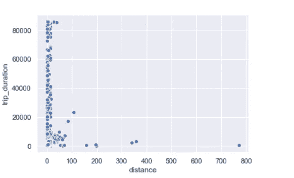

我们可以看到几个值远远超过 200km 的异常值和许多 trip_distance = 0km 的值。这些可能是描述取消的乘坐的行。让我们看看有多少这样的游乐设施。

```
print('The no of rows with distance =0 are {}'.format(len(df[df.distance==0])))
```

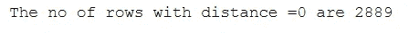

那是一个相当大的数字！我们不会删除这些行。相反，我们将用平均距离代替这些数据

```
mean_dist=df['distance'].mean()
df.loc[df['distance']==0,'distance']=mean_dist
```

我们现在将创建一个名为速度的新功能。这将有助于我们识别耗时和距离不匹配的数据点。我们还将看看出行速度的分布。

```
df['speed']=df['distance']/df['trip_duration_hour']
sns.boxplot(df['speed'])
```

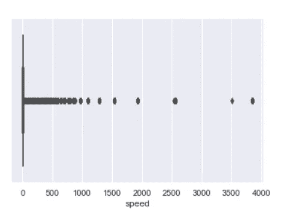

这里我们看到几个异常值。纽约市出租车的平均速度约为 11 公里/小时。数据中有几个数据点的速度远远超过了这个数字。

我们现在来看看距离变量相对于以小时为单位的出行持续时间的分布特征。

```
sns.scatterplot(x='distance',y='trip_duration_hour',data=df)
```

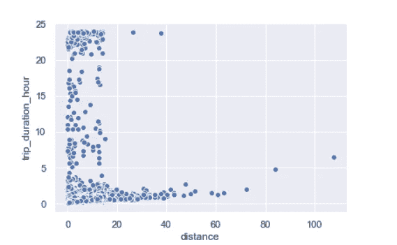

这里我们看到几个数据点的距离是< 20 km and the time taken to be > 10 小时。这是非常荒谬的平均速度是 11 公里/小时。这可能是因为道路极度拥挤。让我们对这些列进行 log 变换，并再次查看分布情况。

```
df['log_distance']=np.log(df.distance)
df['log_trip_duration']=np.log(df.trip_duration_hour)sns.scatterplot(x='log_distance',y='log_trip_duration',data=df)
```

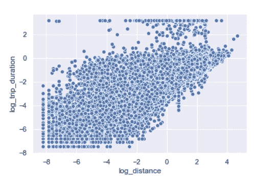

这里我们看到行程持续时间和距离的对数转换值具有某种线性关系。但是仍然存在一些异常数据点，其中持续时间值即使随着距离的改变也不改变。

因此，我们将删除超过 log_trip_duration > 2 的行

```
df=df[df.log_trip_duration<2]
```

因为我们现在已经向数据集添加了几列，所以让我们来看看它们。

```
df.columns
```

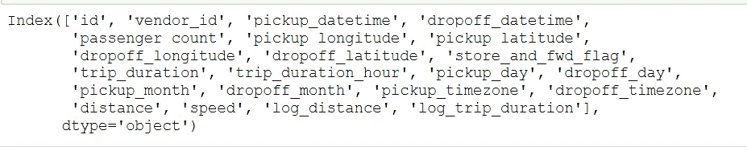

现在，我们不会使用它们来构建我们的模型，因为这会使模型非常复杂。我们创建一个新的数据框 data2，仅选择对目标变量 trip_duration 有一定影响的要素。我们删除了某些功能，因为它们被转换成了其他功能。我们也放弃了名义上的特征。

例如:纬度经度转换为距离，接送日期转换为相应的月份和工作日等。

```
data2=df.loc[:,['passenger_count','store_and_fwd_flag','trip_duration', 'pickup_day', 'dropoff_day', 'pickup_month',
   'dropoff_month','pickup_timezone','dropoff_timezone','speed','log_distance','distance']]
```

我们现在将从 data2 数据帧通过[一个热编码转换分类特征。](https://pandas.pydata.org/pandas-docs/stable/reference/api/pandas.get_dummies.html)

```
data2=pd.get_dummies(data2,columns=['store_and_fwd_flag','pickup_day','dropoff_day','pickup_month','dropoff_month','pickup_timezone', 'dropoff_timezone'])
```

现在，我们将看一下每个功能之间的关联热图，以便我们更容易选择最佳功能


因此，我们看到一些特征与其他特征高度相关，而一些特征根本不相关。

首先，我们将创建一个以出行持续时间平均值作为预测值的模型。然后，我们将创建一个只有距离的基线模型，它与 trip_duration 的相关性大于 5。接下来，我们将选择与 trip_duration 正相关的其他特征，并创建第三个模型。

我们将把数据分成两部分。第一部分我们将用来训练我们的数据，第二部分将用于测试。

在第一部分中，我们将使用[和](https://scikit-learn.org/stable/modules/generated/sklearn.model_selection.cross_val_score.html)进行 K 重交叉验证。(k=20)

我们正在定义基线模型列、将在实际模型构建中使用的列和目标列。我们已经从预测值列中移除了速度要素，因为它与距离高度相关，并且会导致[多重共线性。](https://www.youtube.com/watch?v=Cba9LJ9lS8s&t=10s)

```
base_line_col=['distance']
predictor_cols=['passenger_count','distance','store_and_fwd_flag_N','store_and_fwd_flag_Y',
               'pickup_day_Friday','pickup_day_Monday','pickup_day_Saturday','pickup_day_Sunday',
               'pickup_day_Thursday','pickup_day_Tuesday','pickup_day_Wednesday','dropoff_day_Friday',
               'dropoff_day_Monday','dropoff_day_Saturday','dropoff_day_Sunday','dropoff_day_Thursday',
               'dropoff_day_Tuesday','dropoff_day_Wednesday','pickup_month_1','pickup_month_5','pickup_month_6',
               'dropoff_month_1','dropoff_month_5','dropoff_month_6','pickup_timezone_late night',
               'pickup_timezone_midday','pickup_timezone_morning','dropoff_timezone_evening',
               'dropoff_timezone_late night','dropoff_timezone_midday','dropoff_timezone_morning']
target_col=['trip_duration']
```

我们将定义一个函数，它将接受模型对象、测试数据、训练数据、预测列和目标列。我们将使用均方根误差作为评估指标。更多信息请点击这里。

该函数将打印出训练数据的 RMSE、K-Fold 交叉验证的每个折叠处的 RMSE 的平均值以及测试数据。它还将返回测试数据的预测值。我们已经导入了所需的库。

```
from sklearn import  metrics
from sklearn.model_selection import cross_val_score
def modelfit(estimator,data_train,data_test,predictors,target):
    #print(data_train.head())
    #fitting model
    estimator.fit(data_train[predictors],data_train.loc[:,target])
    #train data prediction
    train_pred=estimator.predict(data_train[predictors])
    #cross_validation score
    cv_score=cross_val_score(estimator,data_train[predictors],data_train.loc[:,target],cv=20,scoring='neg_mean_squared_error')

    cv_score=np.sqrt(np.abs(cv_score))
    #Print model report:
    print ("\nModel Report")
    print ("RMSE on Train Data: %.4g" % np.sqrt(metrics.mean_squared_error(data_train.loc[:,target].values, train_pred)))
    print ("CV Score : Mean - %.4g | Std - %.4g | Min - %.4g | Max - %.4g" % (np.mean(cv_score),np.std(cv_score),np.min(cv_score),np.max(cv_score)))

    test_pred=estimator.predict(data_test[predictors])
    print ("RMSE on Test Data: %.4g" % np.sqrt(metrics.mean_squared_error(data_test.loc[:,target].values, test_pred)))

    return test_pred
```

我们现在将数据分成 80:20 比例的训练和测试数据

```
from sklearn.linear_model import LinearRegression
from sklearn.model_selection import train_test_split
validation_size = 0.20
seed = 7
X_train, X_test = train_test_split(data2,test_size=validation_size, random_state=seed)
```

我们将首先使用平均值作为每个测试数据点的预测值来创建一个模型。

```
mean_pred=np.repeat(X_train[target_col].mean(),len(X_test[target_col]))
from sklearn.metrics import mean_squared_error as mae
sqrt(mae(X_test[target_col],mean_pred))
```

由此得出的 RMSE 是 674。36860 . 68668686667 我们现在将使用这个值作为基础，并尝试实现一个小于这个值的 RMSE。

接下来，我们将距离要素作为唯一的预测值列，并构建线性回归模型。我们将看看所获得的 RMSE。

```
alg1 = LinearRegression(normalize=True)
print('The baseline model')
y_pred=modelfit(alg1, X_train, X_test,base_line_col,target_col)
coef1 = alg1.coef_
print('The coeffient is {}'.format(coef1))
```

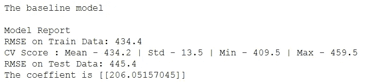

正如我们所看到的，所有的数值都比预测 RMSE 的平均值小得多。因此，我们的模型工作得更好。我们也打印了适合模型的系数。

现在，我们将获取预测值列的所有值，并构建一个回归模型。

```
alg2 = LinearRegression(normalize=True)y_pred=modelfit(alg2, X_train, X_test, predictor_cols,target_col)
coef1 = pd.Series(alg2.coef_[0], predictor_cols).sort_values()
coef1.plot(kind='bar', title='Model Coefficients')
```

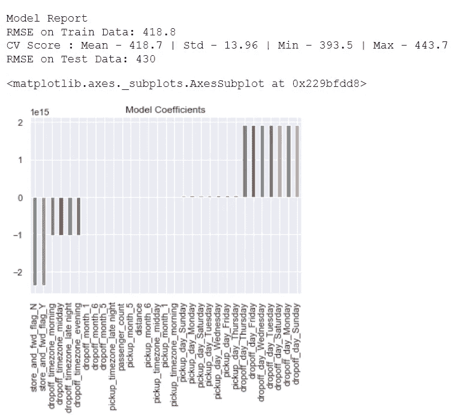

我们看到包含所有列的回归模型表现得更好。我们还绘制了每个特征的拟合系数。

我们现在将绘制残差图，以查看假设[的同质性](https://www.youtube.com/watch?v=2xcUup_-K6c&t=2s)。

```
residuals=y_pred-X_test[target_col]Heteroskedasticity
plt.figure(figsize=(10, 6), dpi=120, facecolor='w', edgecolor='b')
f = range(0,145510)
k = [0 for i in range(0,145510)]
plt.scatter( f, residuals, label = 'residuals')
plt.plot( f, k , color = 'red', label = 'regression line' )
plt.xlabel('fitted points ')
plt.ylabel('residuals')
plt.title('Residual plot')
plt.legend()
```

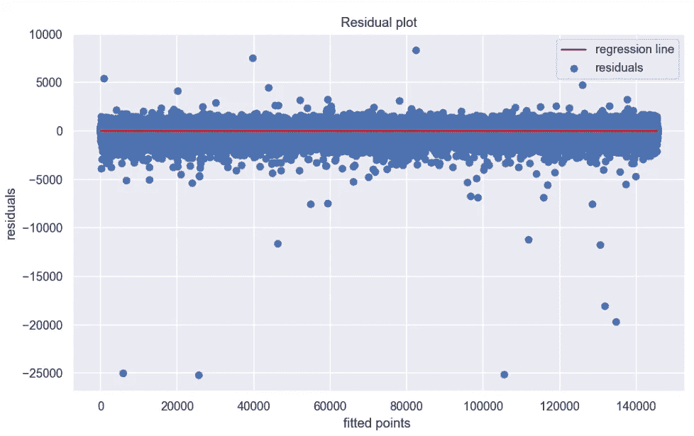

这里残差的分布是均方的。所以线性回归的假设成立。

今天到此为止。我们稍后将探索更多的方法来改进我们的模型和特征选择。

感谢阅读！