# 在 Google Data Studio 中构建移动友好仪表板

> 原文：<https://medium.com/analytics-vidhya/building-a-mobile-friendly-dashboard-in-google-data-studio-caa107f432f9?source=collection_archive---------1----------------------->


# 行动纲要

在本文中，我们将使用 [Google Data Studio](https://datastudio.google.com/) 为开源 web 应用程序“ [forecastr](https://forecastr-io.herokuapp.com/) ”构建[这个移动产品仪表板](https://www.datanarrative.io/data-studio-mobile-iframe-example/)，在这个过程中，我们将学习如何:

*   将数据分类，如获取、参与、保留和增长
*   构建一个简单的移动导航栏来跳转到我们报告的不同部分
*   创建现代化的移动 UI 元素，如数据卡和产品参与渠道
*   整合增长积压中的数据，讲述我们将如何改进我们的应用并推动 KPI
*   使用谷歌的数据混合功能将数据连接在一起
*   为 Data Studio 生成的 iframe 创建一个简单的网页，以便我们可以在移动网络上轻松查看我们的报告。

在本教程结束时，您应该能够将这些知识应用于您的 KPI，在 Google Data Studio 中构建您自己的产品或销售移动仪表板。

## 现在，让我们开始玩吧！

构建移动仪表板给我带来了惊人的快乐。

也许是因为我们使用移动设备在当今世界上消费了如此多的信息，所以检查我的手机以获得快速的业务更新是很自然的事情。通常，启动笔记本电脑并查看一些数据感觉像是一项工作。

但在我的手机上，感觉有些不同。

如果我们的业务数据可以在移动设备上通过我们今天使用的越来越多的平台轻松访问，那会怎么样？那不是很神奇吗？

当然，我们仍然需要我们的笔记本电脑来进行更深入的分析和制作演示文稿，但从高层次来说，我们的移动设备似乎是我们快速获取业务更新的理想媒介。在我们打开笔记本电脑进行探索性分析之前，只要有足够的信息来引发见解或问题，了解正在发生的事情。

本文是一系列文章中的第一篇，旨在帮助人们构建更好的仪表板，并组织我们每天从网络上使用的业务数据。

所以今天，我们要找点乐子，在 Google Data Studio 中创建一个移动产品仪表板，然后将其嵌入到一个网页中！

你为什么问数据工作室？

除了 python，它还是我最喜欢的探索和可视化数据的地方。我不仅用它来讲述我的业务绩效，还用它来讲述我为积极改善业务和推动公司目标以实现目标所做的事情。如果您知道如何将 python 与 BigQuery 结合使用，情况只会变得更好(但这是另一篇博文)

现在，虽然这个仪表板不会做出响应，但它“足够好”来开始思考我们如何布置我们的数据，以便当我们滚动仪表板时，我们能够完全了解我们的产品正在发生什么，并确定增加其使用的机会。在这个过程中，我们会有一些使用布局的技巧和窍门。

所以，让我们想象一下，我们正在开发一个开源的 web 应用程序，它指导人们创建一个基线预测的过程，我们希望把它做得更好。

此应用程序的汇总 KPI 报告在移动设备上会是什么样子？

**首先，让我们整理一下我们的数据源**

我将假设您之前已经向 Data Studio 添加了数据源，但是如果您还没有，这里有一个[链接](https://support.google.com/datastudio/answer/6300774?hl=en)。

为了保持简单和相对简短，本教程将主要侧重于建立该报告的第一页。为此，我们将在本报告中使用一些数据源，它们来自:

*   谷歌分析—预测(生产数据)
*   Google Sheets —保留数据、[目标](https://docs.google.com/spreadsheets/d/1DQ8uc3aIRkxX1v0hvPigYXiwXWtUXgEZb-Fx0iGboPs/edit?usp=sharing)和[增长积压](https://docs.google.com/spreadsheets/d/18w1xt2FrBy6WnMxTkffbjEnd_IMweBBZ1nbWemgZRJM/edit?usp=sharing)数据

**定制画布尺寸**

现在我们已经有了数据，我们需要为我们的画布选择一个“移动友好”的屏幕宽度。

对于这个仪表板，我选择了 393 像素宽，因为我目前使用的是 Pixel 4，但我建议在 Data Studio 中选择 400 像素宽左右的任何东西。或者你可以使用类似于 [statscounter 的服务来找到最流行的屏幕宽度](https://gs.statcounter.com/screen-resolution-stats/mobile/worldwide)并从那里开始。在任何情况下，当我们将这个 Data Studio 报告嵌入到网页中并将 iframe 的宽度设置为 100%时，Data Studio 报告应该在该空间内缩放。

因此，要设置仪表板的大小，右键单击空白画布中的任意位置并选择:

*当前页面设置*

然后打开右边菜单中的样式选项卡，更新画布的宽度和高度。正如你在下面的截图中看到的，我选择了一个 393 x 2000 像素的画布。

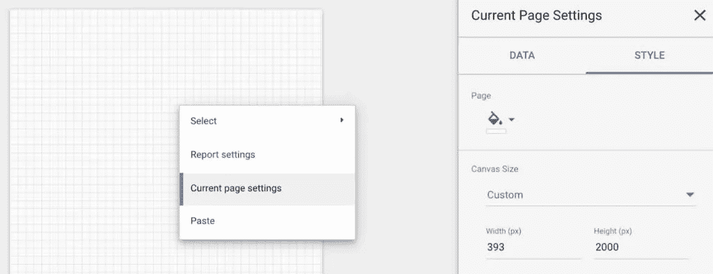

如何在 Google Data Studio 中设置画布大小

**接下来:为我们的移动报告构建导航栏**

在 Google Data Studio 嵌入式报表中，用于在报表页面间导航的下拉菜单只有在单击仪表板时才会显示(除了位于 iframe 的底部)。因此，我们的利益相关者可能不一定知道该报告中还有其他页面可供导航。

因此，让我们发挥一点创造性，为我们的利益相关者提供一种替代方法来导航到我们报告中的不同部分。为此，我们将在一个简单的导航栏中创建文本链接，允许用户跳转到报告中的不同部分。

在分析产品数据时，我喜欢将产品性能故事分成以下几个部分:

1.  **概述**:高级总结与目标
2.  **获得:**我们从哪里获得新客户
3.  **参与**:客户如何参与我们的产品
4.  留住客户:我们在留住客户方面做得怎么样
5.  **增长**:我们正在做什么来增长我们的业务和 kpi

除了用于公司徽标和报告标题的部分之外，我们还会将这些部分作为文本字段添加到仪表板的导航中。

为了更加清晰，我通常还会使用 Data Studio 的 Shape 工具绘制矩形来容纳这些元素。

这是我们现在所处的位置，包括用来包含我们的徽标、标题和导航栏的形状的属性。

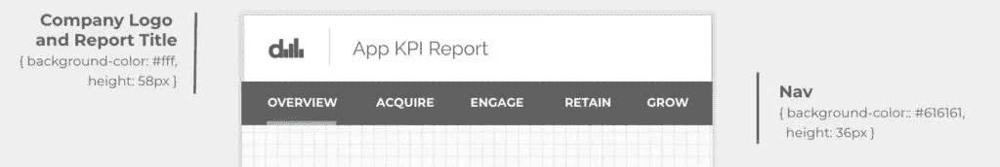

我们目前的导航

现在，在我们向导航中的每个文本元素添加链接之前，我们需要在报告中创建几个额外的页面。我通常喜欢复制页面，而不是创建一个新的页面，因为它保留了现有的格式。

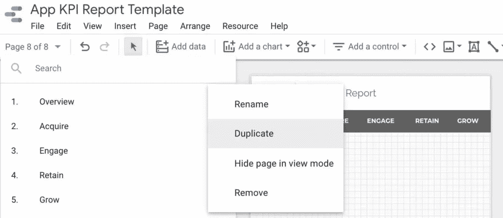

如何复制报表中的页面

单击页面下拉菜单，然后单击 3 点图标，并选择复制。重复 3 次，并将每个页面重命名为:

*概述、收购、参与、保留、发展*

现在，让我们回到我们的“概述”页面，并开始添加链接到导航中的每个文本元素。选择“获取”文本元素，在 Data Studio 的右侧打开一个面板。单击链接图标并选择要链接的页面。

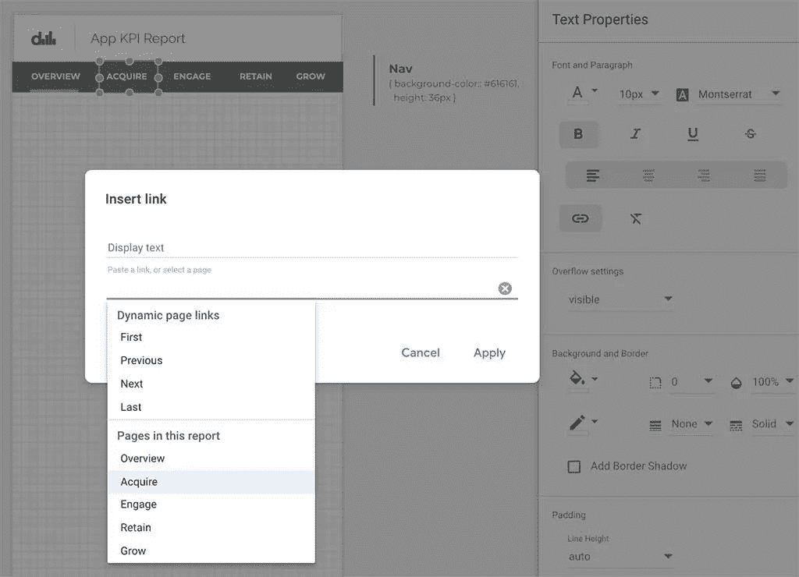

如何链接到 Google Data Studio 报告中的另一个页面

对每个链接重复此过程。然后格式化文本颜色，去掉下划线来清理每个链接。

然后，为了更加清晰，您可以在每个链接下面添加一条蓝色粗线来表示用户所在的页面，如下所示:

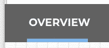

你可以做的最后一件事是复制并粘贴整个导航栏，并用其他页面上的导航栏替换它(以节省你手动更新每个页面上的每个链接的时间)。

好的，我们的导航看起来很好！接下来，让我们添加一个日期选择器到我们的导航。

**向我们的导航栏添加日期选择器**

通常，当向任何 Data Studio 报告添加日期选择器时，我们可以看到整个日期范围被选中，如下所示:

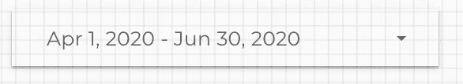

数据工作室日期选择器

现在，不幸的是，我们的 nav 中没有房地产来显示完整的时间范围，但当我们缩小它时，我们会丢失日期，它看起来就像一个空白的下拉列表，这不是最大的。

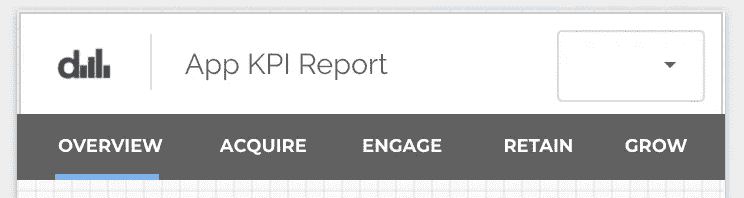

空白日期选择器(图像的右上角)

为了使这个选择器更加清晰，我们可以做的一件事是在这个元素下面放置一个文本字段。

创建一个“文本”元素并将其标记为“日期”，然后右键单击“日期选择器”并选择:

顺序>置于顶层

我们的仪表板中的每个元素都是分层的，所以我们希望我们的日期选择器位于我们新创建的“日期”字段的顶部，这样当利益相关者单击更改日期时，他们实际上是单击了日期选择器。

还记得设置日期选择器的背景颜色为“透明”,你会得到如下结果:

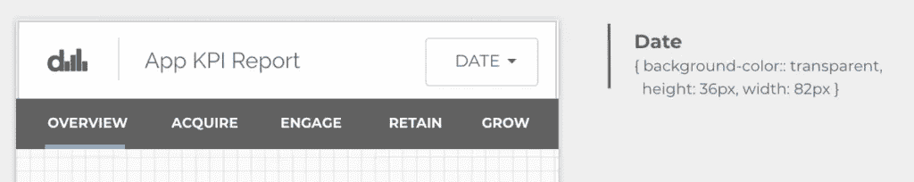

日期选择器覆盖在日期文本字段的顶部

咻！设置一个简单的导航需要做很多工作，但在 Data Studio 中为我们的利益相关者提供最好的移动报告体验是完全值得的。

**继续我们的 KPI 总结！**

考虑到我们的不动产有限，让我们将重点放在可视化 4 个顶线 KPI 的绩效上。如果能够在 Data Studio 中水平滑动 KPI，那将是一件令人惊叹的事情，但在那一天到来之前，我们可以像这样展示我们的数据:

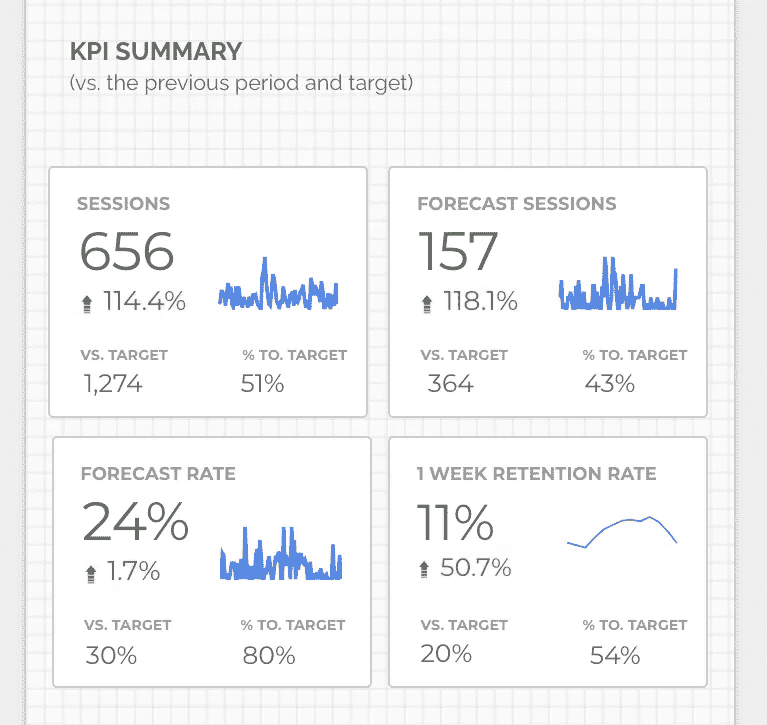

与前期和目标相比的 4 个 KPI 汇总

在本节中，我们将重点放在构建第一张 KPI 卡上，然后我们可以为其余 3 张卡复制它。

您的 KPI 显然会与此处呈现的不同，但是我们呈现 KPI 的整体设置应该是一致和相似的。

在交流某项指标的绩效时，最好将该指标放在上下文中，无论是相对于目标、前期还是您希望改进的某种基准。在我们的示例中，我们已经设定了一个目标，并将其与之前的绩效进行了比较。

如果你对如何为你的企业选择合适的关键绩效指标感兴趣，我推荐你阅读[艾伦·希拉里的《利用商业智能讲述你产品的性能故事](https://productschool.com/blog/product-management-2/business-intelligence-product-performance/)。

好的，下面是我们将要构建的 KPI 卡的详细分解:

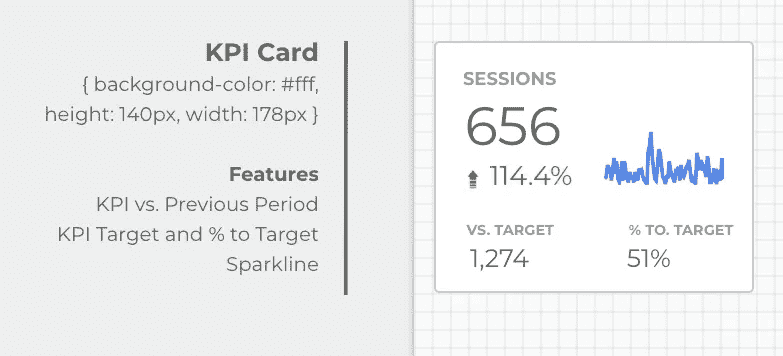

KPI 数据卡示例

在很大程度上，这张卡片相当容易创建，因为它由 3 个[记分卡可视化](https://support.google.com/datastudio/answer/7193479?hl=en#:~:text=Scorecards%20are%20commonly%20used%20to,%2C%20minimum%20failure%20rate%2C%20etc.)和一个会议迷你图组成。

唯一复杂的是计算“到目标的百分比”指标，为了进行渲染，我们需要混合以下两个数据源:

*   谷歌分析——你的关键绩效指标可能存在的地方
*   目标电子表格——我们的目标将要居住的地方。

将这两个数据集结合在一起，我们就可以更好地控制我们的目标在一段时间内的表现方式，此外，当我们改变报告中的时间框架时，我们的目标会变得更加动态。

**让我们加入我们的数据**

为了混合您的数据，我们首先需要选择指标，然后从右侧菜单中选择“混合数据”:

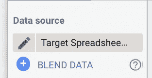

在 Data Studio CTA 中混合数据

这将打开一个数据混合菜单，我们将在其中选择所需的指标，并在“日期”维度上连接两个数据源。

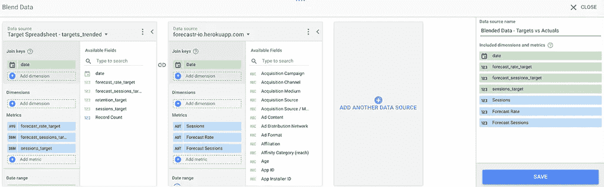

在日期维度上混合 Google Data Studio 中的两个数据源

太好了！现在，我们已经连接了这两个数据集，我们可以执行一个简单的自定义计算来获得会话的**与目标**和**的百分比**

在右侧菜单中，单击一个指标，然后单击“Create New Field”，这将打开以下屏幕，我们可以在其中为目标百分比创建一个简单的公式。

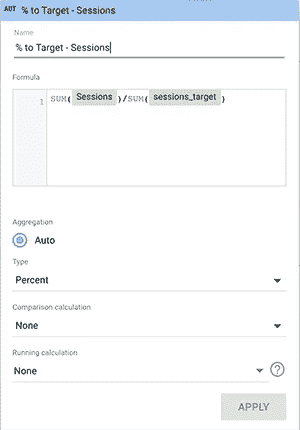

Data Studio 中的自定义计算

厉害！现在，只需对您想要作为目标的其他 KPI 重复这一过程，我们就会对我们的应用程序与之前相比的表现和目标有一个很好的概括！

**接下来:趋势分析我们的 KPI**

下一部分可能是该报告中最容易创建的部分，因为它只是一张卡片上的时间序列图，具有一些增强的功能。

它看起来是这样的:

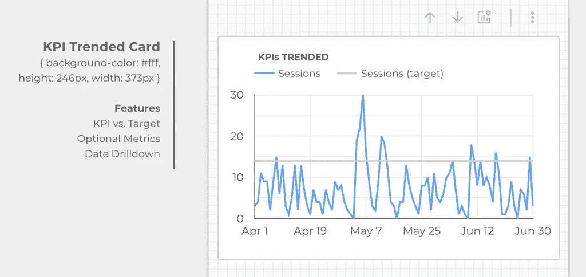

KPI 趋势卡

我想在这里介绍的主要内容是，当您激活右栏中的“向下钻取”开关时，您可以使用卡片上方的上下箭头将日期从每日视图切换到每月视图。您还可以添加可选的指标，这样您就可以在不同的 KPI 之间切换，这非常方便。

**构建产品参与漏斗**

不幸的是，Data Studio 中目前还没有现成的漏斗可视化。有一些社区，但不幸的是，由于安全原因，社区可视化不会在 iframes 中呈现。

然而，有一个简单的条形图，我们可以结合几个谷歌分析的目标设置使用。

基本思想是在谷歌分析中为用户在你的产品(或销售)漏斗中点击的每个阶段创建一个目标。在以下案例中，我创建了一个非常简单的三步漏斗，以谷歌分析事件为目标进行衡量:

1.  应用程序的会话总数
2.  将 CSV 上传到应用程序的会话总数
3.  完成预测的会话总数

然后，您只需在 Data Studio 中选择一个条形图，并添加每个特定事件的目标完成情况作为指标。

在条形图下面，除了总会话的百分比(即转换率)，使其进入阶段 2 和 3。这有助于我们看到下降并发现优化机会。

正如你在下图中看到的，我看到上传数据并最终在应用中进行预测的用户数量大幅下降。所以，这里一定有一些问题需要探讨！

在您为您的数据建立了一个漏斗之后，它应该看起来像这样:

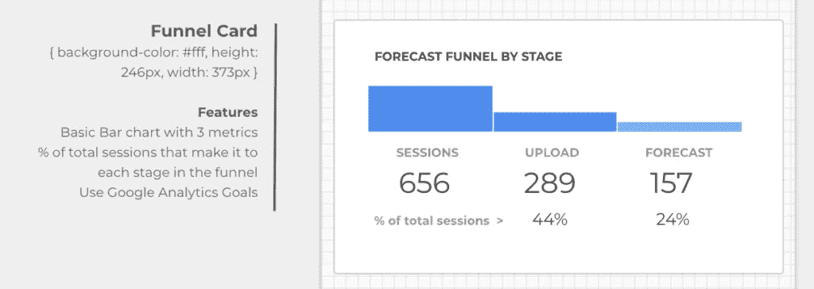

预测流程中各阶段的预测者产品参与度漏斗

下一个环节:产品增长部分！

我们仪表板的这一部分包含一个按优先顺序排列的增长计划列表，您的团队正在努力改进您的体验或 KPI。这些数据可以来自像这样的的[电子表格，或者来自像](https://docs.google.com/spreadsheets/d/18w1xt2FrBy6WnMxTkffbjEnd_IMweBBZ1nbWemgZRJM/edit#gid=1122875180)[特雷罗](https://trello.com/)的来源。

这一部分的重点是清楚地传达你和你的团队正在努力改进业务的首要计划。这是最好的透明度！

最初，我想使用 [Romain Vialard 的令人敬畏的社区卡数据，即](https://datastudio.google.com/reporting/76e574a8-e095-49da-8387-989c53022b4b/page/mdJUB)，但是当我对其进行检测并嵌入最终结果时，它不会作为 iframe 呈现！！！！我喜欢能够将 HTML、CSS 和 JS 添加到 Data Studio 中的想法。如果你在听谷歌，请把它作为产品特性添加进来。

因此，不幸的是，我们将手动创建 3 张卡，对我们正在进行的前 3 项计划应用过滤器。但是当它完成的时候，它会看起来很棒！

这是我们正在构建的:

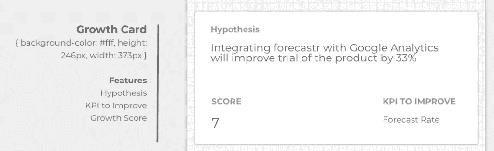

增长数据卡

从本质上讲，这只是与存在于[这个 Google 工作表](https://docs.google.com/spreadsheets/d/18w1xt2FrBy6WnMxTkffbjEnd_IMweBBZ1nbWemgZRJM/edit#gid=1122875180)中的优先化的计划积压相关联。

输入到待办事项中的计划将根据以下 3 个因素进行评分(满分为 5 分):

*   交通
*   开发工作
*   价值

然后，我们总结增长得分，并使用以下公式在 Google Sheets 中对我们即将推出的计划进行排名:

```
=QUERY(Backlog!A1:1000,"SELECT * WHERE I <> 'complete' ORDER BY M desc")
```

然后，每张卡都有一个过滤器，分别应用于 rank = 1、2 或 3 的数据。这些卡片代表了我们正在开展的前 3 项计划。请随意复制这个电子表格，用它来排列你想要测试的计划或假设的优先顺序。

我也希望得到一些关于你如何优先考虑你的计划/假设的反馈。我们可以做些什么来使这个电子表格更好？

**现在来看有趣的东西！让我们在我们的移动设备上实现它吧！**

我们需要做的第一件事是在我们的 data studio 报告中启用嵌入:

在 Data Studio 菜单中，单击文件>嵌入报告

然后勾选复选框启用嵌入(如下所示)并将复制到剪贴板。

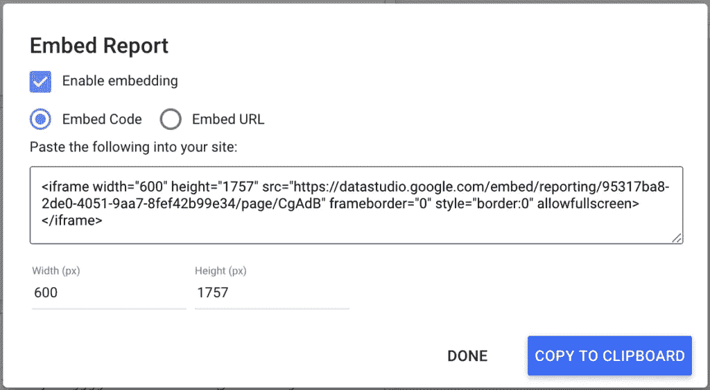

嵌入 Data Studio 报表-通过选中复选框启用嵌入

接下来，我们将创建一个基本的 html 页面，并将嵌入代码粘贴到标签中，将宽度修改为 100%,高度修改为 2000px。

看起来是这样的:

```
<html>
    <head>    
        <title>Forecastr Mobile KPI Report</title>                
    </head>
    <body>

        <iframe width="100%" height="2000" src="https://datastudio.google.com/embed/reporting/95317ba8-2de0-4051-9aa7-8fef42b99e34/page/CgAdB" frameborder="0" style="border:0" allowfullscreen></iframe>

    </body>
</html>
```

然后保存并上传你的 html 页面到一个受保护的空间，在你的移动设备上访问链接，它应该看起来像[这个](https://www.datanarrative.io/data-studio-mobile-iframe-example/)。

就是这样！我们已经完成了概述页面，现在可以在移动网络上看到我们的报告了！

**接下来—采集页面！**

等一下…鉴于这篇文章的长度，我们把这一部分和其他部分留待以后再说怎么样？我很想听听您对如何深入了解和看待收购、产品参与、保留和增长的看法！因此，与其深入讨论这个问题，不如来个快速奖金部分？

**奖金！**

如果您没有空间或网站来保存 iframe，请随意使用我们名为[数据空间](https://www.datanarrative.io/)的分析平台，它可以帮助人们在客户群的整个生命周期中组织他们的数据和报告。

它可以免费使用，并且像 Google Data Studio 生成的文件一样容易保存。在我的下一篇文章中，我将展示如何将 Data Studio 报告保存到数据空间。

下次再见，非常感谢您抽出时间阅读这篇文章。

**反馈**

我很想听到你对我设计的移动仪表板的反馈。

你会怎样做得更好？如何创建移动仪表盘？你在 Google Data Studio 中见过哪些移动仪表盘的例子？您成功地向利益相关方推出了移动仪表盘吗？你包括什么样的度量标准？您将如何在本报告的接下来 4 页中更深入地回顾收购、产品参与、保留和增长？

**请在下方留言或在**[**LinkedIn**](https://www.linkedin.com/in/garethcull/)**上联系我！**

非常感谢，祝您愉快！