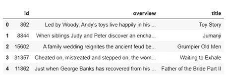
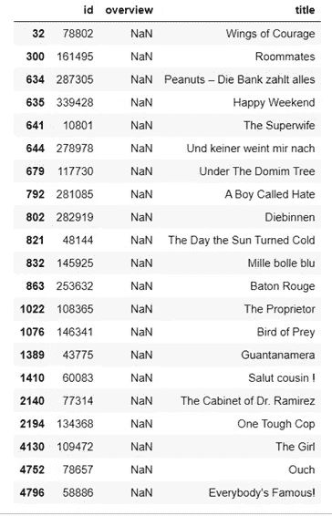
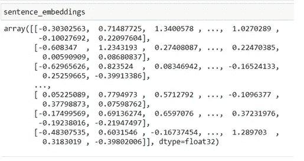
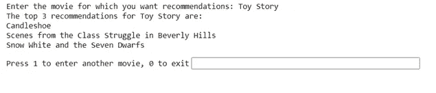

# 用 Python 构建电影推荐引擎

> 原文：<https://medium.com/analytics-vidhya/building-a-movie-recommendation-engine-in-python-53fb47547ace?source=collection_archive---------4----------------------->

使用 Python 和 SentenceBERT 在几分钟内构建您自己的电影推荐器。


罗曼·马顿在 [Unsplash](https://unsplash.com/?utm_source=medium&utm_medium=referral) 上的照片

在浏览网飞或 Prime Video 的时候，你一定遇到过一个根据你的观看历史或你所在地区当前的流行趋势向你推荐电影和电视节目的栏目。想知道这是怎么做到的吗？使用电影推荐引擎。

在这篇文章中，我将向你展示如何从头开始构建你自己的电影推荐器。将会有一些理论来帮助你理解正在做的事情和大量的实践工作。所以让我们开始吧！

通常，电影推荐器是以下类型之一:

1.  基于推荐—基于用户所在地区最受欢迎的视频的简单系统。是的，你猜对了 YouTube 趋势页面。
2.  基于内容—根据电影情节、类型、演员、语言等标准查找相似的电影。
3.  协作过滤—基于用户的观看历史/模式。例如，网飞使用了基于内容和协同过滤的组合。

现在让我们开始推荐吧！这将是一个基于内容的一个特定的电影，将建议基于给定电影的概述类似的电影。

## 资料组

我们将在 Kaggle 上使用[‘电影数据集’](https://www.kaggle.com/rounakbanik/the-movies-dataset)。没有必要下载整个数据集；只需下载“movies_metadata.csv”文件。该文件包含超过 45k+电影的一系列信息，例如电影名称、分级、类型、概述、演员等等。我们使用以下代码加载文件:

```
import pandas as pd
movies = pd.read_csv("movies_metadata.csv", usecols = [5,9,20])
movies_head()
```



图 1:电影数据集前 5 部电影

在我们继续构建推荐器之前，让我们对数据集进行一些清理。有些电影没有概述(图 2)。我们还通过给电影分配索引来对数据集中的电影进行编号。下面代码中的 for 循环基本上是为数据集中的每部电影分配一个数字(从 0 到电影数)。我们还将定义两个助手函数来检索电影的名称及其在数据集中的相关索引。这些功能将在稍后推荐电影时被推荐者使用。

```
def get_title(index):
    return movies[movies.index == index]["title"].values[0]def get_index(title):
    return movies[movies.title == title]["index"].values[0]movies['index'] = [i for i in range(0, len(movies))]movies = movies.dropna()
```



图 2: NaN/Null 值

## **推荐引擎**

现在我们已经准备好了数据集，让我们开始构建模型。但是在编码之前，让我们先了解一下我们要怎么做。我们将利用句子嵌入来完成这项任务。句子嵌入帮助我们将一个或多个句子(在我们的例子中是电影概述)及其语义信息表示为向量。简单地说，这些向量代表了电影总览的含义、上下文和其他微妙的细微差别。

我们将使用广受好评的句子伯特模型来获得我们的句子嵌入。为了对这个模型有一个基本的了解，请参考这篇[文章](https://www.analyticsvidhya.com/blog/2020/08/top-4-sentence-embedding-techniques-using-python/)和这篇[研究论文](https://arxiv.org/abs/1908.10084)以获得更深入的了解。

好了，现在回到编码上来！我们现在加载句子-伯特模型。SentenceTransformer()中的参数是预训练模型的名称。预训练模型的完整列表可以在[这里](https://github.com/UKPLab/sentence-transformers/blob/master/docs/pretrained-models/sts-models.md)找到。

注意:下载和安装过程可能需要一段时间。

```
!pip install sentence-transformers
from sentence_transformers import SentenceTransformer
bert = SentenceTransformer('bert-base-nli-mean-tokens')
```

现在，我们使用这个模型来获取我们的数据集中的电影向量。

```
sentence_embeddings = bert.encode(movies['overview'].tolist())
```



图 3:电影概述的嵌入

现在我们有了向量，我们需要计算它们之间的相似性。我们如何做到这一点？简单，用余弦相似度。使用余弦相似性，我们可以得到两个向量之间的相似性得分。分数为 0 表示没有相似性，而分数为 1 表示完全相似。使用下面的代码，我们计算数据集中每部电影之间的相似性得分。

```
similarity = cosine_similarity(sentence_embeddings)
```

相似性变量是 2D 阵列。每一行对应于一部电影，并且包含该电影与数据集中所有其他电影的相似性。

瞧，就是这样。恭喜你，你的推荐人已经准备好了！让我们用行动来检验一下。

```
notOver = True
while(notOver):
    user_movie = input("Enter the movie for which you want recommendations: ")# Generate Recommendations
    recommendations = sorted(list(enumerate(similarity[get_index(user_movie)])), key = lambda x:x[1], reverse = True)
    print("The top 3 recommendations for" + " " + user_movie + " " + "are: ")
    print(get_title(recommendations[1][0]), get_title(recommendations[2][0]), get_title(recommendations[3][0]), sep = "\n")
    decision = input("Press 1 to enter another movie, 0 to exit")
    if(int(decision) == 0):
        print("Bye")
        notOver = False
```

上面的代码在数据集中找到了与我们输入的电影最相似的 3 部电影。

注意:您输入的电影必须存在于数据集中。让我们看看《玩具总动员》有什么推荐。



图 4:类似于《玩具总动员》的电影

对于我们的模型，这里的推荐看起来相当不错！《烛光秀》和《白雪公主》都是儿童电影。第二个建议是一部喜剧，也是《玩具总动员》的一部分。去给其他电影一个尝试，你会惊讶地发现这个模型推荐得有多好！

现在这还不是结束。你可以构建更加复杂的推荐器，考虑其他指标，如电影演员、语言、时长、类型甚至你过去的观看历史。

感谢阅读这篇文章，如果你需要任何帮助，请随意使用我的 [Jupyter 笔记本](https://github.com/anshbordia/movie-recommender-bert)中的代码。干杯！