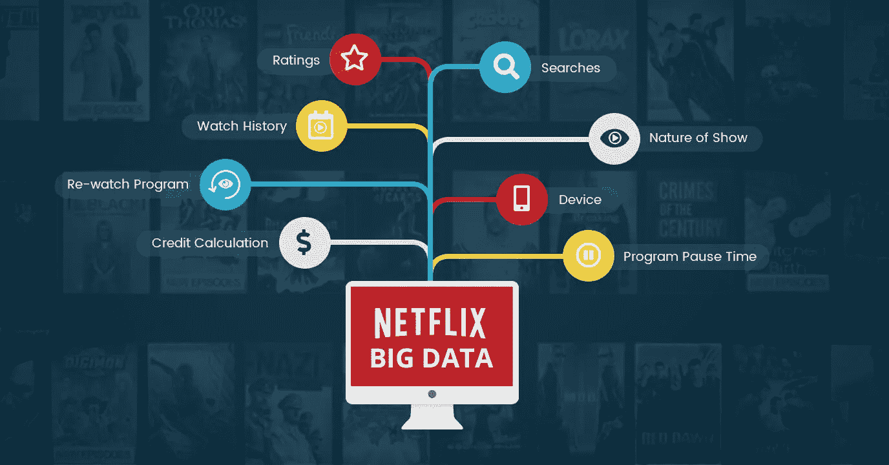
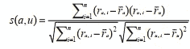
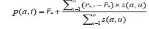

# 构建网飞推荐系统

> 原文：<https://medium.com/analytics-vidhya/building-a-netflix-recommendation-system-7b1fec90f83e?source=collection_archive---------12----------------------->

推荐系统是流行的数据科学应用之一。几乎每个主要的科技公司都在他们的商业模式中看到了它的潜力。亚马逊用它向顾客提供产品推荐，YouTube 用它来建议接下来要播放的视频，脸书用它来推荐喜欢的页面。此外，对于像网飞和 Spotify 这样的公司来说，他们的商业模式和成功取决于他们的推荐能力。事实上，网飞举办了一场竞赛，谁能将其系统改进 10%，谁就能获得 100 万美元的奖励。

网飞推荐系统和大数据

# **引入推荐系统或推荐人**

推荐系统(RS)是应用程序或网站中的软件工具，它考虑了各种类型的知识和数据，例如用户的偏好、动作、任务和上下文信息，从而推荐最终用户可能感兴趣的信息(例如，项目、人物、新闻文章)。在大多数情况下，这些系统使用计算方法来分析用户过去的行为和决策，以及其他用户相关或任务相关的信息，以提供有用的、通常个性化的推荐。这背后的动机是通过将用户最感兴趣的相关内容呈现出来，来缓解信息过载的问题。在许多知名的电子商务网站中可以看到这样的例子，例如 Amazon.com，它推广用户最后检查或购买的产品，或者其他用户已经评级或评论的产品。除此之外，在有些情况下，这些建议是难以准确确定的多种因素综合作用的结果。在这种情况下，采用各种替代方法来生成建议。RS 属于信息过滤系统家族，因此试图预测用户对某个项目的评价或偏好。因此，RS 遵循的通用方法是找到三种模型(用户、评级和项目)之间的相关性，以便产生推荐。所有推荐算法及其变体都遵循这个模型来计算推荐。本文回顾了不同类型的 RS、它们的典型架构以及用于生成推荐的算法。最后讨论了 RS 评估的挑战性主题，概述了评估推荐的准确性、有用性和用户满意度的可能方法。

# 推荐系统的方法

根据推荐系统用来推荐项目的信息，推荐系统可以大致分为几类。然而，在文献中主要遵循以下三个类别:

(1)协同过滤

(2)基于内容的过滤

(3)混合滤波。

下面显示了所有上述方法的详细描述。

1.  **协同过滤**

这是一种协同过滤(CF)方法，其中推荐是由其他人给出的，这些人在过去有类似的偏好，但是已经体验过当前用户还不知道的项目或产品。协同过滤系统要求用户对产品或物品发表意见。他们收集用户的意见，并根据人们的意见相似度推荐商品。持相同意见者为投稿人。协同过滤推荐系统通常评论不止一个共同的项目或产品来定义一组用户，这会影响结果。协同过滤技术的应用通常涉及在网络上可获得的非常大的数据集。传统的协同过滤技术包括基于用户、基于项目和基于模型的方法。基于用户的协同过滤在这种方法中，使用与先前对某个项目或产品进行评级的用户的平均评级和用户平均评级的偏差的加权和来预测针对该项目的用户行为。基于用户的协同过滤技术通过比较用户对同一项目或产品的评分来计算用户之间的相似性，然后计算活动用户对项目或产品的预测评分，作为与活动用户相似的用户对项目或产品的加权平均评分，其中权重是这些用户与目标项目或产品的相似性。皮尔逊相关算法用于度量两个变量之间的相似性，它被定义为:

在上面的等式中，s(a，u)表示两个用户用户 a 和用户 u 之间的相似性，r{a，i}是用户 a 对项目 I 给出的评级，r a 是用户 a 给出的平均评级，n 是用户项目空间中项目的总数。通过使用公式 2.2 选择邻居评级，由加权和得到的预测数值

其中 p(a，I)是项目 I 的活动用户 a 的预测，s(a，u)是用户 a 和 u 之间的相似度，n 是邻域中的用户数量。它根据系统的活动用户和其他用户对常见项目或产品的数字评级来计算用户之间的相似性。

该系统通过利用皮尔逊相关性来实现这一点。皮尔逊相关是一种通过寻找相似性度量来找出相似用户的方法。相关值是在图形上表示数据集的一种方式。假设用户 A 倾向于给出比用户 B 更高的分数，但是两者都倾向于喜欢他们评级的任何项目、书籍或电影。如果它们的分数之间的差异是准确且一致的，则相关值仍然可以给出完美的分数。基于项目的协同过滤基于项目的协同过滤技术使用项目之间的相似性而不是用户之间的相似性来计算预测。它通过从用户项目矩阵中检索由活动用户评级的所有项目来创建项目相似性模型，它确定检索到的项目与目标项目的相似程度，然后它选择 k 个最相似的项目并确定它们的匹配相似性。有许多不同的方法来计算项目之间的相似性。下面是三种这样的方法。这些是基于余弦的相似性、基于相关性的相似性和调整的余弦相似性。基于余弦的相似性，其中两个项目被认为是 m 维用户空间中的两个向量。通过计算这两个向量之间角度的余弦来测量这些项目之间的相似性。基于相关性的相似性，其中相似性是寻找两个项目之间的相关性。两个项目 I 和 j 之间的相似性通过计算 Pearson-r 相关 corr i，j 来测量。调整的余弦相似性，其中，在基于项目的情况下使用基本余弦度量来寻找相似性具有一个重要的缺点，即没有考虑不同用户之间的评级尺度的差异。调整后的余弦相似度通过从每个共同评级对中减去相应的用户平均来克服这个缺点。基于模型的协同过滤技术通过首先开发用户评级的模型来提供项目推荐。这一类别中的算法采用概率方法，并在给定用户对其他项目的评级的情况下，将协同过滤过程预测为计算用户预测的期望值。该模型是使用机器学习或数据挖掘技术构建的。在创建一个模型之后，它将只使用这个创建的模型给出一个建议。这些技术可以快速推荐一组项目或产品，因为它们使用预先计算的模型，并且它们产生类似于基于邻域的推荐技术的推荐结果。基于模型的推荐系统使用一些称为模型的小数据集。该模型是通过从与特定参数或属性相关的大型数据库中提取一些信息来设计的，并且每次都使用该模型，而不使用大型数据库。

**2。基于内容的过滤**

基于内容的推荐系统处理用户提供的数据，无论是显式的(评级)还是隐式的(点击链接)。基于该数据，创建用户简档，然后使用该简档向用户进行推荐。随着用户提供更多的输入或评级或对建议采取行动，引擎变得越来越有效和准确。基于内容的推荐系统试图推荐与给定用户过去喜欢的产品或项目相似的产品或项目，而根据协作推荐模型设计的系统识别偏好与给定用户的偏好相似的用户，并推荐他们喜欢的产品或项目。基于内容的过滤(CBF)技术基于项目内容和用户简档之间的比较来推荐项目。每个产品或项目的内容都表示为一组描述符或术语，通常是文档中出现的单词。所生成的用户简档表示相同的术语，并且通过分析用户已经看过的项目的内容来建立。当实现基于内容的推荐系统时，必须考虑几个挑战。首先，术语可以自动给出，也可以手动给出。当自动给出术语时，必须选择一种方法来从项目中提取这些术语。第二，术语必须被表示成使得用户简档和项目都能够以有意义的方式进行比较。第三，必须选择一种学习算法，该算法能够基于所看到的产品或物品来学习用户简档，并且能够基于所生成的用户简档来做出推荐。基于内容的推荐系统通常使用的信息源是文本文档。术语解析的标准技术是从文档中选择单个单词。向量空间模型和潜在语义索引是使用这些术语将文档表示为多维空间中的向量的两种技术。基于内容的推荐系统有其自身的局限性。他们不能捕捉相互依赖或复杂的行为。例如，我可能喜欢关于数据挖掘的文章，只有当它们包括理论的实际应用时，而不仅仅是理论。这种类型的信息不能被这些类型的推荐系统捕获。

**3。混合滤波**

混合过滤，它结合了协同过滤和基于内容的过滤在某些情况下可能会更成功。混合过滤可以通过几种方式实现:分别进行基于内容的过滤和协同过滤预测，然后将它们结合起来；通过将基于内容的能力添加到协作过滤技术中(反之亦然)；或者将这些技术统一到一个模型中。一些研究将混合方法的性能与纯协作过滤和基于内容的过滤方法进行了经验比较，并证明了混合方法可以提供比纯技术更完美的推荐。混合过滤方法也可以用来克服推荐系统中的一些常见问题，例如冷启动和稀疏性问题。使用多种推荐技术可以在组合模型中抑制单个技术的弱点。这些方法的组合可以通过以下任何一种方式来完成:算法的单独实现和结果的组合，在协作方法中利用一些基于内容的过滤，在基于内容的方法中利用一些协作过滤，创建一个将两种方法结合在一起的统一推荐系统。它克服了稀疏性和冷启动问题。混合过滤(HF)结合了不同的推荐方法，以获得更好的系统优化，避免纯推荐系统技术的一些限制和问题。混合过滤背后的主要目标是算法的组合将提供比单一算法更准确和有效的推荐，因为一种算法的缺点可以被另一种算法克服。使用多种推荐方法可以克服组合模型中单个技术的弱点。混合推荐系统用于描述任何将多种推荐方法结合在一起以产生其输出的推荐系统。

**结论**

推荐系统已经引起了研究者和学者的关注。本文概述了推荐系统的各种方法和优缺点。每种方法都有其优点和缺点，需要有效地研究和选择。在未来，它可以适应现有的技术，以提供更好的结果。

参考资料:

[https://medium . com/datadriveninvestor/how-to-build-a-recommender-system-RS-616 c 988d 64 b 2](/datadriveninvestor/how-to-built-a-recommender-system-rs-616c988d64b2)