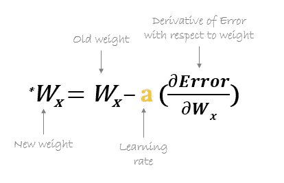

# 用 Python 从头开始构建神经网络

> 原文：<https://medium.com/analytics-vidhya/building-a-neural-network-from-scratch-in-python-edc74ae63761?source=collection_archive---------6----------------------->

> 一种理解神经网络工作背后的内在数学的方法


来源:谷歌图片

我始终相信，要成为任何领域的大师，我们都应该了解那个特定领域的核心工作领域。为了开发我们自己的库，我们应该理解神经网络工作背后的内部数学。所以我决定从头开始建立一个神经网络，而不需要任何深度学习库。

在这篇文章中，我们将从头开始学习神经网络和 Python 代码背后的数学。我们建立一个具有各种层(完全连接)的神经网络。最终，我们将能够以模块化的方式创建网络。

我假设你已经有了一些关于神经网络的 T2 知识。这里的目的不是解释神经网络的概念或者我们为什么要做这些模型，而是向**展示如何做一个合适的实现**。

# ***神经网络的组成***

神经网络由以下组件组成

*   一个**输入层**， **X**
*   任意数量的**隐藏层**
*   一个**输出层**，**， *ŷ* ，**
*   一组**权重**和**在各层之间偏向**、**、 *W 和 b* 、**
*   一个选择**激活功能**用于每个隐藏层，**一个**。在本教程中，我们将使用一个 **Sigmoid** 激活函数。

下图显示了 2 层神经网络的架构(*注意，在计算神经网络的层数时，输入层通常被排除在外*


两层神经网络

# 构建我们算法的各个部分

构建神经网络的主要步骤是:

1.  定义模型结构(如输入要素和隐藏图层的数量)
2.  初始化模型的参数。
3.  循环直到成本函数的最小值。

*   计算电流损耗( ***正向传播*** )
*   计算当前梯度( ***反向传播*** )
*   更新参数( ***渐变下降*** )

你经常分别构建 1-3，然后将它们整合成一个函数，我们称之为`model()`

# **实现**

所以，我们现在知道了神经网络背后的主要思想。让我们开始在代码中实现这些想法。正如我提到的，我们不会使用任何深度学习库。因此，我们将主要使用 numpy 来高效地执行数学计算。

```
import numpy as np
```

构建神经网络的第一步是在初始化参数之前定义我们的模型结构(layer_dim)。我们需要为每层中的每个神经元初始化两个参数:1) *权重*和 2) *偏差*。

这些权重和偏差以 ***矢量化*** 的形式声明。这意味着我们不是为每一层中的每个神经元初始化权重和偏差，而是为每一层创建一个权重向量(或矩阵)和另一个偏差向量。(注意*矢量化实现可以被视为矩阵运算，通常比标准循环更有效)*

这些*权重*和*偏置*矢量将与层的输入相结合。然后，我们将对该组合应用 sigmoid 函数，并将其作为输入发送到下一层。

**layer_dim** 保存每一层的尺寸。我们将把这些层的尺寸传递给 **init_parms** 函数，该函数将使用它们来初始化参数。这些参数将存储在名为 **params** 的字典中。因此在 params 字典**中，params['W1']** 将表示层 1 的权重矩阵。

酷！我们已经初始化了权重和偏差，现在我们将定义 *sigmoid 函数*。它将为任何给定值 **Z** 计算 sigmoid 函数的值，并将该值存储为缓存。我们将存储缓存值，因为我们需要它们来实现反向传播。这里的 **Z** 就是*线性假设*。这里，sigmoid 函数是*激活函数，不同类型的*激活函数*可用于获得更好的性能，但为了简单起见，我们将坚持使用 sigmoid(*注意，Relu 是使用最广泛的激活函数)**

> 激活函数的工作是调整神经元的输出。其目的是将线性输出转换为非线性输出。

## **正向传播**

现在，我们开始编写向前传播的代码。我们知道*正向* *传播*将从上一层获取值，并将其作为输入提供给下一层。下面的函数将把*训练数据*和*参数*作为输入，并将生成一层的输出，然后将该输出馈送到下一层，依此类推。

**A_prev** *i* s 输入到第一层。我们将遍历网络的所有层，并计算线性假设。之后，它将获取 **Z** (线性假设)的值，并将其提供给 sigmoid 激活函数。高速缓存值沿途存储，并在**高速缓存**中累积。最后，该函数将返回生成的值和存储的缓存。

现在是时候定义我们的**成本函数**来检查我们的模型性能了。

随着代价函数值的减小，我们的模型的性能变得更好。可以通过更新神经网络中每一层的参数值来最小化成本函数值。诸如 ***梯度下降*** 的算法被用于以最小化成本函数的方式更新这些值。

## **反向传播**

既然我们已经测量了我们预测的误差(损失)，我们需要找到一种方法来**传播**误差回来，并更新我们的权重和偏差。为了知道调整权重和偏差的适当量，我们需要知道损失函数相对于权重和偏差的**导数。**


梯度下降算法

上面的代码运行一个单层的反向传播步骤。它使用我们之前存储的缓存值来计算一个图层的 sigmoid 单元的梯度值。在激活缓存中，我们已经存储了该层的 **Z** 的值。使用这个值，我们将计算 **dZ** ，它是成本函数相对于给定神经元的线性输出的导数。

现在我们可以计算出 **dW** 、 **db** 和 **dA_prev、**，它们分别是成本函数关于权重、偏差和先前激活的导数。我直接使用了代码中的公式。如果你不熟悉微积分，那么它可能看起来太复杂了(注意*关于反向传播的数学非常复杂)*

现在我们将实现整个神经网络的反向传播。函数 **backprop** 实现了相应的代码。这里，我们创建了一个字典，用于将渐变映射到每个层。我们将反向遍历模型并计算梯度。

一旦我们循环了所有的层并计算了梯度，我们将把这些值存储在 **grads** 字典中并返回。

太好了！我们已经用 numpy 手动实现了所有层的反向传播。


## 更新参数



最后，使用这些梯度值，我们将更新每个层的参数。函数 **update_parameters** 遍历所有层，更新参数并返回。

最后，是时候把它们放在一起了。我们将创建一个名为**模型**的函数来训练我们的神经网络。

终于搞定了！我们从零开始构建了一个神经网络，没有使用任何深度学习库。


# **结论**

在这篇文章中，我展示了如何从头开始正确实现一个神经网络(*记住你知道神经网络的基础知识*)。网上有大量资源可以学习神经网络的重要部分，如**矢量化实现、反向传播、梯度下降和微积分**。去探索它们吧。

快乐深度学习！