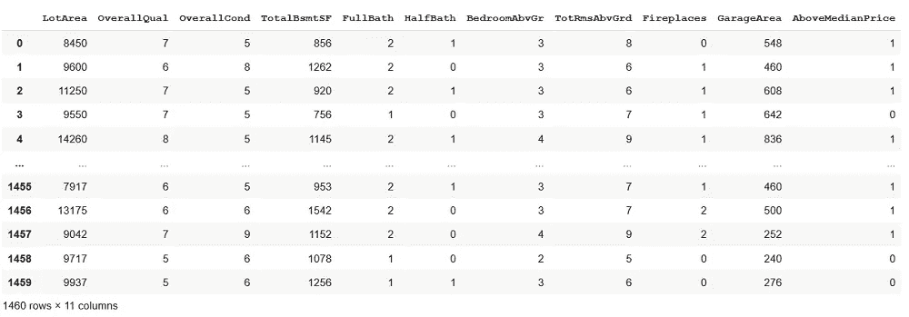
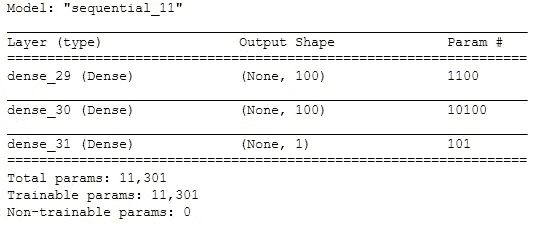
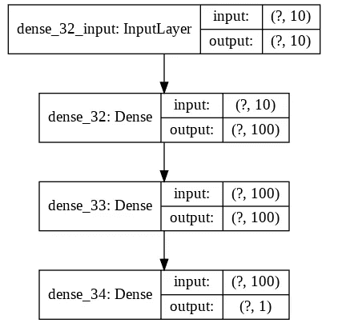
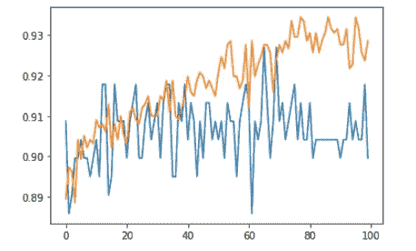

# 用 Keras 构建神经网络，用 Google 云平台部署模型

> 原文：<https://medium.com/analytics-vidhya/building-a-neural-network-with-keras-and-deploying-the-model-with-google-cloud-platform-cd049ed6e568?source=collection_archive---------7----------------------->

在本文中，我们将向您展示如何使用 Keras 创建一个简单的神经网络模型来预测房价是否高于中值，以及稍后如何使用 Google 云平台工具部署该模型。


为此，您必须熟悉 google Colaboratory 或 Jupter notebook，并安装以下软件包:

Keras
tensor flow
Scikit-learn
Pandas
Matplotlib

你还需要有一个 GCP 账户。您可以使用您的谷歌 gmail 在以下链接设置它【https://cloud.google.com/ T4

## 本文涵盖的步骤

探索数据
标准化数据集
构建神经网络
训练神经网络
查看损失和准确性
在谷歌云平台(GCP)上部署模型
以 JSON 格式保存待预测数据
使用 GCP 神经网络模型进行预测

## 探索数据

第一步是在规范化之前探索和理解数据。为此，让我们使用熊猫图书馆。在 Colab 或 Jupyter 打开一个新的 Python 笔记本，导入 pandas 库和数据集。

数据集可以直接从 Git hub 下载，使用链接:[https://github . com/markitosanches/machine/blob/master/house price data . CSV](https://github.com/markitosanches/machine/blob/master/housepricedata.csv)

该数据集改编自 Zillow 的房屋价值预测 Kaggle 竞争数据。

```
import pandas as pd
data = pd.read_csv("housepricedata.csv");
data
```



数据保存在一个名为 data 的变量中。你可以浏览屏幕上的数据。

前 10 列我们可以看到我们的输入功能。

*   地块面积(平方英尺)
*   总体质量(从 1 到 10 分)
*   总体状况(从 1 到 10 分)
*   地下室总面积(平方英尺)
*   全浴室数量
*   半个浴室的数量
*   地上卧室的数量
*   地上房间总数
*   壁炉数量
*   车库面积(平方英尺)

最后一列是我们想要预测的特性。

*   房价到底是不是中值以上？(1 表示是，0 表示否)

机器学习模型处理向量，因此需要将数据转换为数组。

```
dataset = data.values
dataset
```

这将是输出:

```
array([[ 8450,     7,     5, ...,     0,   548,     1],
       [ 9600,     6,     8, ...,     1,   460,     1],
       [11250,     7,     5, ...,     1,   608,     1],
       ...,
       [ 9042,     7,     9, ...,     2,   252,     1],
       [ 9717,     5,     6, ...,     0,   240,     0],
       [ 9937,     5,     6, ...,     0,   276,     0]])
```

我们可以使用函数 dataset.shape 来浏览数据，结果将是一个数组(1640，11)。这意味着一个 1460 行 11 列的阵列。

下一步是将数据集分成输入资源“X”和要预测的资源“y”。“X”是第 1 至 10 列，而“y”是第 11 列。为此，我们将创建两个变量“X”和“y”。

```
X = dataset[:,0:10]
X.shapeY = dataset[:,10]
y.shape
```

创建变量后，我们可以用 shape 函数来研究它，可以看到 X 是(1460，10)和 y (1460，)的向量

## 标准化数据集

归一化的思想是将不同尺度的测量值调整到一个共同的标称尺度，通常是在取平均值之前。扩展数据的一种方法是使用现有的 scikit-learn 包。
我们将使用一个名为 min-max scaler 的函数来缩放数据集，使所有输入资源都在 0 和 1 之间，包括:

```
from sklearn import preprocessing
min_max_scaler = preprocessing.MinMaxScaler()
X_scale = min_max_scaler.fit_transform(X)
```

规范化数据保存到名为 X_scale 的变量中。现在我们需要分割数据用于训练、测试和验证。在 scikit-learn 中，我们将导入 train_test_split 函数来完成这项工作。测试规模将是 30%,从测试规模，我们将使用 50%作为验证。这意味着训练规模将为 70%，测试规模为 15%，验证规模为 15%。

```
from sklearn.model_selection import train_test_split#Train and test set (30%)
X_train, X_val_and_test, y_train, y_val_and_test = train_test_split(X_scale, y, test_size=0.3)#validation test (50% of test set)
X_val, X_test, y_val, y_test = train_test_split(X_val_and_test, y_val_and_test, test_size=0.5)
```

## 构建神经网络

构建神经网络的第一步是定义体系结构。对于本文，我们将使用一个顺序模型，其中 1 个输入层大小为 10(为 X 定义的资源数)，2 个隐藏层各有 100 个神经元，使用 Relu 激活，输出层有 1 个神经元和一个 Sigmoid 激活。

该模型使用 adam 优化器和均方误差损失。

为了执行所描述的架构，我们将使用 Keras。

```
import numpy as np
from tensorflow.keras.models import Sequential
from tensorflow.keras.layers import Dense
from tensorflow.train import AdamOptimizer
import tensorflow as tf
```

创建模型。该模型将保存在名为 model 的变量中。

```
model = Sequential()
model.add(Dense(100, activation="relu", input_shape=(10,)))
model.add(Dense(100, activation="relu"))
model.add(Dense(1, activation="sigmoid"))

model.compile(optimizer="adam", loss="mean_squared_error", metrics=['accuracy'])
```

打印模型摘要。

```
model.summary()
```



绘制模型。

```
tf.keras.utils.plot_model(model, 'my_first_model.png', show_shapes=True)
```



## 训练神经网络

现在我们的模型已经准备好了，我们可以训练和分析损失和准确性。为了训练模型，我们将使用 X_train 和 y_train 特征，epochs 为 100，验证样本 X_val 和 y_val，并将其保存在名为 hist 的变量中。

```
hist = model.fit(X_train, y_train, batch_size=32, epochs=100, validation_data=(X_val, y_val))
```

# 观看损失和准确性

我们可以通过执行以下命令来评估模型损失和准确性。第一个数值是损耗，越低越好，第二个是精度越高越好。

```
model.evaluate(X_test, y_test)#Output
[0.0513587364731314, 0.9178082199945842]
```

为了更好的分析，我们还可以绘制一个图表。为此我们需要 Matplotlib 库。

```
hist.history.keys()

import matplotlib.pyplot as plt
plt.plot(hist.history['val_acc'])
plt.plot(hist.history['acc'])
```



橙色线表示训练准确度，蓝色线表示验证准确度。

## 在 Google 云平台上部署模型

要使用 GCP 部署模型，您必须有一个项目 ID。如果您没有，请打开您的 GCP 控制台并创建一个新项目。在项目页面下，您可以找到项目 ID。现在，我们可以使用 python 笔记本完成所有的配置。

为我们的 GCP 项目设置一些全局变量:您的项目 ID、为您的 Bucket(存储在您的 GCP 中)创建一个名称、服务器位置、模型版本和模型名称。

```
GCP_PROJECT = 'INSERT HERE YOUR PROJECT ID'
KERAS_MODEL_BUCKET = 'gs://house-prediction-gcp'
REGION = 'us-central1'
KERAS_VERSION_NAME = 'v1'
MODEL = 'model_house'
```

按照说明运行以下代码来验证您的 GCP 凭据。点击链接将其连接到您的 gmail，复制认证号，将其粘贴到字段中，然后按 enter。

```
import sys
if 'google.colab' in sys.modules:
  from google.colab import auth as google_auth
  google_auth.authenticate_user()
else:
  %env GOOGLE_APPLICATION_CREDENTIALS ''
```

创建您的存储桶，存储位置在 GCP。您可以直接从控制台或通过运行以下代码来完成此操作。您的存储桶名称将是 KERAS_MODEL 存储桶变量中给出的名称。

```
! gsutil mb -p $GCP_PROJECT -l $REGION $KERAS_MODEL_BUCKET
# Display what is in the bucket
!gsutil ls -al $KERAS_MODEL_BUCKET
```

使用变量 GCP 项目配置您的 GCP 项目。

```
!gcloud config set project $GCP_PROJECT
```

将您的模型导出到名为 keras_export 的文件夹中。该文件夹将有一个名为 saved_model.pb 的文件。这将是您在 GCP 保存的模板。

```
export_path = tf.contrib.saved_model.save_keras_model(model, KERAS_MODEL_BUCKET + '/keras_export')
```

在 GCP 控制台下创建一个模型。模型名称将是变量模型的值。

```
!gcloud ai-platform models create $MODEL
```

为您的模型创建一个版本，该版本将与您的存储桶 keras_export/saved_model.pb 连接。版本名称将是变量 KERAS_VERSION_NAME 的值。

```
!gcloud beta ai-platform versions create $KERAS_VERSION_NAME --model $MODEL \
--origin=$KERAS_MODEL_BUCKET/keras_export/ \
--python-version=3.5 \
--runtime-version=1.14 \
--framework='TENSORFLOW'
```

我们准备好了，让我们创建一个 JSON 文件来测试我们实现的模型。

## 以 JSON 格式保存要预测的数据

要在 GCP 使用我们的模型，我们必须以 JSON 格式提交请求。我们将创建一个 JSON 对象，将其保存在本地，并通过 GCP 向我们的模型发送请求。

为了测试我们的模型，我们使用来自 X_test[0]样本的值，并在 JSON 中转换它。

```
%%writefile predictions.json
[0.03430788, 0.66666667, 0.5, 0.14729951, 0.66666667, 0.5, 0.375, 0.41666667, 0.33333333, 0.45416079]
```

## 使用 GCP 神经网络模型进行预测

最后，我们可以测试我们的模型，在我们的 GCP 模型中直接部署 JSON 文件。

```
prediction = !gcloud ai-platform predict --model=$MODEL --json-instances=predictions.json --version=$KERAS_VERSION_NAME
print(prediction[1])
```

此预测的结果是[0.9708504676818848]，此结果可能会根据数据拆分而变化。

完整的代码可以在我的 Git hub 上找到。
[https://github . com/markitosanches/machine/blob/master/realstate . ipynb](https://github.com/markitosanches/machine/blob/master/RealState.ipynb)

## 关于作者:

> [**Marcos Sanches**](https://marcossanches.com/) 是一名业务管理专家，在信息技术的分析、设计和执行方面具有丰富的知识。在巴西、法国和加拿大的实践经验。具有战略眼光和市场生存能力的批判性分析能力。利用最新技术进行更新，利用这些知识和经验来优化或构建内部业务流程，应用最佳工具和实践。初学机&深度学习。
> 
> 加拿大大学计算机科学教授。
> 
> 欢迎所有评论和反馈。

***参考:*** *本文部分内容参考了《用 Keras 构建你的第一个神经网络预测房价》一文，作者为李宗德·韦恩。全文请见:*[*https://hacker noon . com/build-your-first-neural-network-to-predict-house-prices-with-keras-3fb 0839680 F4*](https://hackernoon.com/build-your-first-neural-network-to-predict-house-prices-with-keras-3fb0839680f4)