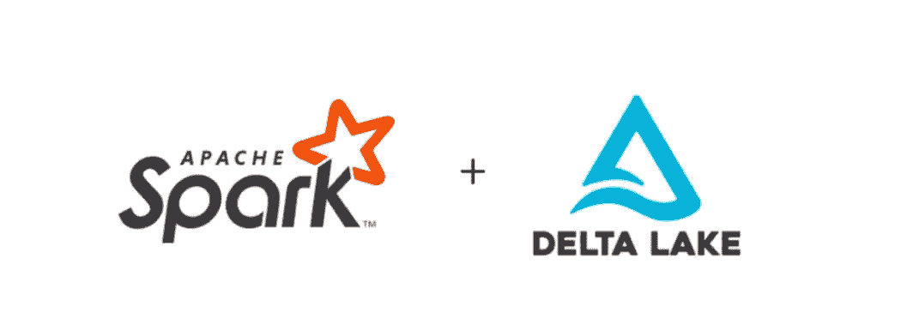

# 用 Spark 和 Delta Lake 构建基于笔记本的 ETL 框架

> 原文：<https://medium.com/analytics-vidhya/building-a-notebook-based-etl-framework-with-spark-and-delta-lake-b0eee85a8527?source=collection_archive---------8----------------------->



随着数据科学应用的增长，从不同来源提取、转换和加载数据(ETL)的过程在过去几年变得至关重要。此外，数据可用性、及时性、准确性和一致性是任何数据项目开始时的关键要求。

即使有指导方针，也没有一个万能的架构来构建 ETL 数据管道。这取决于多种因素，如数据类型、频率、数量以及维护这些数据的人员的专业知识。数据管道需要可靠和可伸缩，但也要相对简单，以便数据工程师和数据科学家与新的数据源集成，并对底层数据结构进行更改。

有无数的工具可以用于 ETL，但是由于其处理大量数据的速度，Spark 可能是最常用的数据处理平台之一。除了数据处理，Spark 还有用于机器学习、流、数据分析等的库，因此它是实施端到端数据项目的一个很好的平台。它还支持 Python (PySpark)和 R (SparkR，sparklyr)，这是数据科学中使用最多的编程语言。

另一方面，还有[三角洲湖](https://delta.io/)，这是一个支持 [ACID](https://en.wikipedia.org/wiki/ACID) 事务的开源数据湖，这使得它成为处理复杂数据工作负载的绝佳选择。此外，它还具有多种特性，如模式演化(对数据模型的更改易于实现)和模式实施(确保到达的数据与目标模式一致)、数据版本控制(及时返回)、批处理和流接收，最后但同样重要的是，它与 Spark 完全兼容。

Spark 背后的公司 Databricks 有一个基于云的分析平台，提供多种工具来促进 Spark 在不同用例中的使用。他们的协作笔记本允许运行 Python/Scala/R/SQL 代码，不仅用于快速数据探索和分析，还用于数据处理管道。事实上，[笔记本在网飞的数据架构中扮演着关键角色](https://netflixtechblog.com/notebook-innovation-591ee3221233)。

在这个简单的介绍之后，我们已经准备好进入基于 Spark 笔记本的 ETL 工作流的细节。在这种架构中，作为编排者的笔记本从 Delta 提取数据，执行列表中的笔记本，然后将运行结果存储回 Delta。

这篇文章的想法是*不是*提供完整的实现，而是提供工作流的概述和一些代码片段来帮助理解流程是如何工作的。

*   首先，在 Delta Lake 中创建一个主表，其中包含要执行的笔记本的*名称和路径，以及*作业组*、*超时*(作业暂停前可以花费的分钟数)、*最大重试次数*(作业失败时的尝试次数)、*状态*(启用/禁用)和*优先级*(运行顺序，如果笔记本可以并行运行，则为-1)。*

```
**CREATE** **TABLE** delta.`/mnt/delta/master_runs`
  notebook_path STRING,
  job_group STRING,
  timeout_minutes SMALLINT, 
  maximum_retries SMALLINT,
  priority SMALLINT,
  is_enabled BOOLEAN
)
**USING** DELTA
```

*   这个表将由充当协调器的主 Spark 笔记本查询。它获取需要按优先级顺序为特定作业组执行的笔记本列表。也就是说，Databricks 中配置的每个作业都可以包含一个参数，该参数将被传递到主笔记本，以使笔记本只为该组运行。例如，可以基于频率或数据源来定义这些组。

```
# Gets job group from the Spark job definition
job_group = getArgument("job_group")df_notebooks_to_run = spark.sql(“*SELECT notebook_path, status, timeout_minutes, maximum_retries, priority FROM master_runs WHERE job_group = {} and is_enabled = True ORDER by priority*".format(job_group)list_notebooks_to_run = df_notebooks_to_run.collect()
```

*   一旦笔记本列表可用，我们迭代每一个，并根据它们是否应该顺序运行，将它们分成单独的列表。例如，依赖于其他笔记本执行的笔记本应该按照*优先级*字段定义的顺序运行。当没有依赖关系时，笔记本用 *priority = -1* 标记，可以并行运行。

```
notebooks_parallel = []
notebooks_sequential = []for nb in list_notebooks_to_run:
  if nb['priority'] >= 0:
    notebooks_sequential.append(nb['job_name'])
  else: 
    notebooks_parallel.append(nb['job_name'])
```

*   为了并行运行笔记本，我们可以使用标准的 Python 并发包。工人池将异步执行元组 *job_tuple_parallel* 中的笔记本。
    (有关如何并行运行 Databricks 笔记本的更多详细信息，请点击查看[)](https://databricks.com/blog/2016/08/30/notebook-workflows-the-easiest-way-to-implement-apache-spark-pipelines.html)

```
from concurrent.futures import ThreadPoolExecutor, waitjob_tuple_parallel = tuple(notebooks_parallel)
run_in_parallel = lambda x: **run_notebook**(x) 

futures = [] 
results = [] 
with ThreadPoolExecutor() as pool: 
 results.extend(pool.map(**run_in_parallel**, **job_tuple_parallel**)) 
 for x in futures: 
   if x.result() is not None: 
     results.append(x.result()) 
   else: 
     results.append(None) 
```

*   方法 *run_notebook* 将使用 Databricks *dbutils 库(dbutils.notebook.run)* 来执行笔记本，并将执行结果记录回 Delta 中。
*   笔记本的每次执行都有自己的 run_id。可以使用 Scala 获得运行 id，然后存储在一个临时视图中，这样 PySpark 就可以访问它。

```
%scala
val runId = dbutils.notebook.getContext.currentRunId.toString
Seq(runId).toDF("run_id").createOrReplaceTempView("run_id")%python
run_id = spark.table("run_id").head()["run_id"]
run_id = re.findall(r'\d+', run_id)[0]
run_id = int(run_id)
```

*   一旦获得当前运行的 *run_id* ,它可以与其他运行参数一起记录到结果增量表中，用于审计目的。该表还可以存储运行的开始和结束时间以及状态(成功、失败)，以便以后可以使用它来构建仪表板，以跟踪多个笔记本运行的性能。

# 结论

这个工作流程当然可以改进和扩充，但根据个人经验，它可以很好地处理繁重的工作负载，并且在需要时可以直接添加新的管道。还应该考虑使用开源工具来构建、安排和监控工作流。阿帕奇气流就是其中之一；一个强大的开源平台，可以与 Databricks 集成，并通过 Python API 和基于 web 的 UI 提供工作流调度。