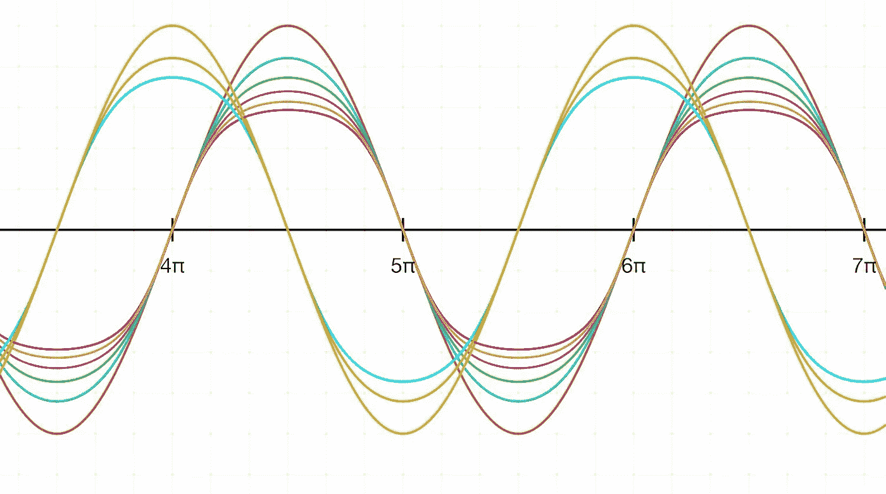
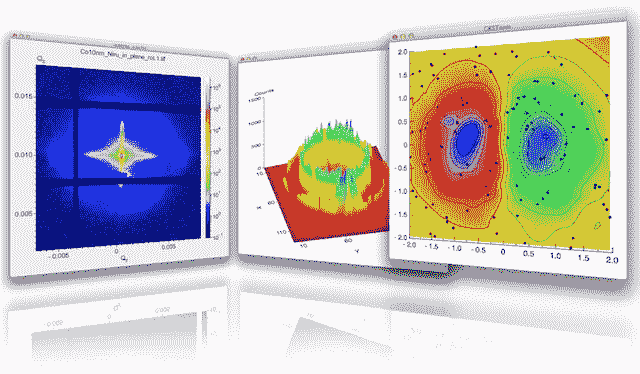
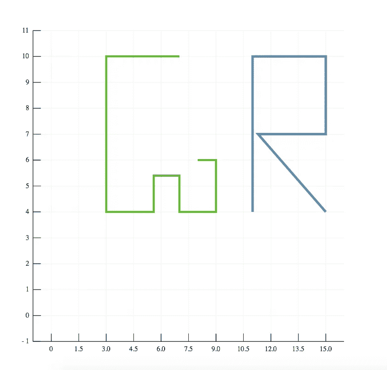
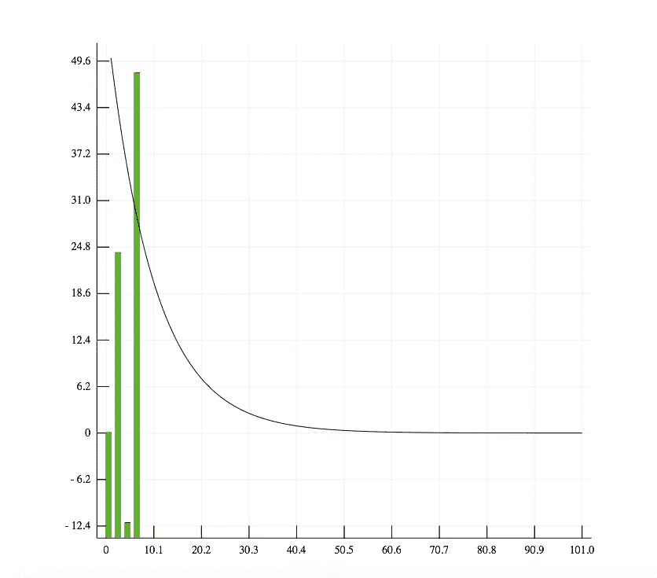
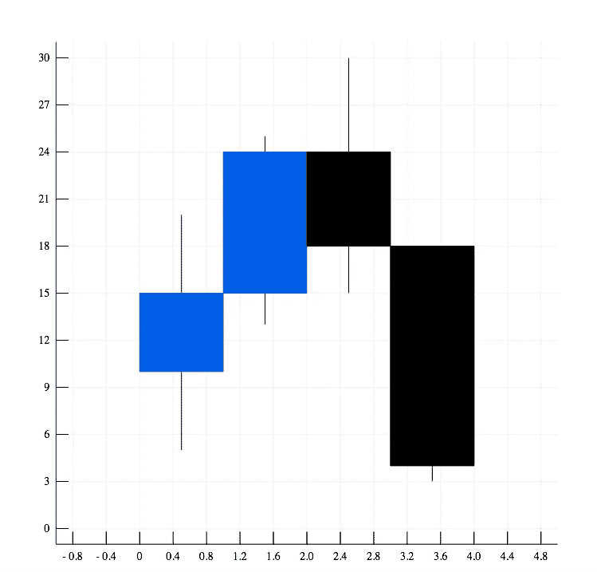
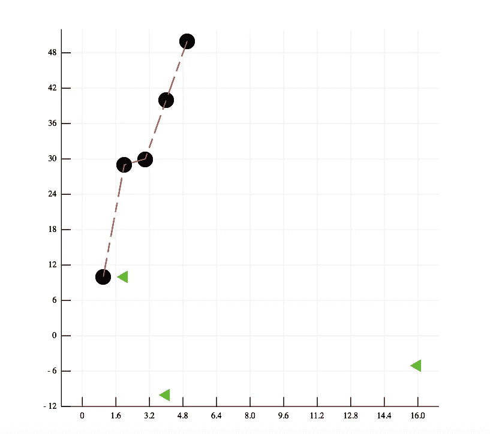
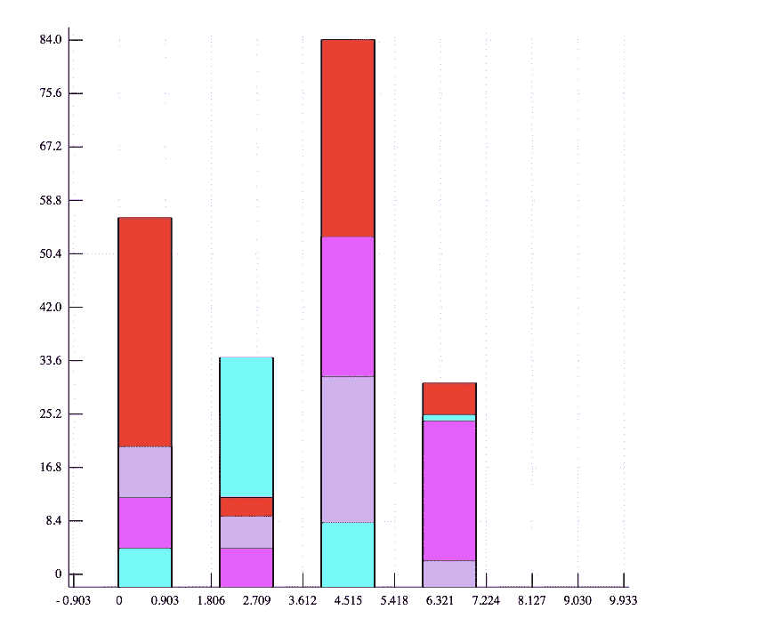
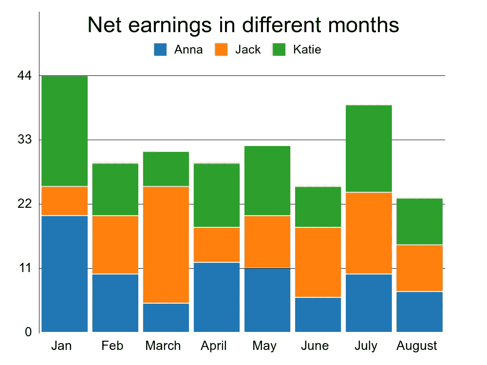
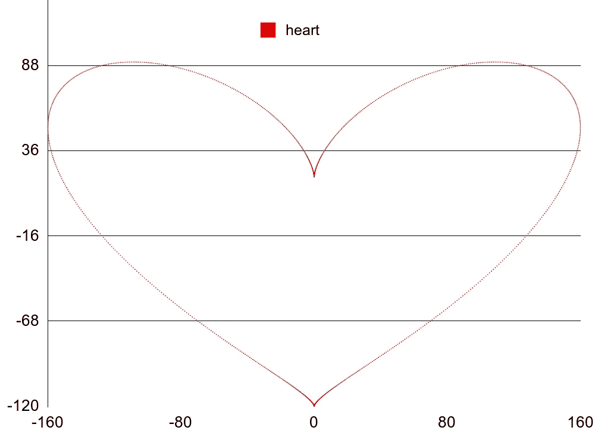
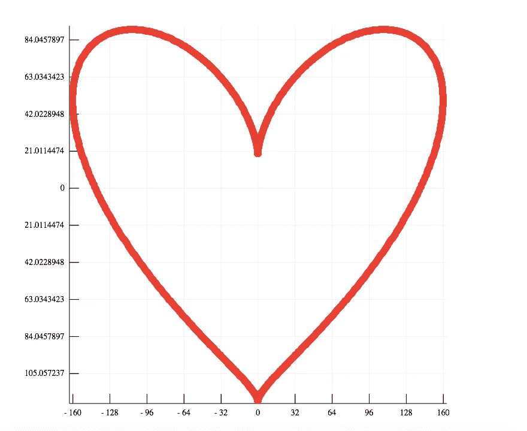

# 为 Ruby 构建绘图库

> 原文：<https://medium.com/analytics-vidhya/building-a-plotting-library-for-ruby-9672bc4af98d?source=collection_archive---------16----------------------->



嗨，读者们，

在 Sciruby，我们遇到了为 ruby 设计下一个 Matplotlib 的雄心勃勃的任务，因此我们检查了相当多不同的绘图库，并认为如果我们可以将所有这些库中的想法汇集起来，那么我们就可以做出真正令人惊叹的东西( [Rubyplot](https://github.com/SciRuby/rubyplot) )。

> 初步计划

最初我们想出了一个采纳 Matplotlib 想法的详细计划。我为谷歌代码之夏项目做了一个提议，并和我在 Sciruby 的导师们分享了这个提议。我们讨论了各种想法，最终我开始着手这个项目。

我们的第一个也是主要的问题是…

> 我们怎么画？

你看，在 Ruby 和 python 中有许多用于进行小型可视化的库，但是制作一个完整的绘图库是一个完全不同层次的任务。我们需要一些真正灵活的东西来使所有事情变得快速。所以经过一番激烈的讨论后，我们最终决定使用两个不同的可视化库，并最终将它们合并在一起。

# Image Magick 和 GR 框架



我们决定独立构建两个不同的 ruby 库，但是在它们的代码中有许多相似之处。最终，当项目完成时，我们将把它们合并成一个单一的库，并让用户选择使用其中一个库作为构建地块的后端。好了，关于设计的讨论到此为止。

> L 让我们从 Gr 图开始做一些真实的东西

Gr plot 正在为 ruby 绘制库，它使用 Gr 框架[作为后端。](http://gr-framework.org/tutorials/index.html)



如果你看一下代码，很容易注意到你不仅可以画出线条曲线，还可以很容易地指定线条宽度和线条颜色等等

```
g.line! @x1, @y1, line_width: 4, line_color: :green
```

不仅如此，我们还有许多定制功能

```
def line!(x_coordinates, y_coordinates, line_width: :default,
 line_color: :default, line_type: :default,
 marker_size: :default, marker_color: :default,
 marker_type: :default)
```

用 GRPlot 还可以画出很多其他的图。

*   分散
*   线条
*   酒吧
*   堆叠条形图
*   坎德尔斯蒂克



条形图、烛台图、折线图、堆积条形图

> 现在让我们继续魔法情节

Magick plot 是一个绘图库，使用 [RMagick](https://rmagick.github.io/) 作为后端，以各种硬拷贝格式生成高质量的数字。



上面注释的代码是不言自明和简单明了的。请注意，许多可用的自定义选项使您更容易处理地块。您可以在绘图中轻松定义标签颜色/绘图大小(以像素为单位)等。

Magickplot 也是一个非常酷的库，有许多类似于 GRPlot 的特性，但是两个库的内部实现完全不同。我们相信，根据不同的用例，用户会发现其中一个比另一个更有用。

因此，我们的下一个目标是将它们合并在一起，并为用户提供一个简单的 API 来轻松地从 GR 图切换到 Magick 图…..

让我们举一个例子



在 Magick 图和 GR 图中绘制的心脏曲线

请注意，在将这两个不同的库组合在一起后，使用它们实际上没有什么不同

```
g = Rubyplot::Figure.new(backend: :magick)                       g.scatter! @x1, @y1, marker_color: :pink, label: :heart                       g.save('scatter.png') g2 = Rubyplot::Figure.new(backend: :GR)                       g2.text_font = :bookman_light_italic                       g2.scatter! @x1, @y1, marker_color: :red                       g2.save('scatter2.png')
```

上面的代码示例强调了如何灵活地使用 figure 类来使用两个不同的后端。

**致谢**

感谢我在西鲁比的所有导师，即 Sameer Deshmukh，Pjotr Prins，Prasun Anand 和 John Woods。

特别感谢 Pranav Garg-> GR-Ruby 的首席开发人员和 Sciruby 的学生

# 功能请求

我的最终目标是让这个项目类似于 Ruby 的 [matplotlib](https://matplotlib.org/) 等价物，具有大量令人惊叹的定制特性。我希望你觉得这很有趣和有用。请从 [github](https://github.com/SciRuby/rubyplot) 中随意尝试一下。欢迎任何建议和推荐。