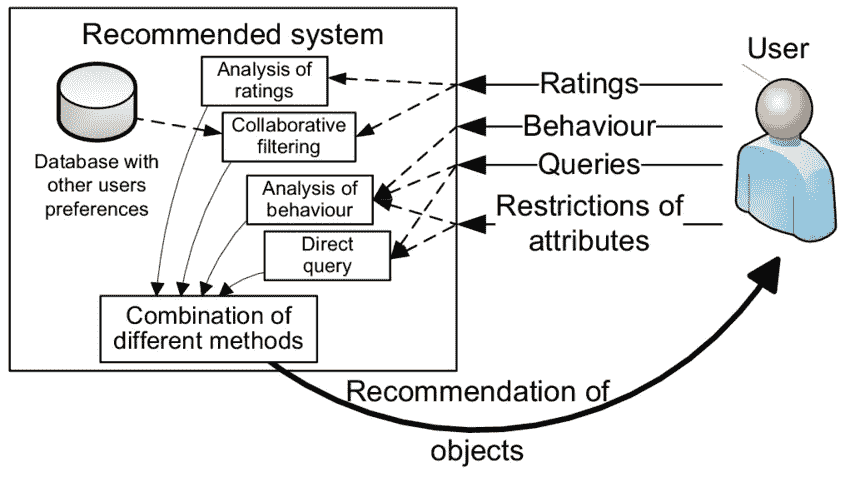

# 构建播客推荐引擎

> 原文：<https://medium.com/analytics-vidhya/building-a-podcast-recommendation-engine-357cda661a12?source=collection_archive---------22----------------------->

自从推荐引擎的概念被介绍给世界以来，组织一直在努力完善推荐算法。像 YouTube、网飞、Spotify 和许多其他公司都依赖于他们的推荐引擎的有效性来吸引新用户，并操纵用户花更多的时间在他们的产品上。音乐、电影、连续剧、播客等。他们每个人都有自己的推荐系统。

由于更好的推荐算法的出现，播客的需求和使用呈指数级增长。播客基本上是用户可以收听的一系列口语单词、音频片段的数字音频文件。

推荐引擎总是需要对用户有更好的了解，以便给出更好的建议。因此，对于一个更好的系统来说，数据的收集和整合是构建推荐引擎过程中最重要也是最关键的方面。即使在播客的情况下，关于用户与平台的交互的信息，如关于过去访问的播客的信息、对听到的播客的评论、用户实际上是否听到完整的播客，甚至简档信息，如性别、年龄、国籍、地点、偏好的流派、花费在平台上的时间、用户是偏好付费播客还是他偏好仅访问免费播客等等。

在我看来，构建一个播客推荐系统主要有两种技术，即基于内容的过滤和协同过滤。

***基于内容的过滤:*** 这种技术基于平台上每个用户的交互和偏好。先前访问的播客和关于用户进行的不同类型的交互的信息(像保存为收藏夹、书签、已经给出令人满意的评级和评论的播客)。用户对流派以及喜欢和经常访问的播客的选择有助于更好地推荐。这种方法非常适合用户频繁使用平台的系统，这有助于引擎获得越来越多的用户活动信息，从而提高推荐的准确性。**但是，**有一个问题，应用程序需要有访问用户隐私的权限。对于访问个人元数据甚至个人交易数据，还必须确保一套监管措施。

***协同过滤:*** 这是另一种广泛使用的技术。这种技术实际上使用了所有用户的协作数据，从在播客中具有相似品味和选择的许多用户的元数据中收集信息，并为单个用户导出推荐。与基于内容的过滤相比，这种方法通常工作得更好，并且具有更高的准确性，因为它可以由播客中具有相似品味的所有用户访问大量的协作数据集。**但是，这里也有一个陷阱。有时，由于不同用户收集的数据，会产生一个可变性因素，这可能会导致一些不太容易解释的建议。就像，如果两个人对听虚构内容的播客感兴趣，并且他们都有非常相似的品味，但是如果其中一个人突然对科学纪录片播客感兴趣，那么在某些情况下，这可能会导致向另一个人推荐与科学推荐相关的播客。没有关于他人的有意义的信息，自然地，参与任何个人行动变得更加困难。**

基于内容的过滤和协同过滤

> *既然* ***协同过滤*** *有机会提供更高的准确率，那么最好使用它。让我们进一步讨论协同过滤:*

## 建立这个系统有两个主要步骤:

*寻找对播客有相似爱好的用户。(前面讨论过)*

*系统必须能够预测任何特定用户对播客的评级，甚至在用户实际评级之前。这实际上对公司非常有帮助，因为引擎本身决定推荐，以便根据用户过去的活动获得满意的评级。这种方式对制作播客的不同赞助商和组织很有帮助，因为他们现在可以根据用户的兴趣来工作，从而增加利润。*

推荐系统的结构

## 现在有两种方法可以完成以上两步，即**基于内存的方法**和**基于模型的方法**。

## **基于记忆的方法**

在这种方法中，统计技术被应用于存储在存储器中的整个数据集，以便预测结果。我们可以根据不同的流派对数据进行分组，每个组都以矩阵(实际上是稀疏矩阵)的形式构成，该矩阵具有用户的唯一 id 以及他们在不同播客上给出的相应评级，按顺序排序(比如评级矩阵)。现在，为了找到相似类型的用户，我们可以考虑他们在以前的播客中给出的评级之间的余弦相似性以及相似类型数据的评级之间的欧几里德距离，以便识别相似类型的用户。在这种方法中还有另外两种类型的协同过滤，虽然统计方法完全相同，但是它们的输入变量在概念上是不同的。

***基于用户的协同过滤:*** 在该技术中，评分矩阵用于根据用户对其收听或访问的播客的评分来找出相似用户。因此，对于特定用户，通过从相似性列表中挑选出特定数量的用户，即基于由给定项目评级组成的评级向量确定的一组相似用户，来找到尚未评级的播客的评级，这些用户已经听过播客并对其进行了评级，因此机器基于相似用户的这些可用评级来计算评级。

***基于评分的协同过滤:*** 在该技术中，评分矩阵用于根据已经收听或访问过播客的用户给出的评分来找出相似的播客。因此，对于播客，通过从相似性列表中挑选出多个播客，即基于由用户接收的评级组成的评级向量确定的一组相似播客，已经由特定用户评级的特定用户**对其进行评级，从而基于这些评级计算指定播客的评级，来找到尚未对其进行评级的特定用户的评级。**但是**与前一种方法相比，这种方法在这种情况下效果很差，因为相似类型的用户可能基于不同的标准对相同的播客进行评级。这就是**矩阵分解**的概念实际上可以发挥作用的地方，其中评级矩阵可以使用潜在因子分解为两个较小矩阵(一个行矩阵和一个列矩阵)的乘积，然后预测指定用户对给定播客的评级(即从两个较小矩阵导出的值的点积)。**

此外，根据我们选择的协同过滤方法，K-NN 可以用于找出相似的用户或相似的评级，以预测对特定用户的'*待推荐'*播客的评级。

## **基于模型的方法**

在这种方法中，我们试图减少稀疏矩阵(评级矩阵，如上所述)。因此，为了减小规模，我们使用不同的降维技术，如 PCA、t-SNE，进行**矩阵分解，**进一步降低矩阵的维度。虽然，根据我目前的知识 **t-SNE** 将被证明是两者中更好的技术，因为它将试图按照我们遵循的方法保留相似评级或用户的邻域。

## **现在，为了衡量我们推荐引擎的准确性，我们可以应用:**

**均方根误差，**其中我们预测了播客的用户评级对的测试数据集的评级，这些播客的评级值是已知的。已知值和预测值之间的差异就是误差。然后对测试集的所有误差值进行平方，并计算平均值，然后计算该平均值的平方根以获得 RMSE。

**平均绝对误差，**除了我们只取测试集的绝对值并计算所有误差值的平均值(或均值)之外，我们遵循与 RMSE 相同的所有步骤。

但是，在某些情况下，描述由独特的词语组成(如一些本地术语、任何虚构的参考资料、研究论文等。)这可能导致推荐系统的失败，因为推荐变得有偏差，在某些情况下导致更少甚至荒谬的推荐。只有彻底检查每个播客的描述，并确保播客的描述确实能够描述内容的主题，才能解决这个问题。

如今，许多公司都在努力建立和完善个性化推荐引擎，即使用户不是平台的常客，它也能识别用户并根据他/她的选择推荐完美的播客。

