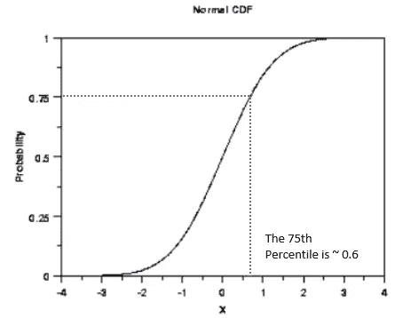
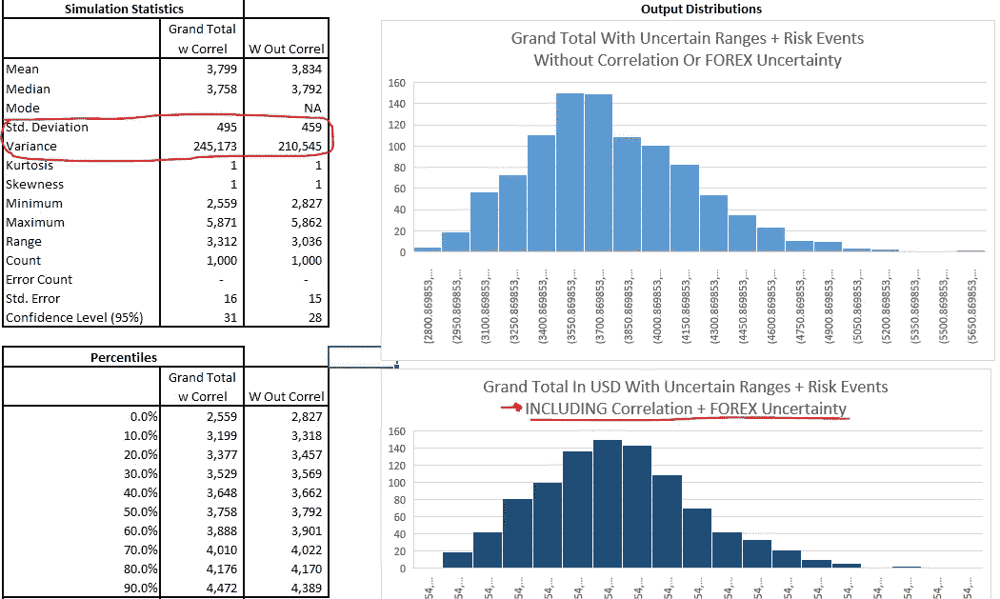

# 使用蒙特卡罗模拟建立概率风险估计

> 原文：<https://medium.com/analytics-vidhya/building-a-probabilistic-risk-estimate-using-monte-carlo-simulations-cf904b1ab503?source=collection_archive---------0----------------------->

*使用 XLRisk 进行数据驱动最佳推测的结构化方法*

图片来源:极客老爸[https://Geek Dad . com/2018/02/part-2-build-perfect-dungeon-master-dice-set/](https://geekdad.com/2018/02/part-2-build-perfect-dungeon-master-dice-set/)

> *在这一部分中，我将解释如何使用蒙特卡罗模拟来构建概率估计，即使你没有所有相关信息，不得不处理不确定的变量输入，并暴露于使用 Excel 插件 XL Risk 的潜在风险中。*

# 概述

1.  [**简介**](#045b)
2.  [**已经把号码给我了！**](#48c3)
3.  [**单点估计的问题&最好最坏情况**](#539e)
4.  [**概率分布入门**](#bc2b)
5.  [**蒙特卡洛模拟工具**](#4602)
6.  [**造型不确定范围**](#5806)
7.  [**建模离散风险事件**](#0eff)
8.  [**建模不确定变量之间的依赖/相关性**](#dd45)
9.  [**了解推动结果的关键因素**](#2b53)
10.  [**结论**](#13b8)

# 1.介绍

生活中充满了不确定性，当面对可能没有所有相关信息的情况或必须应对可能影响我们目标的事件时，通常很难做出最佳决策。

这篇文章概述了一种称为蒙特卡罗模拟*的技术，涉及到建立一个模型，以一组**预定义的随机变量**作为输入，然后**重复运行模拟**，并分析所有模拟的**汇总结果。(* *随机琐事——这个词是由* [*约翰·冯·诺依曼*](https://www.britannica.com/biography/John-von-Neumann#:~:text=John%20von%20Neumann%2C%20original%20name,granted%20his%20father%20in%201913) *创造的，源于摩纳哥这座以赌场闻名的城市。除了他在核物理、博弈论和计算方面的其他成就，冯·诺依曼还在 20 世纪 50 年代提出了神经网络的想法！*)**

 [## 蒙特 卡罗模拟

### 蒙特卡罗模拟用于模拟一个过程中不同结果的概率，而这个过程不容易被模拟

www.investopedia.com](https://www.investopedia.com/terms/m/montecarlosimulation.asp) 

虽然这个主题并不完全与数据科学相关，但我写这篇文章已经有一段时间了，因为这是一个我非常喜欢的主题，因为我作为项目风险分析师的职业生涯中有很大一部分时间都在做这种工作。此外，我在其他一些帖子中也顺便提到了这个方法

例如，我使用蒙特卡罗模拟来模拟新冠肺炎的传播

 [## 用 Excel VBA 建立基于主体的新冠肺炎传染模型

### 样板警告:我既不是流行病学家也不是统计学家，我建立的分析模型更多的是为了…

medium.com](/@zhijingeu/building-an-agent-based-covid-19-contagion-modelling-with-excel-vba-8a8c6e461cac) 

或者…我使用蒙特卡罗模拟来模拟如何使用线性规划选择最佳项目组合，即使是在不确定的输入条件下

 [## 使用线性规划工具优化资本预算

### (Excel 解算器、Open Solver、Solver Studio、Python PulP / Pyomo、Frontline Systems 分析解算器)

medium.com](/@zhijingeu/optimizing-capital-budgeting-using-linear-programming-tools-dfd1dec5a64d) 

# **2。把号码给我就行了！！！**

当面对这样的问题时:

*   *盖房子要花多少钱？*
*   这个假期会花我多少钱？
*   在接下来的 6 个月里，我们预计会有多少新冠肺炎感染病例？

..提供一个单一的数字估计作为答案是很诱人的。

不幸的是，一个单一的数字估计忽略了一个事实，即“真实答案”将可能在一个数字范围内，这将取决于

*   问题定义的**层次和基本假设**。你具体指的是什么样的房子？—这是建造全新的房子还是翻新现有的房子等等
*   用于进行有意义的估算的支持信息的**可用性和性质**(例如，如果我们只有在特定城市销售的房产的历史成本(按平方英尺计算),而没有任何其他粒度，与如果我们有一个更全面的按房产类型分组的交易房产销售实际价值的数据库，请考虑两者之间的差异)
*   我们在评估中想要的对可变性或期望的确定性的**容限**。(例如，如果这是一个像一杯咖啡的价格这样的问题，不准确的后果是微不足道的，而对新冠肺炎病例数的预测是用来规划足够的医院床位的，在这种情况下，我们需要更加保守，宁愿犯谨慎的错误。

在本文的其余部分，我们将使用一个简单的虚构例子来回答“ ***我去梦幻岛度假要花多少钱？”这个问题。***

看哪！梦幻岛——你梦想中的度假胜地(尽管你可能想去泛舟)

# 3.单点估计和最佳最坏情况估计的问题

首先，一个简单的“确定性*”方法是列出构成总度假成本的相关子要素，然后对每个子要素进行估算，并编制出总成本。

(* *确定性估计是一种不涉及随机性的估计，因此总是从给定的初始输入产生相同的输出*

这产生了一个大约 4.2k 美元的直接答案

但是等等！我们可能拥有比上表中更多的信息，因为对于每个要素，我们都有一个高值和低值的概念，因为我们比较了几家酒店的价格和一些 AirBnB/招待所的价格，我们还从 2 或 3 个不同的朋友那里获得了一些关于他们自己家庭在假日旅游成本和餐饮成本等方面的反馈。

或许更好的方法是使用一系列的数字。结果仍然是决定性的，但至少现在有一个“最大”和“最小”的数字。

现在，使用这种“最佳-最坏情况”方法，我们有一系列从 30000 美元到 54000 美元的结果。这是一个进步，但现在的问题是，如果我们想留出一个预算，我们是否应该假设一个介于最好和最坏情况之间的数字，即 4.2k 美元？

# 4.概率分布入门

嗯……前一个问题的答案是——这要视情况而定。如果你有更多的信息，而不仅仅是一个最好的最坏的情况估计(例如，如果以某种方式获得了梦幻岛酒店价格的综合成本调查结果)，或者你想要一个保守的假期预算数字(即，有一些意外情况，以便它有很高的信心不会超过预算)，概率估计*可能是一种方法。

*(*概率估计包括随机因素，每次运行模型时，您可能会得到不同的结果)*

然而，在建立概率风险评估之前，我们首先需要了解一些关于概率分布的基本理论:

 [## 概率概念讲解:概率分布(导论第 3 部分)

### 解释概率分布的基本原理

towardsdatascience.com](https://towardsdatascience.com/probability-concepts-explained-probability-distributions-introduction-part-3-4a5db81858dc) 

概率分布描述了获得某个随机变量的可能值的可能性。一个陈腐但有用的例子是六面骰子滚动的结果。

**概率密度函数**

下图是一个概率密度函数(PDF ),其中 X 轴代表随机变量的值，Y 轴代表在单次模拟中“看到”相应 X 值的可能性(假设公平骰子=1/6，即看到每个数字的几率为 0.1666667)

您可能也熟悉正态曲线，它有一个独特的“钟形”曲线，与骰子的例子不同，它是一个连续变量，不只是 1 到 6 之间的整数，还包括最小-最大值之间的任何数字。

以 0 为中心的正态分布的 PDF 图。图片来源:[https://www . ITL . NIST . gov/div 898/handbook/EDA/section 3/EDA 362 . htm](https://www.itl.nist.gov/div898/handbook/eda/section3/eda362.htm)

**累积密度函数**

还有另一种可视化概率分布的方法，称为累积密度函数(CDF ),其中 Y 轴不是 X 轴值出现的概率，而是变量采用小于或等于相应 X 轴值的*值的概率。所以对于下面的图表，75%的百分位数大约是 0.6 左右。*

先前显示的相同正态分布的 CDF。图片改编自:[https://www . ITL . NIST . gov/div 898/handbook/EDA/section 3/EDA 362 . htm](https://www.itl.nist.gov/div898/handbook/eda/section3/eda362.htm)

有许多不同类型的其他概率分布*(从技术上来说，如果你有足够可靠的原始数据，例如，一份详细的酒店费用价格调查，你实际上可以将价格范围的直方图直接拟合到模型中)*但现在，我将介绍一个可靠的工作平台，称为 Beta Pert 分布:

 [## Vose 软件

### 格式:PERT(min，mode，max)PERT 分布(也称为 Beta-PERT 分布)得名于它…

www.vosesoftware.com](https://www.vosesoftware.com/riskwiki/PERTdistribution.php) 

您可以在链接中阅读详细信息，但 **TLDR 版本**是一个非常方便的连续分布，因为它只需要三个“直观”的值来定义它——最坏情况、最有可能和最好情况估计

总之，把所有这些放在一起，一个直观的解释看起来有点像这样

因此，在讨论了一些基本理论之后，我们转到如何实际构建一个概率风险评估。

# 5.蒙特卡罗模拟工具

在概率抽样和处理相关变量方面，有许多基于电子表格的工具超越了普通的普通 Excel(后面会详细介绍)。

市场上领先的产品包有:

*   帕利塞德的@ Risk[https://www.palisade.com/risk/default.asp](https://www.palisade.com/risk/default.asp)
*   甲骨文的水晶球【https://www.oracle.com/sg/applications/crystalball/ 
*   软件公司的模型风险【https://www.vosesoftware.com/products/modelrisk/ 

*(附注:在电子表格中运行模拟的部分好处是易于定义和调整模型的输入。然而，如果你是一个 Python 爱好者并且喜欢编程代码，你也可以使用 scipy.stats 库获得类似的结果(* [*，我已经在另一篇文章*](https://youtu.be/Zknu2_ffqqw) *中做过)。)*

不幸的是，上面的三个主要示例工具都是付费订阅的，但是有人构建了一个名为 **XLRisk** 的开源替代工具，它具有这些商业工具的相同基本功能，并且是我们将在示例的其余部分使用的。

XLRisk 在 Excel 功能区上添加自定义菜单

 [## pyscripter/XLRisk

### XLRisk 是一个用于执行蒙特卡罗模拟的 Excel 插件。它是免费和开源的，并且兼容…

github.com](https://github.com/pyscripter/XLRisk) 

如果您想继续学习，可以在下面的链接中找到 Excel 模型文件

 [## 织金谷/蒙特卡洛西模拟

### 这是一个示例模型，演示了使用蒙特卡罗模拟来生成概率风险估计…

github.com](https://github.com/ZhijingEu/MonteCarloSimulation/) 

# 6.模拟不确定范围

在这种情况下——我们不只是进行高低估计，还对某些行项目进行“最有可能”的估计。

例外情况是对假日活动/旅游的估计，我们不能真正做出这个“中间”数字估计，所以我们只使用一个高低数字，而不是早期的 3k Fantasy Bucks 估计。另一个排除因素是购物支出，我们宁愿将其作为一个“固定”数字，我们将始终只花 1k 幻想美元(在某种意义上，你可以说它在模型之外，因为它没有可变性)

运行 1，000 次模拟会产生以下输出，其中平均预算估计值为 3.7 万美元。然而，请注意，重点不在于获得单一值，而在于输出分布。

使用蒙特卡洛模拟，我们现在有了从第 0 到第 100 百分位的结果范围，如果你想设定预算，这可能是有用的。如果你比较保守，想要一个“很少”超出的预算估计，你可能会选择使用第 90 百分位的数字——也就是说，90%的时候，实际成本会低于这个估计值

# 7.风险事件建模

除了各种成本要素中的可变性之外，还有一些事件可能只是偶尔发生，但如果它们发生了，就会给假期带来许多不便和额外的成本。

这可以使用伯努利分布来建模，伯努利分布是另一种离散分布(类似于前面的掷骰子的例子)。你可以把它想象成一次掷硬币，在模拟中有一个确定的正面/反面的可能性来打开或关闭一个风险。

变量为 1 的概率为 60%的伯努利分布示例(来源【https://mathworld.wolfram.com/BernoulliDistribution.html】T2)

如果我们将这种方法纳入如下模型，将 2 个“风险事件”纳入总数

由此产生的输出将具有这种行为，您可以看到在尾部有一个凸起，反映了 10%或 5%的机会风险事件“发生”时发生的情况。虽然“中间形态”变化不大，即平均值和中间值大致相同，但最大值现在已经达到 5.9k 美元，而之前没有风险事件时为 4.9k 美元。

我们在示例中没有使用这一点，但在理论上，我们也可以包括“二阶”风险，其中只有当第一个事件触发时，第二个事件才会发生。

例如，可能存在这样一种风险，即我们不仅会丢失自己的财物，而且还会面临另一种风险，即我们被盗的信用卡被不道德的欺诈者用来支付疯狂购物的费用，从而导致我们最终被收取过高的费用。这种二阶风险建模的挑战是需要“校准”第二个事件的可能性，以便它真正反映条件可能性。所有这些都是进入下一个主题的方便的延续…

# 8.模拟不确定变量之间的依赖关系

现在，模型被设置成使得来自概率分布的值的随机采样 ***被假设为独立的*** 。

由于所谓的中心极限定理，当你有许多独立的随机输入时，会发生“每个输入的个体随机性相互抵消”的情况，也就是说，你最终会得到一个清晰而狭窄的正态分布。这与现实不符，因为在大多数情况下，预算是超额完成的，而不是不足完成的，所以一定有什么事情在发生…

 [## 什么是中心极限定理？简单的心理学

### 麦克劳德，S. A. (2019 年 11 月 25 日)。什么是统计学中的中心极限定理？单纯的心理学…

www.simplypsychology.org](https://www.simplypsychology.org/central-limit-theorem.html) 

换句话说，如果我们将所有变量视为独立的，我们假设如果住宿成本很高，食品成本仍然可以很低，并且这些变量之间没有关系。

现在，在实践中，我们知道这些成本要素之间可能存在某种关系，例如，如果我们住在城镇高档地段的豪华昂贵酒店，我们可能更有可能在酒店周围更高档、更昂贵的餐厅用餐。

“梳理”变量之间关系的这一步可能会非常复杂，但由于这是一个“玩具示例”，我们将保持简单，并假设住宿、餐饮和活动/旅游这三个项目之间存在**完全任意的** 85%的相关性。强正相关意味着采样值将趋于一致(例如，如果住宿费用高，餐费也会高)

此外，在所有其他示例中，我们假设一个简单的固定汇率为 4 幻想美元兑 1 美元——让我们也将其更新以显示一个范围。这种“外汇不确定性”变量值得注意，因为它“放大”了整体结果的不确定性(因为本身具有不确定性的其他行项目与这种可变的外汇汇率相乘)

现在运行模拟时，请注意，与没有相关效应的早期运行相比，结果曲线的形状变得更加“分散”(例如，标准差/方差略有增加)，如果我们有一个更复杂的模型，其中有更多相关的变量，则效果会更明显，因为一般原则是变量的相关性越强，结果曲线的分散就越“广泛”。

**关于相关性建模的技术补充说明**

用于确保随机变量“采样”是“相关”的技巧是 Iman Conover 方法，该方法主要涉及生成“*成对随机数*，用于对不确定变量进行采样，从而在每次模拟迭代中，变量的采样值与定义的秩相关系数相匹配。

如果这听起来像一大堆数学天书——也许这两篇文章解释得更好(第一篇文章是针对@Risk 的，但一般方法也类似于 XLRisk。第二篇文章更具体，也是 XLRisk 如何做的基础)

 [## @RISK 如何关联输入-栅栏知识库

### 主页→技巧和提示→关联@RISK →如何关联输入适用于:@RISK，所有发布如何…

kb.palisade.com](https://kb.palisade.com/index.php?pg=kb.page&id=71)  [## 使用 Iman-Conover 方法的相关 VBA 蒙特卡罗风险分析电子表格。第二部分

### 欢迎回来！这是描述如何构建蒙特卡洛风险的五篇博客文章中的第二篇…

www.howardrudd.net](http://www.howardrudd.net/how-tos/vba-monte-carlo-risk-analysis-spreadsheet-with-correlation-part-2/) 

***然而在实践中——模拟随机变量之间的相关性是一个复杂的问题，相关性通常很难准确估计。*** 例如，在 2007 年至 2010 年间，不同份额的债务抵押债券之间的相关性建模存在缺陷，这是引发次贷危机的关键因素之一——参见[这篇来自《连线》杂志](https://www.wired.com/2009/02/wp-quant/)的文章

尽管 Iman Conover 方法很有用，因为它很容易定义，但它只模拟固定的相关模式，即它不能处理相关性可能不同的情况，这取决于随机变量的哪一部分被采样。对于那些热衷于深入研究的人来说，有一种更先进的方法可以使用 Copulas 将单独的边际分布组合成多元分布。(然而，并非所有软件包都有此功能，例如 ModelRisk 和@Risk 有，而 XLRisk 和 Crystal Ball 没有)

 [## 定义系词

### 与相关矩阵非常相似，copula 可用于关联两个或多个输入分布；然而，有…

help.palisade.com](https://help.palisade.com/v8_1/es/@RISK/1-Define/5-Correlation/Define-Copula.htm)  [## Vose 软件

### 参见:Vose 二元连接函数，Vose 多元连接函数，模型风险函数，模型相关性介绍…

www.vosesoftware.com](https://www.vosesoftware.com/riskwiki/CopulasinModelRisk.php) 

# 9.了解推动结果的关键因素

那又怎样？—你可能会问。简单地得到估计的总度假成本的分布是有趣的，但不是很有用。现在的挑战是将此转化为一些可操作的见解。

XL Risk 自动生成一个“龙卷风图”,绘制一个水平条形图，对每个随机输入变量(即不确定范围或风险事件可能性或影响范围)和结果之间的相关性进行排序，其中条形长度反映了相关性的强度。

基本上，柱越长，总体结果的可变性对特定变量的不确定性越敏感。在假日预算的例子中，这是一个有点显而易见的答案，但飞机票价的不确定性(是对总预算贡献最大的元素)是首要驱动因素。

稍微有趣一点的见解是，假日活动旅游的不确定性高于住宿成本，尽管两个变量分别具有相似的“平均值”——这可能是由于与住宿成本相比，假日活动旅游成本的不确定性范围更大。

因此，琐碎的建议是——如果目标是减少预算的可变性——尽早预订航班，以“锁定”飞机航班价格(这意味着，航班成本将不再是一个范围，而是一个固定值)。关于医疗急救风险，你可以通过避免高空跳伞、蹦极或其他高风险活动来降低 10%的可能性。

(补充说明:还有其他方法来对不确定变量对整体结果的相对“影响”进行排名——Palisade 的@Risk 提供了一个显示回归系数而不是相关系数的[龙卷风图，VoseSoftware](https://kb.palisade.com/index.php?pg=kb.page&id=138) [提供了显示条件均值](https://www.vosesoftware.com/riskwiki/Tornadocharts.php)的龙卷风图(即，如果所有其他变量的“平均值”保持不变，则输入变量的最低和最高部分的输出均值)。您也可以多次运行模拟模型，一次移除一个风险事件，以确定每个事件的相对影响)

在实践中，分析/建模过程往往是迭代的，因为随着规划被更好地定义或我们致力于某些决策或子元素的值变得“固定”且不再不确定(例如，特定酒店的选择和预订)，通常会使用细化的输入重新运行蒙特卡洛模拟

# 10.结论

要重新封顶:

1.蒙特卡洛模拟的工作原理是，从一个模型中的一组预定义随机变量中重复采样，并汇总总体结果，以了解结果的总体范围

2.概率估计的输入通常包括:

*   本质上“连续”的现有组件/子元素中的不确定性(其中数字可能变高或变低)
*   有可能发生且一旦触发的离散事件往往会产生可能“不连续”的重大影响
*   所述变量之间的相关性、二阶离散事件或“乘法”效应(即一个随机变量乘以几个其他随机变量)

3.蒙特卡罗模拟可用于深入了解不同不确定输入之间的相互作用，并了解估计值可变性的关键驱动因素(从而指导更好的决策或响应/缓解计划的制定)

4.然而，蒙特卡罗模拟的准确性依赖于模型中使用的基本假设/排除的稳健性，以及用于估计模型子元素不确定性的信息的可靠性

希望这篇文章很好地介绍了如何使用蒙特卡罗模拟来构建概率风险估计。虽然假日预算的例子是一个微不足道的虚构例子，但所展示的原则被广泛应用于从项目管理、金融/投资、保险到健康和安全的各个领域。

如果你喜欢这篇文章或者有任何其他反馈，请在下面的评论中给我留言！