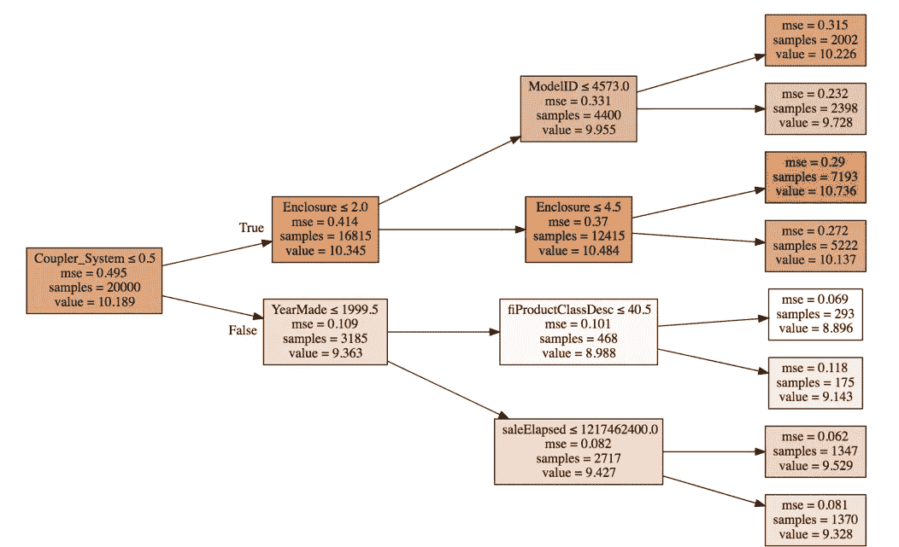

# 从零开始构建随机森林&理解真实世界的数据产品(面向程序员的 ML——第 3 部分)

> 原文：<https://medium.com/analytics-vidhya/building-a-random-forest-from-scratch-understanding-real-world-data-products-ml-for-programmers-7b87474b1fb5?source=collection_archive---------0----------------------->

作为数据科学家和机器学习实践者，我们遇到并学习了大量的算法。你有没有想过每个算法的真正用处在哪里？大多数机器学习技术的主要目的是为了登上黑客马拉松的排行榜吗？

不一定。检查和理解机器学习在现实世界的行业场景中的位置和使用方式非常重要。那是我们大多数人正在工作的地方(或者最终将会工作的地方)。这就是我打算在我们的热门系列的第 3 部分中展示的内容，涵盖了 fast.ai 机器学习入门课程！


在第 1 部分中，我们使用 fastai 库对随机森林做了相当全面的介绍，随后我们又有趣地看了一下[如何解释随机森林模型](https://www.analyticsvidhya.com/blog/2018/10/interpret-random-forest-model-machine-learning-programmers/)。后一部分在当今世界尤为重要。

在本文中，我们将首先后退一步，从商业角度分析机器学习。然后，我们将直接跳到我们离开第 2 部分的地方——从头开始构建一个随机森林模型。我鼓励你回到以前的帖子，以防你需要更新任何概念，并在我们前进的时候带着这些知识。

# 目录

*   机器学习导论:第六课
    1。机器学习在商业中的应用
    2。随机森林解释技术
*   机器学习入门:第 7 课
    1。用 Python 从头开始构建随机森林

# 机器学习导论:第 6 课

了解了随机森林模型的基本概念和用于解释结果的技术后，接下来要问的问题是——这些模型和解释技术在现实生活中的什么地方使用？知道这种技术当然很好，但是如果我们不知道何时何地应用它，那感觉就像是白费力气。

杰瑞米·霍华德在第六课中回答了这个问题，他解释了如何用随机森林模型来解释和理解数据。本课也是一个演练，涵盖了我们在前两篇文章中学到的所有技术。

在这一节中，我们将看看机器学习已经让人们感受到它的存在并正在成功实施的各个领域。

正如杰里米所解释的，商业市场可以大致分为两类——横向市场和纵向市场。我们将分别研究这些，但首先，让我们了解设计机器学习模型所涉及的最重要的步骤。

我们大致遵循四个步骤来完成这项工作。这些共同形成了“动力传动系统方法”，正如 Jeremy 在他的论文中解释的那样:[设计伟大的数据产品](https://www.oreilly.com/ideas/drivetrain-approach-data-products)。


**第一步:明确目标**

在投入挑战和建立机器学习模型之前，人们必须在头脑中有一个清晰、明确的目标或最终目标。这可能因组织试图实现的目标而异。下面给出几个例子:

*   销售更多书籍/产品
*   减少离开/流失的客户数量

**第二步:杠杆**

杠杆是可以控制的输入，或组织可以做出的一些改变，以推动步骤 1 中定义的目标。例如，为了确保顾客满意:

*   卖家可以对他的产品提供特别优惠
*   购物超过 20 美元，赠送免费钢笔或其他商品

机器学习模型不能成为杠杆，但它可以*帮助*组织识别杠杆。清楚地理解这一区别很重要。

**第三步:数据**

下一步是找出哪些数据有助于识别和设置组织可能拥有(或可以收集)的杠杆。这可能不同于组织先前已经提供或收集的数据。

**第四步:预测模型**

一旦我们获得了有助于实现上述目标的所需数据，最后一步就是根据这些数据建立一个模拟模型。请注意，一个模拟模型可以有多个预测模型。例如，构建一个模型来确定应该向用户推荐哪些商品，而构建另一个模型来预测用户根据推荐购买特定产品的概率。这个想法是创建一个优化模型，而不是一个预测模型。

你可以阅读我在上面链接的论文来更详细地理解这些步骤。我们将继续从工业和商业的角度来理解机器学习的应用。

# 机器学习在商业中的应用

正如我们前面提到的，我们可以将商业市场大致分为两类——横向和纵向。我将在这一节中详细阐述每一个问题，让您从行业的角度来看问题。

## 水平市场

横向市场通常由人口统计学来定义(在不同类型的企业中可能很常见)，这大体上是指涉及营销的一切。这里是一组可以(并且正在)使用机器学习的营销应用。


以“流失”为例，目标是确定谁将离开或流失。假设一个组织有一个流失模型，该模型预测哪个员工将要离开，以及可以改变什么以减少离开的员工数量。

一旦确定了最终目标，我们就可以列出可以改变的事情，以减少离开组织的人数，并收集建立模型所需的任何数据。

然后，我们可以创建一个随机森林模型，并使用我们之前学到的解释技术。例如，来自随机森林模型的特征重要性方面可以帮助我们理解哪些特征最重要。或者，pdp 绘图可视化可用于确定特定变化将如何影响目标变量(即员工流失的概率)。

## 垂直市场

垂直市场是指共享同一行业的一组业务，如教育、医疗保健、航空航天、金融等。下面是在这种情况下使用机器学习的几个例子:

*   **医疗保健:**ML 模型可用于预测患者再次入院的风险。基于关于患者的数据，例如他/她的年龄、血压、血小板计数、心率等。该模型可以预测患者再次入院的概率，并可用于找到其背后的确切原因。
*   **飞机排班:**一个模型可以用来预测航班延误的几率，这对组织人员和决定登机口管理很有用。

讨论机器学习在各个领域的应用并回答每个领域的以下问题是一个很好的练习:

*   机器学习在各个领域有哪些可能的应用？
*   目标是什么？预测会是什么？
*   将需要什么样的数据，哪种 ML 模型可用于该任务？

到目前为止，我们的讨论已经让您对行业中过多的机器学习应用有了一个公平的想法。我们将快速回顾一下随机森林解释技术，然后继续从头开始构建随机森林模型。


# 随机森林解释技术

我们将快速回顾一下这些技术，因为我们已经在第 2 部分中介绍过了。要获得更详细的解释，您可以看看这篇文章:

*   [使用 fastai 库解释随机森林模型的直观指南](https://www.analyticsvidhya.com/blog/2018/10/interpret-random-forest-model-machine-learning-programmers/)

**标准差**

我们计算了预测的标准偏差(针对*附件*和*产品尺寸*中的每个级别)，以找出模型错误预测的类别及其原因。


我们发现，对于具有低数值计数的类别，模型给出了高标准偏差。因此，对具有较大值计数的类别的预测更准确的可能性更大(因为模型针对这些类别训练得很好)。有道理，对吧？

**特征重要性**

特征重要性基本上决定了一个特征在预测目标变量中的重要性。随机森林模型的前 30 个变量如下:


从上图可以明显看出， *YearMade* 是最重要的变量。这是有道理的，因为车越老，*销售价格*越低。当不太重要的特征从训练集中移除时，模型性能得到改善。可以想象，这对于理解数据和变量非常有帮助。此外，我们可以使用一键编码为每个级别创建列，然后计算特性重要性:


**部分依赖图(PDP)**

部分依赖用于理解特征对目标变量的依赖性。这是通过预测每一行的目标，保持一个变量不变来实现的。例如，当*年制*为 1960 年时，预测每一行的*销售价格*，然后预测*年制*为 1961 年，以此类推。结果会是这样一个图:


**树解释器**

树解释器用于使用随机森林模型中的所有树来评估每行的预测。这也有助于我们理解每个变量对最终预测的贡献。

在我们理解如何计算多棵树的贡献之前，让我们先来看看一棵树:



*耦合器 _ 系统< =5* 的值为 10.189，对于*外壳< =2* 的值为 2.0，*型号 _id* 的值为 9.955(现在只考虑最上面的路径)。


*外壳* < =2 的值不仅仅是因为*外壳*的特性，而是*耦合器 _ 系统*和*外壳的组合。*换句话说，我们可以说*耦合器 _ 系统*与*外壳*相互作用，贡献为 0.156。同样，我们可以确定特征之间的交互重要性。

现在，我们可以使用所有树的平均值来计算每个特征的总体贡献。对于验证集中的第一行，下面是每个变量的贡献:

```
[('ProductSize', 'Mini', -0.54680742853695008),
('age', 11, -0.12507089451852943),
('fiProductClassDesc',
'Hydraulic Excavator, Track - 3.0 to 4.0 Metric Tons',
-0.11143111128570773),
('fiModelDesc', 'KX1212', -0.065155113754146801),
('fiSecondaryDesc', nan, -0.055237427792181749),
('Enclosure', 'EROPS', -0.050467175593900217),
('fiModelDescriptor', nan, -0.042354676935508852),
('saleElapsed', 7912, -0.019642242073500914),
('saleDay', 16, -0.012812993479652724),
('Tire_Size', nan, -0.0029687660942271598),
('SalesID', 4364751, -0.0010443985823001434),
('saleDayofyear', 259, -0.00086540581130196688),
('Drive_System', nan, 0.0015385818526195915),
('Hydraulics', 'Standard', 0.0022411701338458821),
('state', 'Ohio', 0.0037587658190299409),
('ProductGroupDesc', 'Track Excavators', 0.0067688906745931197),
('ProductGroup', 'TEX', 0.014654732626326661),
('MachineID', 2300944, 0.015578052196894499),
('Hydraulics_Flow', nan, 0.028973749866174004),
('ModelID', 665, 0.038307429579276284),
('Coupler_System', nan, 0.052509808150765114),
('YearMade', 1999, 0.071829996446492878)]
```

只是提醒一下，生成的值背后的计算已经在之前的帖子中讨论过了。

**外推**

对于这个特定的主题，Jeremy 在讲座期间通过使用*行间距*创建一个合成数据集来执行现场编码。我们已经将起点和终点设置为 0 和 1。

```
%matplotlib inline 
from fastai.imports import * 
from sklearn.ensemble import RandomForestRegressorx=np.linspace(0,1) 
x
```


下一步是创建一个因变量。为简单起见，我们假设 x 和 y 之间存在线性关系。我们可以使用以下代码来生成目标变量并绘制该变量:

```
y=x+np.random.uniform(-0.2,0.2,x.shape) 
plt.scatter(x,y)
```


我们将把 1D 数组转换成 2D 数组，作为随机森林模型的输入。

```
x1=x[...,None]
```

在这 50 个数据点中，我们将选取 40 个数据点来训练我们的随机森林模型，并将剩下的 10 个数据点用作验证集。

```
x_trn, x_val = x1[:40], x1[40:]
y_trn, y_val = y[:40], y[40:]
```

我们现在可以拟合一个随机森林模型，并将预测值与实际值进行比较。

```
m = RandomForestRegressor().fit(x_trn, y_trn)
plt.scatter(y_trn, m.predict(x_trn))
```


结果相当不错，但是你认为我们会在验证集上得到相似的结果吗？我们已经在前 40 个数据点上训练了我们的模型，其规模实际上与验证集的规模非常不同。因此，随机森林模型试图预测的任何新点，都不可避免地确定这些点更接近给定的 40 点中的最高点。

让我们来看看剧情:


这证实了我们的预感，random forest 无法推断出它从未见过的数据类型。它基本上会给你之前看到的数据的平均值。那么应该如何处理这种类型的数据呢？我们可以潜在地使用神经网络，它已经被证明在这种情况下工作得更好。另一个显而易见的解决方案是使用时间序列技术(这是我亲自研究过的，可以证实它们显示出更好的结果)。

因此，为了结束第 6 课，我们讨论了构建机器学习模型的必要步骤，并简要介绍了我们在上一篇文章中学到的所有解释技术。如果你对这部分有任何问题，请在文章下面的评论中告诉我。

# 机器学习简介:第 7 课

在前一篇文章中，我们开始学习如何从头开始构建随机森林模型。我们将从本节(第 7 课)停止的地方继续学习。本课结束时，您将能够自己从头构建一个端到端随机森林模型。听起来相当令人兴奋，所以让我们继续吧！

我们已经详细讨论了随机森林算法——从理解其工作原理到如何选择分割点，以及如何计算预测。我们现在将把我们的理解转化为代码形式，一次一步，也就是说，创建一个使用很少的功能、很少的树和数据子集的模型。

*注意:第 1 步到第 6 步已经在上一篇文章中介绍过了。*

**步骤 1:** 导入基本库。

```
%load_ext autoreload
%autoreload 2
%matplotlib inline

from fastai.imports import *
from fastai.structured import *
from sklearn.ensemble import RandomForestRegressor, RandomForestClassifier

from IPython.display import display
from sklearn import metrics
```

**第二步:**读取数据并分成训练集和验证集。

```
PATH = "data/bulldozers/"

df_raw = pd.read_feather('tmp/bulldozers-raw')
df_trn, y_trn, nas = proc_df(df_raw, 'SalePrice')

def split_vals(a,n): return a[:n], a[n:]
n_valid = 12000
n_trn = len(df_trn)-n_valid

X_train, X_valid = split_vals(df_trn, n_trn)
y_train, y_valid = split_vals(y_trn, n_trn)

raw_train, raw_valid = split_vals(df_raw, n_trn)
```

第三步:从数据的一个子集开始。

正如我之前提到的，我们将采取较小的步骤，所以这里我们只选择两个特性并使用它们。如果这样做很好，我们可以通过获取所有的特征来完成模型。

```
x_sub = X_train[['YearMade', 'MachineHoursCurrentMeter']]
```

**步骤 4:** 定义输入集:

*   一组特征— x
*   目标变量— y
*   随机森林中的树的数量— n_trees
*   定义样本大小的变量— sample_sz
*   最小叶子大小的变量 min _ leaf
*   用于测试的随机种子

```
def __init__(self, x, y, n_trees, sample_sz, min_leaf=5):
       np.random.seed(42)
       self.x,self.y,self.sample_sz,self.min_leaf = x,y,sample_sz,min_leaf
       self.trees = [self.create_tree() for i in range(n_trees)]
```

**步骤 5:** 定义一个使用数据样本(带替换)的函数，并在其上创建一个决策树。

```
def create_tree(self):
       rnd_idxs = np.random.permutation(len(self.y))[:self.sample_sz]
       return DecisionTree(self.x.iloc[rnd_idxs], self.y[rnd_idxs], min_leaf=self.min_leaf)
```

**第 6 步:**创建一个预测函数。特定行的每棵树的预测值的平均值作为最终预测返回。

```
def predict(self, x):
       return np.mean([t.predict(x) for t in self.trees], axis=0)
```

结合以上所有函数，我们可以创建一个类 *TreeEnsemble* 。

```
class TreeEnsemble():
   def __init__(self, x, y, n_trees, sample_sz, min_leaf=5):
       np.random.seed(42)
       self.x,self.y,self.sample_sz,self.min_leaf = x,y,sample_sz,min_leaf
       self.trees = [self.create_tree() for i in range(n_trees)]

   def create_tree(self):
       rnd_idxs = np.random.permutation(len(self.y))[:self.sample_sz]
       return DecisionTree(self.x.iloc[rnd_idxs], self.y[rnd_idxs], min_leaf=self.min_leaf)

   def predict(self, x):
       return np.mean([t.predict(x) for t in self.trees], axis=0)
```

步骤 7: 创建一个类*决策树*。我们在函数 *create_tree，*中调用*决策树*，所以让我们在这里定义它。决策树有一组独立变量、一个目标变量和索引值。目前，我们只创建了一个决策树(稍后我们可以让它递归)。

```
class DecisionTree():
  def __init__(self, x, y, idxs=None, min_leaf=5):
      if idxs is None: idxs=np.arange(len(y))
      self.x,self.y,self.idxs,self.min_leaf = x,y,idxs,min_leaf ##define x,y,index and minimum leaf size
      self.n,self.c = len(idxs), x.shape[1]  ##number of rows and columns
      self.val = np.mean(y[idxs])  
      self.score = float('inf')
      self.find_varsplit()
```

**第八步:**确定最佳分割点。对于每一列，我们使用函数 *find_better_split* 来识别拆分点，然后返回拆分的列名、值和分数。

```
def find_varsplit(self):
      for i in range(self.c): self.find_better_split(i) #check for each column in the dataset

def find_varsplit(self):
       for i in range(self.c): self.find_better_split(i)

  @property
  def split_name(self): return self.x.columns[self.var_idx]

  @property
  def split_col(self):
      return self.x.values[self.idxs,self.var_idx]

  @property
  def is_leaf(self): return self.score == float('inf')

  def __repr__(self):
      s = f'n: {self.n}; val:{self.val}'
      if not self.is_leaf:
          s += f'; score:{self.score}; split:{self.split}; var:
                 {self.split_name}'
      return s
```

**第 9 步:**用 10 棵树建立我们的第一个模型，样本大小为 1000，最小叶子为 3。

```
m = TreeEnsemble(X_train, y_train, n_trees=10, sample_sz=1000,min_leaf=3)
m.trees[0]
```

对于第一棵树，结果是:

```
n: 1000; val:10.079014121552744
```

现在让我们填充我们在上面第 8 步中留下的块— *find_better_split* 。这是到目前为止代码中最难理解的部分，但是 Jeremy 已经用 excel 中的一个简单例子进行了解释。我在这里用直观的方式解释一下。

对于每个变量，我们将点分成左右两个节点，并检查每个值的得分。我们的想法是找到一个分割点，在这里我们可以将更多相似的点分割在一起。

考虑下面的例子:我们有两列——一个我们试图分割的独立变量和一个二进制目标变量。


我们将在第一列的每个值处进行分割，并计算标准偏差，以确定我们能够对目标进行分类的程度。我们假设第一个分裂点> =3，然后计算标准差。


我们可以取这个值的加权平均值。类似地，我们可以计算 4、6、1 等的分割。让我们把它写成代码:

```
def find_better_split(self, var_idx):
   x,y = self.x.values[self.idxs,var_idx], self.y[self.idxs]

   for i in range(self.n):
       lhs = x<=x[i]
       rhs = x>x[i]
       if rhs.sum()<self.min_leaf or lhs.sum()<self.min_leaf: continue
       lhs_std = y[lhs].std()
       rhs_std = y[rhs].std()
       curr_score = lhs_std*lhs.sum() + rhs_std*rhs.sum()
       if curr_score<self.score: 
           self.var_idx,self.score,self.split = var_idx,curr_score,x[i]
```

如果我们尝试分别打印两列的函数结果，我们会得到下面的结果:

```
find_better_split(tree,1) 
treen: 1000; val:10.079014121552744; score:681.0184057251435; split:3744.0; var:MachineHoursCurrentMeterfind_better_split(tree,0)
treen: 1000; val:10.079014121552744; score:658.5510186055949; split:1974.0; var:YearMade
```

看起来 1974 年制造的是一个更好的分割点。

**第十步:**对比 *scikit-learn* 随机森林。但是请记住，这里有一个棘手的方面。在比较这两个模型时，它们应该具有相同的输入。因此，让我们存储我们刚刚构建的随机森林中使用的输入。

```
ens = TreeEnsemble(x_sub, y_train, 1, 1000) 
tree = ens.trees[0] 
x_samp,y_samp = tree.x, tree.y
```

现在我们在这个子集上建立一个模型:

```
m = RandomForestRegressor(n_estimators=1, max_depth=1, bootstrap=**False**)
m.fit(x_samp, y_samp)
draw_tree(m.estimators_[0], x_samp, precision=2)
```


我们看到这里的分裂出现在 1974.5 年的*年制造的*列上，与我们模型的结果非常相似。还不错！

到目前为止，我们看到的代码有一个问题——你能认出它是什么吗？我们需要优化它！在当前的格式中，我们检查每一行的拆分分数，也就是多次检查一个值。看看我们之前使用的例子:


该函数将检查分割点 4 和 1 两次，因为它实际上是按行工作的。优化我们的代码以减少计算时间是一个好主意(不是每个人都有一台顶级机器！).想法是按列排序，然后在拆分后只检查唯一值的得分。

```
sort_idx = np.argsort(x) 
sort_y,sort_x = y[sort_idx], x[sort_idx]
```

此外，为了计算标准偏差，我们定义了以下函数:

```
def std_agg(cnt, s1, s2): return math.sqrt((s2/cnt) - (s1/cnt)**2)
```

我们将需要跟踪分割的每一边的数据点的计数以及值的平方和。所以我们初始化变量 *rhs_cnt，lhs_cnt，rjs_sum2* 和 *lhs_sum2。*

```
rhs_cnt,rhs_sum,rhs_sum2 = self.n, sort_y.sum(), (sort_y**2).sum() lhs_cnt,lhs_sum,lhs_sum2 = 0,0.,0.
```

综上所述，代码如下所示:

```
tree = TreeEnsemble(x_sub, y_train, 1, 1000).trees[0]
def std_agg(cnt, s1, s2): return math.sqrt((s2/cnt) - (s1/cnt)**2)
def find_better_split_foo(self, var_idx):
x,y = self.x.values[self.idxs,var_idx], self.y[self.idxs]

sort_idx = np.argsort(x)
sort_y,sort_x = y[sort_idx], x[sort_idx]

rhs_cnt,rhs_sum,rhs_sum2 = self.n, sort_y.sum(), (sort_y**2).sum()
lhs_cnt,lhs_sum,lhs_sum2 = 0,0.,0.

for i in range(0,self.n-self.min_leaf-1):
  xi,yi = sort_x[i],sort_y[i]
  lhs_cnt += 1; rhs_cnt -= 1
  lhs_sum += yi; rhs_sum -= yi
  lhs_sum2 += yi**2; rhs_sum2 -= yi**2
  if i<self.min_leaf or xi==sort_x[i+1]:
    continue

  lhs_std = std_agg(lhs_cnt, lhs_sum, lhs_sum2)
  rhs_std = std_agg(rhs_cnt, rhs_sum, rhs_sum2)
  curr_score = lhs_std*lhs_cnt + rhs_std*rhs_cnt
  if curr_score<self.score:
    self.var_idx,self.score,self.split = var_idx,curr_score,xi
```

理想情况下，这个函数应该给出相同的结果。让我们检查一下:

```
%timeit find_better_split_foo(tree,1) 
tree2.2 ms ± 148 µs per loop (mean ± std. dev. of 7 runs, 100 loops each)
n: 1000; val:10.079014121552744; score:658.5510186055565; split:1974.0; var:YearMade
```

请注意，我们创建了一个新函数(将名称从 *find_better_split* 略微更改为 *find_better_split_foo* )，我们需要在我们的*决策树*类中使用它。以下命令为我们做了这件事:

```
DecisionTree.find_better_split = find_better_split_foo
```

**第 12 步:**用一个以上的分割来构建我们的树。

在第 10 步中，我们将模型的第一层与 scikit-learn 随机森林模型进行了比较。我们现在将创建一个完整的树(在我们的两个特征上分裂)并再次比较它。现在我们的 *find_varsplit* 函数看起来像这样:

```
def find_varsplit(self):
      for i in range(self.c): self.find_better_split(i)
```

这里我们已经单独定义了 *find_better_split* 。我们将更新这个函数，以便它自动检查叶节点，并在分割后在 lhs 和 rhs 中存储一个索引列表。

```
def find_varsplit(self):
  for i in range(self.c): self.find_better_split(i)
  if self.is_leaf: return
  x = self.split_col
  lhs = np.nonzero(x<=self.split)[0]
  rhs = np.nonzero(x>self.split)[0]
  self.lhs = DecisionTree(self.x, self.y, self.idxs[lhs])
  self.rhs = DecisionTree(self.x, self.y, self.idxs[rhs])

DecisionTree.find_varsplit = find_varsplit
```

我们将再次比较这两种模型。以前， *max_depth* 被限制为 1，我们在这里将它设为 2(我们现在只有两个特性):

```
m = RandomForestRegressor(n_estimators=1, max_depth=2,  bootstrap=**False**)
m.fit(x_samp, y_samp)
draw_tree(m.estimators_[0], x_samp, precision=2)
```


现在看看我们的结果:

```
tree = TreeEnsemble(x_sub, y_train, 1, 1000).trees[0] 
treen: 1000; val:10.079014121552744; score:658.5510186055565; split:1974.0; var:YearMade
```

根据上图，lhs 应该有 159 个样本，值为 9.66，而 rhs 应该有 841 个样本，值为 10.15。

```
tree.lhs 
n: 159; val:9.660892662981706; score:76.82696888346362; split:2800.0; var:MachineHoursCurrentMetertree.rhs 
n: 841; val:10.158064432982941; score:571.4803525045031; split:2005.0; var:YearMade
```

到目前为止一切看起来都很完美！深入到树的下一层，lhs 的左侧应该包含 150 个样本:

```
tree.lhs.lhs n: 150; val:9.619280538108496; score:71.15906938383463; split:1000.0; var:YearMade
```

太好了！我们能够建造自己的树。让我们创建一个函数来计算预测，然后我们将比较 r 平方值。

第十三步:计算最后的预测。我们在 *TreeEnsemble* 中调用了一个预测函数，该函数返回每一行的预测值:

```
def predict(self, x):
return np.array([self.predict_row(xi) for xi in x])

def predict_row(self, xi):
if self.is_leaf: return self.val
t = self.lhs if xi[self.var_idx]<=self.split else self.rhs
return t.predict_row(xi)
DecisionTree.predict_row = predict_row
```

至此，我们已经完成了我们自己的随机森林模型的构建。让我们在验证集上绘制预测:

```
cols = ['MachineID', 'YearMade', 'MachineHoursCurrentMeter', 'ProductSize', 'Enclosure','Coupler_System', 'saleYear']%time tree = TreeEnsemble(X_train[cols], y_train, 1, 1000).trees[0]
x_samp,y_samp = tree.x, tree.y

CPU times: user 288 ms, sys: 12 ms, total: 300 ms
Wall time: 297 ms

plt.scatter(preds, y_valid, alpha=0.05)
```


```
metrics.r2_score(preds, y_valid)

0.4840854669925271
```

对照 scikit-learn 模型检查性能和 r-square:

```
m = RandomForestRegressor(n_estimators=1, min_samples_leaf=5, bootstrap=False)
%time m.fit(x_samp, y_samp)
preds = m.predict(X_valid[cols].values)
plt.scatter(preds, y_valid, alpha=0.05)
```


```
metrics.r2_score(preds, y_valid) 0.47541053100694797
```

第 14 步:把所有的东西放在一起！

```
class TreeEnsemble():
    def __init__(self, x, y, n_trees, sample_sz, min_leaf=5):
        np.random.seed(42)
        self.x,self.y,self.sample_sz,self.min_leaf = x,y,sample_sz,min_leaf
        self.trees = [self.create_tree() for i in range(n_trees)]

    def create_tree(self):
        idxs = np.random.permutation(len(self.y))[:self.sample_sz]
        return DecisionTree(self.x.iloc[idxs], self.y[idxs], 
                    idxs=np.array(range(self.sample_sz)), min_leaf=self.min_leaf)

    def predict(self, x):
        return np.mean([t.predict(x) for t in self.trees], axis=0)

def std_agg(cnt, s1, s2): return math.sqrt((s2/cnt) - (s1/cnt)**2)class DecisionTree():
    def __init__(self, x, y, idxs, min_leaf=5):
        self.x,self.y,self.idxs,self.min_leaf = x,y,idxs,min_leaf
        self.n,self.c = len(idxs), x.shape[1]
        self.val = np.mean(y[idxs])
        self.score = float('inf')
        self.find_varsplit()

    def find_varsplit(self):
        for i in range(self.c): self.find_better_split(i)
        if self.score == float('inf'): return
        x = self.split_col
        lhs = np.nonzero(x<=self.split)[0]
        rhs = np.nonzero(x>self.split)[0]
        self.lhs = DecisionTree(self.x, self.y, self.idxs[lhs])
        self.rhs = DecisionTree(self.x, self.y, self.idxs[rhs])

    def find_better_split(self, var_idx):
        x,y = self.x.values[self.idxs,var_idx], self.y[self.idxs]
        sort_idx = np.argsort(x)
        sort_y,sort_x = y[sort_idx], x[sort_idx]
        rhs_cnt,rhs_sum,rhs_sum2 = self.n, sort_y.sum(), (sort_y**2).sum()
        lhs_cnt,lhs_sum,lhs_sum2 = 0,0.,0.

        for i in range(0,self.n-self.min_leaf):
            xi,yi = sort_x[i],sort_y[i]
            lhs_cnt += 1; rhs_cnt -= 1
            lhs_sum += yi; rhs_sum -= yi
            lhs_sum2 += yi**2; rhs_sum2 -= yi**2
            if i<self.min_leaf-1 or xi==sort_x[i+1]:
                continue

            lhs_std = std_agg(lhs_cnt, lhs_sum, lhs_sum2)
            rhs_std = std_agg(rhs_cnt, rhs_sum, rhs_sum2)
            curr_score = lhs_std*lhs_cnt + rhs_std*rhs_cnt
            if curr_score<self.score: 
                self.var_idx,self.score,self.split = var_idx,curr_score,xi

    @property
    def split_name(self): return self.x.columns[self.var_idx]

    @property
    def split_col(self): return self.x.values[self.idxs,self.var_idx]

    @property
    def is_leaf(self): return self.score == float('inf')

    def __repr__(self):
        s = f'n: {self.n}; val:{self.val}'
        if not self.is_leaf:
            s += f'; score:{self.score}; split:{self.split}; var:{self.split_name}'
        return s

    def predict(self, x):
        return np.array([self.predict_row(xi) for xi in x])

    def predict_row(self, xi):
        if self.is_leaf: return self.val
        t = self.lhs if xi[self.var_idx]<=self.split else self.rhs
        return t.predict_row(xi)ens = TreeEnsemble(X_train[cols], y_train, 5, 1000)
preds = ens.predict(X_valid[cols].values)
plt.scatter(y_valid, preds, alpha=0.1, s=6);metrics.r2_score(y_valid, preds) 0.7025757322910476
```

这就对了。这是一次相当好的学习经历，我们现在已经从零开始正式建立了一种机器学习技术。真正值得骄傲的事情！

# 结束注释

让我们快速回顾一下我们在第 3 部分中讲述的内容。我们从**第 6 课**开始，它广泛涵盖了机器学习在各种商业领域的应用，以及我们在第 2 部分看到的解释技术的修订版。

本文的后半部分讲述了**第 7 课**，代码有点多。我们构建了一个完整的随机森林模型，并将其性能与 scikit-learn 的模型进行了比较。理解模型实际上是如何工作的，而不是简单地实现模型，这是一个很好的实践。

至此，我们结束了对随机森林模型的理解、解释和构建。在下一部分，我们将把重点转移到神经网络上。我们将在非常受欢迎的 MNIST 数据集上工作，所以应该会很有趣！

你也可以在分析 Vidhya 的 Android 应用上阅读这篇文章


*原载于 2018 年 12 月 3 日*[*www.analyticsvidhya.com*](https://www.analyticsvidhya.com/blog/2018/12/building-a-random-forest-from-scratch-understanding-real-world-data-products-ml-for-programmers-part-3/)*。*