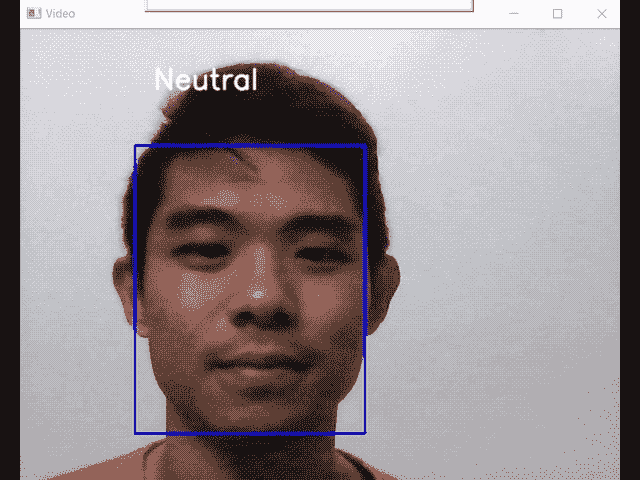
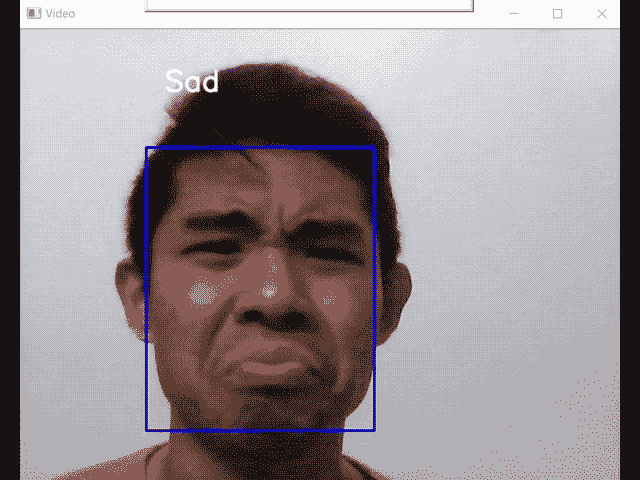
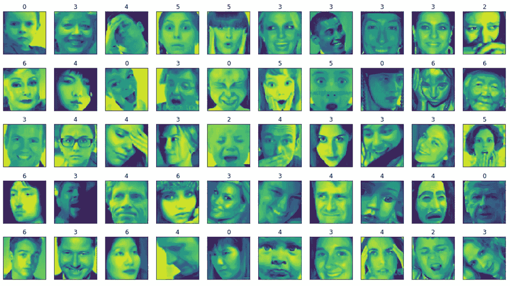
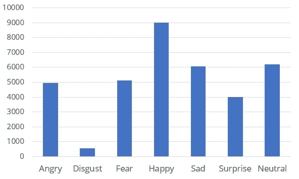
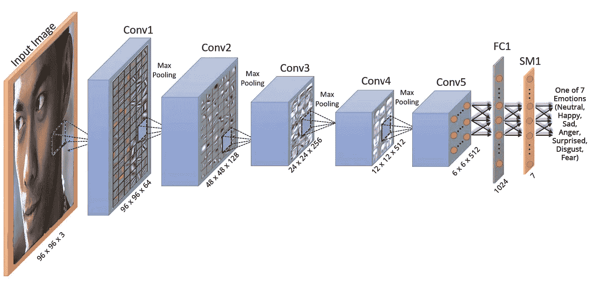
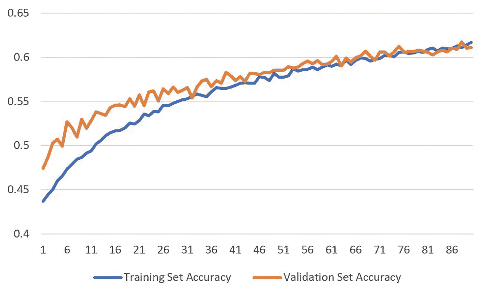
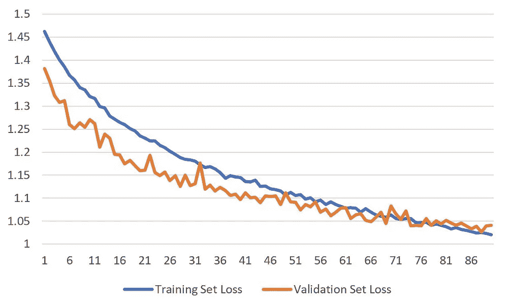
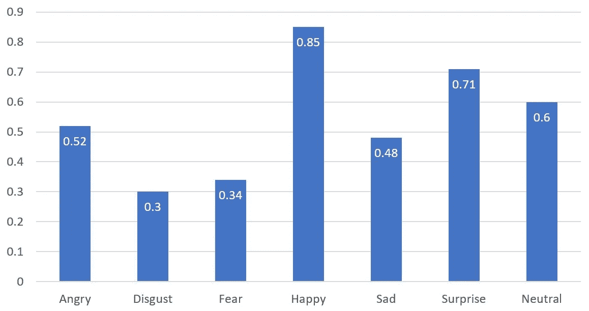
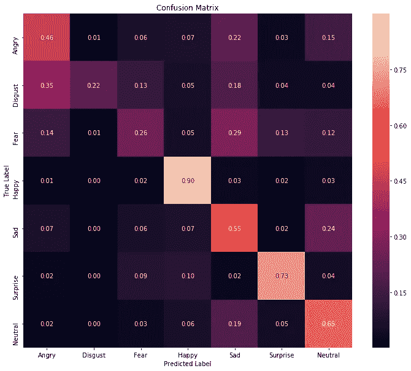
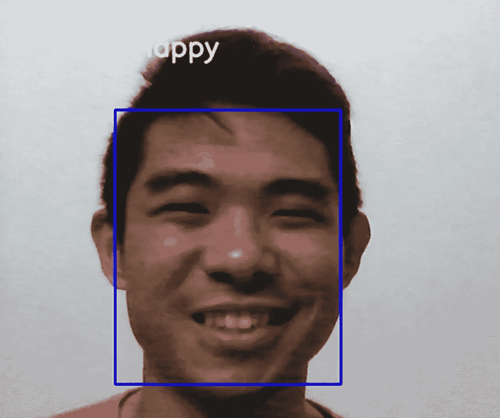

# 你感觉怎么样？—用实时情绪检测器回答

> 原文：<https://medium.com/analytics-vidhya/building-a-real-time-emotion-detector-towards-machine-with-e-q-c20b17f89220?source=collection_archive---------5----------------------->

“他感觉怎么样？”随着关于心理健康的对话越来越普遍，这个问题也越来越频繁地出现在我的脑海中。由于小丑对精神疾病的有力描述，我们开始谈论保持良好精神健康的方法。

情绪跟踪是这样做的方法之一，因为它可以帮助我们调节我们的情绪。如果我们能够及早发现我们情绪模式的变化，我们就可以开始采取措施来管理它们。

这让我想到……如果我们可以利用机器学习的力量来预测某人的内心感受——而不必问一个问题，会怎么样？

所以我建立了自己的情绪检测器(在这个 [Github 库](https://github.com/travistangvh/emotion-detection-in-real-time))。

终于，有人知道我的感受…

以下是方法。

# 该过程总结如下

首先，我收集了大量带有各种情绪的人脸数据。然后，我使用 Keras 训练了一个卷积神经网络来识别各种情绪。为了实时预测情绪，来自网络摄像头的实时视频被输入一个网络，该网络可以检测人脸并预测情绪。

1.  **收集数据**

使用的数据是[面部情感识别数据集](https://www.kaggle.com/c/challenges-in-representation-learning-facial-expression-recognition-challenge/data)。它由 35，887 张 48x48 灰度级的人脸组成，分为 7 种情绪类型，训练验证测试分为 75-12.5-12.5。

FER2013 图像的一些样本(0 =愤怒，1 =厌恶，2 =恐惧，3 =快乐，4 =悲伤，5 =惊讶，6 =中性)

让我们研究一下数据的分布。频率图显示数据集是倾斜的。虽然有 9000 多张快乐的脸，但只有不到 1000 张“厌恶”的脸。这告诉我们，利用这个数据集，我们可能无法有效地识别“厌恶”的面孔。

FER2013 数据集的频率表

2.**架构**

很自然会考虑使用[卷积神经网络](https://ujjwalkarn.me/2016/08/11/intuitive-explanation-convnets/)来完成图像识别任务。与传统的机器学习技术(如决策树或梯度提升)相比，卷积神经网络允许有效地检测特征。这样的网络允许早期在网络中检测到的简单特征(如线条)拼凑在一起，形成复杂的特征(如组成左眼的简单曲线)，使卷积神经网络在识别图像方面特别有效。

因此，这里使用的架构是由牛津大学的一组研究人员提出的名为 VGGFace 的[卷积神经网络。网络的输入馈入 8 个卷积块和 3 个全连接层。每个卷积块包含一个线性卷积层，后面是非线性层(例如 ReLU 和 max pooling)。最终的 softmax 层输出每种情绪的概率。](http://www.robots.ox.ac.uk/~vgg/publications/2015/Parkhi15/parkhi15.pdf)

考虑到网络接受大小为 226 x 226 的输入比我们的大小为 48 x 48 的训练图像大得多，网络可能会过度适应训练图像。换句话说，网络可能会记住训练集中的面孔——它可能会在以前见过的面孔上表现得很好，但在没有见过的面孔上则不然。因此，网络以两种方式改变:

*   首先，卷积块(Conv)的数量从 8 减少到 5。
*   其次，全连接(FC)层的数量从 3 个减少到 1 个。在这个全连接层之后是一个概率为 0.5 的脱落层。

用于情感识别任务的改变的 VGGFace 的图示

3.**训练过程**

该模型使用深度学习库 Keras 进行训练。在训练时，分类交叉熵损失随着学习率为 0.001 的随机梯度下降而最小化。该模型用 90 个历元进行训练，批次大小为 32。

随着训练的进行，模型在训练和验证集上的准确性增加，而损失减少。此外，我们看到训练集和验证集的值彼此非常接近。

简单地说，我们的模型在以前见过的人脸上的表现有所提高。瞧，这就是健康神经网络的标志。

训练和验证集的**准确度和损失相对于历元数的图表**

4.**性能**

在训练我们的模型之后，我们将使用测试集(使用模型以前没有见过的人脸)来测试模型。可以说，该模型的性能最好使用对面部情绪进行分类的 F1 分数来评估，而不是准确性、精确度或回忆等指标。直观地说，准确性是相对于整个测试集做出的正确预测的比例。

测试集的准确度=测试集中正确分类的人脸数量/测试集中的人脸总数。

然而，[当数据集偏斜时，一个差的模型可能报告高精度](https://tryolabs.com/blog/2013/03/25/why-accuracy-alone-bad-measure-classification-tasks-and-what-we-can-do-about-it/)。对于这些情况，首选精度或召回率等替代指标。这两个指标可以合并为一个指标，即 F1 得分，这与在 FER2013 这样的倾斜数据集上训练和测试的模型特别相关。

f1-7 种情绪测试集的分数

从 F1 分数的条形图中，我们可以看到我们的模型能够很好地预测快乐、惊讶、中性、悲伤和愤怒的表情。然而，它在表现厌恶和恐惧的脸上表现较差。为了研究错误分类的情况，我们绘制了数据集的混淆矩阵。

*归一化混淆矩阵*报告正确或错误分类的人脸比例。在矩阵的纵轴和横轴上分别是人脸的真实和预测标签。混淆矩阵的对角线显示了正确分类的人脸比例，以及错误分类的人脸比例。

测试集的混淆矩阵

有了矩阵，我们可以通过查看混淆矩阵中真正的标签是“厌恶”或“恐惧”的行来分析为什么模型在“厌恶”和“恐惧”上表现不佳。

啊，现在清楚了。大多数“厌恶”的脸被错误地预测为愤怒、悲伤或恐惧，而大多数“恐惧”的脸被错误地预测为悲伤或愤怒。这不应该令人惊讶，因为训练集中有限数量的“厌恶”面孔可能不足以训练该模型。

更重要的是，更多的时候，我们在脸上表达的情绪不止一种。一个人可以经历和表达不同程度的恐惧、悲伤和愤怒——所有这些都用一个表情来表达。因此，*甚至*一个人都可能无法从一张脸上准确地分辨出负面情绪的类型，更不用说一台机器了。不用说，[超越人类水平的精确度是具有挑战性的](https://dl.acm.org/citation.cfm?id=3295710)，尽管并非不可能。

5.**局限与改进**

我们所讨论的可能是这个模型的最大限制。它不能将我们经历的情绪简单地归类为 7 个小盒子——仅仅是因为我们经历了 7 种以上的情绪，以及它们的无限组合。因此，这个模型的更好版本应该识别不同情绪的组合。例如，如果一张脸同时表达了悲伤和愤怒，这两种情绪都会作为输出显示出来。这可以通过设置一个概率阈值来实现——只要特定情绪的概率高于阈值，就会显示为输出之一。

该模型的另一个明显的局限性是使用了具有许多参数的大型网络，这可能会限制其预测速度。事实上，修改后的 VGGFace 网络(1950 万个参数)明显大于类似于 [MobileNet](https://arxiv.org/abs/1704.04861) 这样的轻量级网络(230 万个参数)。其他值得探索的模型还有 [LightFace](https://www.sciencedirect.com/science/article/abs/pii/S0925231219310045) 和 [SqueezeNet、](https://arxiv.org/abs/1602.07360)都是用于计算机视觉的轻量级模型。

6.**实时预测**

为了实时预测，首先使用 python 上的 CV2 捕获直播视频，并将其输入到人脸检测网络 mt CNN[中，该网络可以实现出色的实时性能。检测到的人脸然后被输入到我们训练好的网络中，在那里模型输出预测。](https://kpzhang93.github.io/MTCNN_face_detection_alignment/)

7.**接下来的步骤**

我很高兴能继续改进模型的局限性，并最终部署到一个应用程序中。特别是，我对开发一个可以根据相机图像检测用户情绪下降的应用程序很感兴趣。该应用能够及早发现负面情绪，可以帮助提升用户的情绪——通过冥想、锻炼或其他方式。为了构建这个应用程序，我计划在使用 Tensorflow Lite 时遵循 deeplearning.ai 的[Laurence mono Rey](https://www.coursera.org/specializations/tensorflow-data-and-deployment?)的步骤。

如果你对项目代码感兴趣，可以随意参考我的 [Github 资源库](https://github.com/travistangvh/emotion-detection-in-real-time/)。欢迎任何反馈:)

 [## travistangvh/实时情绪检测

### 以下存储库是实时人脸检测和情感分类模型。

github.com](https://github.com/travistangvh/emotion-detection-in-real-time) 

# 确认

*   [深度人脸识别](http://www.robots.ox.ac.uk/~vgg/publications/2015/Parkhi15/parkhi15.pdf)由 Parkhi 等人完成。艾尔。

P.S .这是我的第一个深度学习项目，我非常高兴它成功了。我鼓励任何人尝试新项目，并尝试做同样的事情。

感谢您的阅读！