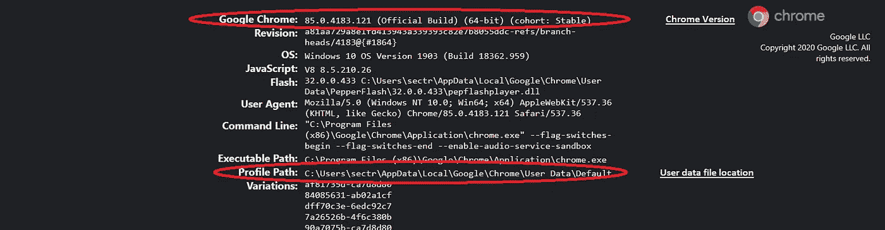

# 用 Selenium Web 驱动程序构建 Reddit 机器人

> 原文：<https://medium.com/analytics-vidhya/building-a-reddit-bot-with-selenium-web-driver-87ece50c7d5?source=collection_archive---------8----------------------->


Kon Karampelas 在 [Unsplash](https://unsplash.com?utm_source=medium&utm_medium=referral) 上拍摄的照片

嗨，读者们，

希望你们都平安健康。这是我的第一个博客！，所以我真的很兴奋开始，让我们开始吧。

在一个晴朗的日子，我在 Reddit 的海洋中冲浪，像往常一样，我看到了一个帖子，我想和我的朋友分享。正如你们许多 Redditors 知道的那样，在 Reddit DM 上分享帖子并不方便，你必须复制帖子的链接，然后打开 DM 窗口，选择聊天，然后粘贴，然后通过 Reddit DM 发送。

费力不是吗，我的意思是为什么浪费时间做这些，当世界需要一些拯救。😜

所以我决定使用 Selenium 来自动化它，这个机器人做的是，它打开你的个人资料的 upvotes 部分，复制你已经 upvotes 的最新帖子的链接，并实时分享它，它不断刷新以检查是否有任何新帖子并分享它们。

让我们从代码开始吧…

## 要求

您需要安装 Chrome Web 驱动程序才能运行此代码。如果您没有，请不要担心，我们将在下面一一介绍。

首先，我们需要安装将要使用的 Python 模块。

```
pip install pyperclip
pip install selenium
```

现在，让我们把导入部分去掉。

先说说我导入的东西吧。

[**Selenium**](https://selenium-python.readthedocs.io/) 是一个 web 驱动程序，它用于自动化 web 应用程序，一般用于测试网站，也用于抓取网站。我们将使用 Selenium 来打开[www.reddit.com](http://www.reddit.com)并自动化共享过程。

[**Pyperclip**](https://pypi.org/project/pyperclip/) 是一个跨平台的 **Python** 模块，用于复制粘贴剪贴板功能。我们将使用 Pyperclip 来粘贴我们从剪贴板中复制的链接。

现在，让我们初始化变量…

> 如果你没有 chrome 驱动程序，你可以从 [**这里**](https://chromedriver.chromium.org/downloads) 下载。确保你下载的 chrome 驱动程序与你的 chrome 浏览器版本相匹配，你可以在你的 chrome 浏览器搜索栏上输入 **chrome://version/** 来检查你的 chrome 驱动程序版本。你还可以在那个页面上找到 chrome 用户数据的位置。



chrome 的快照://version/ page。

现在，让我们创建一个`logIn()`函数…

> 你只需要登录一次，除非你退出，因为我们之前添加的 chrome 驱动选项参数会存储 cookies，这样你就不必每次运行代码时都登录。

一个`check()`功能来确保我们不会两次发送相同的帖子。

定义`profile()`功能打开轮廓…

> `profile()`接受一个参数，你将共享文件的人的用户名。
> 
> 您可以根据自己的需要随意改变`sleep(seconds)`时间长度并进行调整。

现在，我们定义`dm()`函数来发送帖子…

> `dm()`函数遍历多个标签，提取聊天名称并将其与传递给该函数的用户名进行匹配，然后打开聊天，粘贴并发送链接。

最后，让我们调用函数…

```
logIn()
```

## 链接

你可以在我的 [**GitHub 账号**](https://github.com/sectrumsempra/Reddit_Bot.py) 上找到这段代码的链接。

谢谢你抽出时间来看我的博客。如果你能在评论区留下评论，那就太好了。

一定要点击下面按钮来获得更多类似的内容。