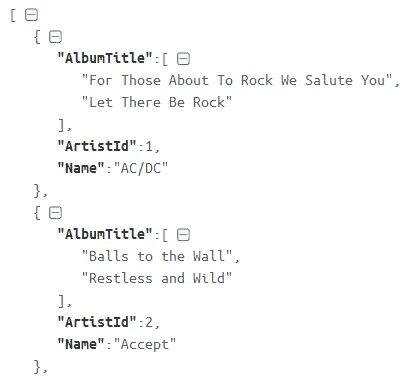

# 用 Python 构建 RESTful web API

> 原文：<https://medium.com/analytics-vidhya/building-a-restful-web-api-with-python-e843563d6f97?source=collection_archive---------9----------------------->


图片来源:[https://www.google.com/url?sa=i&Source = images&CD =&ved = 2 ahukewju _ sG1-crlahwo 3 akhwohacmqjrx 6 bagbeaq&URL = http % 3A % 2F % 2 fwww . software samurai . org % 2f 2017% 2 F12 % 2f 03% 2 fusing-restful-API-JavaScript % 2F&psig = aovvaw1 iem 32 PC 4 p 8 kquokpriicg&](https://www.google.com/url?sa=i&source=images&cd=&ved=2ahUKEwju_sG1-crlAhWO3OAKHWoHAcMQjRx6BAgBEAQ&url=http%3A%2F%2Fwww.softwaresamurai.org%2F2017%2F12%2F03%2Fusing-restful-api-javascript%2F&psig=AOvVaw1Iem32pc4P8KQUoKpRIicg&ust=1572764191509797)

在本文中，目标是构建一个遵循 RESTful 原则的 web API 或服务。但是在设计阶段之前，我们先来解释一些概念。

**什么是 API？**

一个 [API](https://en.wikipedia.org/wiki/Application_programming_interface) 是一个计算机程序的一部分，被设计成由另一个计算机程序使用或操纵。由于用户界面是为人类与计算机程序交互而存在的，因此 API 是为计算机程序与其他计算机程序交互而存在的。

**什么是 WEB API？**

web API 或服务通过互联网提供由其他程序操作的功能或数据。直觉上，我们已经可以假设除了 web API 之外还有其他类型的 API。像电子表格这样的桌面应用程序使用不需要网络服务的 VBA API。web 服务是一个 API(包装在 HTTP 中),但是 API 不一定是 web 服务。最近，设计 web 服务或 API 的标准架构已经转向 REST(**RE**presentational**S**state**T**transfer)。

**什么是休息？**

REST 架构最初被设计成适合万维网使用的 HTTP(**H**yper**T**ext**T**transfer**P**rotocol)。REST 基于 HTTP 协议定义的四种方法: **POST** 、 **GET** 、 **PUT** 和 **DELETE** 对应于对数据库中的数据执行的四种传统操作: **CREATE** 、 **READ** 、 **UPDATE** 和 **DELETE** 。在本文中，我们将只插入数据库，从数据库中读取和更新数据库。这意味着我们将分别只关心 POST、GET 和 PUT 请求。REST 设计原则有六大特点:

*   客户机-服务器:这意味着客户机和服务器之间的区别应该很清楚。
*   **无状态:**不允许服务器将一个请求中提供的信息用于另一个请求。这意味着客户端应该对发送到服务器的每个请求进行身份验证。
*   **统一接口:**客户端和服务器之间的通信方式必须统一。这意味着应用程序中的每个实体都需要唯一标识。本文中的 web API 将使用 URL 来惟一地标识我们的资源。此外，要交换的数据的格式必须在客户机和服务器之间达成一致。将用[JSON(**J**ava**S**script**O**object**N**rotation)](https://en.wikipedia.org/wiki/JSON)格式来表示资源。需要在资源表示中清楚地指定不同资源之间的关系，以便客户端可以利用它们来发现新资源。
*   **可缓存:**出于性能原因，服务器、客户端或中间系统应该能够缓存数据。服务器必须向客户端或中间系统指示和提供请求是否可以缓存以及如何缓存的指令。
*   **分层系统:**客户端不需要直接连接到服务器，而是可以通过中间系统连接，中间系统将请求中继到服务器。
*   **按需编码:**这表示服务器可以提供客户端可以在其上下文中执行的代码。这个属性是唯一可选的，而且不实用，因为在执行代码方面有各种各样具有不同能力的客户端。

在本文结束时，我们将构建一个 web 服务或 API，它在从数据库提取数据和向数据库推送数据时遵循 RESTful 原则。

**让我们为我们的项目**创建一个虚拟环境

虚拟环境是一种工具，它通过为我们的依赖项创建一个隔离的 Python 虚拟环境来帮助保持项目依赖项的分离。我的假设是，我们的操作系统上已经安装了 Python，我们选择的操作系统是 Windows。在继续之前，让我们创建一个项目文件夹，我们可以在其中保存我们将使用的所有文件。

*   **注意:**如果我们从另一个操作系统工作，只有少数命令会改变，但这是相同的过程，所以我们可以谷歌(如果必要的话)跟随。

这样，让我们在项目文件夹中打开一个终端会话，并运行以下命令(不带路径):

```
C:\Users\aobisesan\Desktop\web api>python -m venv myenv
```

上面的命令创建了一个虚拟环境。myenv 是虚拟环境的名称，我们也可以使用相同的名称或选择不同的名称。接下来，我们需要激活虚拟环境，为此我们运行以下命令(不带路径):

```
C:\Users\aobisesan\Desktop\web api>myenv\Scripts\activate
```

这将激活您的虚拟环境，很明显，虚拟环境的名称显示在文件夹路径前的括号中，如下所示:

```
(myenv) C:\Users\aobisesan\Desktop\web api>
```

接下来，让我们安装两个包，它们不是 Python 自带的，但是我们的项目需要它们。要安装这两个包，我们需要运行以下命令(不带路径):

```
(myenv) C:\Users\aobisesan\Desktop\web api> pip install pandas && pip install flask
```

上述命令安装[熊猫](https://pandas.pydata.org/)和[烧瓶](https://palletsprojects.com/p/flask/)。

*   [Pandas](https://pandas.pydata.org/) 是一个数据结构和数据分析工具。这将用于在[数据框架](https://pandas.pydata.org/pandas-docs/stable/reference/frame.html)中查看我们数据库表的内容。
*   Flask 是一个易于扩展的微型 web 框架。这将用于我们的 API 开发。

接下来，让我们在项目文件夹中创建一个脚本来查看我们将使用的两个表，并将脚本命名为 **view_db.py** (此外，我们可以选择我们想要的任何名称)。

*   **注意:**为了在不需要编码的情况下跟进，我们可以从我的 GitHub 库中[克隆](https://github.com/Ayoyiinka/web-api.git)。

**我们数据库的概述**

使用的数据库是 [SQLite](https://www.sqlite.org/index.html) ，这是一个轻量级数据库引擎，可以由 Python 库(标准库自带)处理。要用的数据库来源是 [SQLite 教程](https://www.sqlitetutorial.net/)。我们可以将数据库下载到我们的项目文件夹中。这是下面数据库图的 [**截图**](https://www.sqlitetutorial.net/wp-content/uploads/2018/03/sqlite-sample-database-diagram-color.pdf) :


在这个数据库中，我们可以看到这么多的表，但是我们的 API 将只使用两个表:**艺术家**和**专辑**。**艺术家**和**专辑**有一对多的关系，意味着一个艺术家可以有几个专辑，反之亦然。现在，让我们用 Python 来看看这两个表的内容。

**view_db.py**

```
import sqlite3
import pandas as pd#creating a connection object that represents the database
conn = sqlite3.connect(‘chinook.db’)cur = conn.cursor()#getting the column information for the artists and albums table e.g column name and data type
artists_col_infos = []
for col_info in cur.execute(“PRAGMA TABLE_INFO(artists)”):
    artists_col_infos.append(col_info)albums_col_infos = []
for col_info in cur.execute(“PRAGMA TABLE_INFO(albums)”):
    albums_col_infos.append(col_info)#querying the tables — artists and albums
artists_data = cur.execute(“SELECT * FROM artists”).fetchall()
albums_data = cur.execute(“SELECT * FROM albums”).fetchall()conn.close()#saving the dataframe (a representation of the database table)
artists_dataframe = pd.DataFrame(artists_data, columns=[col_name[1] for col_name in artists_col_infos])albums_dataframe = pd.DataFrame(albums_data, columns=[col_name[1] for col_name in albums_col_infos])print(‘See below the datatype of each column in the artists table’)
print(artists_col_infos)
print()
print(‘See below the datatype of each column in the artists table’)
print(albums_col_infos)
print()print(“A VIEW OF THE FIRST 5 ROWS AND LAST 5 ROWS OF THE ARTISTS TABLE”)
print(artists_dataframe.head()),
print(artists_dataframe.tail())
print()
print(“\n\nA VIEW OF THE FIRST 5 ROWS AND LAST 5 ROWS OF THE ALBUMS TABLE”)
print(albums_dataframe.head())
print(albums_dataframe.tail())
```

基本上，代码所做的是首先获取每一列的信息(例如，数据类型)并将其保存在两个不同的变量中。然后，查询两个数据库表，并将结果保存到另外两个变量中。接下来，它使用具有两个数据库表查询的两个变量创建两个数据帧。最后，它输出到屏幕上；每一列的信息和数据帧。下面的输出还包含执行代码的命令。

***输出***

```
(myenv) C:\Users\aobisesan\Desktop\web api>python view_db.py
```


***输出汇总***

我们的**艺人**表有两列(**艺人 Id** 和**名字**)275 行，而我们的**专辑**表有三列(**专辑 Id** 、**标题**和**艺人 id**)347 行。**专辑**表中的**艺人 Id** 是来自**艺人**表的 [**外键**](https://en.wikipedia.org/wiki/Foreign_key) ，这有助于将**专辑**映射到**艺人**。另外， **ArtistId** 和 **AlbumId** 列只接受整数，而 **Name** 和 **Title** 只接受最多 120 和 160 个字符的文本。现在我们知道了表中包含的内容，我们可以开始处理数据，所以是时候开始设计我们的 web 服务了

**设计阶段**


我们项目的最终结构如上图所示。我们已经有了 **view_db.py** 、 **myenv** 和 **chinook.db** 。

*   **注意:**我们采用这种结构是为了让我们的程序易于维护，选择不一定是最好的，它是相对的。

为了快速取胜，让我们在终端上运行以下命令:

```
(myenv) C:\Users\aobisesan\Desktop\web api>pip freeze > requirements.txt
```

该命令创建一个 **requirements.txt** 文件，该文件包含这个项目的所有已安装的依赖项和已安装的版本。该文件用于确保如果项目需要移动到新机器上，在新机器上安装**pip install–r requirements . txt**，所有的包/依赖项(具有相同的版本)都会安装到新机器上。所以，打开来检查一下，我们应该有的是下图中的东西(如果我们一直在努力跟随的话)；


**其他文件的高级视图**

*   **api.py:** 这是我们需要运行来启动 api 的模块。
*   这是项目文件夹的子目录。
*   **__init__。py:**Python 中的一个文件夹，包含一个 **__init__。py** 文件被认为是一个包，这个 **__init__。导入包时，py** 自动运行。因此， **art_alb** 是这个项目中的包。__init__。py 模块将用于创建我们的 web API 的实例。
*   **albums.py:** 它定义了访问 **albums** 表的路径/资源，并实现了 POST 和 PUT 方法来分别插入和更新 albums 表中的值，并最终以 JSON 格式返回数据。
*   **artists_albums.py:** 它定义了访问 **artists** 和 **albums** 表的路径/资源，并实现了查询数据库的 GET 方法。然后，它以 JSON 格式返回数据。返回的数据包含 **ArtistID** 、 **Name** (艺术家的)和 **Albums** (映射到特定艺术家的所有专辑的列表)。
*   **artists.py:** 定义了访问 **artists** 表的路径，实现了 POST 和 PUT 方法，分别插入和更新 artists 表，并以 JSON 格式返回数据。
    **注:** POST 方法追加到集合的末尾。也就是说，每次我们实现 POST 方法时，新数据都成为集合中的最后一个。
*   **errors.py:** 它定义了错误处理程序，以便以 json 格式返回错误，从而遵守资源表示。

注意:在继续之前，我假设我们有一点使用 Flask 框架的经验。

**__init__。py**

```
from flask import Flask
app = Flask(__name__)def dict_factory(cursor, row):
    d = {}
    for idx, col in enumerate(cursor.description):
        d[col[0]] = row[idx]
    return dfrom art_alb import albums, artists_albums, artists, errors
```

首先，在所有必要的导入之后，我们创建了应用程序的一个实例。然后我们定义了 **dict_factory** 函数，该函数用于从我们的数据库返回基于名称的列的值。也就是说，它将数据库中的项目作为字典而不是列表返回。我们更喜欢返回字典，因为当我们将它们输出到 JSON 时，这样会更好。另外，可以注意到我们在文件的底部而不是顶部(像往常一样)导入了我们的模块(我们的其他资源)。这样做是为了避免我们在 Python 中所说的循环依赖错误。为了理解什么是循环依赖错误，你可以[看看 Miguel Grinberg 的视频](https://blog.miguelgrinberg.com/post/flask-webcast-3-circular-dependencies)。

**artists_albums.py**

```
from flask import jsonify, request, abort
from art_alb import app, dict_factory
import sqlite3@app.route(‘/api/v1/chinook/artistsalbums’, methods=[‘GET’])
def get_artists_with_their_albums():
    conn = sqlite3.connect(‘chinook.db’)
    conn.row_factory = dict_factory
    cur = conn.cursor()
    artists_dict = cur.execute(‘SELECT * FROM artists;’).fetchall()
    albums_dict = cur.execute(‘SELECT * FROM albums;’).fetchall()
    conn.close()
    for artist in artists_dict:
        artist[‘AlbumTitle’] = []
        for album in albums_dict:
            if artist[‘ArtistId’] == album[‘ArtistId’]:
                artist[‘AlbumTitle’].append(album[‘Title’])
    query_parameters = request.args
    id_ = query_parameters.get(‘ArtistId’)
    name = query_parameters.get(‘Name’)
    if id_ and name:
        if int(id_) <= 0:
            abort(400)
        artists = []
        for artist in artists_dict:
            if artist[‘Name’] == name:
                artist_id = artist[‘ArtistId’]
                artists.append(artist)
                break
        if len(artists) == 0:
            abort(404)
        if int(id_) == artist_id:
            return jsonify(artists)
        else:
            abort(400)
    elif id_:
        if int(id_) <= 0:
            abort(400)
        artists = []
        if int(id_) > len(artists_dict):
            abort(404)
        artists.append(artists_dict[int(id_) — 1])
        return jsonify(artists)
    elif name:
        artists = []
        for artist in artists_dict:
            if artist[‘Name’] == name:
                artist_id = artist[‘ArtistId’]
                artists.append(artist)
                break
        if len(artists) == 0:
            abort(404)
        return jsonify(artists) return jsonify(artists_dict)
```

首先，我们导入该资源所需的所有包和模块。然后，我们通过使用 Python 中一个名为 [Decorators](https://wiki.python.org/moin/PythonDecorators) 的概念来创建资源本身，Flask 使用这个概念来定义路由。

*   **注意**:路线的定义是基于选择，但我们应该始终确保我们定义了清晰的路线。

装饰者向现有对象添加新功能，而不修改其结构。因此，装饰器下定义的函数是一个视图函数，它包含为响应发送给应用程序的请求而编写的代码。该函数查询两个表，返回字典列表。每个字典代表一个列名和每行上的值的键值对。接下来，我们在每个**艺术家**字典中创建一个新的关键字 **AlbumTitle** ，其值是映射到该艺术家的专辑列表。然后，我们创建一个过滤器，可以从使用 **ArtistId** 或**名称**进行过滤的查询参数中获得。最后，我们检查了一些条件，以确保发送到服务器的请求是有效的(符合 REST 的统一接口特征)。对于无效请求，已经映射了要返回的正确错误。如果是一个有效的请求，它要么返回所有艺术家，要么返回一个艺术家(如果有查询参数的话)。

**errors.py**

```
from flask import jsonify, abort, make_response
from art_alb import app@app.errorhandler(404)
def not_found(error):
    return make_response(jsonify({‘error’: ‘Not Found’}), 404)@app.errorhandler(400)
def not_found(error):
    return make_response(jsonify({‘error’: ‘Bad Request’}), 400)@app.errorhandler(500)
def internal_Server_error(error):
    return make_response(jsonify({‘error’: ‘Internal Server Error’}), 500)
```

注意，这里的装饰者与资源的装饰者不同，它们是**错误处理程序**。也就是说，我们可以编写当应用程序在特定的 **HTTP 状态代码**上失败时要实现的逻辑。在这个应用程序中，我们正在处理的错误的 **HTTP 状态代码**是 **400** 、 **404** 和 **500** 。这些错误处理程序中的逻辑只是确保错误以 JSON 格式(而不是 HTML)返回，从而遵守 REST 原则的统一接口特征。

*   **注:**我们从 GitHub 克隆或者下载的时候可以查看剩下的文件(但这里不会查看内容)。但是我们将运行它们，以查看它们在上面的高级视图中定义的功能。

让我们的网络服务运行起来

我们将使用 [curl](https://curl.haxx.se/) (而不是 web 浏览器)来测试我们的 web 服务，因为 web 浏览器无法轻松生成所有类型的 HTTP 请求。

*   **注** : [curl](https://curl.haxx.se/) 用于命令行或脚本中传输数据。如果没有，现在安装[卷曲](https://curl.haxx.se/)。通过运行以下命令启动 web 服务(从控制台窗口):

```
(myenv) C:\Users\aobisesan\Desktop\web api>python api.py
```

然后打开一个新的终端并运行以下命令:

```
$ curl -i http://localhost:5000/api/v1/chinook/artistsalbums
```

因为我们的数据大约有 275 行，所以返回的数据在控制台窗口上看起来可能很笨拙。所以，让我们在任何浏览器中打开 [JSON 格式化器&验证器](https://jsonformatter.curiousconcept.com/)。接下来，我们从控制台窗口和浏览器的网页上复制返回的数据，将复制的数据粘贴到 JSON Data/URL 文本框中，最后单击 process 按钮。处理后的数据显示在格式化的 JSON 数据文本框中。因为我们有大约 275 行数据，所以不能在一个视图中捕获所有的输出。因此，我截取了顶部和底部的截图，显示在下面，让我们看看它是什么样子的:

*前两个(艺人 ID 1 和 2)*



*最后两个(艺人 ID 274 和 375)*


以上对应于我们使用 DataFrame 查看的数据。接下来，让我们通过运行以下命令使用 **ArtistId** 进行过滤:

```
$ curl -i [http://localhost:5000/api/v1/chinook/artistsalbums?ArtistId=27](http://localhost:5000/api/v1/chinook/artistsalbums?ArtistId=275)5
```

*输出*

```
% Total    % Received % Xferd  Average Speed   Time    Time     Time  Current
Dload  Upload   Total   Spent    Left  Speed
100   118  100   118    0     0    517      0 --:--:-- --:--:-- --:--:--   515HTTP/1.0 200 OK
Content-Type: application/json
Content-Length: 118
Server: Werkzeug/0.16.0 Python/3.7.3
Date: Sun, 27 Oct 2019 01:49:38 GMT[{"AlbumTitle":["Koyaanisqatsi (Soundtrack from the Motion Picture)"],"ArtistId":275,"Name":"Philip Glass Ensemble"}]
```

该命令成功地为我们获取了具有 **ArtistId** 的 **275** 的艺术家。接下来，让我们使用名称进行查询，并确认资源是否如预期的那样工作，让我们在最后的结果中使用艺术家的名称(菲利普·格拉斯合奏)进行查询。为此，让我们运行以下命令。

```
$ curl -i http://localhost:5000/api/v1/chinook/artistsalbums?Name=Philip%20Glass%20Ensemble
```

*输出*

```
% Total    % Received % Xferd  Average Speed   Time    Time     Time  Current
Dload  Upload   Total   Spent    Left  Speed
100   118  100   118    0     0    519      0 --:--:-- --:--:-- --:--:--   517HTTP/1.0 200 OK
Content-Type: application/json
Content-Length: 118
Server: Werkzeug/0.16.0 Python/3.7.3
Date: Sun, 27 Oct 2019 01:57:54 GMT[{"AlbumTitle":["Koyaanisqatsi (Soundtrack from the Motion Picture)"],"ArtistId":275,"Name":"Philip Glass Ensemble"}]
```

**注意:**我们添加了 **%20** 来编码名称之间的空格，因为 URL 之间不应该有空格。我们也可以用 **+** 来代替 **%20** 。

返回值和上面的一样。

最后，让我们使用一个在我们的数据库中不存在的 **ArtistId** 来查询一个艺术家，看看会发生什么。因此，让我们运行以下命令:

```
$ curl -i http://localhost:5000/api/v1/chinook/artistsalbums?ArtistId=1000
```

*输出*

```
% Total    % Received % Xferd  Average Speed   Time    Time     Time  Current
Dload  Upload   Total   Spent    Left  Speed
100    22  100    22    0     0     97      0 --:--:-- --:--:-- --:--:--    96HTTP/1.0 404 NOT FOUND
Content-Type: application/json
Content-Length: 22
Server: Werkzeug/0.16.0 Python/3.7.3
Date: Sun, 27 Oct 2019 02:02:11 GMT{"error":"Not Found"}
```

不出所料，**未找到**是返回值，因为 **ArtistId** 不存在。我们可以继续利用这一资源(如果我们愿意的话)。转到包含资源的 **artists.py** ，该资源使我们能够在 **artists** 表中插入新艺术家并更新现有艺术家。从 POST 方法开始，让我们将两位新艺术家插入到数据库中。首先， **J 科尔**接下来，**奈拉马利**。为此，让我们运行以下命令:

```
$ curl -i -H "Content-Type: application/json" -X POST -d '{"Name": "J Cole"}' [http://localhost:5000/api/v1/chinook/artis](http://localhost:5000/api/v1/chinook/artist)t
```

— — — — — — — — — — — — — — — — — — — — — — — — — —

```
$ curl -i -H "Content-Type: application/json" -X POST -d '{"Name": "Naira Marley"}' http://localhost:5000/api/v1/chinook/artist
```

这两个命令都以 JSON 格式返回我们的 **artists** 表中的全部内容(以及新内容)。然而，由于我们的数据库中有大约 275 行，并且为了可见性，我们也可以像以前一样使用 [JSON 格式化程序&验证程序](https://jsonformatter.curiousconcept.com/)进行检查。但是，让我们运行以下命令来查询我们的数据库，以确认这两个新艺术家已经被添加:

```
$ curl -i http://localhost:5000/api/v1/chinook/artistsalbums?Name=J%20Cole
```

*输出*

```
% Total    % Received % Xferd  Average Speed   Time    Time     Time  Current
Dload  Upload   Total   Spent    Left  Speed
100    51  100    51    0     0    225      0 --:--:-- --:--:-- --:--:--   225HTTP/1.0 200 OK
Content-Type: application/json
Content-Length: 51
Server: Werkzeug/0.16.0 Python/3.7.3
Date: Sun, 27 Oct 2019 02:25:52 GMT[{"AlbumTitle":[],"ArtistId":276,"Name":"J Cole"}]
```

— — — — — — — — — — — — — — — — — — — — — — — — — —

```
$ curl -i http://localhost:5000/api/v1/chinook/artistsalbums?Name=Naira+Marley
```

*输出*

```
% Total    % Received % Xferd  Average Speed   Time    Time     Time  Current
Dload  Upload   Total   Spent    Left  Speed
100    57  100    57    0     0    262      0 --:--:-- --:--:-- --:--:--   263HTTP/1.0 200 OK
Content-Type: application/json
Content-Length: 57
Server: Werkzeug/0.16.0 Python/3.7.3
Date: Sun, 27 Oct 2019 02:26:13 GMT[{"AlbumTitle":[],"ArtistId":277,"Name":"Naira Marley"}]
```

如输出所示，找到了两位艺术家。接下来，让我们通过实现 PUT 方法来更新我们的**艺术家**数据库。所以，我们来换一下， **J 科尔**到**坎耶西**和**奈拉马利**到**兹拉坦**。这将有助于我们展示我们可以使用 **ArtistId** 或**名称**或两者(这意味着 **ArtistId** 必须与**名称**匹配)来确定要更新的行。为此，请运行以下命令:

**注:**奈拉马利的**艺人 Id** 为 **277** 。

```
$ curl -i -H "Content-Type: application/json" -X PUT -d '{"Name": "J Cole", “new_name”: “Kanye West”}' http://localhost:5000/api/v1/chinook/artist
```

— — — — — — — — — — — — — — — — — — — — — — — — — —

```
$ curl -i -H "Content-Type: application/json" -X PUT -d '{"ArtistId": 277, "new_name": "Zlatan"}' http://localhost:5000/api/v1/chinook/artist
```

这两个命令都以 JSON 格式返回我们的**艺术家**数据库中的全部内容。为了确认我们的更新已经发生，让我们查询 **Kanye West** 和 **Zlatan** 。为此，请运行以下命令:

```
$ curl -i http://localhost:5000/api/v1/chinook/artistsalbums?Name=Kanye+West
```

*输出*

```
% Total    % Received % Xferd  Average Speed   Time    Time     Time  Current
Dload  Upload   Total   Spent    Left  Speed
100    55  100    55    0     0    254      0 --:--:-- --:--:-- --:--:--   254HTTP/1.0 200 OK
Content-Type: application/json
Content-Length: 55
Server: Werkzeug/0.16.0 Python/3.7.3
Date: Sun, 27 Oct 2019 02:37:25 GMT[{"AlbumTitle":[],"ArtistId":276,"Name":"Kanye West"}]
```

— — — — — — — — — — — — — — — — — — — — — — — — — —

```
$ curl -i http://localhost:5000/api/v1/chinook/artistsalbums?Name=Zlatan
```

*输出*

```
% Total    % Received % Xferd  Average Speed   Time    Time     Time  Current
Dload  Upload   Total   Spent    Left  Speed
100    51  100    51    0     0    225      0 --:--:-- --:--:-- --:--:--   226HTTP/1.0 200 OK
Content-Type: application/json
Content-Length: 51
Server: Werkzeug/0.16.0 Python/3.7.3
Date: Sun, 27 Oct 2019 02:37:56 GMT[{"AlbumTitle":[],"ArtistId":277,"Name":"Zlatan"}]
```

输出显示 **Kanye West** 和 **Zlatan** 现在存在于我们的数据库中，他们还没有任何专辑映射到他们。我们再确认一下 **J 科尔**和**奈拉马利**不存在了。为此，让我们运行以下命令来查询它们:

```
$ curl -i http://localhost:5000/api/v1/chinook/artistsalbums?Name=J+Cole
```

*输出*

```
% Total    % Received % Xferd  Average Speed   Time    Time     Time  Current
Dload  Upload   Total   Spent    Left  Speed
100    22  100    22    0     0    101      0 --:--:-- --:--:-- --:--:--   101HTTP/1.0 404 NOT FOUND
Content-Type: application/json
Content-Length: 22
Server: Werkzeug/0.16.0 Python/3.7.3
Date: Sun, 27 Oct 2019 02:39:38 GMT{"error":"Not Found"}
```

— — — — — — — — — — — — — — — — — — — — — — — — —

```
$ curl -i http://localhost:5000/api/v1/chinook/artistsalbums?Name=Naira+Marley
```

*输出*

```
% Total    % Received % Xferd  Average Speed   Time    Time     Time  Current
Dload  Upload   Total   Spent    Left  Speed
100    22  100    22    0     0    101      0 --:--:-- --:--:-- --:--:--   101HTTP/1.0 404 NOT FOUND
Content-Type: application/json
Content-Length: 22
Server: Werkzeug/0.16.0 Python/3.7.3
Date: Sun, 27 Oct 2019 02:40:25 GMT{"error":"Not Found"}
```

输出显示**未找到**意味着它们不像预期的那样再次存在。同样，让我们确认当我们尝试更新我们的数据库并且客户端发送的请求包含 **ArtistId** 和 **Name** (它们不匹配)时会发生什么。使用 **Zlatan** 作为用例， **Zlatan** 有一个 **ArtistId** 的 **277** 。因此，我们将在请求中使用 **266** 的一个 **ArtistId** 。因此，让我们尝试将 **Zlatan** 改为 **Kcee** 。

```
$ curl -i -H "Content-Type: application/json" -X PUT -d '{"ArtistId": 276, "Name": "Zlatan",  "new_name": "Kcee"}' http://localhost:5000/api/v1/chinook/artist
```

*输出*

```
% Total    % Received % Xferd  Average Speed   Time    Time     Time  Current
Dload  Upload   Total   Spent    Left  Speed
100    82  100    24  100    58    108    262 --:--:-- --:--:-- --:--:--   371HTTP/1.0 400 BAD REQUEST
Content-Type: application/json
Content-Length: 24
Server: Werkzeug/0.16.0 Python/3.7.3
Date: Sun, 27 Oct 2019 02:47:10 GMT{"error":"Bad Request"}
```

是的， **Kcee** 是一个**错误请求**，因为 **ArtistId** 和**名称**不匹配，我希望这是有意义的，因为 **ArtistId** 对于我们的**艺术家**表中的每个艺术家都是唯一的。我们可以用这个资源做更多的尝试，但是为了节省时间，让我们转到 **albums.py** 。这与 **artists.py** 非常相似，因此我们不会在这方面纠缠不清，我只是展示一下，一旦我们创建了一个相册，它就会自动映射到我们的艺术家。接下来，**兹拉坦**将被分配一个标题为 **Jogor** 的专辑(因为我们知道**兹拉坦**有一个 **277** 的 **ArtistId** ，而 **ArtistId** 是创建专辑所需的一部分)。因此，让我们运行下面的命令:

```
$ curl -i -H "Content-Type: application/json" -X POST -d '{"Title": "Jogor", "ArtistId": "277"}' http://localhost:5000/api/v1/chinook/album
```

这会以 JSON 格式返回相册数据库的内容(包含新相册)。此外，应该运行下面的命令来显示这个相册实际上已经被映射到了 **Zlatan** 。

```
$ curl -i http://localhost:5000/api/v1/chinook/artistsalbums?Name=Zlatan
```

*输出*

```
% Total    % Received % Xferd  Average Speed   Time    Time     Time  Current
Dload  Upload   Total   Spent    Left  Speed
100    58  100    58    0     0    255      0 --:--:-- --:--:-- --:--:--   255HTTP/1.0 200 OK
Content-Type: application/json
Content-Length: 58
Server: Werkzeug/0.16.0 Python/3.7.3
Date: Sun, 27 Oct 2019 03:01:19 GMT[{"AlbumTitle":["Jogor"],"ArtistId":277,"Name":"Zlatan"}]
```

**太好了，**映射已经正确完成。

相信我，该资源提供了比我展示的更多的功能，所以如果我们自己尝试更多的东西会更好。这就把我们带到了终点。

感谢您的阅读。但在离开之前，我对项目如何扩展有一些想法(如果感兴趣)。

**扩展项目的想法**

*   为资源实现 **DELETE** 方法。
*   通过向服务器发送每个请求的**认证**来保护 web 服务。
*   当我们向 **albums.py、**中的资源发送请求时，我们可以使用艺术家的**路径(URL)** ，而不是返回数据中的 **ArtistId** 。
*   从数据库添加更多表格。